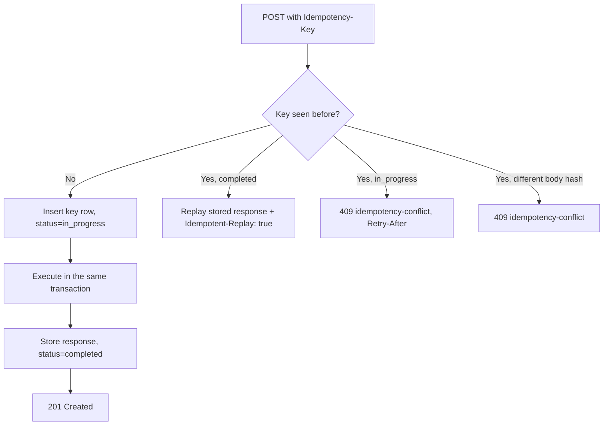
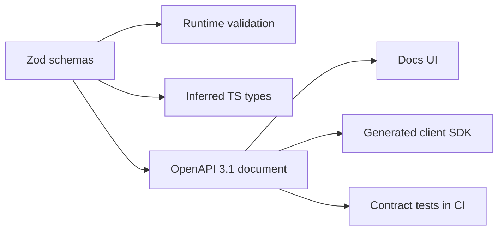

# API Design Guidelines

## REST Principles

- **Resource-oriented** - URLs name resources, not actions
- **Stateless** - every request carries everything needed to serve it
- **Consistent** - one set of conventions across every endpoint
- **Contract-first** - the Zod schema is the contract; OpenAPI 3.1 is generated from it
- **Evolvable** - additive changes by default, versioned + sunset when they cannot be

## URL Naming Conventions

### Resource Naming

```
# Good - plural nouns, lowercase, hyphens for multi-word
GET /api/users
GET /api/user-profiles
GET /api/order-items

# Bad - verbs, camelCase, underscores
GET /api/getUsers
GET /api/userProfiles
GET /api/order_items
```

### URL Structure

```
/api/{version}/{resource}/{id}/{sub-resource}

GET  /api/v1/users                    # List users
GET  /api/v1/users/123                # Get user 123
GET  /api/v1/users/123/orders         # Orders belonging to user 123
GET  /api/v1/users/123/orders/456     # One order of that user
POST /api/v1/users/123/orders         # Create an order for user 123
```

Nest at most one level deep. Beyond that, expose the sub-resource at the top level with a filter:
`/api/v1/orders?userId=123`.

### Query Parameters

```
GET /api/users?status=active&role=admin          # Filtering
GET /api/users?sort=name                         # Sorting (prefix - for descending)
GET /api/users?sort=-createdAt
GET /api/users?cursor=eyJpZCI6MTIzfQ&limit=20    # Pagination (cursor by default)
GET /api/users?fields=id,name,email              # Sparse fieldsets
GET /api/users?q=john                            # Search
GET /api/users?status=active&sort=-createdAt&limit=20
```

## HTTP Methods

| Method | Usage                | Safe | Idempotent | Request Body | Response Body |
| ------ | -------------------- | ---- | ---------- | ------------ | ------------- |
| GET    | Retrieve resource(s) | Yes  | Yes        | No           | Yes           |
| POST   | Create / process     | No   | No\*       | Yes          | Yes           |
| PUT    | Replace resource     | No   | Yes        | Yes          | Yes           |
| PATCH  | Partial update       | No   | No\*\*     | Yes          | Yes           |
| DELETE | Remove resource      | No   | Yes        | No           | Optional      |

\* Make POST idempotent with an `Idempotency-Key` header (below).
\*\* PATCH is idempotent only if the patch document is absolute (`{"name": "X"}`), not relative
(`{"increment": 1}`). Prefer absolute patches. Use `PUT` only when the client sends the whole
resource; partial updates are `PATCH`.

```typescript
// POST - Create -> 201 + Location
POST /api/users
{ "email": "a@example.com", "password": "...", "name": "Ada" }
201 Created
Location: /api/users/0199c2f1-7a3e-7bb2-9f0c-9d3a1b2c3d4e

// PATCH - Partial update -> 200
PATCH /api/users/0199c2f1-...
{ "name": "Ada Lovelace" }

// DELETE -> 204, no body
DELETE /api/users/0199c2f1-...
204 No Content
```

## HTTP Status Codes

### Success

| Code | Meaning      | When                                      |
| ---- | ------------ | ----------------------------------------- |
| 200  | OK           | Successful GET, PUT, PATCH                |
| 201  | Created      | POST created a resource (send `Location`) |
| 202  | Accepted     | Async job queued (send a status URL)      |
| 204  | No Content   | Successful DELETE, or PUT with no body    |
| 304  | Not Modified | Conditional GET matched `If-None-Match`   |

### Client Error

| Code | Meaning                | When                                              |
| ---- | ---------------------- | ------------------------------------------------- |
| 400  | Bad Request            | Malformed syntax, unparseable body                |
| 401  | Unauthorized           | Missing or invalid credentials                    |
| 403  | Forbidden              | Authenticated but not permitted                   |
| 404  | Not Found              | Resource does not exist (or must not be revealed) |
| 405  | Method Not Allowed     | Send `Allow` header                               |
| 409  | Conflict               | Duplicate resource, state conflict                |
| 412  | Precondition Failed    | `If-Match` did not match (lost-update protection) |
| 415  | Unsupported Media Type | Wrong `Content-Type`                              |
| 422  | Unprocessable Content  | Syntactically valid, semantically invalid (Zod)   |
| 429  | Too Many Requests      | Rate limited; send `Retry-After`                  |

Rule of thumb: JSON that will not parse is **400**; JSON that parses but fails schema validation
is **422**.

### Server Error

| Code | Meaning               | When                                  |
| ---- | --------------------- | ------------------------------------- |
| 500  | Internal Server Error | Unhandled bug                         |
| 502  | Bad Gateway           | Upstream returned garbage             |
| 503  | Service Unavailable   | Draining or overloaded; `Retry-After` |
| 504  | Gateway Timeout       | Upstream timed out                    |

## Error Format - RFC 9457 Problem Details (default)

Serve errors as `application/problem+json`. The members `type`, `title`, `status`, `detail` and
`instance` are standard; anything else is an extension member you define.

```http
HTTP/1.1 422 Unprocessable Content
Content-Type: application/problem+json
```

```json
{
  "type": "https://api.example.com/problems/validation-error",
  "title": "Validation Failed",
  "status": 422,
  "detail": "One or more fields are invalid",
  "instance": "/api/v1/users",
  "requestId": "0199c2f1-7a3e-7bb2-9f0c-9d3a1b2c3d4e",
  "errors": [
    { "field": "email", "message": "Invalid email format" },
    { "field": "password", "message": "Must be at least 12 characters" }
  ]
}
```

| Member     | Required | Meaning                                                                                                        |
| ---------- | -------- | -------------------------------------------------------------------------------------------------------------- |
| `type`     | no       | Stable URI identifying the problem kind. Defaults to `about:blank`. Clients branch on this, never on `detail`. |
| `title`    | no       | Short, human-readable, constant per `type`                                                                     |
| `status`   | no       | Mirrors the HTTP status                                                                                        |
| `detail`   | no       | Human-readable, specific to **this** occurrence                                                                |
| `instance` | no       | URI of the occurrence - the request path, or a log/incident URI                                                |

Host the `type` URIs and document each one. Extension members (`requestId`, `errors`,
`retryAfter`, `balance`) carry the machine-readable specifics.

```typescript
// src/schemas/problem.schema.ts
import { z } from "zod";

export const problemDetails = z.object({
  type: z.url().default("about:blank"),
  title: z.string(),
  status: z.number().int().min(100).max(599),
  detail: z.string().optional(),
  instance: z.string().optional(),
  requestId: z.string().optional(),
  errors: z
    .array(
      z.object({
        field: z.string(),
        message: z.string(),
        code: z.string().optional(),
      }),
    )
    .optional(),
});

export type ProblemDetails = z.infer<typeof problemDetails>;
```

### Problem type catalogue

| `type` suffix           | Status | `title`                  |
| ----------------------- | ------ | ------------------------ |
| `/validation-error`     | 422    | Validation Failed        |
| `/unauthorized`         | 401    | Authentication Required  |
| `/forbidden`            | 403    | Insufficient Permissions |
| `/not-found`            | 404    | Not Found                |
| `/conflict`             | 409    | Resource Conflict        |
| `/idempotency-conflict` | 409    | Idempotency Key Reused   |
| `/precondition-failed`  | 412    | Precondition Failed      |
| `/rate-limited`         | 429    | Too Many Requests        |

Never leak stack traces, SQL, internal hostnames or upstream error text in `detail`. Correlate
through `requestId` instead (see `backend.md`).

## Error Format - legacy `{success, data}` envelope (alternative)

Existing APIs that already ship the envelope below may keep it. **Do not mix formats within one
API version**, and do not start a new API this way - Problem Details is the default.

```json
// Success
{ "success": true, "data": { "id": "0199c2f1-...", "name": "Ada" } }

// Success with pagination
{
  "success": true,
  "data": [ ... ],
  "pagination": { "limit": 20, "nextCursor": "eyJpZCI6MTQzfQ", "hasMore": true }
}

// Error
{
  "success": false,
  "error": "Validation failed",
  "code": "VALIDATION_FAILED",
  "details": { "email": ["Invalid email format"] }
}
```

```typescript
/** Machine-readable codes for the legacy envelope. Naming: CATEGORY_SPECIFIC_ERROR. */
export const ERROR_CODES = {
  AUTH_INVALID_CREDENTIALS: "Invalid email or password",
  AUTH_TOKEN_EXPIRED: "Authentication token has expired",
  AUTHZ_FORBIDDEN: "You do not have permission to perform this action",
  VALIDATION_FAILED: "Request validation failed",
  RESOURCE_NOT_FOUND: "The requested resource was not found",
  RESOURCE_ALREADY_EXISTS: "A resource with this identifier already exists",
  RATE_LIMIT_EXCEEDED: "Too many requests, please try again later",
  INTERNAL_ERROR: "An internal server error occurred",
} as const;

export type ErrorCode = keyof typeof ERROR_CODES;
```

Migrating envelope → Problem Details: serve both by content negotiation for one release
(`Accept: application/problem+json` opts in), announce with `Deprecation`/`Sunset` headers, then
remove the envelope in the next major version.

## Pagination

### Cursor-based (default)

Cursors are opaque, stable under concurrent writes, and O(1) at any depth.

```
GET /api/v1/users?limit=20&cursor=eyJjIjoiMjAyNi0wOS0yMFQxMDowMDowMFoiLCJpIjoiMDE5OSJ9
```

```json
{
  "data": [ ... ],
  "pagination": {
    "limit": 20,
    "nextCursor": "eyJjIjoiMjAyNi0wOS0xOVQxMDowMDowMFoiLCJpIjoiMDE5OCJ9",
    "hasMore": true
  }
}
```

```typescript
// src/utils/cursor.ts
import { z } from "zod";
import { BadRequestError } from "./errors.js";

const cursorPayload = z.object({ c: z.iso.datetime(), i: z.uuid() });
export type Cursor = z.infer<typeof cursorPayload>;

/** Encodes a keyset position as an opaque base64url cursor. */
export function encodeCursor(row: { createdAt: Date; id: string }): string {
  return Buffer.from(
    JSON.stringify({ c: row.createdAt.toISOString(), i: row.id }),
  ).toString("base64url");
}

/**
 * Decodes an opaque cursor.
 * @throws {BadRequestError} When the cursor is malformed or tampered with.
 */
export function decodeCursor(cursor: string): Cursor {
  try {
    return cursorPayload.parse(
      JSON.parse(Buffer.from(cursor, "base64url").toString()),
    );
  } catch {
    throw new BadRequestError("Invalid cursor");
  }
}
```

The cursor must encode the full sort key (`created_at`, `id`) so the keyset comparison is total -
see the `findPage` query in `backend.md`. Never expose a raw primary key or an offset as the
cursor; clients will build on it.

### Offset-based (bounded sets only)

Acceptable when the collection is small and bounded and the UI needs page numbers (admin tables,
reference data). Cap `page * limit`; deep offsets degrade linearly.

```
GET /api/v1/countries?page=2&limit=50
```

```json
{
  "data": [ ... ],
  "pagination": { "page": 2, "limit": 50, "total": 195, "pages": 4 }
}
```

Do not return `total` on cursor endpoints - counting defeats the point.

## Filtering and Sorting

```
# Equality (default)
GET /api/products?status=active

# Comparison via suffix operators
GET /api/products?price_gte=100&price_lte=500

# Multiple values (OR)
GET /api/products?status=active,pending

# Operators: _gt _gte _lt _lte _ne _like
```

```typescript
// Sorting: -field = descending. Validate against an allowlist; never interpolate into SQL.
const SORTABLE = ["name", "email", "createdAt"] as const;
type Sortable = (typeof SORTABLE)[number];

const sortSchema = z
  .string()
  .default("-createdAt")
  .transform((raw) =>
    raw.split(",").map((f) => ({
      field: f.replace(/^-/, ""),
      direction: f.startsWith("-") ? ("DESC" as const) : ("ASC" as const),
    })),
  )
  .refine(
    (fs) => fs.every((f) => (SORTABLE as readonly string[]).includes(f.field)),
    {
      message: `sort must reference one of: ${SORTABLE.join(", ")}`,
    },
  );

// The allowlist check is what makes the column name safe to place in the ORDER BY clause;
// every value stays a $n parameter.
```

## Idempotency for Unsafe POSTs

Any POST that moves money, sends a message or creates a billable resource must accept an
`Idempotency-Key` so a retried request cannot double-execute.

```http
POST /api/v1/payments
Idempotency-Key: 0199c2f1-7a3e-7bb2-9f0c-9d3a1b2c3d4e
Content-Type: application/json
```



```typescript
// src/middleware/idempotency.middleware.ts
import { createHash } from "node:crypto";
import type { RequestHandler } from "express";
import { ConflictError } from "../utils/errors.js";

/**
 * Replays the stored response for a previously seen Idempotency-Key.
 * Keys are scoped per user and per endpoint, and expire after 24 hours.
 */
export const idempotency: RequestHandler = async (req, res, next) => {
  const key = req.get("idempotency-key");
  if (!key) return next(); // or throw BadRequestError to make the header mandatory

  const fingerprint = createHash("sha256")
    .update(
      `${req.user!.id}:${req.method}:${req.path}:${JSON.stringify(req.body)}`,
    )
    .digest("hex");

  const existing = await idempotencyRepo.find(key, req.user!.id);

  if (existing?.status === "completed") {
    if (existing.fingerprint !== fingerprint) {
      throw new ConflictError(
        "Idempotency-Key reused with a different request body",
      );
    }
    res.setHeader("Idempotent-Replay", "true");
    res.status(existing.statusCode).json(existing.body);
    return;
  }
  if (existing?.status === "in_progress") {
    res.setHeader("Retry-After", "2");
    throw new ConflictError(
      "A request with this Idempotency-Key is still in progress",
    );
  }

  await idempotencyRepo.claim(key, req.user!.id, fingerprint); // unique index enforces the race
  res.locals.idempotencyKey = key;
  next();
};
```

Persist the key, the body fingerprint and the serialized response in the **same transaction** as
the side effect; otherwise a crash between the two reopens the double-execution window.

## Conditional Requests (ETag)

```typescript
/** GET with an ETag: unchanged resources cost one 304 instead of a payload. */
export const getUser: RequestHandler = async (req, res) => {
  const user = await userService.getUserById(req.validated!.params.id);
  const etag = `"${user.version}"`; // or a hash of the serialized representation

  res.setHeader("ETag", etag);
  res.setHeader("Cache-Control", "private, max-age=0, must-revalidate");

  if (req.get("if-none-match") === etag) {
    res.status(304).end();
    return;
  }
  res.json({ data: user });
};

/** Optimistic concurrency: If-Match prevents a lost update. */
export const updateUser: RequestHandler = async (req, res) => {
  const ifMatch = req.get("if-match");
  if (!ifMatch)
    throw new BadRequestError("If-Match header is required for updates");

  const updated = await userService.updateUser(
    req.validated!.params.id,
    req.validated!.body,
    Number(ifMatch.replaceAll('"', "")), // expected version
  ); // throws PreconditionFailedError (412) on mismatch

  res.setHeader("ETag", `"${updated.version}"`);
  res.json({ data: updated });
};
```

Use weak ETags (`W/"..."`) when the comparison should ignore encoding-level differences.

## Rate Limiting

```http
HTTP/1.1 429 Too Many Requests
Content-Type: application/problem+json
Retry-After: 30
RateLimit: limit=100, remaining=0, reset=30
RateLimit-Policy: 100;w=900
```

```json
{
  "type": "https://api.example.com/problems/rate-limited",
  "title": "Too Many Requests",
  "status": 429,
  "detail": "Rate limit of 100 requests per 15 minutes exceeded",
  "instance": "/api/v1/users",
  "retryAfter": 30
}
```

`Retry-After` accepts delta-seconds or an HTTP-date. Send it on 503 during a drain as well.
Emit the IETF `RateLimit` / `RateLimit-Policy` headers (`standardHeaders: 'draft-8'` in
`express-rate-limit`), not the legacy `X-RateLimit-*` pair.

## API Versioning

### URL path versioning (default)

```
/api/v1/users
/api/v2/users
```

Version only on a breaking change. Additive changes - a new optional field, a new endpoint, a new
enum value the client may ignore - stay in the current version.

| Change                            | Breaking? |
| --------------------------------- | --------- |
| Adding an optional response field | No        |
| Adding an optional request field  | No        |
| Removing or renaming a field      | Yes       |
| Narrowing a type or enum          | Yes       |
| Tightening validation             | Yes       |
| Changing a status code            | Yes       |

### Deprecation and sunset

```typescript
// RFC 9745 Deprecation + RFC 8594 Sunset. Both are IMF-fixdate HTTP-dates.
app.use("/api/v1", (_req, res, next) => {
  res.setHeader("Deprecation", "Wed, 01 Apr 2026 00:00:00 GMT");
  res.setHeader("Sunset", "Thu, 01 Oct 2026 00:00:00 GMT");
  res.setHeader("Link", '</api/v2/users>; rel="successor-version"');
  next();
});
```

Migration: announce deprecation → run both versions for at least six months → track v1 traffic
per client → contact the remaining callers → sunset.

## OpenAPI 3.1 - Generated from Zod

The Zod schemas in `src/schemas/` are the single source of truth. The OpenAPI document is a build
artifact - **never hand-edit it, never let it drift.**



```typescript
// scripts/generate-openapi.ts
import { z } from "zod";
import { createDocument } from "zod-openapi";
import { writeFileSync } from "node:fs";
import {
  createUserSchema,
  listUsersQuery,
  userSchema,
} from "../src/schemas/user.schema.js";
import { problemDetails } from "../src/schemas/problem.schema.js";

const document = createDocument({
  openapi: "3.1.0",
  info: { title: "User API", version: "1.0.0" },
  servers: [
    { url: "https://api.example.com/v1", description: "Production" },
    { url: "https://staging-api.example.com/v1", description: "Staging" },
  ],
  components: {
    securitySchemes: {
      bearerAuth: { type: "http", scheme: "bearer", bearerFormat: "JWT" },
    },
    schemas: { User: userSchema, Problem: problemDetails },
  },
  security: [{ bearerAuth: [] }],
  paths: {
    "/users": {
      get: {
        operationId: "listUsers",
        tags: ["Users"],
        summary: "List users (cursor-paginated)",
        requestParams: { query: listUsersQuery },
        responses: {
          "200": {
            description: "A page of users",
            content: {
              "application/json": {
                schema: z.object({
                  data: z.array(userSchema),
                  pagination: z.object({
                    limit: z.number().int(),
                    nextCursor: z.string().nullable(),
                    hasMore: z.boolean(),
                  }),
                }),
              },
            },
          },
          "401": problemResponse("Authentication required"),
          "429": problemResponse("Rate limit exceeded"),
        },
      },
      post: {
        operationId: "createUser",
        tags: ["Users"],
        requestBody: {
          content: { "application/json": { schema: createUserSchema } },
        },
        responses: {
          "201": {
            description: "User created",
            headers: { Location: { schema: z.string() } },
            content: {
              "application/json": { schema: z.object({ data: userSchema }) },
            },
          },
          "409": problemResponse("Email already registered"),
          "422": problemResponse("Validation failed"),
        },
      },
    },
  },
});

/** Every non-2xx response shares the RFC 9457 media type and schema. */
function problemResponse(description: string) {
  return {
    description,
    content: { "application/problem+json": { schema: problemDetails } },
  };
}

writeFileSync("openapi.json", JSON.stringify(document, null, 2));
```

Annotate the schemas once and every consumer inherits it:

```typescript
export const userSchema = z
  .object({
    id: z.uuid().meta({
      description: "UUIDv7 identifier",
      example: "0199c2f1-7a3e-7bb2-9f0c-9d3a1b2c3d4e",
    }),
    email: z.email(),
    name: z.string().min(2).max(100),
    role: z.enum(["user", "admin"]),
    createdAt: z.iso.datetime(),
  })
  .meta({ id: "User", description: "A registered account" });
```

Trimmed excerpt of the generated document - read it, do not write it:

```yaml
openapi: 3.1.0
info: { title: User API, version: 1.0.0 }
paths:
  /users:
    get:
      operationId: listUsers
      parameters:
        - {
            name: limit,
            in: query,
            schema: { type: integer, minimum: 1, maximum: 100, default: 20 },
          }
        - { name: cursor, in: query, schema: { type: string } }
      responses:
        "200":
          content:
            application/json:
              schema:
                type: object
                properties:
                  data:
                    {
                      type: array,
                      items: { $ref: "#/components/schemas/User" },
                    }
        "429":
          content:
            application/problem+json:
              schema: { $ref: "#/components/schemas/Problem" }
components:
  schemas:
    User:
      type: object
      required: [id, email, name, role, createdAt]
      properties:
        id: { type: string, format: uuid }
        email: { type: string, format: email }
        role: { type: string, enum: [user, admin] }
        createdAt: { type: string, format: date-time }
    Problem:
      type: object
      required: [title, status]
      properties:
        type: { type: string, format: uri, default: about:blank }
        title: { type: string }
        status: { type: integer }
        detail: { type: string }
        instance: { type: string }
```

OpenAPI 3.1 is a JSON Schema 2020-12 dialect, so Zod's constraints map directly - no lossy
translation, `null` is a real type (not `nullable: true`), and `webhooks` are first class.

CI gates: regenerate `openapi.json` and fail if `git diff --exit-code openapi.json` is dirty;
diff against the published spec with an OpenAPI diff tool and fail on breaking changes outside a
version bump.

## HATEOAS (optional)

```json
{
  "data": { "id": "0199c2f1-...", "name": "Ada" },
  "links": {
    "self": "/api/v1/users/0199c2f1-...",
    "orders": "/api/v1/users/0199c2f1-.../orders"
  }
}
```

Worth it when clients should discover state transitions (an order that may or may not be
cancellable). Skip it when the client is generated from the OpenAPI document and already knows
every route.

## Checklist

### API Design

- [ ] URLs use plural nouns, lowercase, hyphens; nesting at most one level
- [ ] Correct method per operation; `PATCH` for partial updates with absolute patch documents
- [ ] Correct status codes: 400 unparseable vs 422 schema-invalid, 201 + `Location`, 204 empty
- [ ] Errors are RFC 9457 `application/problem+json` with a hosted, documented `type` URI
- [ ] Legacy `{success, data}` envelope only on pre-existing APIs, never mixed within a version
- [ ] `detail` leaks no stack traces, SQL or internal hostnames; correlate via `requestId`
- [ ] Cursor pagination on every unbounded list; offset only for small bounded sets
- [ ] Cursors are opaque, encode the full sort key, and are validated on decode
- [ ] Sort and filter fields checked against an allowlist; values always parameterized
- [ ] `Idempotency-Key` accepted on unsafe POSTs; key + response stored in the same transaction
- [ ] ETag on GET, `If-None-Match` → 304, `If-Match` → 412 for lost-update protection
- [ ] 429 carries `Retry-After` plus `RateLimit` / `RateLimit-Policy` headers
- [ ] Breaking changes bump the version; additive changes do not

### Documentation

- [ ] OpenAPI 3.1 generated from Zod schemas - never hand-edited
- [ ] Every operation has an `operationId`, tags, and a summary
- [ ] Every error response documented with the Problem schema
- [ ] Schema examples and descriptions supplied via `.meta()`
- [ ] Authentication requirements declared in `securitySchemes`
- [ ] CI fails on spec drift and on breaking spec diffs
- [ ] Deprecated versions send `Deprecation`, `Sunset` and a successor `Link` header
