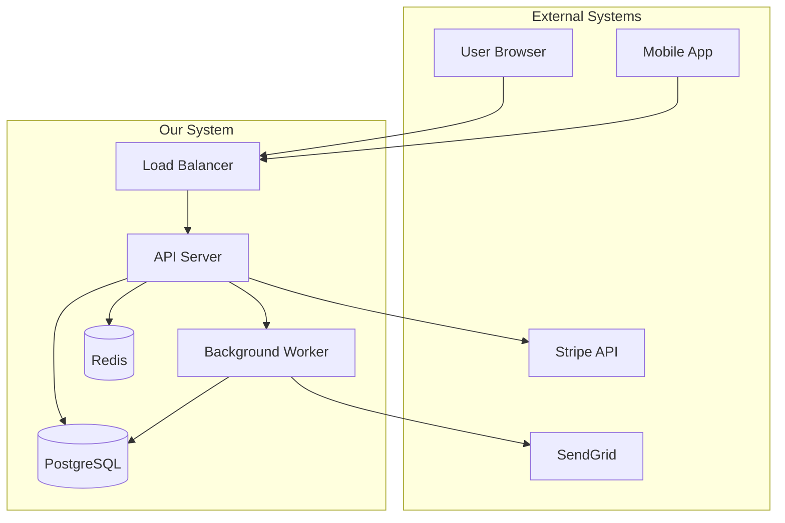
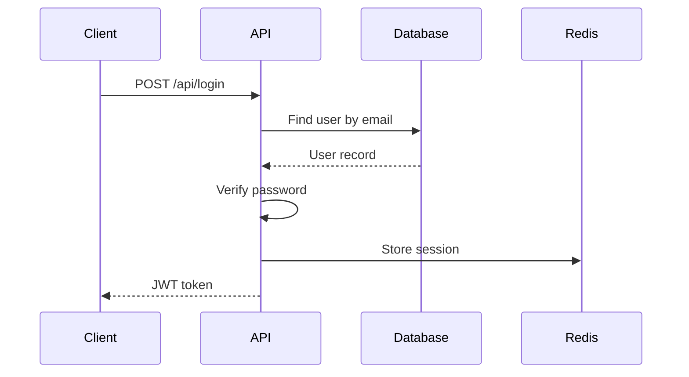
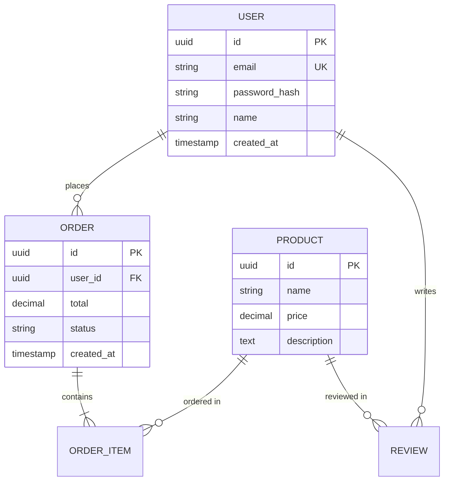
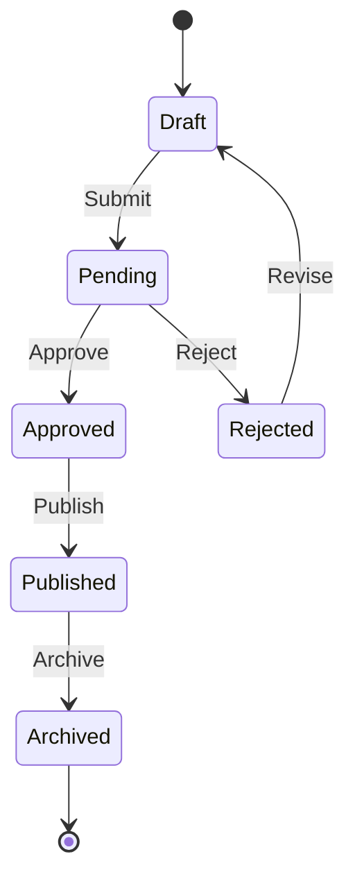
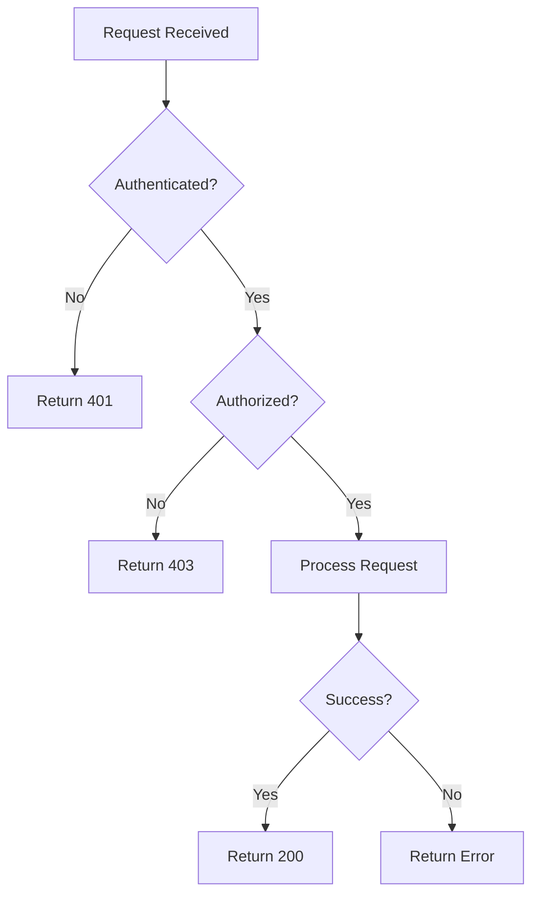

# Architecture Guidelines

## Architecture Documentation Principles

- **Document decisions, not just designs** - Capture the "why" behind choices
- **Keep it current** - Outdated docs are worse than no docs
- **Appropriate detail** - Match documentation depth to audience needs
- **Visual first** - Use diagrams to communicate structure

## Architecture Decision Records (ADR)

### ADR Template

```markdown
# ADR-XXX: [Title]

## Status

[Proposed | Accepted | Deprecated | Superseded by ADR-XXX]

## Date

YYYY-MM-DD

## Context

What is the issue that we're seeing that is motivating this decision or change?

## Decision

What is the change that we're proposing and/or doing?

## Rationale

Why is this change being made? What alternatives were considered?

### Options Considered

1. **Option A**: [Description]
   - Pros: ...
   - Cons: ...

2. **Option B**: [Description]
   - Pros: ...
   - Cons: ...

## Consequences

What becomes easier or more difficult to do because of this change?

### Positive

- ...

### Negative

- ...

### Risks

- ...

## References

- [Link to related documentation]
- [Link to relevant discussions]
```

### ADR Examples

```markdown
# ADR-001: Use PostgreSQL as Primary Database

## Status
Accepted

## Date
2024-01-15

## Context
We need a reliable database for our application that supports:
- Complex queries and joins
- ACID transactions
- JSON data types for flexible schemas
- Good tooling and community support

## Decision
Use PostgreSQL 16 as our primary database.

## Rationale

### Options Considered

1. **PostgreSQL**
   - Pros: ACID compliant, excellent JSON support, mature ecosystem, free
   - Cons: Requires more setup than managed solutions

2. **MySQL**
   - Pros: Popular, good performance, easy setup
   - Cons: Weaker JSON support, licensing concerns with Oracle

3. **MongoDB**
   - Pros: Flexible schema, good for prototyping
   - Cons: Eventual consistency issues, not ideal for relational data

## Consequences

### Positive
- Strong data integrity guarantees
- Powerful query capabilities
- Large talent pool familiar with PostgreSQL

### Negative
- Need to manage schema migrations
- Slightly more complex initial setup

## References
- [PostgreSQL Documentation](https://www.postgresql.org/docs/)
```

### ADR File Organization

```
docs/
└── architecture/
    └── decisions/
        ├── README.md           # Index of all ADRs
        ├── 0001-use-postgresql.md
        ├── 0002-jwt-authentication.md
        ├── 0003-react-frontend.md
        └── 0004-docker-deployment.md
```

## System Design Documentation

### System Overview Template

```markdown
# System Architecture Overview

## Purpose

Brief description of the system's purpose and business value.

## High-Level Architecture

[Diagram: System components and their relationships]

## Key Components

| Component | Technology | Responsibility |
|-----------|------------|----------------|
| Frontend | React + MUI | User interface |
| API Gateway | Express.js | Request routing, auth |
| Database | PostgreSQL | Data persistence |
| Cache | Redis | Session, caching |
| Queue | Bull | Background jobs |

## Data Flow

[Diagram: How data moves through the system]

## External Dependencies

| Service | Purpose | SLA |
|---------|---------|-----|
| Stripe | Payments | 99.99% |
| SendGrid | Email | 99.95% |
| S3 | File storage | 99.99% |

## Security Architecture

- Authentication method
- Authorization model
- Data encryption approach

## Scalability Considerations

- Current capacity
- Scaling triggers
- Horizontal vs vertical scaling approach
```

### Component Architecture Template

```markdown
# [Component Name] Architecture

## Overview

What this component does and its role in the system.

## Responsibilities

- Responsibility 1
- Responsibility 2
- Responsibility 3

## Dependencies

### Upstream (This component depends on)
- Service A: [purpose]
- Service B: [purpose]

### Downstream (Depends on this component)
- Service C: [purpose]
- Service D: [purpose]

## API Contract

### Endpoints (if applicable)
| Method | Path | Description |
|--------|------|-------------|
| GET | /api/items | List items |
| POST | /api/items | Create item |

### Events Published (if applicable)
| Event | Payload | When |
|-------|---------|------|
| item.created | `{id, name}` | New item created |

## Data Model

[Entity relationship diagram or schema description]

## Configuration

| Variable | Description | Default |
|----------|-------------|---------|
| MAX_ITEMS | Maximum items per user | 100 |

## Error Handling

How errors are handled, logged, and propagated.

## Monitoring

Key metrics and alerts for this component.
```

## Mermaid Diagrams

### System Context Diagram



### Sequence Diagram



### Entity Relationship Diagram



### State Diagram



### Flowchart



## Integration Patterns

### API Integration

```markdown
## [Service Name] Integration

### Overview
Purpose of this integration.

### Authentication
How we authenticate with this service.

### Endpoints Used

| Endpoint | Method | Purpose |
|----------|--------|---------|
| /v1/charges | POST | Create payment |
| /v1/refunds | POST | Process refund |

### Error Handling

| Error Code | Meaning | Our Response |
|------------|---------|--------------|
| 400 | Bad request | Log and return validation error |
| 401 | Auth failed | Alert, retry with new token |
| 429 | Rate limited | Exponential backoff |
| 500 | Server error | Retry 3 times, then fail |

### Rate Limits
- 100 requests/second
- Burst: 200 requests

### Circuit Breaker Settings
- Failure threshold: 5
- Recovery timeout: 30s
```

### Event-Driven Integration

```markdown
## Event Schema: [Event Name]

### Topic/Queue
`orders.created`

### Payload Schema

```json
{
  "eventId": "uuid",
  "eventType": "order.created",
  "timestamp": "ISO-8601",
  "data": {
    "orderId": "uuid",
    "userId": "uuid",
    "items": [...],
    "total": 99.99
  }
}
```

### Publishers
- Order Service

### Subscribers
- Notification Service (send confirmation email)
- Inventory Service (reserve stock)
- Analytics Service (track metrics)

### Delivery Guarantees
- At least once delivery
- Idempotent consumers required
```

## Technical Debt Tracking

### Technical Debt Register

```markdown
# Technical Debt Register

| ID | Description | Impact | Effort | Priority | Owner |
|----|-------------|--------|--------|----------|-------|
| TD-001 | Legacy auth system | High | Large | P1 | Team A |
| TD-002 | No request validation | Medium | Small | P2 | Team B |
| TD-003 | Hardcoded config | Low | Small | P3 | Any |

## TD-001: Legacy Authentication System

### Description
Current auth system uses deprecated library with known vulnerabilities.

### Impact
- Security risk (CVE-2023-XXXX)
- Poor performance on token validation
- Difficult to add new auth methods

### Proposed Solution
Migrate to Passport.js with JWT strategy.

### Effort Estimate
2-3 sprints

### Dependencies
- Need to coordinate with mobile team
- Requires user session migration

### Acceptance Criteria
- [ ] All auth flows working with new system
- [ ] Zero downtime migration
- [ ] Performance improved by 50%
```

## Scalability Documentation

### Capacity Planning

```markdown
# Capacity Analysis

## Current State

| Metric | Current | Threshold | Headroom |
|--------|---------|-----------|----------|
| Requests/sec | 500 | 1000 | 50% |
| DB connections | 50 | 100 | 50% |
| Memory usage | 2GB | 4GB | 50% |
| Storage | 100GB | 500GB | 80% |

## Growth Projections

| Timeframe | Users | Requests/sec | Storage |
|-----------|-------|--------------|---------|
| Current | 10K | 500 | 100GB |
| 6 months | 25K | 1,250 | 250GB |
| 12 months | 50K | 2,500 | 500GB |

## Scaling Strategy

### Horizontal Scaling
- Add API server instances behind load balancer
- Trigger: CPU > 70% for 5 minutes
- Scale down: CPU < 30% for 15 minutes

### Vertical Scaling
- Database: Upgrade instance when connections > 80%
- Cache: Increase memory when eviction rate > 10%

### Data Sharding (Future)
- Shard by tenant ID when storage > 1TB
- Read replicas for reporting queries
```

## Checklist

### Architecture Documentation

- [ ] System overview diagram exists
- [ ] All major components documented
- [ ] Data flow diagrams current
- [ ] Integration points documented
- [ ] Security architecture defined
- [ ] ADRs written for major decisions

### ADR Quality

- [ ] Context clearly explains the problem
- [ ] All viable options considered
- [ ] Decision rationale is clear
- [ ] Consequences (positive and negative) listed
- [ ] Status is current
- [ ] Date is accurate

### Diagram Quality

- [ ] Uses standard notation (Mermaid)
- [ ] Appropriate level of detail
- [ ] Labels are clear
- [ ] Legend included if needed
- [ ] Renders correctly in Markdown
