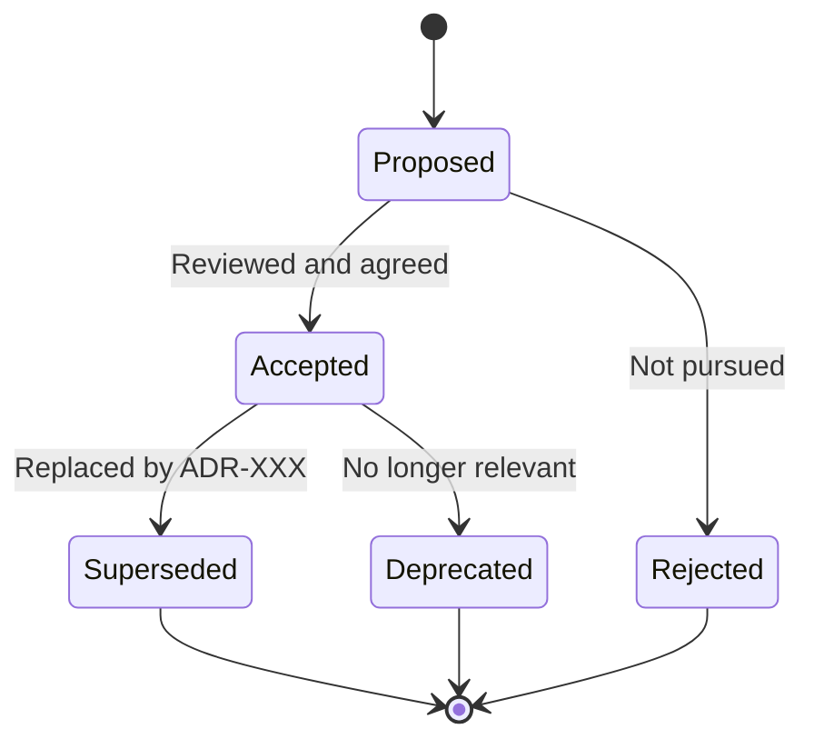
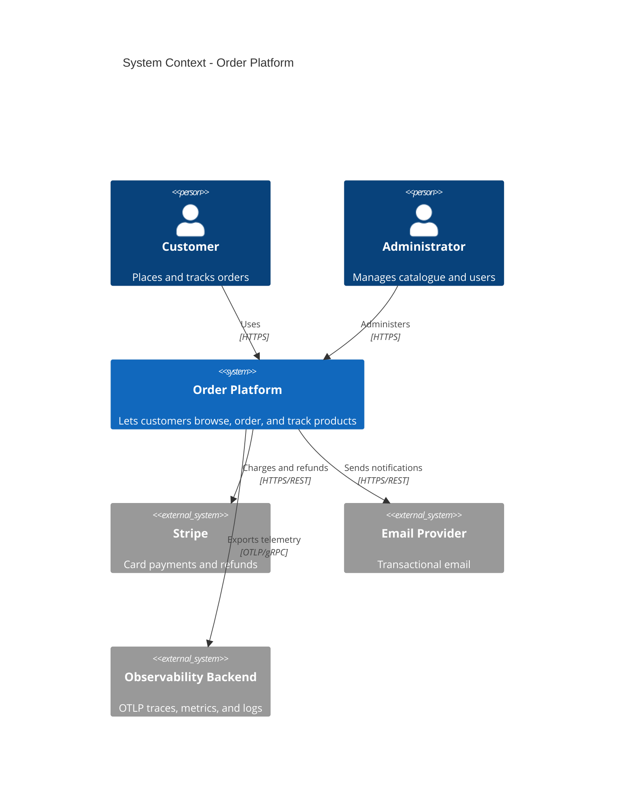
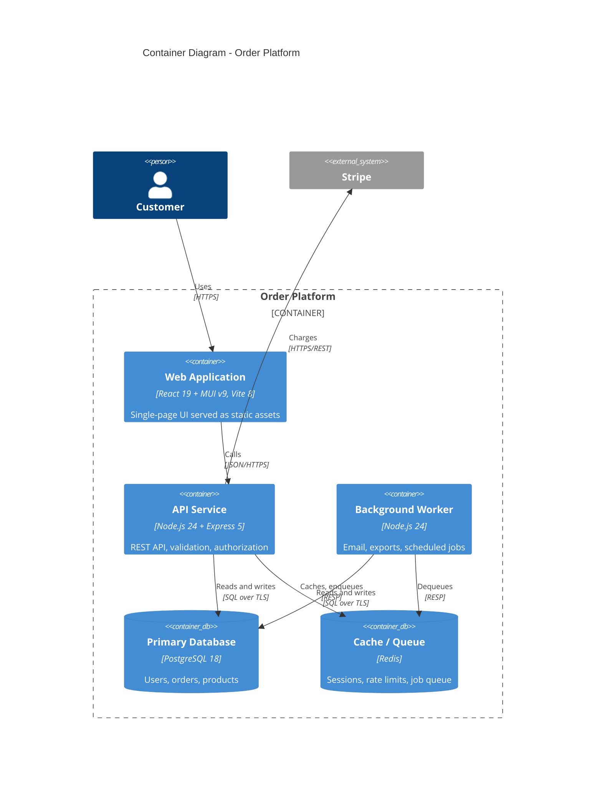
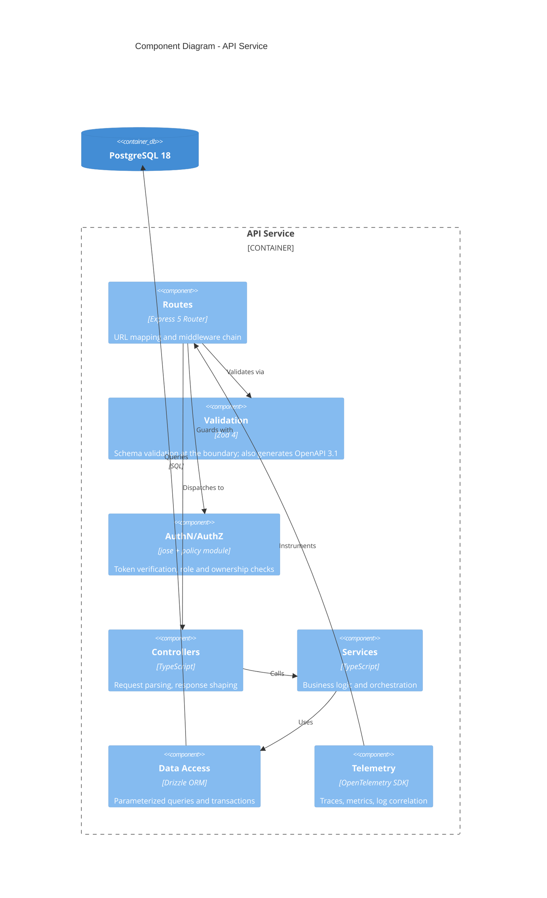
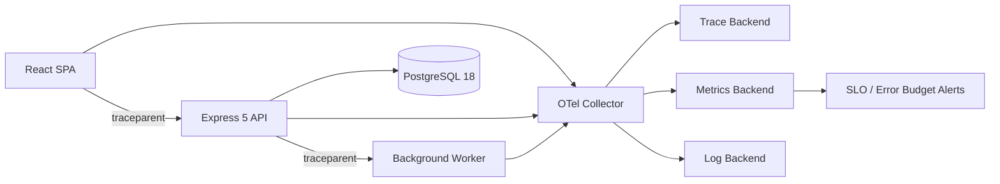
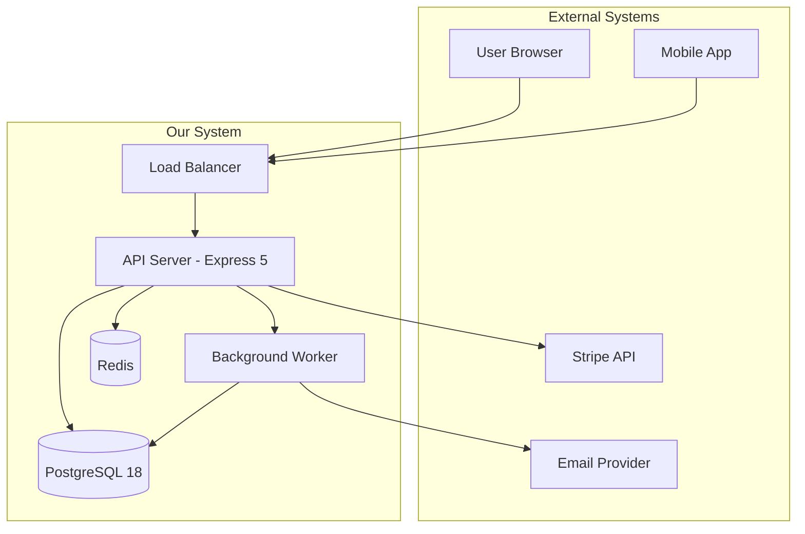
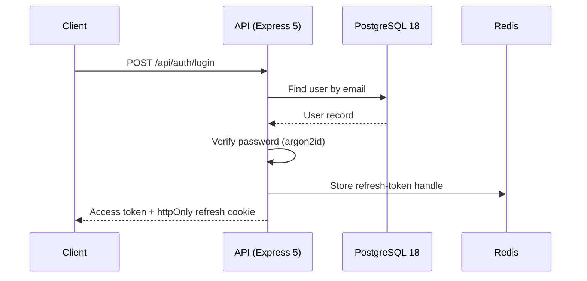
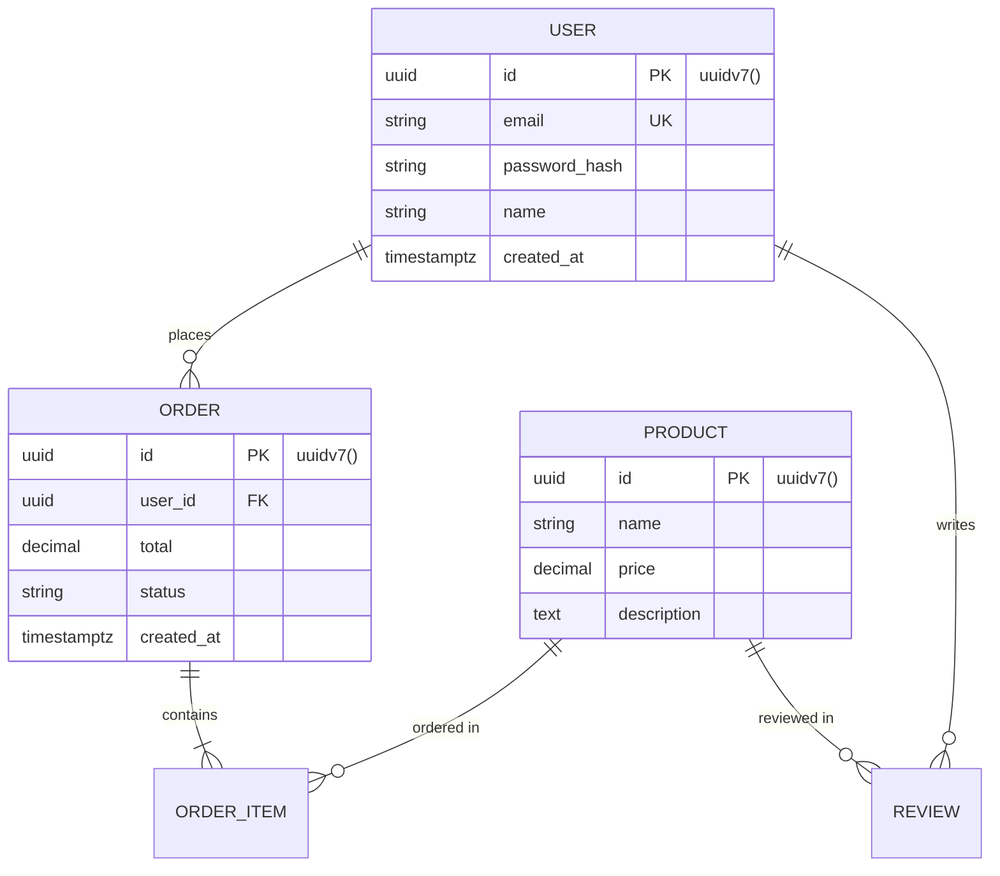
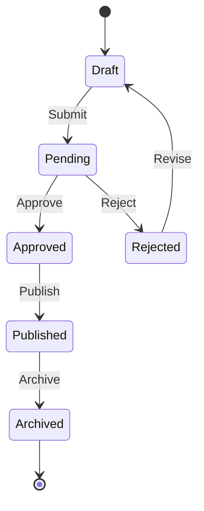
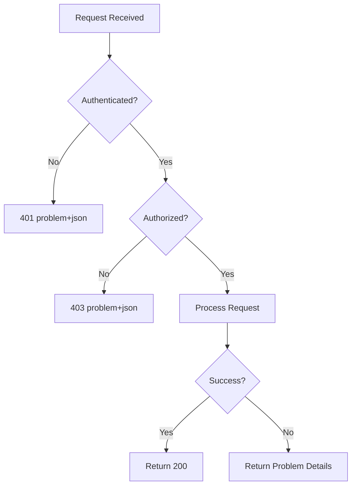

# Architecture Guidelines

## Architecture Documentation Principles

- **Document decisions, not just designs** - Capture the "why" behind choices
- **Keep it current** - Outdated docs are worse than no docs
- **Appropriate detail** - Match documentation depth to audience needs
- **Visual first** - Use diagrams to communicate structure (Mermaid only, never ASCII art)
- **Executable where possible** - Encode architectural rules as fitness functions, not prose

## Reference Stack

Examples in this file assume the project's current baseline. Use these versions when writing
new architecture documentation:

| Layer         | Technology                                                      |
| ------------- | --------------------------------------------------------------- |
| Frontend      | React 19.3 + MUI v9 (MUI X v9), Vite 8                          |
| Backend       | Node.js 24 LTS + Express 5.2                                    |
| Language      | TypeScript 7.0 (JavaScript ESM + JSDoc as fallback)             |
| Validation    | Zod 4 (also the source for OpenAPI 3.1)                         |
| Database      | PostgreSQL 18 (UUIDv7 keys), Drizzle ORM or raw `pg` 8          |
| Observability | OpenTelemetry (traces + metrics + logs), `pino` structured logs |
| CI/CD         | GitHub Actions, Docker (`docker compose` v2)                    |

## Architecture Decision Records (ADR)

### ADR Template

```markdown
# ADR-XXX: [Title]

## Status

[Proposed | Accepted | Deprecated | Superseded by ADR-XXX]

## Date

YYYY-MM-DD

## Context

What is the issue that we're seeing that is motivating this decision or change?

## Decision

What is the change that we're proposing and/or doing?

## Rationale

Why is this change being made? What alternatives were considered?

### Options Considered

1. **Option A**: [Description]
   - Pros: ...
   - Cons: ...

2. **Option B**: [Description]
   - Pros: ...
   - Cons: ...

## Consequences

What becomes easier or more difficult to do because of this change?

### Positive

- ...

### Negative

- ...

### Risks

- ...

## Architecture Characteristics Affected

Which NFRs this decision trades against (see "Architecture Characteristics" below).

## Verification

How compliance with this decision is checked (fitness function, lint rule, CI job, or
"manual review" if none exists yet).

## References

- [Link to related documentation]
- [Link to relevant discussions]
```

### ADR Examples

```markdown
# ADR-001: Use PostgreSQL as Primary Database

## Status

Accepted

## Date

2026-09-20

## Context

We need a reliable database for our application that supports:

- Complex queries and joins
- ACID transactions
- JSON data types for flexible schemas
- Good tooling and community support

## Decision

Use PostgreSQL 18 as our primary database, with UUIDv7 primary keys generated by the
native `uuidv7()` function and `TIMESTAMPTZ` for all timestamps.

## Rationale

### Options Considered

1. **PostgreSQL 18**
   - Pros: ACID compliant, excellent JSONB support, native `uuidv7()` for index-local
     primary keys, `MERGE`, row-level security for multi-tenancy, mature ecosystem, free
   - Cons: Requires more setup than managed document stores

2. **MySQL**
   - Pros: Popular, good performance, easy setup
   - Cons: Weaker JSON support, weaker constraint/extension story

3. **MongoDB**
   - Pros: Flexible schema, good for prototyping
   - Cons: Eventual consistency issues, not ideal for relational data

## Consequences

### Positive

- Strong data integrity guarantees
- Powerful query capabilities
- UUIDv7 keys keep B-tree inserts sequential (no UUIDv4 index fragmentation)
- Large talent pool familiar with PostgreSQL

### Negative

- Need to manage forward-only, expand/contract migrations
- DDL needs `lock_timeout` / `statement_timeout` guards for zero-downtime deploys

## Architecture Characteristics Affected

Data integrity (+), operational simplicity (-), write throughput (+ via UUIDv7)

## Verification

Integration tests run against a real PostgreSQL 18 container (Testcontainers), so a
divergence from the documented version fails CI.

## References

- [PostgreSQL Documentation](https://www.postgresql.org/docs/)
```

### ADR Lifecycle

ADRs are immutable once accepted. You never edit the decision of an accepted ADR - you
write a new one that supersedes it.


```mermaid
stateDiagram-v2
    [*] --> Proposed
    Proposed --> Accepted: Reviewed and agreed
    Proposed --> Rejected: Not pursued
    Accepted --> Deprecated: No longer relevant
    Accepted --> Superseded: Replaced by ADR-XXX
    Superseded --> [*]
    Deprecated --> [*]
    Rejected --> [*]
```

| Status                | Meaning                                      | Allowed edits              |
| --------------------- | -------------------------------------------- | -------------------------- |
| Proposed              | Under discussion, not binding                | Full edits during review   |
| Accepted              | Binding; code must comply                    | Status and References only |
| Rejected              | Considered and declined; kept for the record | Status and References only |
| Deprecated            | No longer relevant (feature removed)         | Status and References only |
| Superseded by ADR-XXX | Replaced; the new ADR links back             | Status and References only |

**Superseding rules**

- The new ADR's Context restates why the old decision no longer holds.
- The old ADR's Status becomes `Superseded by ADR-0042` with a link.
- Never delete an ADR. The record of a decision that was reversed is often more valuable
  than the decision itself.

**Where ADRs live**

```
docs/
└── architecture/
    ├── README.md               # System overview, links to C4 diagrams
    ├── characteristics.md      # Architecture characteristics / NFRs
    └── decisions/
        ├── README.md           # Index: number, title, status, date
        ├── 0001-use-postgresql.md
        ├── 0002-jwt-authentication.md
        ├── 0003-react-frontend.md
        └── 0004-docker-deployment.md
```

ADRs live in the repository, next to the code they govern, and are reviewed in the same
pull request as the change that implements them.

**When an ADR is required vs. a code comment**

| Situation                                                                       | Record as                   |
| ------------------------------------------------------------------------------- | --------------------------- |
| Choosing a database, framework, auth model, or deployment topology              | ADR                         |
| Anything hard or expensive to reverse                                           | ADR                         |
| A decision that constrains other teams or future work                           | ADR                         |
| Adopting or dropping a cross-cutting library (ORM, logger, test runner)         | ADR                         |
| A trade-off between architecture characteristics (e.g. consistency vs. latency) | ADR                         |
| Why one local algorithm was chosen over another                                 | Code comment                |
| A workaround for a known upstream bug, with issue link                          | Code comment                |
| Naming, formatting, file layout inside a module                                 | Lint rule or convention doc |

Rule of thumb: if a new engineer would ask "why is it like this?" six months from now and
the answer is not obvious from one file, it is an ADR.

## C4 Model

The C4 model gives four zoom levels. Use the first three routinely; the fourth (Code) is
generated on demand from the IDE rather than hand-maintained.

| Level        | Question it answers                                                 | Audience                          | Update cadence                          |
| ------------ | ------------------------------------------------------------------- | --------------------------------- | --------------------------------------- |
| 1. Context   | What is the system and who/what does it talk to?                    | Everyone, including non-technical | On new external integrations            |
| 2. Container | What are the deployable/runnable units and how do they communicate? | Developers, DevOps, architects    | On new service, datastore, or protocol  |
| 3. Component | What are the major building blocks inside one container?            | Developers on that container      | On significant internal restructuring   |
| 4. Code      | Class/type relationships                                            | Rarely documented                 | Generate on demand, never hand-maintain |

Keep one Context diagram per system, one Container diagram per system, and Component
diagrams only for containers complex enough to warrant them.

### Level 1: System Context


```mermaid
C4Context
    title System Context - Order Platform

    Person(customer, "Customer", "Places and tracks orders")
    Person(admin, "Administrator", "Manages catalogue and users")

    System(platform, "Order Platform", "Lets customers browse, order, and track products")

    System_Ext(payments, "Stripe", "Card payments and refunds")
    System_Ext(email, "Email Provider", "Transactional email")
    System_Ext(otel, "Observability Backend", "OTLP traces, metrics, and logs")

    Rel(customer, platform, "Uses", "HTTPS")
    Rel(admin, platform, "Administers", "HTTPS")
    Rel(platform, payments, "Charges and refunds", "HTTPS/REST")
    Rel(platform, email, "Sends notifications", "HTTPS/REST")
    Rel(platform, otel, "Exports telemetry", "OTLP/gRPC")
```

### Level 2: Container


```mermaid
C4Container
    title Container Diagram - Order Platform

    Person(customer, "Customer")

    Container_Boundary(platform, "Order Platform") {
        Container(spa, "Web Application", "React 19 + MUI v9, Vite 8", "Single-page UI served as static assets")
        Container(api, "API Service", "Node.js 24 + Express 5", "REST API, validation, authorization")
        Container(worker, "Background Worker", "Node.js 24", "Email, exports, scheduled jobs")
        ContainerDb(db, "Primary Database", "PostgreSQL 18", "Users, orders, products")
        ContainerDb(cache, "Cache / Queue", "Redis", "Sessions, rate limits, job queue")
    }

    System_Ext(payments, "Stripe")

    Rel(customer, spa, "Uses", "HTTPS")
    Rel(spa, api, "Calls", "JSON/HTTPS")
    Rel(api, db, "Reads and writes", "SQL over TLS")
    Rel(api, cache, "Caches, enqueues", "RESP")
    Rel(worker, cache, "Dequeues", "RESP")
    Rel(worker, db, "Reads and writes", "SQL over TLS")
    Rel(api, payments, "Charges", "HTTPS/REST")
```

### Level 3: Component


```mermaid
C4Component
    title Component Diagram - API Service

    Container_Boundary(api, "API Service") {
        Component(routes, "Routes", "Express 5 Router", "URL mapping and middleware chain")
        Component(validation, "Validation", "Zod 4", "Schema validation at the boundary; also generates OpenAPI 3.1")
        Component(authz, "AuthN/AuthZ", "jose + policy module", "Token verification, role and ownership checks")
        Component(controllers, "Controllers", "TypeScript", "Request parsing, response shaping")
        Component(services, "Services", "TypeScript", "Business logic and orchestration")
        Component(repo, "Data Access", "Drizzle ORM", "Parameterized queries and transactions")
        Component(telemetry, "Telemetry", "OpenTelemetry SDK", "Traces, metrics, log correlation")
    }

    ContainerDb(db, "PostgreSQL 18")

    Rel(routes, validation, "Validates via")
    Rel(routes, authz, "Guards with")
    Rel(routes, controllers, "Dispatches to")
    Rel(controllers, services, "Calls")
    Rel(services, repo, "Uses")
    Rel(repo, db, "Queries", "SQL")
    Rel(telemetry, routes, "Instruments")
```

If a renderer in your toolchain does not support the `C4*` Mermaid dialect, express the
same levels with `flowchart`/`graph` plus `subgraph` boundaries. Never fall back to ASCII.

## Architecture Characteristics (NFRs)

Architecture characteristics are the "-ilities" the design is optimised for. Name them
explicitly, pick the few that drive the design, and state what you deliberately traded away.

| Characteristic          | How it is stated                    | How it is measured                            |
| ----------------------- | ----------------------------------- | --------------------------------------------- |
| Performance             | p95 API latency < 500ms             | OpenTelemetry histogram, load tests           |
| Scalability             | 2,500 req/s at 12 months            | Load test against projection                  |
| Availability            | 99.9% monthly SLO                   | Error-budget burn from SLI metrics            |
| Security                | OWASP Top 10:2025 controls in place | Automated scans, threat model review          |
| Accessibility           | WCAG 2.2 AA                         | axe in CI, manual keyboard/screen-reader pass |
| Frontend responsiveness | INP ≤ 200ms, LCP ≤ 2.5s, CLS ≤ 0.1  | Lighthouse CI, field RUM                      |
| Deployability           | < 15 min from merge to production   | Pipeline duration metric                      |
| Observability           | Every request traceable end to end  | Trace coverage of critical paths              |

Rules:

- Choose at most three to five **driving** characteristics. Everything cannot be first.
- Every ADR names the characteristics it improves and the ones it degrades.
- Each driving characteristic needs a measurable target and an owner, otherwise it is a wish.
- Record them in `docs/architecture/characteristics.md`; the `/nfr-capture` and `/nfr-review`
  skills read and maintain that file.

## Fitness Functions (Architecture Testing)

A fitness function is an automated test for an architectural characteristic. Prose rules
decay; executable rules do not. Run them in CI alongside unit tests.

### Layering and Dependency Rules

Enforce `Routes → Controllers → Services → Data Access` so that no inner layer reaches
outward and no module imports across feature boundaries.

```json
// .dependency-cruiser.json (excerpt)
{
  "forbidden": [
    {
      "name": "no-services-to-controllers",
      "severity": "error",
      "comment": "Services must not depend on the HTTP layer",
      "from": { "path": "^src/services" },
      "to": { "path": "^src/(controllers|routes)" }
    },
    {
      "name": "no-direct-db-from-controllers",
      "severity": "error",
      "comment": "Controllers go through services, never straight to data access",
      "from": { "path": "^src/controllers" },
      "to": { "path": "^src/db" }
    },
    {
      "name": "no-circular",
      "severity": "error",
      "from": {},
      "to": { "circular": true }
    }
  ]
}
```

The equivalent with ESLint 10 flat config and `eslint-plugin-boundaries` or
`import/no-restricted-paths` works just as well - pick one and keep it in the lint job.

### Other Fitness Functions Worth Having

| Rule                   | Tool                                        | Fails the build when                         |
| ---------------------- | ------------------------------------------- | -------------------------------------------- |
| Layering and no cycles | dependency-cruiser / ESLint boundaries      | An import crosses a forbidden edge           |
| Bundle budget          | Vite build + size check                     | Main chunk exceeds the documented budget     |
| API latency budget     | k6 / Artillery in CI                        | p95 exceeds the NFR target                   |
| Core Web Vitals        | Lighthouse CI                               | INP > 200ms, LCP > 2.5s, or CLS > 0.1        |
| Accessibility          | `@axe-core/playwright`                      | Any WCAG 2.2 AA violation                    |
| Supply chain           | `osv-scanner` / `npm audit`                 | New high/critical advisory                   |
| Contract stability     | OpenAPI 3.1 diff against the published spec | Undocumented breaking change                 |
| ADR compliance         | Custom check in CI                          | Code contradicts an accepted ADR (see below) |

### Automated ADR Compliance Checks

Give each enforceable ADR a machine-checkable assertion and link the check back to the ADR
number so a failure tells the engineer _which decision_ they broke:

- **ADR: PostgreSQL only** - a grep/lint rule fails on imports of another database driver.
- **ADR: parameterized SQL only** - lint rule bans template literals inside query calls.
- **ADR: Zod at every boundary** - a test enumerates registered routes and asserts each has
  a schema attached.
- **ADR: no direct `fetch` to third parties from the UI** - dependency rule restricting
  `src/features/**` to the internal API client.
- **ADR index freshness** - CI fails if `docs/architecture/decisions/README.md` does not list
  every ADR file with a current status.

Write the fitness function in the same PR as the ADR. An ADR with no verification path
should say so explicitly in its Verification section.

## System Design Documentation

### System Overview Template

```markdown
# System Architecture Overview

## Purpose

Brief description of the system's purpose and business value.

## High-Level Architecture

[C4 Container diagram - see "C4 Model" above]

## Key Components

| Component | Technology                 | Responsibility                    |
| --------- | -------------------------- | --------------------------------- |
| Frontend  | React 19 + MUI v9 (Vite 8) | User interface                    |
| API       | Node.js 24 + Express 5     | Request routing, validation, auth |
| Database  | PostgreSQL 18              | Data persistence                  |
| Cache     | Redis                      | Session, caching, rate limiting   |
| Queue     | Redis-backed job queue     | Background jobs                   |
| Telemetry | OpenTelemetry Collector    | Traces, metrics, logs export      |

## Data Flow

[Diagram: How data moves through the system]

## External Dependencies

| Service        | Purpose             | SLA    |
| -------------- | ------------------- | ------ |
| Stripe         | Payments            | 99.99% |
| Email provider | Transactional email | 99.95% |
| Object storage | File storage        | 99.99% |

## Security Architecture

- Authentication method (short-lived access tokens, rotating refresh tokens in
  httpOnly/Secure/SameSite cookies)
- Authorization model (roles plus resource ownership checks)
- Data encryption approach (TLS in transit, encryption at rest)
- Supply chain controls (committed lockfile, `npm ci`, SBOM, pinned CI actions)

## Architecture Characteristics

Driving characteristics and their targets (link to `characteristics.md`).

## Scalability Considerations

- Current capacity
- Scaling triggers
- Horizontal vs vertical scaling approach
```

### Component Architecture Template

```markdown
# [Component Name] Architecture

## Overview

What this component does and its role in the system.

## Responsibilities

- Responsibility 1
- Responsibility 2
- Responsibility 3

## Dependencies

### Upstream (This component depends on)

- Service A: [purpose]
- Service B: [purpose]

### Downstream (Depends on this component)

- Service C: [purpose]
- Service D: [purpose]

## API Contract

### Endpoints (if applicable)

| Method | Path       | Description                             |
| ------ | ---------- | --------------------------------------- |
| GET    | /api/items | List items (cursor pagination)          |
| POST   | /api/items | Create item (accepts `Idempotency-Key`) |

Errors follow RFC 9457 Problem Details (`application/problem+json`).

### Events Published (if applicable)

| Event        | Payload      | When             |
| ------------ | ------------ | ---------------- |
| item.created | `{id, name}` | New item created |

## Data Model

[Entity relationship diagram or schema description]

## Configuration

| Variable                    | Description                  | Default |
| --------------------------- | ---------------------------- | ------- |
| MAX_ITEMS                   | Maximum items per user       | 100     |
| OTEL_EXPORTER_OTLP_ENDPOINT | Telemetry collector endpoint | -       |

## Error Handling

How errors are handled, logged, and propagated. Exceptional conditions are handled
explicitly (OWASP A10) - no swallowed errors, no leaked internals.

## Observability

Spans emitted, key metrics, SLIs, and the alerts derived from them.
```

## Observability as an Architectural Concern

Observability is designed in, not bolted on. Decide instrumentation at the same time you
decide the component boundaries, because a boundary you cannot trace across is a boundary
you cannot operate.

**Baseline**

- **OpenTelemetry** for traces, metrics, and logs, exported over OTLP to a collector. The
  collector - not the application - decides where telemetry ends up, so backends can change
  without touching code.
- **Context propagation** via W3C `traceparent` across every hop: browser → API → worker →
  database. A request that loses its trace context at a boundary is an architecture defect.
- **Structured JSON logs** (`pino`) with redaction of secrets and PII, carrying `trace_id`
  and `span_id` so logs join traces automatically.
- **Semantic conventions** for span and attribute names, so dashboards survive refactors.
- **Health endpoints**: `/health` for liveness, `/health/ready` for readiness with real
  dependency checks.

**Architectural consequences to write down**

- Cardinality budget: which attributes may be high-cardinality, and which must not be.
- Sampling strategy: head vs. tail sampling, and what is always sampled (errors, slow paths).
- Cost: telemetry volume is a running cost; state the budget.
- Vendor neutrality: instrumentation is OTel; backends are replaceable.


```mermaid
flowchart LR
    SPA[React SPA] -->|traceparent| API[Express 5 API]
    API -->|traceparent| Worker[Background Worker]
    API --> DB[(PostgreSQL 18)]
    SPA --> Col[OTel Collector]
    API --> Col
    Worker --> Col
    Col --> Traces[Trace Backend]
    Col --> Metrics[Metrics Backend]
    Col --> Logs[Log Backend]
    Metrics --> SLO[SLO / Error Budget Alerts]
```

**SLO-based alerting**: alert on error-budget burn rate for user-facing SLIs (availability,
latency), not on raw CPU thresholds. Deploy automation rolls back on fast burn.

## Mermaid Diagrams

### System Context Diagram


```mermaid
graph TB
    subgraph external [External Systems]
        User[User Browser]
        Mobile[Mobile App]
        Stripe[Stripe API]
        Email[Email Provider]
    end

    subgraph system [Our System]
        LB[Load Balancer]
        API[API Server - Express 5]
        Worker[Background Worker]
        DB[(PostgreSQL 18)]
        Cache[(Redis)]
    end

    User --> LB
    Mobile --> LB
    LB --> API
    API --> DB
    API --> Cache
    API --> Worker
    Worker --> DB
    Worker --> Email
    API --> Stripe
```

### Sequence Diagram


```mermaid
sequenceDiagram
    participant C as Client
    participant A as API (Express 5)
    participant D as PostgreSQL 18
    participant R as Redis

    C->>A: POST /api/auth/login
    A->>D: Find user by email
    D-->>A: User record
    A->>A: Verify password (argon2id)
    A->>R: Store refresh-token handle
    A-->>C: Access token + httpOnly refresh cookie
```

### Entity Relationship Diagram


```mermaid
erDiagram
    USER ||--o{ ORDER : places
    USER ||--o{ REVIEW : writes
    ORDER ||--|{ ORDER_ITEM : contains
    PRODUCT ||--o{ ORDER_ITEM : "ordered in"
    PRODUCT ||--o{ REVIEW : "reviewed in"

    USER {
        uuid id PK "uuidv7()"
        string email UK
        string password_hash
        string name
        timestamptz created_at
    }

    ORDER {
        uuid id PK "uuidv7()"
        uuid user_id FK
        decimal total
        string status
        timestamptz created_at
    }

    PRODUCT {
        uuid id PK "uuidv7()"
        string name
        decimal price
        text description
    }
```

### State Diagram


```mermaid
stateDiagram-v2
    [*] --> Draft
    Draft --> Pending: Submit
    Pending --> Approved: Approve
    Pending --> Rejected: Reject
    Rejected --> Draft: Revise
    Approved --> Published: Publish
    Published --> Archived: Archive
    Archived --> [*]
```

### Flowchart


```mermaid
flowchart TD
    A[Request Received] --> B{Authenticated?}
    B -->|No| C[401 problem+json]
    B -->|Yes| D{Authorized?}
    D -->|No| E[403 problem+json]
    D -->|Yes| F[Process Request]
    F --> G{Success?}
    G -->|Yes| H[Return 200]
    G -->|No| I[Return Problem Details]
```

## Integration Patterns

### API Integration

```markdown
## [Service Name] Integration

### Overview

Purpose of this integration.

### Authentication

How we authenticate with this service (prefer OIDC/workload identity over long-lived keys).

### Endpoints Used

| Endpoint    | Method | Purpose        |
| ----------- | ------ | -------------- |
| /v1/charges | POST   | Create payment |
| /v1/refunds | POST   | Process refund |

### Error Handling

| Error Code | Meaning      | Our Response                                          |
| ---------- | ------------ | ----------------------------------------------------- |
| 400        | Bad request  | Log and surface a validation Problem Details response |
| 401        | Auth failed  | Alert, retry with new token                           |
| 429        | Rate limited | Honour `Retry-After`, exponential backoff with jitter |
| 500        | Server error | Retry 3 times with jitter, then fail loudly           |

### Idempotency

Unsafe POST calls send an `Idempotency-Key` so retries cannot double-charge.

### Rate Limits

- 100 requests/second
- Burst: 200 requests

### Circuit Breaker Settings

- Failure threshold: 5
- Recovery timeout: 30s

### Observability

Outbound calls are wrapped in a client span; failures and breaker state are metrics.
```

### Event-Driven Integration

````markdown
## Event Schema: [Event Name]

### Topic/Queue

`orders.created`

### Payload Schema

Defined as a Zod schema and published as JSON Schema; the snippet below is illustrative.

```json
{
  "eventId": "uuid",
  "eventType": "order.created",
  "timestamp": "ISO-8601",
  "traceparent": "00-<trace-id>-<span-id>-01",
  "data": {
    "orderId": "uuid",
    "userId": "uuid",
    "items": [],
    "total": 99.99
  }
}
```

### Publishers

- Order Service

### Subscribers

- Notification Service (send confirmation email)
- Inventory Service (reserve stock)
- Analytics Service (track metrics)

### Delivery Guarantees

- At least once delivery
- Idempotent consumers required (dedupe on `eventId`)
- `traceparent` carried on the message so consumers join the producer's trace

````

## Technical Debt Tracking

### Technical Debt Register

```markdown
# Technical Debt Register

| ID | Description | Impact | Effort | Priority | Owner |
|----|-------------|--------|--------|----------|-------|
| TD-001 | Legacy auth on an unmaintained library | High | Large | P1 | Team A |
| TD-002 | Routes without Zod validation | Medium | Small | P2 | Team B |
| TD-003 | Express 4 `asyncHandler` wrappers still in place | Low | Small | P3 | Any |
| TD-004 | Manual `useMemo`/`useCallback` predating React Compiler | Low | Medium | P3 | Any |

## TD-001: Legacy Authentication System

### Description
Auth uses an unmaintained token library with an open advisory, and secrets are verified
with a hand-rolled comparison.

### Impact
- Security risk (unpatched advisory; OWASP A07 Authentication Failures)
- Poor performance on token validation
- Difficult to add new auth methods (passkeys, SSO)

### Proposed Solution
Move verification to `jose`, shorten access tokens to 15 minutes, rotate refresh tokens in
httpOnly/Secure/SameSite cookies, and evaluate Better Auth / Auth.js for the surrounding
flows.

### Effort Estimate
2-3 sprints

### Dependencies
- Need to coordinate with mobile team
- Requires user session migration

### Acceptance Criteria
- [ ] All auth flows working with new system
- [ ] Zero downtime migration
- [ ] Token verification p95 improved by 50%
- [ ] Fitness function fails the build if the old library reappears
````

Track debt where the work is planned (issue tracker), and keep the register as the index.
Debt that has no owner and no priority is not tracked - it is remembered, badly.

## Scalability Documentation

### Capacity Planning

```markdown
# Capacity Analysis

## Current State

| Metric                    | Current | Threshold | Headroom |
| ------------------------- | ------- | --------- | -------- |
| Requests/sec              | 500     | 1000      | 50%      |
| DB connections            | 50      | 100       | 50%      |
| Memory usage              | 2GB     | 4GB       | 50%      |
| Storage                   | 100GB   | 500GB     | 80%      |
| p95 latency               | 210ms   | 500ms     | 58%      |
| Error budget burned (30d) | 18%     | 100%      | 82%      |

## Growth Projections

| Timeframe | Users | Requests/sec | Storage |
| --------- | ----- | ------------ | ------- |
| Current   | 10K   | 500          | 100GB   |
| 6 months  | 25K   | 1,250        | 250GB   |
| 12 months | 50K   | 2,500        | 500GB   |

Projections are validated by load tests run against the next milestone's numbers, not by
extrapolation alone.

## Scaling Strategy

### Horizontal Scaling

- Add API server instances behind the load balancer
- Trigger: sustained p95 latency > 350ms or CPU > 70% for 5 minutes
- Scale down: CPU < 30% for 15 minutes

### Vertical Scaling

- Database: upgrade instance when connections > 80% or replication lag grows
- Cache: increase memory when eviction rate > 10%

### Connection Management

- Pool sized so that (instances x pool size) stays below the PostgreSQL connection limit
- Use a pooler (PgBouncer or the managed equivalent) before raising the server limit

### Data Sharding (Future)

- Shard by tenant ID when storage > 1TB
- Read replicas for reporting queries
- Row-level security already in place for multi-tenant isolation
```

## Checklist

### Architecture Documentation

- [ ] C4 Context and Container diagrams exist and are current
- [ ] Component diagrams exist for non-trivial containers
- [ ] All major components documented
- [ ] Data flow diagrams current
- [ ] Integration points documented
- [ ] Security architecture defined
- [ ] Architecture characteristics named, targeted, and owned
- [ ] Observability design documented (traces, metrics, logs, SLOs)
- [ ] ADRs written for major decisions
- [ ] Versions in examples match the project's actual stack

### ADR Quality

- [ ] Context clearly explains the problem
- [ ] All viable options considered
- [ ] Decision rationale is clear
- [ ] Consequences (positive and negative) listed
- [ ] Architecture characteristics traded off are named
- [ ] Verification method stated (fitness function or explicit "manual")
- [ ] Status is current; superseded ADRs link to their replacement
- [ ] Listed in the ADR index
- [ ] Date is accurate

### Fitness Functions

- [ ] Layering rules enforced automatically (dependency-cruiser or ESLint boundaries)
- [ ] No-cycles rule enabled
- [ ] Performance and Core Web Vitals budgets checked in CI
- [ ] Accessibility (WCAG 2.2 AA) checked in CI
- [ ] Supply chain scanning enabled
- [ ] Each enforceable ADR has a linked automated check

### Diagram Quality

- [ ] Uses standard notation (Mermaid) - never ASCII art
- [ ] Correct C4 level for the audience
- [ ] Appropriate level of detail
- [ ] Labels are clear
- [ ] Legend included if needed
- [ ] Renders correctly in Markdown
