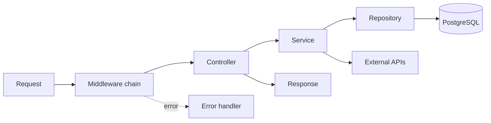
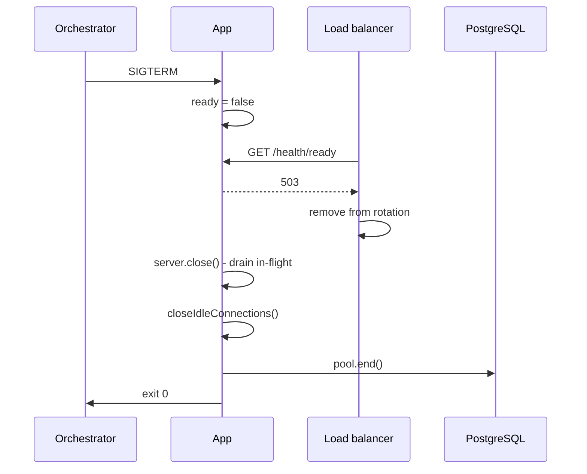

# Backend Development (Node 24 LTS + Express 5 + TypeScript)

## Baseline

| Thing      | Version                | Note                                                      |
| ---------- | ---------------------- | --------------------------------------------------------- |
| Node.js    | 24 LTS (target `>=22`) | Node 22 is Maintenance LTS until 2027-04-30               |
| TypeScript | 7.0                    | native Go compiler, 8-12x faster builds; same type system |
| Express    | 5.2                    | async errors forwarded automatically                      |
| Zod        | 4.6                    | validation at every boundary                              |
| `pg`       | 8.23                   | parameterized queries only                                |
| Logging    | `pino` + OpenTelemetry | never a hand-rolled logger, never `console.log`           |

> **TypeScript 7 caveat**: there is no stable programmatic API until 7.1, so
> `typescript-eslint` and some framework tooling cannot consume the native build yet. Keep
> TypeScript 5.9 installed alongside if you need type-aware linting.

> **JavaScript (ESM + JSDoc) fallback**: everything below works in plain ESM JavaScript. Where a
> snippet uses a TS-only construct (`satisfies`, declaration merging, generics, `import type`),
> a short fallback note follows it. Use `// @ts-check` plus JSDoc types to keep editor checking.

## Project Structure

```
src/
├── app.ts                 # Express app composition (no listen)
├── server.ts              # Server startup and graceful shutdown
├── telemetry.ts           # OpenTelemetry SDK - imported FIRST
├── routes/
│   ├── index.ts           # Route aggregator
│   ├── health.routes.ts
│   ├── auth.routes.ts
│   └── users.routes.ts
├── controllers/           # Request handlers (parse in, format out)
├── services/              # Business logic, framework-agnostic
├── repositories/          # Data access (SQL lives here only)
├── middleware/
│   ├── auth.middleware.ts
│   ├── validate.middleware.ts
│   ├── request-id.middleware.ts
│   └── error.middleware.ts
├── schemas/               # Zod schemas + inferred types
├── utils/
│   ├── errors.ts
│   └── logger.ts
├── config/
│   └── index.ts           # Env parsing + validation
└── types/
    └── express.d.ts       # Request augmentation
```

## Architecture Pattern



### Layer Responsibilities

| Layer        | Responsibility                                | Must NOT               |
| ------------ | --------------------------------------------- | ---------------------- |
| Routes       | URL mapping, middleware chain                 | contain logic          |
| Controllers  | Read validated input, shape the HTTP response | contain business rules |
| Services     | Business logic, orchestration, transactions   | touch `req`/`res`      |
| Repositories | Parameterized SQL, row → domain mapping       | contain business rules |

## Express 5: what changed

### Async errors are forwarded automatically

Express 5 awaits the promise returned by a handler and routes a rejection to the error
middleware. **The `asyncHandler` wrapper is dead code - it is an Express 4 legacy pattern.**

```typescript
// Express 4 LEGACY - do not write this any more
router.get('/:id', asyncHandler(async (req, res) => { ... }));

// Express 5 - throw freely, the error handler receives it
router.get('/:id', async (req, res) => {
  const user = await userService.getUserById(req.params.id); // may throw NotFoundError
  res.json(user);
});
```

Caveats that still require `next(err)` or a `try/catch`:

- Errors thrown **after** the response has been sent (check `res.headersSent`).
- Rejections from detached work you did not `await` (fire-and-forget promises, event emitters,
  `setTimeout` callbacks). Attach `.catch(next)` or handle them where they occur.
- Streams: use `pipeline()` from `node:stream/promises`, not `.pipe()`.

### Routing is path-to-regexp v8

| Express 4       | Express 5       | Meaning                     |
| --------------- | --------------- | --------------------------- |
| `*`             | `/*splat`       | wildcard, now must be named |
| `/files/*`      | `/files/*splat` | named wildcard param        |
| `/users/:id?`   | `/users{/:id}`  | optional segment            |
| `/ab?cd`, `/a+` | removed         | no regex characters in path |
| `/:id(\\d+)`    | removed         | validate with Zod instead   |

```typescript
router.get("/files/*splat", (req, res) => {
  const path = (req.params as { splat: string[] }).splat.join("/");
  res.json({ path });
});

router.get("/users{/:id}", (req, res) => {
  res.json({ id: req.params.id ?? null }); // id is optional
});
```

### `req.query` is a read-only getter

Express 5 defines `req.query` as a lazily-parsed getter. **Assigning to it throws.** Validation
middleware must write parsed output somewhere else.

```typescript
// BREAKS in Express 5
req.query = parsed.data;

// Correct: a typed, dedicated slot
req.validated = { ...req.validated, query: parsed.data };
```

Other removals: `res.send(status)` (use `res.sendStatus(status)`), `res.json(obj, status)`,
`req.param()`, `app.del()`. `res.status(...).json(...)` still chains.

## Typed Request Augmentation

```typescript
// src/types/express.d.ts
import type { AuthenticatedUser } from "../schemas/auth.schema.js";

declare global {
  namespace Express {
    interface Request {
      /** Parsed + typed output of the validation middleware. Never assign to req.query. */
      validated?: { body?: unknown; query?: unknown; params?: unknown };
      /** Correlation id echoed on every response and every log line. */
      id: string;
      user?: AuthenticatedUser;
    }
    interface Locals {
      requestId: string;
    }
  }
}

export {};
```

> **JavaScript fallback**: skip the `.d.ts`; attach the same fields at runtime and describe them
> with `@typedef` in JSDoc, or use `res.locals` exclusively.

## Express App Setup

```typescript
// src/app.ts
import express from "express";
import helmet from "helmet";
import cors from "cors";
import { rateLimit } from "express-rate-limit";
import { requestId } from "./middleware/request-id.middleware.js";
import {
  errorHandler,
  notFoundHandler,
} from "./middleware/error.middleware.js";
import { httpLogger } from "./utils/logger.js";
import healthRoutes from "./routes/health.routes.js";
import routes from "./routes/index.js";
import { config } from "./config/index.js";

const app = express();

// 0. Trust the proxy so req.ip / X-Forwarded-Proto are accurate behind a load balancer
app.set("trust proxy", config.trustProxy);
app.disable("x-powered-by");

// 1. Correlation: request id + traceparent, before anything that logs
app.use(requestId);

// 2. Security headers
app.use(helmet());
app.use(
  cors({
    origin: config.allowedOrigins,
    credentials: true,
    maxAge: 86_400,
  }),
);

// 3. Rate limiting
app.use(
  "/api",
  rateLimit({
    windowMs: 15 * 60 * 1000,
    limit: 100,
    standardHeaders: "draft-8", // RateLimit + RateLimit-Policy headers
    legacyHeaders: false,
  }),
);

// 4. Body parsing (bounded)
app.use(express.json({ limit: "1mb" }));
app.use(express.urlencoded({ extended: true, limit: "1mb" }));

// 5. Structured request logging (pino-http, emits one line per request)
app.use(httpLogger);

// 6. Health probes - before auth, never rate-limited
app.use(healthRoutes);

// 7. API routes
app.use("/api", routes);

// 8. 404
app.use(notFoundHandler);

// 9. Error handler MUST be last and MUST take four arguments
app.use(errorHandler);

export default app;
```

Middleware order: **correlation → security → rate limiting → parsing → logging → health → auth →
validation → business logic → 404 → error handling.**

## Server Startup and Graceful Shutdown

```typescript
// src/server.ts
import "./telemetry.js"; // MUST be the first import - instruments before anything loads
import app from "./app.js";
import { config } from "./config/index.js";
import { logger } from "./utils/logger.js";
import { pool } from "./db/pool.js";

const server = app.listen(config.port, () => {
  logger.info({ port: config.port, env: config.nodeEnv }, "server listening");
});

// Node 24: bound the time a socket may stay idle between requests
server.keepAliveTimeout = 65_000;
server.headersTimeout = 66_000;

let shuttingDown = false;

/** Drains in-flight requests, then closes the HTTP server and the database pool. */
async function shutdown(signal: NodeJS.Signals): Promise<void> {
  if (shuttingDown) return;
  shuttingDown = true;
  logger.info({ signal }, "shutdown started");

  // Fail readiness first so the load balancer stops sending new traffic.
  app.locals.ready = false;

  const forced = setTimeout(() => {
    logger.error("forced shutdown after timeout");
    process.exit(1);
  }, 30_000);
  forced.unref();

  // 1. Stop accepting new connections; existing requests finish.
  await new Promise<void>((resolve) => server.close(() => resolve()));

  // 2. Kill sockets still idle in keep-alive (Node 18.2+).
  server.closeIdleConnections();
  // Only if a drain deadline passes: server.closeAllConnections();

  // 3. Release downstream resources.
  await pool.end();

  clearTimeout(forced);
  logger.info("shutdown complete");
  process.exit(0);
}

process.on("SIGTERM", () => void shutdown("SIGTERM"));
process.on("SIGINT", () => void shutdown("SIGINT"));

process.on("unhandledRejection", (reason) => {
  logger.fatal({ err: reason }, "unhandled rejection");
  void shutdown("SIGTERM");
});
process.on("uncaughtException", (err) => {
  logger.fatal({ err }, "uncaught exception");
  process.exit(1); // state is unknown - exit, let the orchestrator restart
});
```

Shutdown sequence:



## Error Handling

### Error Classes

```typescript
// src/utils/errors.ts

/** Base class for errors that are expected and safe to surface to clients. */
export class AppError extends Error {
  readonly statusCode: number;
  readonly type: string;
  readonly isOperational = true;
  readonly details?: Record<string, unknown>;

  constructor(
    message: string,
    statusCode: number,
    type: string,
    details?: Record<string, unknown>,
  ) {
    super(message);
    this.name = new.target.name;
    this.statusCode = statusCode;
    this.type = type;
    this.details = details;
    Error.captureStackTrace(this, new.target);
  }
}

export class BadRequestError extends AppError {
  constructor(message = "Bad request") {
    super(message, 400, "https://api.example.com/problems/bad-request");
  }
}

export class UnauthorizedError extends AppError {
  constructor(message = "Authentication required") {
    super(message, 401, "https://api.example.com/problems/unauthorized");
  }
}

export class ForbiddenError extends AppError {
  constructor(message = "Insufficient permissions") {
    super(message, 403, "https://api.example.com/problems/forbidden");
  }
}

export class NotFoundError extends AppError {
  constructor(message = "Resource not found") {
    super(message, 404, "https://api.example.com/problems/not-found");
  }
}

export class ConflictError extends AppError {
  constructor(message = "Resource conflict") {
    super(message, 409, "https://api.example.com/problems/conflict");
  }
}

export class ValidationError extends AppError {
  constructor(
    message = "Validation failed",
    details: Record<string, unknown> = {},
  ) {
    super(
      message,
      422,
      "https://api.example.com/problems/validation-error",
      details,
    );
  }
}
```

Use `cause` to preserve the original failure without leaking it:
`throw new ConflictError('Email already registered', { cause: err })`.

### Error Middleware (RFC 9457 Problem Details)

```typescript
// src/middleware/error.middleware.ts
import type { ErrorRequestHandler, RequestHandler } from "express";
import { ZodError } from "zod";
import { AppError } from "../utils/errors.js";
import { logger } from "../utils/logger.js";
import { config } from "../config/index.js";

export const notFoundHandler: RequestHandler = (req, res) => {
  res
    .status(404)
    .type("application/problem+json")
    .json({
      type: "https://api.example.com/problems/not-found",
      title: "Not Found",
      status: 404,
      detail: `Cannot ${req.method} ${req.path}`,
      instance: req.originalUrl,
      requestId: req.id,
    });
};

/** Global error handler. Must be registered last and must declare four parameters. */
export const errorHandler: ErrorRequestHandler = (err, req, res, next) => {
  // Express 5 still requires delegating once the response has started.
  if (res.headersSent) return next(err);

  if (err instanceof ZodError) {
    req.log.warn({ err }, "validation failed");
    res
      .status(422)
      .type("application/problem+json")
      .json({
        type: "https://api.example.com/problems/validation-error",
        title: "Validation Failed",
        status: 422,
        detail: "One or more fields are invalid",
        instance: req.originalUrl,
        requestId: req.id,
        errors: err.issues.map((i) => ({
          field: i.path.join("."),
          message: i.message,
        })),
      });
    return;
  }

  if (err instanceof AppError) {
    req.log.warn({ err, statusCode: err.statusCode }, err.message);
    res
      .status(err.statusCode)
      .type("application/problem+json")
      .json({
        type: err.type,
        title: err.name.replace(/Error$/, "") || "Error",
        status: err.statusCode,
        detail: err.message,
        instance: req.originalUrl,
        requestId: req.id,
        ...(err.details ?? {}),
      });
    return;
  }

  // Unknown = a bug. Log fully, tell the client nothing.
  logger.error(
    { err, path: req.path, method: req.method, requestId: req.id },
    "unhandled error",
  );
  res
    .status(500)
    .type("application/problem+json")
    .json({
      type: "about:blank",
      title: "Internal Server Error",
      status: 500,
      detail: config.isDev
        ? String((err as Error).message)
        : "An unexpected error occurred",
      instance: req.originalUrl,
      requestId: req.id,
    });
};
```

See `api-design.md` for the full Problem Details contract and the legacy `{success, data}`
envelope alternative.

## Routes

```typescript
// src/routes/index.ts
import { Router } from "express";
import authRoutes from "./auth.routes.js";
import userRoutes from "./users.routes.js";

const router = Router();
router.use("/auth", authRoutes);
router.use("/users", userRoutes);
export default router;
```

```typescript
// src/routes/users.routes.ts
import { Router } from "express";
import { authenticate, authorize } from "../middleware/auth.middleware.js";
import { validate } from "../middleware/validate.middleware.js";
import {
  createUserSchema,
  updateUserSchema,
  listUsersQuery,
  userIdParams,
} from "../schemas/user.schema.js";
import * as userController from "../controllers/users.controller.js";

const router = Router();

router.get(
  "/",
  authenticate,
  validate({ query: listUsersQuery }),
  userController.listUsers,
);
router.get(
  "/:id",
  authenticate,
  validate({ params: userIdParams }),
  userController.getUser,
);
router.post(
  "/",
  authenticate,
  authorize("admin"),
  validate({ body: createUserSchema }),
  userController.createUser,
);
router.patch(
  "/:id",
  authenticate,
  validate({ params: userIdParams, body: updateUserSchema }),
  userController.updateUser,
);
router.delete(
  "/:id",
  authenticate,
  authorize("admin"),
  validate({ params: userIdParams }),
  userController.deleteUser,
);

export default router;
```

Note `PATCH` for partial updates (`PUT` only when the client replaces the whole resource).

## Controllers

No `asyncHandler`. Throwing is the error path.

```typescript
// src/controllers/users.controller.ts
import type { RequestHandler } from "express";
import type {
  CreateUserInput,
  ListUsersQuery,
  UserIdParams,
} from "../schemas/user.schema.js";
import * as userService from "../services/user.service.js";

/** GET /api/users - cursor-paginated list. */
export const listUsers: RequestHandler = async (req, res) => {
  const query = req.validated!.query as ListUsersQuery;
  const { items, nextCursor } = await userService.listUsers(query);
  res.json({ data: items, pagination: { limit: query.limit, nextCursor } });
};

/** GET /api/users/:id */
export const getUser: RequestHandler = async (req, res) => {
  const { id } = req.validated!.params as UserIdParams;
  const user = await userService.getUserById(id); // throws NotFoundError
  res.json({ data: user });
};

/** POST /api/users */
export const createUser: RequestHandler = async (req, res) => {
  const input = req.validated!.body as CreateUserInput;
  const user = await userService.createUser(input); // throws ConflictError
  res.status(201).location(`/api/users/${user.id}`).json({ data: user });
};

/** PATCH /api/users/:id */
export const updateUser: RequestHandler = async (req, res) => {
  const { id } = req.validated!.params as UserIdParams;
  const user = await userService.updateUser(id, req.validated!.body, req.user!);
  res.json({ data: user });
};

/** DELETE /api/users/:id */
export const deleteUser: RequestHandler = async (req, res) => {
  const { id } = req.validated!.params as UserIdParams;
  await userService.deleteUser(id);
  res.sendStatus(204); // res.send(204) was removed in Express 5
};
```

> Prefer a small typed helper over repeated `as` casts:
> `const q = getValidated<ListUsersQuery>(req, 'query');`

## Services

Framework-agnostic. No `req`, no `res`, no status codes.

```typescript
// src/services/user.service.ts
import {
  ConflictError,
  ForbiddenError,
  NotFoundError,
} from "../utils/errors.js";
import { hashPassword } from "../utils/password.js";
import * as userRepo from "../repositories/user.repository.js";
import type {
  CreateUserInput,
  ListUsersQuery,
  User,
  AuthenticatedUser,
} from "../schemas/user.schema.js";

/** Returns one page of users plus an opaque cursor for the next page. */
export async function listUsers(
  query: ListUsersQuery,
): Promise<{ items: User[]; nextCursor: string | null }> {
  const rows = await userRepo.findPage({ ...query, limit: query.limit + 1 });
  const hasMore = rows.length > query.limit;
  const items = hasMore ? rows.slice(0, query.limit) : rows;
  return { items, nextCursor: hasMore ? encodeCursor(items.at(-1)!) : null };
}

/**
 * Fetches a user by id.
 * @throws {NotFoundError} When no user has that id.
 */
export async function getUserById(id: string): Promise<User> {
  const user = await userRepo.findById(id);
  if (!user) throw new NotFoundError(`User ${id} not found`);
  return user;
}

/**
 * Registers a user with a hashed password.
 * @throws {ConflictError} When the email is already registered.
 */
export async function createUser(input: CreateUserInput): Promise<User> {
  if (await userRepo.existsByEmail(input.email)) {
    throw new ConflictError("Email already registered");
  }
  const passwordHash = await hashPassword(input.password); // argon2id
  return userRepo.insert({ ...input, passwordHash });
}

/**
 * Applies a partial update. Users may only update themselves unless they are admins.
 * @throws {ForbiddenError} When the requester owns neither the record nor the admin role.
 */
export async function updateUser(
  id: string,
  patch: Partial<User>,
  requester: AuthenticatedUser,
): Promise<User> {
  if (id !== requester.id && requester.role !== "admin") {
    throw new ForbiddenError("Not authorized to update this user");
  }
  await getUserById(id); // 404 before 200
  return userRepo.update(id, patch);
}
```

TSDoc rule: types live in the signature - document `@throws` and behaviour, never repeat
`@param {type}`. In the JavaScript fallback, JSDoc carries the types too.

## Data Access - Parameterized SQL Only

```typescript
// src/repositories/user.repository.ts
import { pool } from "../db/pool.js";
import type { User } from "../schemas/user.schema.js";

/** Keyset page over (created_at, id); never uses OFFSET. */
export async function findPage(opts: {
  limit: number;
  cursor?: { createdAt: string; id: string };
  search?: string;
}): Promise<User[]> {
  const { rows } = await pool.query<User>(
    `SELECT id, email, name, role, created_at AS "createdAt"
       FROM users
      WHERE deleted_at IS NULL
        AND ($1::text IS NULL OR name ILIKE '%' || $1 || '%')
        AND ($2::timestamptz IS NULL OR (created_at, id) < ($2, $3))
      ORDER BY created_at DESC, id DESC
      LIMIT $4`,
    [
      opts.search ?? null,
      opts.cursor?.createdAt ?? null,
      opts.cursor?.id ?? null,
      opts.limit,
    ],
  );
  return rows;
}
```

Never build SQL by concatenation or template interpolation. A type-safe query builder (Drizzle
ORM, Kysely) or Prisma is fine; raw `pg` with `$n` placeholders is always acceptable.

## Validation Middleware (Zod 4)

Critical: this does **not** reassign `req.query` - that getter is read-only in Express 5.

```typescript
// src/middleware/validate.middleware.ts
import type { RequestHandler } from "express";
import type { ZodType } from "zod";

interface ValidationTargets {
  body?: ZodType;
  query?: ZodType;
  params?: ZodType;
}

/**
 * Parses the named request parts and stores the typed result on `req.validated`.
 * Rejections propagate as ZodError; the error handler renders them as 422 Problem Details.
 */
export function validate(targets: ValidationTargets): RequestHandler {
  return (req, _res, next) => {
    req.validated ??= {};
    if (targets.params) req.validated.params = targets.params.parse(req.params);
    // req.query = ... would THROW in Express 5 (read-only getter).
    if (targets.query) req.validated.query = targets.query.parse(req.query);
    if (targets.body) req.validated.body = targets.body.parse(req.body);
    next();
  };
}
```

`res.locals` works equally well if you prefer not to augment `Request`:
`res.locals.validatedQuery = targets.query.parse(req.query)`.

```typescript
// src/schemas/user.schema.ts
import { z } from "zod";

export const userIdParams = z.object({ id: z.uuid() });

export const listUsersQuery = z.object({
  limit: z.coerce.number().int().min(1).max(100).default(20),
  cursor: z.string().base64url().optional(),
  search: z.string().trim().max(100).optional(),
  status: z.enum(["active", "inactive", "pending"]).optional(),
});

export const createUserSchema = z.object({
  email: z.email().max(255).toLowerCase(),
  password: z.string().min(12).max(128),
  name: z.string().trim().min(2).max(100),
  role: z.enum(["user", "admin"]).default("user"),
});

export const updateUserSchema = createUserSchema
  .pick({ name: true, email: true })
  .partial()
  .refine((d) => Object.keys(d).length > 0, {
    message: "At least one field must be provided",
  });

export type UserIdParams = z.infer<typeof userIdParams>;
export type ListUsersQuery = z.infer<typeof listUsersQuery>;
export type CreateUserInput = z.infer<typeof createUserSchema>;
```

Zod 4 notes: top-level format helpers (`z.email()`, `z.uuid()`, `z.url()`) replace the
`z.string().email()` chain; issues live on `err.issues`; `z.treeifyError(err)` gives a nested
shape for form rendering. These schemas are also the source for the OpenAPI 3.1 document - see
`api-design.md`.

## Authentication Middleware

```typescript
// src/middleware/auth.middleware.ts
import type { RequestHandler } from "express";
import { jwtVerify } from "jose";
import { ForbiddenError, UnauthorizedError } from "../utils/errors.js";
import { config } from "../config/index.js";

const secret = new TextEncoder().encode(config.jwtSecret);

/** Verifies the bearer access token and populates `req.user`. */
export const authenticate: RequestHandler = async (req, _res, next) => {
  const header = req.headers.authorization;
  if (!header?.startsWith("Bearer "))
    throw new UnauthorizedError("No token provided");

  try {
    const { payload } = await jwtVerify(header.slice(7), secret, {
      issuer: config.jwtIssuer,
      audience: config.jwtAudience,
      algorithms: ["HS256"],
    });
    req.user = { id: payload.sub!, role: payload.role as "user" | "admin" };
    next();
  } catch (err) {
    throw new UnauthorizedError(
      (err as Error).name === "JWTExpired" ? "Token expired" : "Invalid token",
    );
  }
};

/** Restricts a route to the listed roles. */
export function authorize(...roles: Array<"user" | "admin">): RequestHandler {
  return (req, _res, next) => {
    if (!req.user) throw new UnauthorizedError("Not authenticated");
    if (!roles.includes(req.user.role))
      throw new ForbiddenError("Insufficient permissions");
    next();
  };
}
```

Prefer `jose` over `jsonwebtoken`. Access tokens ≤ 15 minutes; rotating refresh tokens in
`httpOnly` / `Secure` / `SameSite=Strict` cookies; opaque tokens plus a server session when you
need instant revocation. Better Auth and Auth.js are reasonable batteries-included choices.
Passwords: argon2id via the `argon2` package (bcrypt with cost ≥ 12 is acceptable legacy).

## Environment Configuration

```typescript
// src/config/index.ts
import { z } from "zod";

const envSchema = z.object({
  NODE_ENV: z
    .enum(["development", "test", "production"])
    .default("development"),
  PORT: z.coerce.number().int().min(1).max(65_535).default(3001),
  DATABASE_URL: z.url(),
  JWT_SECRET: z.string().min(32, "JWT_SECRET must be at least 32 characters"),
  JWT_ISSUER: z.string().default("https://api.example.com"),
  JWT_AUDIENCE: z.string().default("api"),
  ALLOWED_ORIGINS: z
    .string()
    .transform((s) => s.split(",").map((o) => o.trim())),
  LOG_LEVEL: z
    .enum(["fatal", "error", "warn", "info", "debug", "trace"])
    .default("info"),
  TRUST_PROXY: z.coerce.number().int().min(0).default(1),
  OTEL_EXPORTER_OTLP_ENDPOINT: z.url().optional(),
});

const parsed = envSchema.safeParse(process.env);
if (!parsed.success) {
  // Startup only - process.stderr is correct here; runtime code uses the logger.
  process.stderr.write(
    `Invalid environment:\n${z.prettifyError(parsed.error)}\n`,
  );
  process.exit(1);
}

const env = parsed.data;

export const config = {
  nodeEnv: env.NODE_ENV,
  port: env.PORT,
  databaseUrl: env.DATABASE_URL,
  jwtSecret: env.JWT_SECRET,
  jwtIssuer: env.JWT_ISSUER,
  jwtAudience: env.JWT_AUDIENCE,
  allowedOrigins: env.ALLOWED_ORIGINS,
  logLevel: env.LOG_LEVEL,
  trustProxy: env.TRUST_PROXY,
  isDev: env.NODE_ENV === "development",
  isProd: env.NODE_ENV === "production",
} satisfies Record<string, unknown>;
```

`satisfies` checks the object against a constraint while keeping literal types, so
`config.nodeEnv` narrows to the union rather than widening to `string`. Validate at startup and
crash loudly - a misconfigured process must never accept traffic.

> **JavaScript fallback**: drop `satisfies` and `z.infer`; the runtime parsing and the
> `process.exit(1)` are identical.

## Logging (pino) and Observability

```typescript
// src/utils/logger.ts
import { pino } from "pino";
import { pinoHttp } from "pino-http";
import { trace } from "@opentelemetry/api";
import { config } from "../config/index.js";

export const logger = pino({
  level: config.logLevel,
  // Never let a secret reach the log pipeline.
  redact: {
    paths: [
      "req.headers.authorization",
      "req.headers.cookie",
      'res.headers["set-cookie"]',
      "password",
      "*.password",
      "*.passwordHash",
      "*.token",
      "*.refreshToken",
      "*.secret",
      "*.creditCard",
      "*.ssn",
    ],
    censor: "[REDACTED]",
  },
  // Correlate every line with the active span.
  mixin() {
    const span = trace.getActiveSpan()?.spanContext();
    return span ? { trace_id: span.traceId, span_id: span.spanId } : {};
  },
  formatters: { level: (label) => ({ level: label }) },
  timestamp: pino.stdTimeFunctions.isoTime,
  transport: config.isProd ? undefined : { target: "pino-pretty" },
});

/** One structured line per request, available on every handler as `req.log`. */
export const httpLogger = pinoHttp({
  logger,
  genReqId: (req) => req.id,
  customLogLevel: (_req, res, err) =>
    err || res.statusCode >= 500
      ? "error"
      : res.statusCode >= 400
        ? "warn"
        : "info",
  autoLogging: { ignore: (req) => req.url?.startsWith("/health") ?? false },
});
```

```typescript
// src/middleware/request-id.middleware.ts
import { randomUUID } from "node:crypto";
import type { RequestHandler } from "express";

/**
 * Derives a correlation id from the incoming W3C `traceparent` (trace-id segment) or
 * `x-request-id`, generating one when neither is present, and echoes it back.
 */
export const requestId: RequestHandler = (req, res, next) => {
  const traceparent = req.get("traceparent");
  const fromTrace = traceparent?.split("-")[1];
  req.id = req.get("x-request-id") ?? fromTrace ?? randomUUID();
  res.locals.requestId = req.id;
  res.setHeader("x-request-id", req.id);
  next();
};
```

```typescript
// src/telemetry.ts - imported before every other module
import { NodeSDK } from "@opentelemetry/sdk-node";
import { getNodeAutoInstrumentations } from "@opentelemetry/auto-instrumentations-node";

const sdk = new NodeSDK({
  instrumentations: [
    getNodeAutoInstrumentations({
      // HTTP, Express 5 routing, pg and pino are instrumented automatically.
      "@opentelemetry/instrumentation-fs": { enabled: false },
    }),
  ],
});
sdk.start();
process.on("SIGTERM", () => void sdk.shutdown());
```

Rules: no `console.log` anywhere in production code. Log objects, not interpolated strings
(`logger.info({ userId }, 'user created')`). Use `req.log` inside handlers so the request id and
trace id ride along. Alert on SLO error-budget burn rate, not raw thresholds.

## Health Endpoints

```typescript
// src/routes/health.routes.ts
import { Router } from "express";
import { pool } from "../db/pool.js";
import { redis } from "../cache/redis.js";

const router = Router();

/** Liveness: is the process up? Never touches dependencies - a failure means "restart me". */
router.get("/health", (_req, res) => {
  res.json({ status: "ok", uptime: process.uptime() });
});

/** Readiness: may this instance receive traffic? Checks every hard dependency. */
router.get("/health/ready", async (req, res) => {
  if (req.app.locals.ready === false) {
    res.status(503).json({ status: "shutting_down" });
    return;
  }

  const checks = {
    database: await check(() => pool.query("SELECT 1")),
    cache: await check(() => redis.ping()),
  };
  const healthy = Object.values(checks).every((c) => c.status === "ok");

  res.status(healthy ? 200 : 503).json({
    status: healthy ? "ok" : "degraded",
    timestamp: new Date().toISOString(),
    checks,
  });
});

/** Runs a dependency probe with a hard timeout so readiness never hangs. */
async function check(
  fn: () => Promise<unknown>,
): Promise<{ status: "ok" | "error"; message?: string }> {
  try {
    await Promise.race([
      fn(),
      new Promise((_, reject) =>
        setTimeout(() => reject(new Error("timeout")), 2_000),
      ),
    ]);
    return { status: "ok" };
  } catch (err) {
    return { status: "error", message: (err as Error).message };
  }
}

export default router;
```

Liveness must not check dependencies - a database blip would otherwise restart every healthy pod.

## Response Patterns

```typescript
res.json({ data: user }); // 200
res.status(201).location(`/api/users/${user.id}`).json({ data: user }); // 201
res.json({ data: users, pagination: { limit, nextCursor } }); // 200 list
res.sendStatus(204); // 204 - res.send(204) is removed

// Errors: throw, never hand-format
throw new NotFoundError("User not found");
throw new ValidationError("Invalid data", { email: ["Invalid format"] });
```

## When to pick something else

Express 5 is the default: the largest middleware ecosystem, the smallest onboarding cost, and it
now handles async errors natively. Reach elsewhere only for a concrete reason.

| Choose      | When                                                                                                                               |
| ----------- | ---------------------------------------------------------------------------------------------------------------------------------- |
| **Fastify** | Throughput and JSON-schema-driven serialization matter; you want built-in validation, hooks and structured logging out of the box. |
| **Hono**    | You deploy to edge/Workers/Deno/Bun runtimes, or want the smallest footprint with first-class typed routing and RPC.               |
| **NestJS**  | A large team needs prescriptive structure: DI, modules, decorators, and a shared convention across many services.                  |

Do not rewrite a working Express service to chase benchmarks. Migrate when the constraint is real
(runtime target, team size, serialization cost), not aspirational.

## Checklist

Before completing backend work:

- [ ] No `asyncHandler` wrapper - Express 5 forwards async errors itself
- [ ] No reassignment of `req.query`; validated data on `req.validated` or `res.locals`
- [ ] Routes use path-to-regexp v8 syntax (`/*splat`, `{/:id}`), no regex in paths
- [ ] Zod schema on body, query and params for every endpoint
- [ ] Zod schemas exported as the OpenAPI 3.1 source of truth
- [ ] TSDoc on every exported function; `@throws` documented, types not duplicated
- [ ] All SQL parameterized (`$1`) - no concatenation or template interpolation
- [ ] Services contain no `req`/`res` and no status codes
- [ ] Errors returned as RFC 9457 Problem Details with a `requestId`
- [ ] Error handler registered last, four parameters, guards `res.headersSent`
- [ ] Environment validated at startup with Zod, `satisfies` on the config object
- [ ] `JWT_SECRET` ≥ 32 chars; access tokens ≤ 15m; `jose` for verification; argon2id for passwords
- [ ] Rate limiting on `/api` and tighter limits on auth endpoints
- [ ] `pino` with `redact` paths; no `console.log`; `req.log` inside handlers
- [ ] OpenTelemetry imported first; request id derived from `traceparent`
- [ ] `/health` liveness (no dependencies) and `/health/ready` readiness (with timeouts)
- [ ] Graceful shutdown: readiness false → drain → `closeIdleConnections` → `pool.end()` → exit
- [ ] `trust proxy` configured and `x-powered-by` disabled
