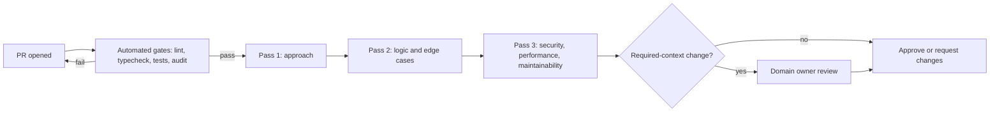

# Code Review Guidelines

Stack baseline: TypeScript 7, Node 24 LTS, Express 5.2, React 19.3 (React Compiler 1.0) + MUI v9,
PostgreSQL 18. All examples are TypeScript.

## Code Review Philosophy

- **Improve code quality** - Not find fault with the author
- **Share knowledge** - Reviews are learning opportunities
- **Be constructive** - Suggest improvements, don't just criticize
- **Respect time** - Review promptly, be thorough but efficient
- **Verify, don't assume** - Especially with AI-assisted PRs, plausible is not correct

## Pull Request Guidelines

### PR Size

| Size   | Lines Changed | Review Time | Recommendation    |
| ------ | ------------- | ----------- | ----------------- |
| Small  | < 200         | < 30 min    | Ideal             |
| Medium | 200-500       | 30-60 min   | Acceptable        |
| Large  | 500-1000      | 1-2 hours   | Split if possible |
| XL     | > 1000        | > 2 hours   | Must split        |

Generated code makes large PRs cheap to produce and no cheaper to review. Size limits apply to the
diff, not to the effort that produced it. Lockfile and generated-artifact churn is excluded from the
count but still reviewed (see supply chain below).

### PR Title Format

```
type(scope): brief description

# Examples
feat(auth): add passkey enrolment flow
fix(api): fail closed when the entitlement service times out
refactor(orders): extract order validation into a service
docs(readme): document the OIDC deploy setup
test(users): add Testcontainers integration tests for user service
chore(deps): bump @mui/material to v9.4
```

### PR Description Template

```markdown
## Summary

Brief description of what this PR does and why.

## Type of Change

- [ ] Bug fix (non-breaking change that fixes an issue)
- [ ] New feature (non-breaking change that adds functionality)
- [ ] Breaking change (fix or feature that would cause existing functionality to change)
- [ ] Refactoring (no functional changes)
- [ ] Documentation update
- [ ] Test update

## Changes Made

- Change 1
- Change 2

## Testing

- [ ] Unit tests added/updated
- [ ] Integration tests added/updated
- [ ] Manual testing performed

### Test Instructions

1. Step 1
2. Step 2
3. Expected result

## Dependencies

- [ ] No new dependencies
- [ ] New dependency added: `<name>` - why it is needed, what it replaces, transitive count,
      maintenance signals, whether it runs install scripts

## AI Assistance

- [ ] No AI-generated code
- [ ] AI-assisted - I have executed the code paths below and verified every API used exists

## Migrations / Schema

- [ ] None
- [ ] Included - expand/contract plan, rollback path, and lock impact described

## Screenshots (if applicable)

## Checklist

- [ ] Self-review completed
- [ ] Types are honest (no new `any`, no unsafe casts)
- [ ] Documentation updated
- [ ] No new warnings introduced
- [ ] Tests pass locally

## Related Issues

Closes #123
```

## Review Checklist

### General Code Quality

- [ ] **Readability**: Code is clear and self-documenting
- [ ] **Simplicity**: No unnecessary complexity or speculative abstraction
- [ ] **DRY**: No duplicated code that should be extracted
- [ ] **Naming**: Variables, functions, types have meaningful names
- [ ] **Comments**: Complex logic explained; no restatement of the code
- [ ] **Dead code**: No commented-out code, unused imports, or unreferenced exports

### TypeScript

- [ ] **No `any` escape hatches**: `unknown` + narrowing, or a real type. `any` on a boundary
      silently disables checking for everything downstream
- [ ] **No unsafe casts**: `as` that is not a widening or a `satisfies` refinement needs a comment
      or a runtime check; `as unknown as X` is always a blocking discussion
- [ ] **No non-null `!`** where a guard or `??` would do
- [ ] **`readonly` where intended**: `readonly` fields and `ReadonlyArray` on data that must not be
      mutated; mutation of a shared object is the bug this prevents
- [ ] **Exhaustive switches**: a `default: assertNever(x)` branch so adding a union member becomes a
      compile error instead of a silent fallthrough
- [ ] **`satisfies` used correctly**: to check a literal against a type while keeping the narrow
      inferred type - not as a substitute for annotation, and not to launder a bad shape past the
      checker
- [ ] **Types derive from one source**: `z.infer` from the Zod schema, generated DB types from the
      schema - not hand-maintained duplicates that can drift
- [ ] **Errors typed**: `catch (err: unknown)` with narrowing, not `catch (err: any)`

### Functionality

- [ ] **Requirements**: Code implements what the ticket asked for
- [ ] **Edge cases**: null, empty, boundary, concurrent
- [ ] **Error handling**: Fails closed; errors are neither swallowed nor leaked
- [ ] **Validation**: Every boundary validated with Zod
- [ ] **State management**: Server state via TanStack Query; no ad-hoc caches

### Security

- [ ] **Input validation**: All inputs validated, objects `.strict()`
- [ ] **Authentication**: Protected routes require auth
- [ ] **Authorization**: Server-side checks including ownership; no trust in client-supplied ids
- [ ] **Secrets**: No hardcoded secrets, keys, or tokens
- [ ] **SQL injection**: Parameterized queries; identifiers allowlisted
- [ ] **XSS**: User content escaped; `dangerouslySetInnerHTML` sanitized
- [ ] **Error responses**: No stack traces, SQL, or internal identifiers reach the client

### Supply Chain

- [ ] **New dependency justified**: Does it replace something? Could 30 lines do it? Is it
      maintained, and by whom?
- [ ] **Lockfile diff reviewed**: Unexpected entries in a PR that added no dependency are a red
      flag. Check the integrity hashes and registry URLs actually changed as expected
- [ ] **Transitive count**: A one-function utility that pulls 40 packages is a supply-chain
      decision, not a convenience
- [ ] **Install scripts**: Does the new package run `postinstall`/`preinstall`? If so, why, and can
      it be avoided?
- [ ] **Version pinning**: CI actions pinned to full commit SHAs, not tags
- [ ] **Advisory status**: No new high/critical findings from `osv-scanner` / `npm audit`

### Performance

- [ ] **Database**: N+1 avoided, indexes exist for new query shapes
- [ ] **Async**: No unbounded concurrency; timeouts on every outbound call
- [ ] **Payloads**: Pagination on list endpoints; no unbounded result sets
- [ ] **Bundle**: New client dependencies justified against bundle size
- [ ] **Web Vitals**: Changes to interactive surfaces considered against INP ≤ 200ms, LCP ≤ 2.5s,
      CLS ≤ 0.1

### Testing

- [ ] **Coverage**: New code has tests that would fail if the code were wrong
- [ ] **Assertions verified**: The expected values were derived, not guessed to match output
- [ ] **Edge cases**: Error paths tested, not only the happy path
- [ ] **Isolation**: Tests independent and parallel-safe

### Documentation

- [ ] **TSDoc**: Exported functions documented; types live in the signature, not repeated in tags
- [ ] **README / API docs**: Updated for behaviour and endpoint changes
- [ ] **ADR**: Written for decisions that constrain future work

## Review Process



### For Reviewers

#### Before Starting

1. Read the PR description and linked issues
2. Understand the context and requirements
3. Check the PR is appropriately sized, and that CI is green - do not review a red PR

#### During Review

1. **First pass**: Understand the overall approach. Is this the right shape of solution?
2. **Second pass**: Details, logic, edge cases, error paths
3. **Third pass**: Security, performance, maintainability, supply chain

Pull the branch and run it for anything touching auth, money, migrations, or generated code.
Reading a diff cannot tell you whether an API actually exists.

#### Providing Feedback

```markdown
# Blocking (must fix before merge)

🔴 **[Blocking]** SQL injection vulnerability here. Use a parameterized query.

# Suggestion (should consider)

🟡 **[Suggestion]** Consider extracting this into a service function for reuse.

# Nitpick (optional, low priority)

🟢 **[Nitpick]** Minor: `const` would work here.

# Question (seeking clarification)

❓ **[Question]** Why was this approach chosen over X?

# Praise (positive feedback)

✨ **[Nice]** Great error handling here - fails closed and logs the cause.
```

#### Comment Examples

````markdown
# Good - Specific, actionable, explains why

🔴 **[Blocking]** This query interpolates user input and is injectable.

```ts
// Instead of
const rows = await pool.query(`SELECT * FROM users WHERE id = '${id}'`);

// Use
const { rows } = await pool.query<User>(
  "SELECT id, email, name FROM users WHERE id = $1",
  [id],
);
```

# Bad - Vague, no context

"This is wrong"

# Bad - Points at a problem without a path forward

"SQL injection here"

````

### For Authors

#### Before Requesting Review

- [ ] Self-review your own diff first
- [ ] Run lint, typecheck and tests locally
- [ ] Write a clear PR description, including dependency and AI-assistance disclosure
- [ ] Keep the PR focused and reasonably sized
- [ ] Add reviewers who have context - and the domain owner for required-context changes

#### Responding to Feedback

- **Thank reviewers** for their time
- **Address all comments** - resolve, reply, or explain
- **Don't take it personally** - reviews are about code, not you
- **Ask for clarification** if feedback is unclear
- **Push fixes as new commits** (don't force-push during review)

#### After Approval

- Squash commits if appropriate
- Ensure CI passes
- Merge promptly to avoid conflicts
- Delete the branch after merge

## Reviewing Generated and AI-Authored Code

AI-generated code fails differently from human code: it is syntactically clean, idiomatic, and
confidently wrong. The reviewer, not the generator, is accountable for what merges.

- **Hallucinated APIs.** Methods, options and packages that do not exist, or that existed in an
  older major. Verify against the installed version, not memory. Typecheck catches some of it;
  runtime-only APIs, config keys, and CLI flags it does not.
- **Plausible-but-wrong logic.** Correct-looking off-by-one bounds, inverted conditions, timezone
  handling, currency arithmetic in floats, and pagination that silently drops the last page.
- **Unverified test assertions.** The most common failure: tests written to match whatever the
  implementation produced. Ask what the expected value is *derived from*. A test that would pass
  against a buggy implementation is worse than no test.
- **Outdated idioms.** Patterns from older majors - `asyncHandler` wrappers (Express 5 forwards
  async errors), `forwardRef` (React 19 takes `ref` as a prop), manual memoization (React Compiler),
  MSW `rest`/`res(ctx…)` (MSW 2 uses `http` + `HttpResponse`).
- **Invented dependencies.** A suggested package name may not exist, or may be a squatted lookalike.
  Confirm the registry entry, the repository link, and the download history before merging.
- **Copy-scale duplication.** Generated code repeats rather than abstracts; three near-identical
  handlers in one diff usually want one.
- **Silent scope creep.** Reformatted unrelated files, changed defaults, added config. Diff against
  what the ticket asked for.

Ask the author to state which paths they executed. "The tests pass" is not the same claim.

## Required-Context Reviews

Some changes need a reviewer with specific context, not just any approver. Enforce with CODEOWNERS.

| Change | Required reviewer | What they check |
|--------|-------------------|-----------------|
| Database schema / migration | Data owner | Expand/contract ordering, `lock_timeout`/`statement_timeout`, `CREATE INDEX CONCURRENTLY`, backfill batching, rollback path, whether old and new code can both run against both schema states |
| Auth / authorization | Security owner | Fails closed, server-side enforcement, token lifetime and revocation, session rotation, no new enumeration or timing oracle |
| Payments / billing | Domain owner | Idempotency keys, integer minor units, reconciliation, webhook signature + replay protection |
| Public API contract | API owner | Versioning, breaking-change classification, OpenAPI regenerated from Zod, deprecation headers |
| CI/CD and infrastructure | Platform owner | Action SHAs, least-privilege `permissions:`, OIDC trust scope, secret handling, blast radius |
| New direct dependency | Any reviewer + supply-chain checklist | Justification, transitives, install scripts, maintenance |

For migrations specifically, the reviewer confirms the change is deployable without downtime: never
a destructive DDL in the same release as the code that stops using the column.

## Common Anti-Patterns to Flag

### Code Smells

```ts
// God function - does too many things
async function handleUserRequest(req: Request, res: Response) {
  // 200 lines of validation, business logic, and response formatting
}
// Suggest: split into validation middleware, a service function, and a thin controller

// Magic numbers
if (status === 3) { /* ... */ }
// Suggest: a named union or const object
type OrderStatus = 'pending' | 'approved' | 'shipped';

// Mutating parameters
function processUser(user: User): User {
  user.name = user.name.trim();   // mutates the caller's object
  return user;
}
// Suggest: return a new object, and type the input ReadonlyDeep<User>

// Boolean parameters at the call site
createUser(data, true, false);
// Suggest: an options object - createUser(data, { sendEmail: true, isAdmin: false })
```

### TypeScript Anti-Patterns

```ts
// `any` at a boundary disables checking for everything downstream
const data: any = await res.json();
// Fix: const data = responseSchema.parse(await res.json());

// Cast that lies about runtime shape
const user = JSON.parse(raw) as User;
// Fix: parse with Zod; a cast asserts something the compiler cannot verify

// Non-exhaustive switch - adding a status compiles and silently falls through
switch (order.status) {
  case 'pending': return handlePending();
  case 'approved': return handleApproved();
}
// Fix:
default: {
  const _exhaustive: never = order.status;
  throw new Error(`Unhandled status: ${String(_exhaustive)}`);
}

// `satisfies` misused to silence an error rather than to check a literal
const config = { retries: '3' } satisfies Partial<Config>;  // still wrong if Config.retries: number
// Fix: `satisfies` checks assignability while preserving literal types; it is not a cast
```

### React 19 Anti-Patterns

```tsx
// Manual memoization noise. React Compiler 1.0 handles this - useCallback/useMemo/React.memo
// scattered through a component now costs readability and gains nothing.
const handleClick = useCallback((id: string) => setSelected(id), []);
const visible = useMemo(() => users.filter((u) => u.active), [users]);
// Fix: plain functions and expressions. Keep manual memoization only for genuinely expensive
// computation, or in a codebase where the compiler is not enabled - and say which in the PR.

// useEffect for data fetching
useEffect(() => {
  fetch(`/api/users/${id}`).then(setUser);
}, [id]);
// Fix: useQuery - handles caching, races, retries, and cancellation

// useEffect for derived state
const [total, setTotal] = useState(0);
useEffect(() => {
  setTotal(items.reduce((s, i) => s + i.price, 0));
}, [items]);
// Fix: const total = items.reduce((s, i) => s + i.price, 0);

// Hand-rolled submit/pending/error state
const [pending, setPending] = useState(false);
const [error, setError] = useState<string | null>(null);
// Fix: const [state, action, isPending] = useActionState(submitAction, initialState);

// Uncached promise passed to use() - Suspense never settles
const user = use(fetchUser(id));
// Fix: cache the promise outside render, or pass one created by the data layer
```

### Security Issues

```ts
// Hardcoded secret
const API_KEY = "sk_live_abc123";
// Fix: Zod-validated env, sourced from a secret manager

// Missing authorization
router.delete("/users/:id", async (req, res) => {
  await deleteUser(req.params.id);
});
// Fix: authenticate + authorize('admin') + ownership check

// Trusting a client-supplied identity
const userId = req.body.userId;
// Fix: res.locals.user.sub

// Swallowed error - fails open
try {
  allowed = await entitlements.check(userId, docId);
} catch {
  allowed = true;
}
// Fix: log, increment a metric, and throw - authorization fails closed

// Sensitive data in logs
logger.info({ email, password }, "login attempt");
// Fix: pino `redact` paths; never log credentials
```

### Performance Issues

```ts
// N+1 query
const users = await listUsers();
for (const user of users) {
  user.orders = await findOrdersByUser(user.id); // one query per user
}
// Fix: a single join, or a batched WHERE user_id = ANY($1)

// Unbounded concurrency against a dependency
await Promise.all(ids.map(fetchDetail)); // 10,000 concurrent requests
// Fix: a concurrency-limited map, and a timeout per call

// Missing timeout
const res = await fetch(url);
// Fix: fetch(url, { signal: AbortSignal.timeout(3_000), redirect: 'error' })

// Synchronous file I/O on the request path
const data = fs.readFileSync("large-file.json");
// Fix: await fs.promises.readFile, or load once at startup
```

## Review Turnaround Time

| Priority                     | Initial Review | Subsequent Reviews |
| ---------------------------- | -------------- | ------------------ |
| Critical (bug fix, security) | < 4 hours      | < 2 hours          |
| High (feature)               | < 1 day        | < 4 hours          |
| Normal                       | < 2 days       | < 1 day            |
| Low (refactor)               | < 3 days       | < 2 days           |

### When You're Blocked

- Comment on the PR that you're waiting
- Reach out directly if urgent
- Consider requesting additional reviewers

## Approval Criteria

### Ready to Merge

- [ ] All blocking comments resolved
- [ ] Required approvals obtained, including CODEOWNERS for required-context changes
- [ ] CI/CD pipeline passes: lint, typecheck, tests, coverage thresholds, dependency audit
- [ ] No merge conflicts
- [ ] Documentation updated if needed

### Not Ready to Merge

- Unresolved blocking comments
- Missing required approvals
- CI failures, including new audit findings
- Conflicts with the target branch
- Missing tests for new functionality
- New `any`, unsafe casts, or unexplained lint suppressions
- Unexplained lockfile changes

## Checklist Summary

### Reviewer Checklist

- [ ] Understood the context and requirements
- [ ] Checked code quality, readability and type honesty
- [ ] Verified security considerations, including fail-closed error paths
- [ ] Reviewed dependency and lockfile changes
- [ ] Assessed performance implications
- [ ] Confirmed test coverage and that assertions are derived, not fitted
- [ ] Verified any AI-generated code against real APIs, by running it
- [ ] Provided constructive, specific feedback
- [ ] Responded within the turnaround target

### Author Checklist

- [ ] Self-reviewed the diff
- [ ] PR description complete, including dependency and AI-assistance disclosure
- [ ] Tests added and passing; expected values derived from requirements
- [ ] Types honest - no new `any` or unsafe casts
- [ ] Documentation updated
- [ ] Addressed all feedback
- [ ] Ready for merge
