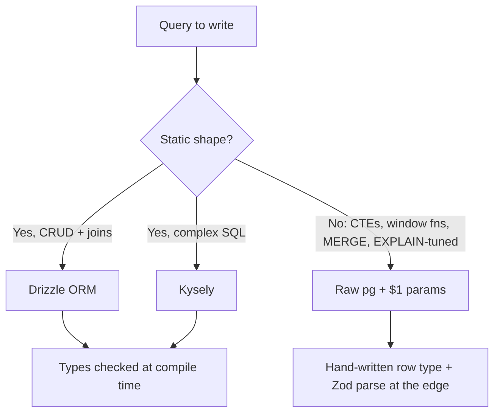
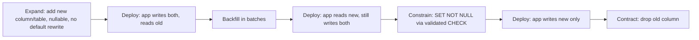

# Database Guidelines (PostgreSQL 18)

## Database Design Principles

- **Normalize first, denormalize for performance** - Start with 3NF, optimize with evidence
- **Explicit constraints** - Enforce data integrity at the database level, not only in the app
- **Meaningful names** - Clear, consistent naming conventions
- **Type-safe access** - Drizzle ORM / Kysely for compile-time SQL types; raw `pg` parameterized queries always acceptable
- **Document decisions** - Comment complex schemas, constraints and non-obvious indexes

## Stack

| Concern           | Choice                                               |
| ----------------- | ---------------------------------------------------- |
| Database          | PostgreSQL 18                                        |
| Driver            | `pg` (node-postgres) 8.23                            |
| Type-safe layer   | Drizzle ORM 0.45 (default) or Kysely (query-builder) |
| Heavier ORM       | Prisma 7 (when you want a managed migration engine)  |
| Primary keys      | UUIDv7 via native `uuidv7()`                         |
| Timestamps        | `TIMESTAMPTZ` everywhere                             |
| Integration tests | Testcontainers (real Postgres, never a mocked DB)    |

## Primary Keys: UUIDv7

PostgreSQL 18 ships a native `uuidv7()` function. Prefer it over `gen_random_uuid()` (UUIDv4)
for primary keys.

```sql
-- PostgreSQL 18: time-ordered UUID, monotonic within a millisecond
id UUID PRIMARY KEY DEFAULT uuidv7()

-- Legacy (PostgreSQL 17 and earlier): random UUID
id UUID PRIMARY KEY DEFAULT gen_random_uuid()
```

**Why index locality matters.** A UUIDv4 is fully random, so every insert lands on a random leaf
page of the primary-key B-tree. On a large table that means each insert touches a page that is
probably not in shared buffers: random I/O, poor cache hit ratio, page splits scattered across the
index, and an index that bloats far beyond its theoretical size. UUIDv7 puts a 48-bit Unix
millisecond timestamp in the high bits, so newly generated keys sort near each other. Inserts append
to the right-hand edge of the B-tree, which stays hot in cache; page splits are mostly right-most
splits (cheap, no redistribution), and `created_at`-ordered range scans align with physical layout.
You keep UUID benefits (client-generatable, non-colliding across shards, safe to expose in URLs
compared with sequential integers) without the write amplification.

Caveat: UUIDv7 leaks an approximate creation timestamp. If that is sensitive for a given resource,
expose a separate opaque public identifier and keep the UUIDv7 internal.

### When integers are the right call

For high-volume append-only tables where 8 bytes beats 16, use identity columns - never `serial`.

```sql
-- Good: SQL-standard, owns its sequence, correct permissions, no ALTER SEQUENCE surprises
id BIGINT GENERATED ALWAYS AS IDENTITY PRIMARY KEY

-- Use BY DEFAULT only when you must insert explicit ids (e.g. data migration)
id BIGINT GENERATED BY DEFAULT AS IDENTITY PRIMARY KEY

-- Legacy, do not use in new schemas
id BIGSERIAL PRIMARY KEY
```

`serial`/`bigserial` are pseudo-types that create a loosely-coupled sequence: dropping the column can
orphan the sequence, permissions must be granted separately, and the default can be overridden
silently. `GENERATED ALWAYS AS IDENTITY` rejects manual inserts unless you write
`OVERRIDING SYSTEM VALUE`, which is what you want for a surrogate key.

## Naming Conventions

### Tables

```sql
-- snake_case, plural nouns
CREATE TABLE users (...);
CREATE TABLE order_items (...);
CREATE TABLE user_preferences (...);

-- Bad: CamelCase (forces quoting forever), singular, abbreviations
CREATE TABLE "User" (...);
CREATE TABLE order_item (...);
CREATE TABLE usr_prefs (...);
```

### Columns

```sql
-- Primary key
id UUID PRIMARY KEY DEFAULT uuidv7()

-- Foreign keys: {table_singular}_id
user_id UUID NOT NULL REFERENCES users(id)

-- Timestamps: always TIMESTAMPTZ, never TIMESTAMP
created_at TIMESTAMPTZ NOT NULL DEFAULT NOW()
updated_at TIMESTAMPTZ NOT NULL DEFAULT NOW()
deleted_at TIMESTAMPTZ            -- NULL = live row

-- Booleans: is_{adjective} or has_{noun}
is_active BOOLEAN NOT NULL DEFAULT true
has_verified_email BOOLEAN NOT NULL DEFAULT false

-- Money: never float
total NUMERIC(12, 2) NOT NULL DEFAULT 0

-- Status: TEXT + CHECK (cheaper to evolve than a native ENUM)
status TEXT NOT NULL CHECK (status IN ('pending', 'active', 'suspended'))
```

`TIMESTAMP WITHOUT TIME ZONE` stores a wall-clock reading with no offset; two servers in different
zones will disagree about what it means and DST transitions create ambiguous values. `TIMESTAMPTZ`
stores an absolute instant (UTC) and renders in the session `TimeZone`. Use it for every point in
time. Use `DATE` only for genuine calendar dates (a birthday, an invoice period).

Prefer `TEXT` over `VARCHAR(n)` unless the length limit is a real business rule - in PostgreSQL they
have identical performance, and widening a `VARCHAR` is a schema change.

### Indexes and Constraints

```sql
-- Indexes: idx_{table}_{column(s)}; unique: uniq_{table}_{column(s)}
CREATE INDEX idx_orders_user_id_created_at ON orders (user_id, created_at DESC);
CREATE UNIQUE INDEX uniq_users_email ON users (email);

-- Primary key:  pk_{table}
-- Foreign key:  fk_{table}_{referenced_table}
-- Unique:       uniq_{table}_{column(s)}
-- Check:        chk_{table}_{description}
CONSTRAINT fk_orders_users FOREIGN KEY (user_id) REFERENCES users (id) ON DELETE RESTRICT
CONSTRAINT chk_orders_total_positive CHECK (total >= 0)
```

## Schema Design Patterns

### Base Table Template

```sql
CREATE TABLE table_name (
    id UUID PRIMARY KEY DEFAULT uuidv7(),

    -- business columns ...

    created_at TIMESTAMPTZ NOT NULL DEFAULT NOW(),
    updated_at TIMESTAMPTZ NOT NULL DEFAULT NOW(),
    created_by UUID REFERENCES users (id),
    updated_by UUID REFERENCES users (id)
);

CREATE TRIGGER set_table_name_updated_at
    BEFORE UPDATE ON table_name
    FOR EACH ROW
    EXECUTE FUNCTION set_updated_at();
```

```sql
-- Shared trigger function; skips no-op updates so updated_at stays truthful
CREATE OR REPLACE FUNCTION set_updated_at()
RETURNS TRIGGER AS $$
BEGIN
    IF NEW IS DISTINCT FROM OLD THEN
        NEW.updated_at = NOW();
    END IF;
    RETURN NEW;
END;
$$ LANGUAGE plpgsql;
```

### Users Table

```sql
CREATE EXTENSION IF NOT EXISTS citext;

CREATE TABLE users (
    id UUID PRIMARY KEY DEFAULT uuidv7(),
    tenant_id UUID NOT NULL REFERENCES tenants (id) ON DELETE RESTRICT,
    email CITEXT NOT NULL,                -- case-insensitive; or TEXT + lower() index
    password_hash TEXT NOT NULL,          -- argon2id
    name TEXT NOT NULL,
    role TEXT NOT NULL DEFAULT 'user',
    is_active BOOLEAN NOT NULL DEFAULT true,
    email_verified_at TIMESTAMPTZ,
    last_login_at TIMESTAMPTZ,
    created_at TIMESTAMPTZ NOT NULL DEFAULT NOW(),
    updated_at TIMESTAMPTZ NOT NULL DEFAULT NOW(),

    CONSTRAINT uniq_users_tenant_email UNIQUE (tenant_id, email),
    CONSTRAINT chk_users_role CHECK (role IN ('user', 'admin', 'moderator')),
    CONSTRAINT chk_users_name_length CHECK (length(name) BETWEEN 2 AND 100)
);

CREATE INDEX idx_users_tenant_active ON users (tenant_id) WHERE is_active;

CREATE TRIGGER set_users_updated_at
    BEFORE UPDATE ON users FOR EACH ROW EXECUTE FUNCTION set_updated_at();
```

Do not enforce email _format_ with a regex CHECK - deliverability is validated by Zod at the API
boundary and ultimately by sending mail. Keep the database constraint to uniqueness and length.

### One-to-Many

```sql
CREATE TABLE orders (
    id UUID PRIMARY KEY DEFAULT uuidv7(),
    tenant_id UUID NOT NULL REFERENCES tenants (id),
    user_id UUID NOT NULL,
    status TEXT NOT NULL DEFAULT 'pending',
    total NUMERIC(12, 2) NOT NULL DEFAULT 0,
    notes TEXT,
    created_at TIMESTAMPTZ NOT NULL DEFAULT NOW(),
    updated_at TIMESTAMPTZ NOT NULL DEFAULT NOW(),

    CONSTRAINT fk_orders_users FOREIGN KEY (user_id)
        REFERENCES users (id) ON DELETE RESTRICT,
    CONSTRAINT chk_orders_status CHECK (
        status IN ('pending', 'confirmed', 'shipped', 'delivered', 'cancelled')),
    CONSTRAINT chk_orders_total_positive CHECK (total >= 0)
);

CREATE INDEX idx_orders_user_id_created_at ON orders (user_id, created_at DESC);
CREATE INDEX idx_orders_open ON orders (created_at DESC)
    WHERE status IN ('pending', 'confirmed');
```

### Many-to-Many

```sql
CREATE TABLE order_items (
    order_id UUID NOT NULL,
    product_id UUID NOT NULL,
    quantity INTEGER NOT NULL DEFAULT 1,
    unit_price NUMERIC(12, 2) NOT NULL,
    created_at TIMESTAMPTZ NOT NULL DEFAULT NOW(),

    CONSTRAINT pk_order_items PRIMARY KEY (order_id, product_id),
    CONSTRAINT fk_order_items_orders FOREIGN KEY (order_id)
        REFERENCES orders (id) ON DELETE CASCADE,
    CONSTRAINT fk_order_items_products FOREIGN KEY (product_id)
        REFERENCES products (id) ON DELETE RESTRICT,
    CONSTRAINT chk_order_items_quantity CHECK (quantity > 0),
    CONSTRAINT chk_order_items_price CHECK (unit_price >= 0)
);

-- FK on the second column is not covered by the PK's leading edge
CREATE INDEX idx_order_items_product_id ON order_items (product_id);
```

A pure join table needs no surrogate `id`: the natural composite key is the primary key and doubles
as the uniqueness constraint.

### Soft Delete

```sql
ALTER TABLE posts ADD COLUMN deleted_at TIMESTAMPTZ;

-- Partial indexes keep live-row lookups small
CREATE INDEX idx_posts_author_live ON posts (author_id, created_at DESC)
    WHERE deleted_at IS NULL;

-- Uniqueness that ignores tombstones
CREATE UNIQUE INDEX uniq_posts_slug_live ON posts (slug) WHERE deleted_at IS NULL;

CREATE VIEW live_posts AS SELECT * FROM posts WHERE deleted_at IS NULL;
```

Soft delete is a cost: every query must filter, and foreign keys still point at dead rows. Use it
only where audit/undo is a requirement, otherwise delete and rely on backups.

## Row-Level Security (Multi-Tenant)

RLS moves tenant isolation into the database, so a forgotten `WHERE tenant_id = $1` cannot leak data
across tenants. This is defence in depth, not a replacement for authorization in the service layer.

```sql
ALTER TABLE orders ENABLE ROW LEVEL SECURITY;
ALTER TABLE orders FORCE ROW LEVEL SECURITY;   -- applies to the table owner too

CREATE POLICY tenant_isolation ON orders
    USING (tenant_id = current_setting('app.tenant_id', true)::uuid)
    WITH CHECK (tenant_id = current_setting('app.tenant_id', true)::uuid);

-- Application role must NOT be superuser or BYPASSRLS
CREATE ROLE app_user LOGIN;
GRANT SELECT, INSERT, UPDATE, DELETE ON ALL TABLES IN SCHEMA public TO app_user;
```

`USING` filters what a statement can read or target; `WITH CHECK` prevents writing a row into
another tenant. Set the tenant per transaction - `set_config(..., true)` is transaction-local, so it
cannot leak to the next request that borrows the same pooled connection.

```typescript
/** Runs `fn` inside a transaction scoped to a single tenant via RLS. */
export async function withTenant<T>(
  tenantId: string,
  fn: (client: PoolClient) => Promise<T>,
): Promise<T> {
  return withTransaction(async (client) => {
    // true = local to this transaction
    await client.query("SELECT set_config($1, $2, true)", [
      "app.tenant_id",
      tenantId,
    ]);
    return fn(client);
  });
}
```

Index `tenant_id` as the leading column of composite indexes - every RLS-filtered query carries it.

## Type-Safe Access Layer

Three acceptable options. Pick one per service and stay consistent.



### Drizzle ORM (default)

Declare the schema in TypeScript; it is the single source of truth that `drizzle-kit` turns into SQL
migrations, and every query is typed from it.

```typescript
// src/db/schema.ts
import { sql } from "drizzle-orm";
import {
  pgTable,
  uuid,
  text,
  boolean,
  numeric,
  integer,
  timestamp,
  index,
  uniqueIndex,
  check,
} from "drizzle-orm/pg-core";

export const users = pgTable(
  "users",
  {
    id: uuid("id")
      .primaryKey()
      .default(sql`uuidv7()`),
    tenantId: uuid("tenant_id")
      .notNull()
      .references(() => tenants.id),
    email: text("email").notNull(),
    passwordHash: text("password_hash").notNull(),
    name: text("name").notNull(),
    role: text("role", { enum: ["user", "admin", "moderator"] })
      .notNull()
      .default("user"),
    isActive: boolean("is_active").notNull().default(true),
    emailVerifiedAt: timestamp("email_verified_at", { withTimezone: true }),
    createdAt: timestamp("created_at", { withTimezone: true })
      .notNull()
      .defaultNow(),
    updatedAt: timestamp("updated_at", { withTimezone: true })
      .notNull()
      .defaultNow(),
  },
  (t) => [
    uniqueIndex("uniq_users_tenant_email").on(t.tenantId, t.email),
    index("idx_users_tenant_active")
      .on(t.tenantId)
      .where(sql`${t.isActive}`),
    check("chk_users_name_length", sql`length(${t.name}) between 2 and 100`),
  ],
);

export const orders = pgTable(
  "orders",
  {
    id: uuid("id")
      .primaryKey()
      .default(sql`uuidv7()`),
    tenantId: uuid("tenant_id").notNull(),
    userId: uuid("user_id")
      .notNull()
      .references(() => users.id, { onDelete: "restrict" }),
    status: text("status", {
      enum: ["pending", "confirmed", "shipped", "delivered", "cancelled"],
    })
      .notNull()
      .default("pending"),
    total: numeric("total", { precision: 12, scale: 2 }).notNull().default("0"),
    createdAt: timestamp("created_at", { withTimezone: true })
      .notNull()
      .defaultNow(),
  },
  (t) => [
    index("idx_orders_user_id_created_at").on(t.userId, t.createdAt.desc()),
  ],
);

export type User = typeof users.$inferSelect;
export type NewUser = typeof users.$inferInsert;
export type Order = typeof orders.$inferSelect;
export type NewOrder = typeof orders.$inferInsert;
```

The Drizzle table above mirrors the SQL `users` table one-to-one. Keep them in sync by generating
the SQL **from** the schema - never hand-edit both:

```bash
pnpm drizzle-kit generate   # emits a numbered .sql migration from schema diffs
pnpm drizzle-kit migrate    # applies pending migrations
pnpm drizzle-kit check      # fails CI when schema.ts and migrations have drifted
```

```typescript
// src/db/index.ts
import { drizzle } from "drizzle-orm/node-postgres";
import { Pool } from "pg";
import * as schema from "./schema.js";

export const pool = new Pool({
  connectionString: process.env.DATABASE_URL,
  max: 10,
});
export const db = drizzle(pool, { schema });
```

```typescript
// src/repositories/order.repository.ts
import { and, desc, eq, lt, sql } from "drizzle-orm";
import { db } from "../db/index.js";
import { orders, users } from "../db/schema.js";
import type { Order } from "../db/schema.js";

/** Returns one page of a user's orders, newest first, using keyset pagination. */
export async function listOrdersByUser(
  userId: string,
  cursor: Date | null,
  limit = 20,
): Promise<Pick<Order, "id" | "status" | "total" | "createdAt">[]> {
  return db
    .select({
      id: orders.id,
      status: orders.status,
      total: orders.total,
      createdAt: orders.createdAt,
    })
    .from(orders)
    .where(
      and(
        eq(orders.userId, userId),
        cursor ? lt(orders.createdAt, cursor) : undefined,
      ),
    )
    .orderBy(desc(orders.createdAt))
    .limit(limit);
}

/** Joins are typed end to end; the result shape is inferred, not asserted. */
export async function findOrderWithCustomer(orderId: string) {
  const [row] = await db
    .select({ order: orders, customerName: users.name })
    .from(orders)
    .innerJoin(users, eq(users.id, orders.userId))
    .where(eq(orders.id, orderId))
    .limit(1);
  return row ?? null;
}

/** Drop to SQL when the query builder gets in the way - still parameterized. */
export async function revenueByDay(tenantId: string, days: number) {
  return db.execute(sql`
    SELECT date_trunc('day', created_at) AS day, sum(total) AS revenue
    FROM ${orders}
    WHERE tenant_id = ${tenantId} AND created_at > now() - make_interval(days => ${days})
    GROUP BY 1 ORDER BY 1 DESC
  `);
}
```

`sql` template literals interpolate as bind parameters, not string concatenation - they are safe.

### Kysely (alternative)

Pick Kysely when the workload is SQL-shaped: heavy CTEs, window functions, unusual joins. It is a
typed query builder with no runtime model layer.

```typescript
import { Kysely, PostgresDialect } from "kysely";
import { Pool } from "pg";

interface Database {
  users: {
    id: string;
    tenant_id: string;
    email: string;
    name: string;
    created_at: Date;
  };
  orders: {
    id: string;
    user_id: string;
    status: string;
    total: string;
    created_at: Date;
  };
}

export const kdb = new Kysely<Database>({
  dialect: new PostgresDialect({
    pool: new Pool({ connectionString: process.env.DATABASE_URL }),
  }),
});

/** Top spenders per tenant using a lateral join. */
export async function topCustomers(tenantId: string, limit = 10) {
  return kdb
    .selectFrom("users")
    .innerJoin("orders", "orders.user_id", "users.id")
    .select(({ fn }) => [
      "users.id",
      "users.name",
      fn.sum<string>("orders.total").as("spend"),
    ])
    .where("users.tenant_id", "=", tenantId)
    .where("orders.status", "=", "delivered")
    .groupBy(["users.id", "users.name"])
    .orderBy("spend", "desc")
    .limit(limit)
    .execute();
}
```

`kysely-codegen` generates the `Database` interface from the live schema, so drift is caught by
`tsc`.

### Raw `pg` (always acceptable)

```typescript
import { pool } from "../db/index.js";

interface UserRow {
  id: string;
  name: string;
  email: string;
}

/** Fetches a user by id, or null when no row matches. */
export async function findUserById(id: string): Promise<UserRow | null> {
  const { rows } = await pool.query<UserRow>(
    "SELECT id, name, email FROM users WHERE id = $1",
    [id],
  );
  return rows[0] ?? null;
}
```

Never build SQL with string concatenation or template interpolation of user input:

```typescript
// NEVER - SQL injection
const { rows } = await pool.query(
  `SELECT * FROM users WHERE email = '${email}'`,
);

// Identifiers cannot be bound as $1. Whitelist them, never interpolate raw input.
const SORTABLE = { name: "name", created: "created_at" } as const;
const column = SORTABLE[sort as keyof typeof SORTABLE] ?? "created_at";
const { rows } = await pool.query(
  `SELECT id, name FROM users ORDER BY ${column} DESC LIMIT $1`,
  [limit],
);
```

**JavaScript (ESM + JSDoc) fallback:** identical code without annotations; document row shapes with
`@typedef` and keep `@returns` on exported functions.

## Migrations

Rules: **forward-only**, one concern per migration, every migration safe to run against a live
system, and every migration tested against production-sized data.

```
migrations/
├── 0001_create_users.sql
├── 0002_create_orders.sql
├── 0003_users_add_phone.sql
├── 0004_users_backfill_phone.sql        # data-only, batched
└── 0005_users_drop_legacy_name.sql      # contract step, a release later
```

No down migrations. A rollback in production is a new forward migration written with knowledge of
what actually broke; a `DROP COLUMN` "down" script run under pressure destroys data. Roll _back_ the
application, roll _forward_ the schema.

### Migration Template

```sql
-- Migration: 0003_users_add_phone
-- Description: Add optional phone column (expand step of expand/contract)
-- Safe on live traffic: yes (metadata-only ALTER)

BEGIN;

-- Never queue behind a long transaction; fail fast instead of blocking every reader
SET LOCAL lock_timeout = '3s';
SET LOCAL statement_timeout = '30s';

ALTER TABLE users ADD COLUMN phone TEXT;

COMMIT;
```

`lock_timeout` bounds how long the migration waits for an `ACCESS EXCLUSIVE` lock. Without it, an
`ALTER TABLE` stuck behind one slow `SELECT` queues _all_ subsequent queries on that table behind
itself - a total outage from a metadata-only change. `statement_timeout` bounds execution once the
lock is held. Set both with `SET LOCAL` inside the transaction so they revert on commit.

### Expand / Contract (Zero Downtime)



Each arrow is a separate deploy. At no point do the running application and the schema disagree -
that is what makes the sequence zero-downtime.

```sql
-- 1. EXPAND (instant: PG stores the default in the catalog, no table rewrite)
ALTER TABLE users ADD COLUMN full_name TEXT;

-- 2. BACKFILL in batches (see below), never one UPDATE over the whole table

-- 3. CONSTRAIN without a long ACCESS EXCLUSIVE lock:
--    validate under a weak lock first, then flip NOT NULL cheaply
ALTER TABLE users ADD CONSTRAINT chk_users_full_name_not_null
    CHECK (full_name IS NOT NULL) NOT VALID;
ALTER TABLE users VALIDATE CONSTRAINT chk_users_full_name_not_null;  -- SHARE UPDATE EXCLUSIVE
ALTER TABLE users ALTER COLUMN full_name SET NOT NULL;               -- uses the proven constraint
ALTER TABLE users DROP CONSTRAINT chk_users_full_name_not_null;

-- 4. CONTRACT, one release later, once no deployed code references it
ALTER TABLE users DROP COLUMN name;
```

Never `RENAME COLUMN` on a live table: the old and new application versions run concurrently during
a deploy and one of them will reference a column that no longer exists.

Foreign keys follow the same pattern - add `NOT VALID`, then `VALIDATE`:

```sql
ALTER TABLE orders ADD CONSTRAINT fk_orders_users
    FOREIGN KEY (user_id) REFERENCES users (id) NOT VALID;
ALTER TABLE orders VALIDATE CONSTRAINT fk_orders_users;
```

### Batched Backfills

A single `UPDATE` over millions of rows holds one transaction open for minutes, bloats the table with
dead tuples, blocks autovacuum, and blows up WAL. Batch by primary key, commit each batch, and let
the loop yield.

```typescript
/** Backfills `full_name` in keyset-ordered batches, committing after each one. */
export async function backfillFullName(batchSize = 5_000): Promise<number> {
  let cursor = "00000000-0000-0000-0000-000000000000";
  let total = 0;

  for (;;) {
    const { rows } = await pool.query<{ id: string }>(
      `WITH batch AS (
         SELECT id FROM users
         WHERE id > $1 AND full_name IS NULL
         ORDER BY id
         LIMIT $2
       )
       UPDATE users u SET full_name = u.name
       FROM batch b WHERE u.id = b.id
       RETURNING u.id`,
      [cursor, batchSize],
    );

    if (rows.length === 0) return total;
    cursor = rows[rows.length - 1].id;
    total += rows.length;
    await new Promise((r) => setTimeout(r, 50)); // let replication and autovacuum catch up
  }
}
```

### Indexes: CONCURRENTLY, Outside Transactions

```sql
-- Migration: 0006_orders_index_status
-- NOTE: no BEGIN/COMMIT - CREATE INDEX CONCURRENTLY cannot run in a transaction block.
-- Most migration runners wrap files in a transaction; mark this file no-transaction
-- (e.g. drizzle-kit `--no-transaction`, or a runner-specific directive).

SET lock_timeout = '3s';

CREATE INDEX CONCURRENTLY IF NOT EXISTS idx_orders_status_created
    ON orders (status, created_at DESC);

DROP INDEX CONCURRENTLY IF EXISTS idx_orders_status;   -- drop the now-redundant prefix index
```

A plain `CREATE INDEX` takes a lock that blocks all writes for the duration. `CONCURRENTLY` does two
passes under a weak lock; it is slower and can leave an `INVALID` index if it fails, so always pair
it with a check:

```sql
SELECT c.relname FROM pg_class c JOIN pg_index i ON i.indexrelid = c.oid WHERE NOT i.indisvalid;
-- then: DROP INDEX CONCURRENTLY <invalid>;  and re-run
```

## Query Best Practices

### Keyset Pagination (default)

```sql
-- Good: constant cost at any depth; needs a stable, indexed, unique-ish sort key
SELECT id, status, total, created_at
FROM orders
WHERE user_id = $1 AND (created_at, id) < ($2, $3)
ORDER BY created_at DESC, id DESC
LIMIT $4;

-- Acceptable only for small, bounded sets: OFFSET still reads and discards N rows
SELECT id FROM orders ORDER BY created_at DESC LIMIT 20 OFFSET 10000;
```

The row-comparison `(created_at, id) < ($2, $3)` breaks ties correctly when many rows share a
timestamp - the common bug in hand-rolled cursors. Encode `(created_at, id)` into the opaque cursor
your API returns.

### Select Only What You Need

```sql
-- Good
SELECT id, name, email FROM users WHERE id = $1;
-- Bad: breaks covering indexes, ships unused bytes, breaks on schema change
SELECT * FROM users WHERE id = $1;
```

### EXISTS Over COUNT

```sql
SELECT EXISTS (SELECT 1 FROM users WHERE email = $1);   -- stops at the first match
SELECT COUNT(*) > 0 FROM users WHERE email = $1;        -- scans every match
```

### Batch Writes

```typescript
/** Inserts all items in one round trip using UNNEST - no N+1, no dynamic SQL. */
export async function insertOrderItems(
  client: PoolClient,
  orderId: string,
  items: { productId: string; quantity: number; unitPrice: string }[],
): Promise<void> {
  await client.query(
    `INSERT INTO order_items (order_id, product_id, quantity, unit_price)
     SELECT $1, * FROM unnest($2::uuid[], $3::int[], $4::numeric[])`,
    [
      orderId,
      items.map((i) => i.productId),
      items.map((i) => i.quantity),
      items.map((i) => i.unitPrice),
    ],
  );
}
```

`UNNEST` keeps the statement text constant regardless of batch size, so the plan is cached and you
never hit the 65535 bind-parameter limit.

### Upserts and MERGE

```sql
-- INSERT ... ON CONFLICT: the right tool for a single-target upsert
INSERT INTO inventory (product_id, quantity)
VALUES ($1, $2)
ON CONFLICT (product_id)
DO UPDATE SET quantity = inventory.quantity + EXCLUDED.quantity, updated_at = NOW()
RETURNING *;
```

`MERGE` (SQL-standard) handles what `ON CONFLICT` cannot: multiple conditional actions driven by a
source relation, including deletes, without needing a unique constraint on the match condition.

```sql
-- Reconcile a batch of inventory deltas in one statement
MERGE INTO inventory AS t
USING (SELECT * FROM unnest($1::uuid[], $2::int[]) AS s(product_id, delta)) AS s
    ON t.product_id = s.product_id
WHEN MATCHED AND t.quantity + s.delta <= 0 THEN
    DELETE
WHEN MATCHED THEN
    UPDATE SET quantity = t.quantity + s.delta, updated_at = NOW()
WHEN NOT MATCHED AND s.delta > 0 THEN
    INSERT (product_id, quantity) VALUES (s.product_id, s.delta)
RETURNING merge_action(), t.product_id, t.quantity;
```

PostgreSQL 18 supports `RETURNING` with `merge_action()` so you can tell inserts from updates from
deletes. Note `MERGE` does not do `ON CONFLICT`-style speculative insertion - under concurrency it
can raise a unique violation, so retry on `23505` or serialize with a unique index plus
`ON CONFLICT` when contention is high.

## Index Optimization

### Choosing an Index Type

| Scenario                         | Index                                      |
| -------------------------------- | ------------------------------------------ |
| Equality / range / `ORDER BY`    | B-tree (default)                           |
| Prefix match `LIKE 'abc%'`       | B-tree with `text_pattern_ops`             |
| Full-text search                 | GIN on `tsvector`                          |
| `jsonb` containment `@>`         | GIN (`jsonb_path_ops` when only `@>`)      |
| Trigram / fuzzy `ILIKE '%abc%'`  | GIN or GiST with `pg_trgm`                 |
| Range and geometric overlap      | GiST                                       |
| Huge, naturally clustered tables | BRIN (tiny; e.g. append-only `created_at`) |

### Composite Index Order

```sql
-- Equality columns first, then the range/sort column
-- Query: WHERE tenant_id = $1 AND status = $2 AND created_at > $3 ORDER BY created_at DESC
CREATE INDEX idx_orders_tenant_status_created
    ON orders (tenant_id, status, created_at DESC);
```

Usable for a leading-prefix subset (`tenant_id`, or `tenant_id + status`). _Not_ usable for
`created_at` alone. One well-ordered composite index usually replaces three single-column ones -
and every extra index is write amplification on insert, update and vacuum.

### Partial Indexes

```sql
-- Index only the rows queries actually touch: smaller, cached, faster
CREATE INDEX idx_orders_pending ON orders (tenant_id, created_at DESC)
    WHERE status = 'pending';

CREATE INDEX idx_users_active_email ON users (email) WHERE is_active;
```

The planner uses a partial index only when it can prove the query predicate implies the index
predicate - keep the `WHERE` clause literally identical in both.

### Covering Indexes

```sql
CREATE INDEX idx_users_email_covering ON users (email) INCLUDE (name, role);

-- Index-only scan: no heap fetch, provided the visibility map is current (autovacuum keeps it so)
SELECT name, role FROM users WHERE email = $1;
```

`INCLUDE` columns are stored in leaf pages only - they are not part of the key, so they do not bloat
internal pages and cannot be used for filtering or ordering.

### Finding the Queries That Matter

```sql
CREATE EXTENSION IF NOT EXISTS pg_stat_statements;   -- plus shared_preload_libraries

-- Worst offenders by total time (not by single-call time - frequency is what hurts)
SELECT
    calls,
    round(total_exec_time::numeric, 1)          AS total_ms,
    round(mean_exec_time::numeric, 2)           AS mean_ms,
    round(stddev_exec_time::numeric, 2)         AS stddev_ms,
    rows / greatest(calls, 1)                   AS rows_per_call,
    query
FROM pg_stat_statements
WHERE query NOT LIKE '%pg_stat_statements%'
ORDER BY total_exec_time DESC
LIMIT 20;

SELECT pg_stat_statements_reset();   -- reset before a benchmark window
```

```sql
-- Unused indexes: dead write cost. Check on a replica with representative traffic.
SELECT relname, indexrelname, idx_scan, pg_size_pretty(pg_relation_size(indexrelid))
FROM pg_stat_user_indexes
WHERE idx_scan = 0 AND indexrelid NOT IN (SELECT conindid FROM pg_constraint)
ORDER BY pg_relation_size(indexrelid) DESC;

-- Always read a real plan before adding an index
EXPLAIN (ANALYZE, BUFFERS, VERBOSE) SELECT ...;
```

Look for `Rows Removed by Filter` (missing index), a large gap between estimated and actual rows
(stale statistics - `ANALYZE`, or raise `default_statistics_target`), and `Heap Fetches` on an
index-only scan (visibility map lag).

## Connection Management

```typescript
import { Pool } from "pg";
import { logger } from "../utils/logger.js";

export const pool = new Pool({
  connectionString: process.env.DATABASE_URL,
  max: 10, // per process - see sizing below
  idleTimeoutMillis: 30_000,
  connectionTimeoutMillis: 2_000, // fail fast rather than queue forever
  statement_timeout: 15_000, // server-side guard on runaway queries
  query_timeout: 15_000, // client-side guard
  application_name: process.env.SERVICE_NAME, // shows up in pg_stat_activity
});

pool.on("error", (err) => logger.error({ err }, "idle client error"));

process.on("SIGTERM", async () => {
  await pool.end();
});
```

### Pool Sizing

Connections are not free: each is a backend process with its own memory. More connections than the
database has cores makes everything slower through context switching and lock contention.

Start from `max ≈ (cores * 2) + effective_spindle_count` for the **cluster**, then divide by the
number of application processes:

`pool.max = cluster_connection_budget / (instances * processes_per_instance)`

Leave headroom below `max_connections` for migrations, `psql`, and monitoring. A queueing pool with
a low `max` and a short `connectionTimeoutMillis` beats an oversized pool that pushes the contention
into the database.

**PgBouncer.** With many application instances (or serverless/lambda), put PgBouncer in front in
`transaction` pooling mode so hundreds of client connections share a small server pool. In
transaction mode, session state does not survive between statements: no prepared statements unless
the driver/PgBouncer version supports them, no `SET` outside a transaction (use `SET LOCAL`, which is
exactly what the RLS pattern above does), no `LISTEN/NOTIFY`, no session advisory locks. Point the
app at PgBouncer and keep `pool.max` small on both sides.

### Transactions

```typescript
import type { PoolClient } from "pg";
import { pool } from "../db/index.js";

/** Runs `fn` in a transaction; commits on success, rolls back on any throw. */
export async function withTransaction<T>(
  fn: (client: PoolClient) => Promise<T>,
): Promise<T> {
  const client = await pool.connect();
  try {
    await client.query("BEGIN");
    const result = await fn(client);
    await client.query("COMMIT");
    return result;
  } catch (error) {
    await client.query("ROLLBACK");
    throw error;
  } finally {
    client.release();
  }
}

/** Creates an order and its items atomically. */
export async function createOrder(input: CreateOrderInput): Promise<Order> {
  return withTransaction(async (client) => {
    const { rows } = await client.query<Order>(
      `INSERT INTO orders (tenant_id, user_id, total) VALUES ($1, $2, $3)
       RETURNING id, status, total, created_at`,
      [input.tenantId, input.userId, input.total],
    );
    await insertOrderItems(client, rows[0].id, input.items);
    return rows[0];
  });
}
```

Drizzle wraps the same thing: `await db.transaction(async (tx) => { ... })`.

Rules: keep transactions short (never await an HTTP call inside one), take locks in a consistent
order across the codebase to avoid deadlocks, and retry serialization failures.

```typescript
/** Retries a transaction on serialization failure (40001) and deadlock (40P01). */
export async function withRetry<T>(
  fn: () => Promise<T>,
  attempts = 3,
): Promise<T> {
  for (let i = 1; ; i++) {
    try {
      return await fn();
    } catch (error) {
      const code = (error as { code?: string }).code;
      if (i >= attempts || (code !== "40001" && code !== "40P01")) throw error;
      await new Promise((r) => setTimeout(r, 2 ** i * 25 + Math.random() * 25));
    }
  }
}
```

Use `SELECT ... FOR UPDATE` to serialize writes to a contended row; use
`SELECT ... FOR UPDATE SKIP LOCKED` for queue-style workers so they never block each other.

## Data Validation

Two layers, both required. Zod validates at the API boundary and produces friendly per-field errors;
the database constraint is the guarantee that holds no matter which client, script or migration
writes the row.

```sql
CONSTRAINT chk_products_price       CHECK (price > 0),
CONSTRAINT chk_orders_status        CHECK (status IN ('pending', 'confirmed', 'shipped', 'delivered', 'cancelled')),
CONSTRAINT chk_events_dates         CHECK (ends_at > starts_at),
CONSTRAINT chk_users_name_length    CHECK (length(name) BETWEEN 2 AND 100)
```

### Exclusion Constraints

```sql
CREATE EXTENSION IF NOT EXISTS btree_gist;

-- No two bookings for the same room may overlap in time
ALTER TABLE bookings ADD CONSTRAINT excl_bookings_overlap
    EXCLUDE USING gist (room_id WITH =, tstzrange(starts_at, ends_at) WITH &&);
```

This is a correctness guarantee application code cannot provide under concurrency.

### Domains for Reusable Types

```sql
CREATE DOMAIN positive_amount AS NUMERIC(12, 2) CHECK (VALUE >= 0);

CREATE TABLE invoices (subtotal positive_amount NOT NULL, tax positive_amount NOT NULL);
```

### Surfacing Constraint Violations

```typescript
const PG_UNIQUE_VIOLATION = "23505";

/** Maps a Postgres constraint violation onto a domain error. */
export function toDomainError(error: unknown): Error {
  const e = error as { code?: string; constraint?: string };
  if (
    e.code === PG_UNIQUE_VIOLATION &&
    e.constraint === "uniq_users_tenant_email"
  ) {
    return new ConflictError("Email already registered");
  }
  return error as Error;
}
```

Match on the constraint _name_ - that is why the naming convention exists. Never parse error
messages, and never leak the raw driver error to a client.

## Backup and Recovery

```bash
# Logical backup (custom format, parallel, compressed)
pg_dump -h "$PGHOST" -U "$PGUSER" -d myapp -Fc -Z 6 -j 4 -f backup.dump

# Schema only / data only
pg_dump -d myapp --schema-only -f schema.sql
pg_dump -d myapp --data-only   -f data.sql

# Restore (parallel; --clean drops objects first)
pg_restore -d myapp --clean --if-exists -j 4 backup.dump
```

Logical dumps are a point-in-time snapshot and get slow at scale. For production, run physical
base backups (`pg_basebackup`) plus WAL archiving so you can do point-in-time recovery - that is
what recovers from "someone ran `DELETE` without a `WHERE` at 14:32".

A backup that has never been restored is not a backup. Restore into a scratch database on a schedule
and assert row counts; track RPO (how much data you can lose) and RTO (how long recovery takes) as
explicit numbers.

## Testing Against a Real Database

Do not mock the database. Use Testcontainers so integration tests run migrations against a real
PostgreSQL 18 and exercise the actual constraints, triggers and RLS policies. Truncate between tests
(`TRUNCATE ... RESTART IDENTITY CASCADE`) or wrap each test in a transaction that rolls back.

## Checklist

### Schema Design

- [ ] Tables snake_case, plural; columns snake_case
- [ ] Primary keys are UUIDv7 (`uuidv7()`), or `GENERATED ALWAYS AS IDENTITY` - never `serial`
- [ ] All timestamps are `TIMESTAMPTZ`
- [ ] Money is `NUMERIC`, never float
- [ ] Foreign keys declare an explicit `ON DELETE` action
- [ ] `NOT NULL` wherever the column is genuinely required
- [ ] CHECK constraints encode the real invariants; exclusion constraints where overlap matters
- [ ] `created_at` / `updated_at` present, with the `set_updated_at()` trigger
- [ ] Every foreign key is indexed
- [ ] RLS enabled and `FORCE`d on tenant-scoped tables; app role is not `BYPASSRLS`

### Migrations

- [ ] Forward-only; no down migrations
- [ ] `SET LOCAL lock_timeout` and `statement_timeout` before every DDL statement
- [ ] Breaking changes split into expand → backfill → constrain → contract across releases
- [ ] No `RENAME COLUMN` / destructive change while old code is still deployed
- [ ] Backfills batched by key with commits between batches
- [ ] `CREATE INDEX CONCURRENTLY` outside any transaction block; invalid indexes checked for
- [ ] New constraints added `NOT VALID`, then `VALIDATE`d
- [ ] Tested against production-sized data
- [ ] `drizzle-kit check` (or equivalent drift check) passes in CI

### Queries

- [ ] Parameterized values everywhere; identifiers whitelisted, never interpolated
- [ ] Explicit column lists, no `SELECT *`
- [ ] Keyset pagination for lists; offset only for small bounded sets
- [ ] `EXISTS` for existence checks
- [ ] Batch writes via `UNNEST` / multi-row `VALUES`; no N+1 loops
- [ ] `ON CONFLICT` or `MERGE` for upserts rather than read-then-write races
- [ ] `EXPLAIN (ANALYZE, BUFFERS)` reviewed for new hot-path queries
- [ ] `pg_stat_statements` checked for regressions after release

### Runtime

- [ ] Pool `max` sized against the cluster budget; PgBouncer transaction mode where needed
- [ ] `statement_timeout`, `connectionTimeoutMillis` and `application_name` set
- [ ] Transactions short; no network calls inside them
- [ ] Serialization failures (40001) and deadlocks (40P01) retried with backoff
- [ ] Pool drained on `SIGTERM`
- [ ] Constraint violations mapped to domain errors by constraint name
- [ ] Backups restored and verified on a schedule; RPO/RTO documented
