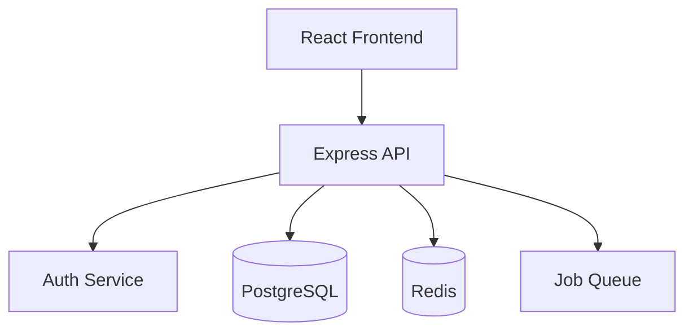
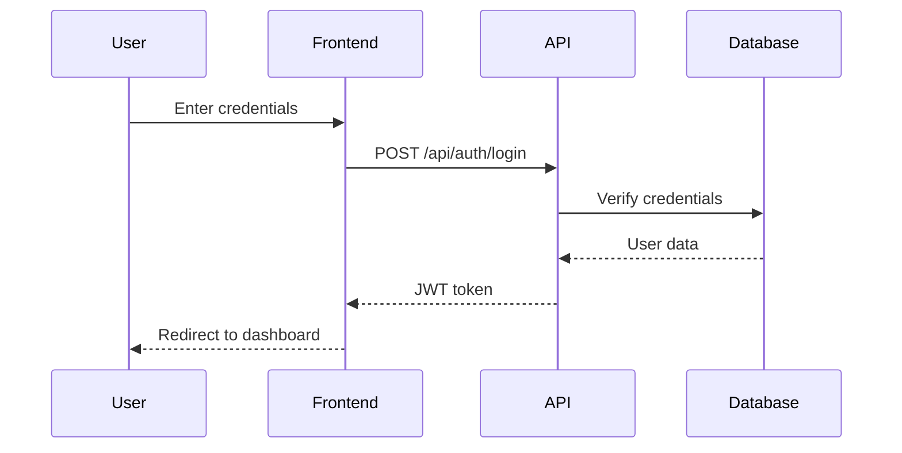
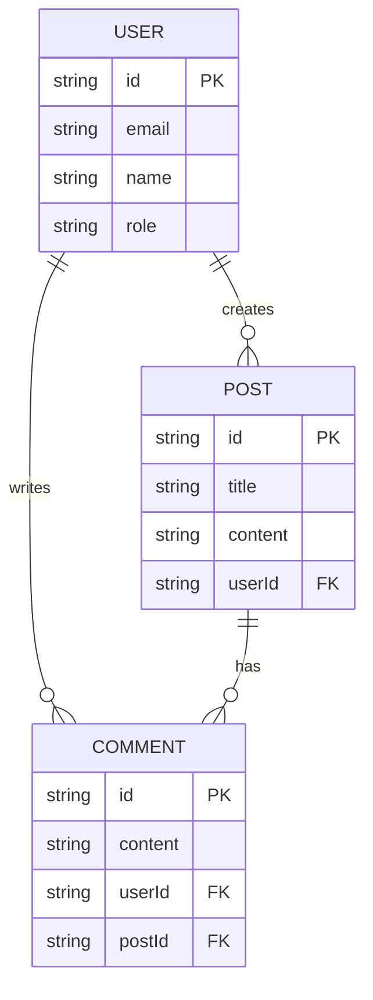
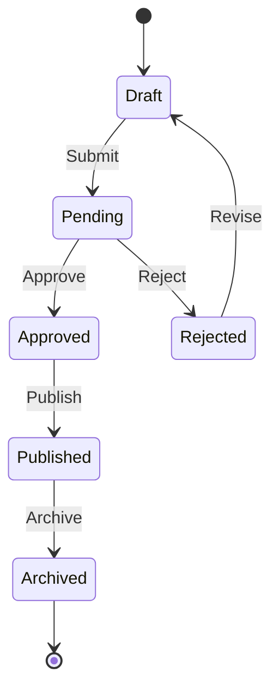
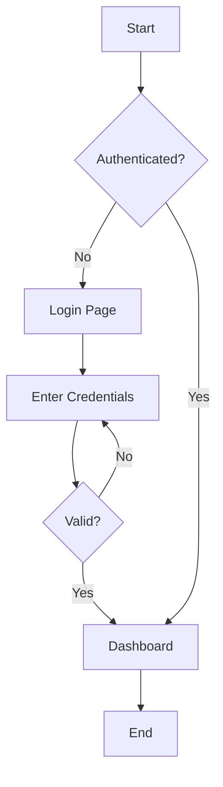

# Documentation Standards

## Documentation Types

| Type | Purpose | Audience |
|------|---------|----------|
| **Architecture** | System design, component relationships | Developers, Tech Leads |
| **API Reference** | Endpoint specifications, contracts | Frontend devs, Integrators |
| **Development** | Setup, contribution guidelines | New developers |
| **Product** | Features, user guides | End users, Stakeholders |

## Architecture Documentation

### System Overview

```markdown
# System Architecture

## Overview
Brief description of the system's purpose and main components.

## High-Level Architecture



## Components

### Frontend (React + MUI)
- **Purpose**: User interface layer
- **Technology**: React 18, Material-UI v5
- **Key Features**: Authentication, Dashboard, Settings

### Backend (Express)
- **Purpose**: API and business logic
- **Technology**: Node.js, Express.js
- **Responsibilities**: Auth, CRUD operations, Validation

### Database
- **Technology**: PostgreSQL
- **Migrations**: Managed via Knex/Prisma
```

### Component Documentation

```markdown
## Authentication Flow

### Sequence Diagram



### Flow Description
1. User submits login form
2. Frontend sends credentials to `/api/auth/login`
3. API validates credentials against database
4. On success, API returns JWT token
5. Frontend stores token and redirects
```

### Decision Records (ADR)

```markdown
# ADR-001: Authentication Strategy

## Status
Accepted

## Context
Need to implement user authentication for the application.

## Decision
Use JWT (JSON Web Tokens) with short-lived access tokens (1h) and refresh tokens (7d).

## Rationale
- Stateless: No server-side session storage needed
- Scalable: Works across multiple server instances
- Standard: Well-supported ecosystem

## Consequences
- Must implement token refresh mechanism
- Must securely store refresh tokens (httpOnly cookies)
- Token revocation requires additional infrastructure
```

## API Documentation

### OpenAPI/Swagger Format

```yaml
openapi: 3.0.0
info:
  title: User API
  version: 1.0.0

paths:
  /api/users:
    get:
      summary: List all users
      tags: [Users]
      security:
        - bearerAuth: []
      parameters:
        - name: page
          in: query
          schema:
            type: integer
            default: 1
        - name: limit
          in: query
          schema:
            type: integer
            default: 20
      responses:
        '200':
          description: Paginated user list
          content:
            application/json:
              schema:
                type: object
                properties:
                  success:
                    type: boolean
                  data:
                    type: array
                    items:
                      $ref: '#/components/schemas/User'
                  pagination:
                    $ref: '#/components/schemas/Pagination'

    post:
      summary: Create a new user
      tags: [Users]
      security:
        - bearerAuth: []
      requestBody:
        required: true
        content:
          application/json:
            schema:
              $ref: '#/components/schemas/CreateUser'
      responses:
        '201':
          description: User created
        '400':
          description: Validation error
        '409':
          description: Email already exists

components:
  schemas:
    User:
      type: object
      properties:
        id:
          type: string
        email:
          type: string
        name:
          type: string
        role:
          type: string
          enum: [user, admin]
        createdAt:
          type: string
          format: date-time

    CreateUser:
      type: object
      required: [email, password, name]
      properties:
        email:
          type: string
          format: email
        password:
          type: string
          minLength: 8
        name:
          type: string
          minLength: 2
```

### API Endpoint Documentation

```markdown
## Users API

### List Users

```
GET /api/users
```

**Query Parameters**
| Parameter | Type | Default | Description |
|-----------|------|---------|-------------|
| page | integer | 1 | Page number |
| limit | integer | 20 | Items per page |
| search | string | - | Search by name |

**Response**
```json
{
  "success": true,
  "data": [
    {
      "id": "123",
      "email": "user@example.com",
      "name": "John Doe",
      "role": "user"
    }
  ],
  "pagination": {
    "page": 1,
    "limit": 20,
    "total": 100,
    "pages": 5
  }
}
```

**Errors**
| Code | Description |
|------|-------------|
| 401 | Unauthorized - invalid or missing token |
| 403 | Forbidden - insufficient permissions |
```

## Development Documentation

### README Structure

```markdown
# Project Name

Brief description of the project.

## Features

- Feature 1
- Feature 2
- Feature 3

## Tech Stack

- **Frontend**: React, Material-UI
- **Backend**: Node.js, Express
- **Database**: PostgreSQL
- **Testing**: Jest, React Testing Library

## Getting Started

### Prerequisites

- Node.js 18+
- PostgreSQL 14+
- npm or yarn

### Installation

```bash
# Clone repository
git clone https://github.com/org/project.git
cd project

# Install dependencies
npm install

# Set up environment
cp .env.example .env

# Run database migrations
npm run db:migrate

# Start development server
npm run dev
```

### Environment Variables

| Variable | Description | Required |
|----------|-------------|----------|
| DATABASE_URL | PostgreSQL connection string | Yes |
| JWT_SECRET | Secret for JWT signing (min 32 chars) | Yes |
| PORT | Server port | No (default: 3001) |

## Scripts

| Command | Description |
|---------|-------------|
| `npm run dev` | Start development server |
| `npm run build` | Build for production |
| `npm run test` | Run tests |
| `npm run lint` | Run ESLint |
| `npm run db:migrate` | Run database migrations |

## Project Structure

```
src/
├── components/     # React components
├── pages/          # Page components
├── hooks/          # Custom React hooks
├── api/            # API client
├── utils/          # Utility functions
└── theme/          # MUI theme config
```

## Contributing

See [CONTRIBUTING.md](CONTRIBUTING.md) for guidelines.

## License

MIT
```

### Contributing Guide

```markdown
# Contributing

## Development Workflow

1. Fork the repository
2. Create a feature branch: `git checkout -b feature/my-feature`
3. Make your changes
4. Run tests: `npm test`
5. Run linting: `npm run lint`
6. Commit with conventional format: `feat: add user profile page`
7. Push and create a Pull Request

## Commit Messages

Follow [Conventional Commits](https://conventionalcommits.org/):

- `feat:` New feature
- `fix:` Bug fix
- `docs:` Documentation changes
- `style:` Code style (formatting, semicolons)
- `refactor:` Code refactoring
- `test:` Adding/updating tests
- `chore:` Maintenance tasks

## Code Standards

- All functions must have JSDoc comments
- Test coverage must be ≥60% overall, ≥20% per file
- ESLint must pass without errors
- Use TypeScript or JSDoc types

## Pull Request Process

1. Update documentation for any changed functionality
2. Add tests for new features
3. Ensure all CI checks pass
4. Request review from at least one team member
```

## Product Documentation

### Feature Documentation

```markdown
# User Management

## Overview

The User Management module allows administrators to create, view, edit, and delete user accounts.

## Features

### User List
- View all users in a paginated table
- Search users by name or email
- Sort by name, email, or creation date
- Filter by role (user/admin)

### Create User
- Email validation (unique, valid format)
- Password requirements (minimum 8 characters)
- Role assignment

### Edit User
- Update name and email
- Change role (admin only)
- Password reset functionality

### Delete User
- Confirmation dialog before deletion
- Soft delete (preserves data for audit)
- Admin-only permission

## User Interface

### User List Page

| Column | Description | Sortable |
|--------|-------------|----------|
| Name | User's full name | Yes |
| Email | User's email address | Yes |
| Role | User or Admin | Yes |
| Created | Account creation date | Yes |
| Actions | Edit, Delete buttons | No |

### Create/Edit Form

| Field | Type | Validation |
|-------|------|------------|
| Name | Text | Required, 2-100 chars |
| Email | Email | Required, valid format, unique |
| Password | Password | Required (create only), min 8 chars |
| Role | Select | Required (admin only) |

## Permissions

| Action | User | Admin |
|--------|------|-------|
| View user list | ❌ | ✅ |
| View own profile | ✅ | ✅ |
| Edit own profile | ✅ | ✅ |
| Edit any user | ❌ | ✅ |
| Delete user | ❌ | ✅ |
| Change roles | ❌ | ✅ |
```

### Release Notes

```markdown
# Release Notes

## v1.2.0 (2024-01-15)

### New Features
- **User Search**: Added ability to search users by name or email
- **Export Users**: Export user list to CSV format
- **Dark Mode**: Theme toggle in settings

### Improvements
- Improved form validation error messages
- Faster page load with optimized queries
- Better mobile responsiveness

### Bug Fixes
- Fixed pagination not resetting after search
- Fixed role dropdown not showing current value
- Fixed date formatting in user list

### Breaking Changes
- API response format changed for `/api/users` endpoint
  - `users` array now nested under `data` property
```

## Mermaid Diagrams

### Entity Relationship



### State Diagram



### Flowchart



## Documentation Checklist

Before completing documentation:

- [ ] Clear and concise language
- [ ] Code examples are tested and work
- [ ] Diagrams render correctly (mermaid syntax)
- [ ] Tables are properly formatted
- [ ] Links are valid
- [ ] Version numbers are accurate
- [ ] No sensitive information exposed
- [ ] Reviewed for technical accuracy