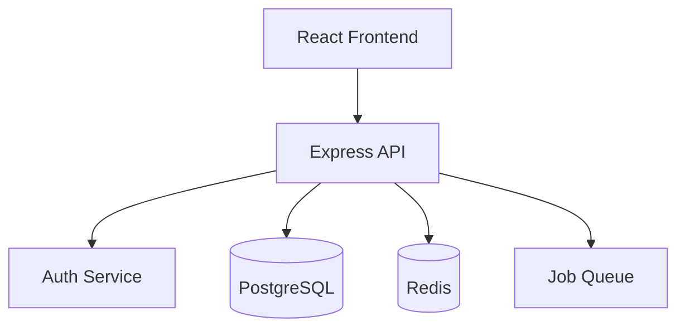
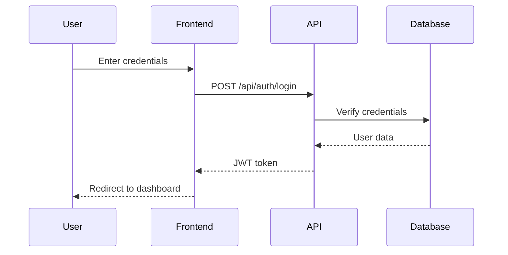
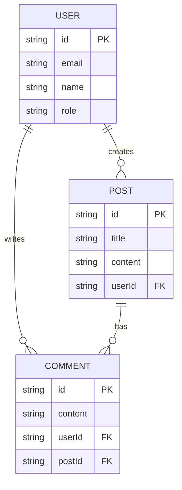
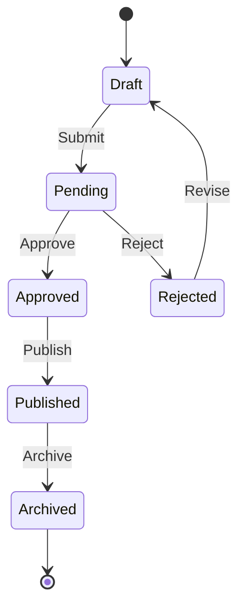
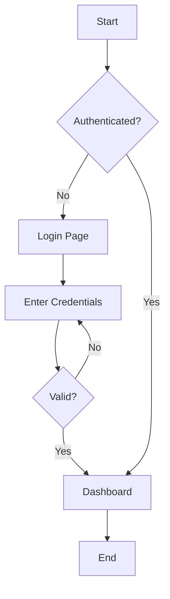

# Documentation Standards

## Documentation Types

| Type | Purpose | Audience |
|------|---------|----------|
| **Architecture** | System design, component relationships | Developers, Tech Leads |
| **API Reference** | Endpoint specifications, contracts | Frontend devs, Integrators |
| **Development** | Setup, contribution guidelines | New developers |
| **Product** | Features, user guides | End users, Stakeholders |

## Architecture Documentation

### System Overview

```markdown
# System Architecture

## Overview
Brief description of the system's purpose and main components.

## High-Level Architecture



## Components

### Frontend (React + MUI)
- **Purpose**: User interface layer
- **Technology**: React 18, Material-UI v5
- **Key Features**: Authentication, Dashboard, Settings

### Backend (Express)
- **Purpose**: API and business logic
- **Technology**: Node.js, Express.js
- **Responsibilities**: Auth, CRUD operations, Validation

### Database
- **Technology**: PostgreSQL
- **Migrations**: Managed via Knex/Prisma
```

### Component Documentation

```markdown
## Authentication Flow

### Sequence Diagram



### Flow Description
1. User submits login form
2. Frontend sends credentials to `/api/auth/login`
3. API validates credentials against database
4. On success, API returns JWT token
5. Frontend stores token and redirects
```

### Decision Records (ADR)

```markdown
# ADR-001: Authentication Strategy

## Status
Accepted

## Context
Need to implement user authentication for the application.

## Decision
Use JWT (JSON Web Tokens) with short-lived access tokens (1h) and refresh tokens (7d).

## Rationale
- Stateless: No server-side session storage needed
- Scalable: Works across multiple server instances
- Standard: Well-supported ecosystem

## Consequences
- Must implement token refresh mechanism
- Must securely store refresh tokens (httpOnly cookies)
- Token revocation requires additional infrastructure
```

## API Documentation

### OpenAPI/Swagger Format

```yaml
openapi: 3.0.0
info:
  title: User API
  version: 1.0.0

paths:
  /api/users:
    get:
      summary: List all users
      tags: [Users]
      security:
        - bearerAuth: []
      parameters:
        - name: page
          in: query
          schema:
            type: integer
            default: 1
        - name: limit
          in: query
          schema:
            type: integer
            default: 20
      responses:
        '200':
          description: Paginated user list
          content:
            application/json:
              schema:
                type: object
                properties:
                  success:
                    type: boolean
                  data:
                    type: array
                    items:
                      $ref: '#/components/schemas/User'
                  pagination:
                    $ref: '#/components/schemas/Pagination'

    post:
      summary: Create a new user
      tags: [Users]
      security:
        - bearerAuth: []
      requestBody:
        required: true
        content:
          application/json:
            schema:
              $ref: '#/components/schemas/CreateUser'
      responses:
        '201':
          description: User created
        '400':
          description: Validation error
        '409':
          description: Email already exists

components:
  schemas:
    User:
      type: object
      properties:
        id:
          type: string
        email:
          type: string
        name:
          type: string
        role:
          type: string
          enum: [user, admin]
        createdAt:
          type: string
          format: date-time

    CreateUser:
      type: object
      required: [email, password, name]
      properties:
        email:
          type: string
          format: email
        password:
          type: string
          minLength: 8
        name:
          type: string
          minLength: 2
```

### API Endpoint Documentation

```markdown
## Users API

### List Users

```
GET /api/users
```

**Query Parameters**
| Parameter | Type | Default | Description |
|-----------|------|---------|-------------|
| page | integer | 1 | Page number |
| limit | integer | 20 | Items per page |
| search | string | - | Search by name |

**Response**
```json
{
  "success": true,
  "data": [
    {
      "id": "123",
      "email": "user@example.com",
      "name": "John Doe",
      "role": "user"
    }
  ],
  "pagination": {
    "page": 1,
    "limit": 20,
    "total": 100,
    "pages": 5
  }
}
```

**Errors**
| Code | Description |
|------|-------------|
| 401 | Unauthorized - invalid or missing token |
| 403 | Forbidden - insufficient permissions |
```

## Development Documentation

### README Structure

```markdown
# Project Name

Brief description of the project.

## Features

- Feature 1
- Feature 2
- Feature 3

## Tech Stack

- **Frontend**: React, Material-UI
- **Backend**: Node.js, Express
- **Database**: PostgreSQL
- **Testing**: Jest, React Testing Library

## Getting Started

### Prerequisites

- Node.js 18+
- PostgreSQL 14+
- npm or yarn

### Installation

```bash
# Clone repository
git clone https://github.com/org/project.git
cd project

# Install dependencies
npm install

# Set up environment
cp .env.example .env

# Run database migrations
npm run db:migrate

# Start development server
npm run dev
```

### Environment Variables

| Variable | Description | Required |
|----------|-------------|----------|
| DATABASE_URL | PostgreSQL connection string | Yes |
| JWT_SECRET | Secret for JWT signing (min 32 chars) | Yes |
| PORT | Server port | No (default: 3001) |

## Scripts

| Command | Description |
|---------|-------------|
| `npm run dev` | Start development server |
| `npm run build` | Build for production |
| `npm run test` | Run tests |
| `npm run lint` | Run ESLint |
| `npm run db:migrate` | Run database migrations |

## Project Structure

```
src/
├── components/     # React components
├── pages/          # Page components
├── hooks/          # Custom React hooks
├── api/            # API client
├── utils/          # Utility functions
└── theme/          # MUI theme config
```

## Contributing

See [CONTRIBUTING.md](CONTRIBUTING.md) for guidelines.

## License

MIT
```

### Contributing Guide

```markdown
# Contributing

## Development Workflow

1. Fork the repository
2. Create a feature branch: `git checkout -b feature/my-feature`
3. Make your changes
4. Run tests: `npm test`
5. Run linting: `npm run lint`
6. Commit with conventional format: `feat: add user profile page`
7. Push and create a Pull Request

## Commit Messages

Follow [Conventional Commits](https://conventionalcommits.org/):

- `feat:` New feature
- `fix:` Bug fix
- `docs:` Documentation changes
- `style:` Code style (formatting, semicolons)
- `refactor:` Code refactoring
- `test:` Adding/updating tests
- `chore:` Maintenance tasks

## Code Standards

- All functions must have JSDoc comments
- Test coverage must be ≥60% overall, ≥20% per file
- ESLint must pass without errors
- Use TypeScript or JSDoc types

## Pull Request Process

1. Update documentation for any changed functionality
2. Add tests for new features
3. Ensure all CI checks pass
4. Request review from at least one team member
```

## Product Documentation

### Feature Documentation

```markdown
# User Management

## Overview

The User Management module allows administrators to create, view, edit, and delete user accounts.

## Features

### User List
- View all users in a paginated table
- Search users by name or email
- Sort by name, email, or creation date
- Filter by role (user/admin)

### Create User
- Email validation (unique, valid format)
- Password requirements (minimum 8 characters)
- Role assignment

### Edit User
- Update name and email
- Change role (admin only)
- Password reset functionality

### Delete User
- Confirmation dialog before deletion
- Soft delete (preserves data for audit)
- Admin-only permission

## User Interface

### User List Page

| Column | Description | Sortable |
|--------|-------------|----------|
| Name | User's full name | Yes |
| Email | User's email address | Yes |
| Role | User or Admin | Yes |
| Created | Account creation date | Yes |
| Actions | Edit, Delete buttons | No |

### Create/Edit Form

| Field | Type | Validation |
|-------|------|------------|
| Name | Text | Required, 2-100 chars |
| Email | Email | Required, valid format, unique |
| Password | Password | Required (create only), min 8 chars |
| Role | Select | Required (admin only) |

## Permissions

| Action | User | Admin |
|--------|------|-------|
| View user list | ❌ | ✅ |
| View own profile | ✅ | ✅ |
| Edit own profile | ✅ | ✅ |
| Edit any user | ❌ | ✅ |
| Delete user | ❌ | ✅ |
| Change roles | ❌ | ✅ |
```

### Release Notes

```markdown
# Release Notes

## v1.2.0 (2024-01-15)

### New Features
- **User Search**: Added ability to search users by name or email
- **Export Users**: Export user list to CSV format
- **Dark Mode**: Theme toggle in settings

### Improvements
- Improved form validation error messages
- Faster page load with optimized queries
- Better mobile responsiveness

### Bug Fixes
- Fixed pagination not resetting after search
- Fixed role dropdown not showing current value
- Fixed date formatting in user list

### Breaking Changes
- API response format changed for `/api/users` endpoint
  - `users` array now nested under `data` property
```

## Mermaid Diagrams

### Entity Relationship



### State Diagram



### Flowchart



## Operational Documentation

### Runbook Template

```markdown
# Runbook: [Service/Process Name]

## Overview

Brief description of what this runbook covers.

## Prerequisites

- Access to production environment
- Required tools installed
- Relevant permissions

## Service Information

| Attribute | Value |
|-----------|-------|
| Service | app-api |
| Repository | github.com/org/app |
| Owner Team | Platform |
| On-call | #platform-oncall |
| Dashboard | [Grafana Link] |
| Logs | [Kibana Link] |

## Common Operations

### Restart Service

**When to use**: Service is unresponsive or memory usage is high.

**Steps**:
```bash
# 1. Check current status
docker compose -f docker-compose.prod.yml ps

# 2. Restart the service
docker compose -f docker-compose.prod.yml restart app

# 3. Verify service is healthy
curl -f http://localhost:3000/health
```

**Expected outcome**: Service returns to healthy state within 2 minutes.

### Scale Service

**When to use**: High CPU/memory usage, increased traffic.

**Steps**:
```bash
# Scale to 3 instances
docker compose -f docker-compose.prod.yml up -d --scale app=3

# Verify all instances are running
docker compose -f docker-compose.prod.yml ps
```

### View Logs

**When to use**: Debugging issues, investigating errors.

**Steps**:
```bash
# Last 100 lines
docker compose -f docker-compose.prod.yml logs --tail=100 app

# Follow logs
docker compose -f docker-compose.prod.yml logs -f app

# Filter by time
docker compose -f docker-compose.prod.yml logs --since="1h" app
```

## Troubleshooting

### High Memory Usage

**Symptoms**: Memory usage > 90%, slow responses, OOM errors.

**Diagnosis**:
```bash
# Check memory usage
docker stats app

# Check for memory leaks in logs
docker compose logs app | grep -i "memory\|heap"
```

**Resolution**:
1. Restart the service (temporary fix)
2. Investigate memory leak in application code
3. Increase memory limits if legitimate growth

### Database Connection Errors

**Symptoms**: "Connection refused", "Too many connections", timeouts.

**Diagnosis**:
```bash
# Check database status
docker compose exec db pg_isready

# Check connection count
docker compose exec db psql -U postgres -c "SELECT count(*) FROM pg_stat_activity;"
```

**Resolution**:
1. Verify database is running
2. Check connection pool settings
3. Look for connection leaks in application

### High Latency

**Symptoms**: Response times > 1s, user complaints.

**Diagnosis**:
```bash
# Check application metrics
curl http://localhost:3000/metrics

# Check slow queries
docker compose exec db psql -U postgres -c "SELECT * FROM pg_stat_statements ORDER BY total_time DESC LIMIT 10;"
```

**Resolution**:
1. Identify slow endpoints/queries
2. Add missing indexes
3. Scale horizontally if CPU-bound

## Emergency Procedures

### Complete Service Outage

1. **Assess**: Check all services status
2. **Communicate**: Post in #incidents, page on-call
3. **Diagnose**: Check logs, metrics, recent deployments
4. **Mitigate**: Rollback if recent deploy, restart services
5. **Resolve**: Fix root cause
6. **Post-mortem**: Document incident

### Rollback Deployment

```bash
# 1. Find previous working version
docker images | grep app

# 2. Update compose file to previous version
# Edit docker-compose.prod.yml

# 3. Deploy previous version
docker compose -f docker-compose.prod.yml up -d

# 4. Verify rollback
curl http://localhost:3000/health
```
```

### Incident Response Template

```markdown
# Incident Report: [Brief Title]

## Summary

| Field | Value |
|-------|-------|
| Incident ID | INC-2024-001 |
| Severity | P1/P2/P3 |
| Status | Resolved |
| Start Time | 2024-01-15 14:30 UTC |
| End Time | 2024-01-15 15:45 UTC |
| Duration | 1h 15m |
| Impact | 30% of users affected |

## Timeline

| Time (UTC) | Event |
|------------|-------|
| 14:30 | Alerts triggered for high error rate |
| 14:35 | On-call engineer paged |
| 14:40 | Investigation started |
| 14:55 | Root cause identified |
| 15:15 | Fix deployed |
| 15:30 | Monitoring confirms resolution |
| 15:45 | Incident closed |

## Root Cause

Database connection pool exhausted due to connection leak introduced in v1.2.3.

## Resolution

Deployed hotfix v1.2.4 with connection leak fix.

## Impact

- 30% of API requests failed for 75 minutes
- ~500 users affected
- No data loss

## Action Items

| Action | Owner | Due Date | Status |
|--------|-------|----------|--------|
| Add connection pool monitoring | @dev | 2024-01-20 | Done |
| Add integration test for connection handling | @qa | 2024-01-22 | Pending |
| Review connection pool settings | @platform | 2024-01-25 | Pending |

## Lessons Learned

- Need better monitoring for connection pool metrics
- Code review should check for resource cleanup
- Consider connection pool alerting at 80% capacity
```

### Troubleshooting Guide Template

```markdown
# Troubleshooting: [Feature/Area]

## Quick Diagnostics

### Check Service Health
```bash
curl http://localhost:3000/health
```

### Check Recent Logs
```bash
docker compose logs --tail=50 app
```

### Check Resource Usage
```bash
docker stats
```

## Common Issues

### Issue: Login Not Working

**Symptoms**:
- Login button does nothing
- "Invalid credentials" for correct password
- Redirect loop after login

**Possible Causes**:
1. JWT secret mismatch between services
2. Redis session store down
3. User account locked

**Diagnostic Steps**:
```bash
# Check auth service logs
docker compose logs auth | grep -i error

# Verify JWT secret is set
docker compose exec app printenv | grep JWT_SECRET

# Check Redis connection
docker compose exec redis redis-cli ping
```

**Resolution by Cause**:

1. **JWT secret mismatch**:
   - Verify all services have same JWT_SECRET
   - Restart services after fixing

2. **Redis down**:
   - Restart Redis: `docker compose restart redis`
   - Check Redis memory usage

3. **Account locked**:
   - Check user status in database
   - Reset failed login count

### Issue: Slow Page Load

**Symptoms**:
- Pages take > 3 seconds to load
- Timeout errors
- Users reporting "spinning forever"

**Possible Causes**:
1. Slow database queries
2. High server load
3. Large payload responses
4. External API delays

**Diagnostic Steps**:
```bash
# Check slow queries
docker compose exec db psql -U postgres -c \
  "SELECT query, calls, total_time/calls as avg_time 
   FROM pg_stat_statements 
   ORDER BY total_time DESC LIMIT 10;"

# Check server resources
docker stats --no-stream

# Check external API response times
curl -w "@curl-format.txt" -o /dev/null -s https://api.external.com/health
```
```

## Changelog Format

### Keep a Changelog

```markdown
# Changelog

All notable changes to this project will be documented in this file.

The format is based on [Keep a Changelog](https://keepachangelog.com/en/1.0.0/),
and this project adheres to [Semantic Versioning](https://semver.org/spec/v2.0.0.html).

## [Unreleased]

### Added
- New feature in development

## [1.2.0] - 2024-01-15

### Added
- User search functionality
- Export users to CSV
- Dark mode support

### Changed
- Improved form validation messages
- Optimized database queries for user list

### Fixed
- Pagination reset after search
- Role dropdown initial value

### Security
- Updated dependencies to patch CVE-2024-XXXX

## [1.1.0] - 2024-01-01

### Added
- User profile editing
- Password reset flow

### Deprecated
- Old authentication endpoint (use /api/v2/auth)

### Removed
- Legacy user import feature

## [1.0.0] - 2023-12-01

### Added
- Initial release
- User management
- Authentication
- Basic dashboard
```

### API Changelog

```markdown
# API Changelog

## 2024-01-15 - v1.2.0

### New Endpoints

#### GET /api/users/search
Search users by name or email.

**Parameters**:
- `q` (string, required): Search query

**Response**: Same as GET /api/users

### Modified Endpoints

#### GET /api/users
- Added `search` query parameter
- Response now includes `pagination.hasNext` and `pagination.hasPrev`

### Deprecated

#### POST /api/auth/login (v1)
Use `/api/v2/auth/login` instead. Will be removed in v2.0.0.

### Breaking Changes

None in this release.

---

## 2024-01-01 - v1.1.0

### Breaking Changes

#### GET /api/users response format
Previous:
```json
{ "users": [...] }
```

New:
```json
{ "success": true, "data": [...] }
```
```

## User Documentation

### User Guide Template

```markdown
# [Feature Name] User Guide

## Overview

Brief description of the feature and its benefits.

## Getting Started

### Prerequisites
- Active user account
- Required permissions

### Accessing the Feature
1. Log in to your account
2. Navigate to Settings > [Feature]
3. Click "Enable [Feature]"

## How to Use

### [Task 1]: Creating a [Thing]

1. Click the "Create New" button
2. Fill in the required fields:
   - **Name**: Enter a descriptive name
   - **Description**: Optional details
3. Click "Save"

**Tips**:
- Names must be unique
- Descriptions support markdown

### [Task 2]: Editing a [Thing]

1. Find the item in the list
2. Click the edit icon (pencil)
3. Make your changes
4. Click "Save Changes"

## Frequently Asked Questions

### Q: How do I reset my password?
A: Click "Forgot Password" on the login page and follow the email instructions.

### Q: Why can't I see the admin settings?
A: Admin settings require administrator privileges. Contact your team admin.

### Q: How do I export my data?
A: Go to Settings > Data > Export and select your preferred format.

## Troubleshooting

| Problem | Solution |
|---------|----------|
| Can't log in | Clear browser cache, try incognito mode |
| Page not loading | Check internet connection, refresh page |
| Error message appears | Note the error code and contact support |

## Getting Help

- **Documentation**: [Link to docs]
- **Support Email**: support@example.com
- **Community Forum**: [Link to forum]
```

## Documentation Checklist

Before completing documentation:

### General Quality
- [ ] Clear and concise language
- [ ] Code examples are tested and work
- [ ] Diagrams render correctly (mermaid syntax)
- [ ] Tables are properly formatted
- [ ] Links are valid
- [ ] Version numbers are accurate
- [ ] No sensitive information exposed
- [ ] Reviewed for technical accuracy

### Technical Writing
- [ ] Active voice used
- [ ] Consistent terminology throughout
- [ ] Steps are numbered and actionable
- [ ] Screenshots are current (if applicable)
- [ ] Audience-appropriate language
- [ ] Examples are realistic and helpful

### Operational Docs
- [ ] Runbook covers common scenarios
- [ ] Emergency procedures are clear
- [ ] Contact information is current
- [ ] Commands are copy-pasteable
- [ ] Expected outcomes are documented