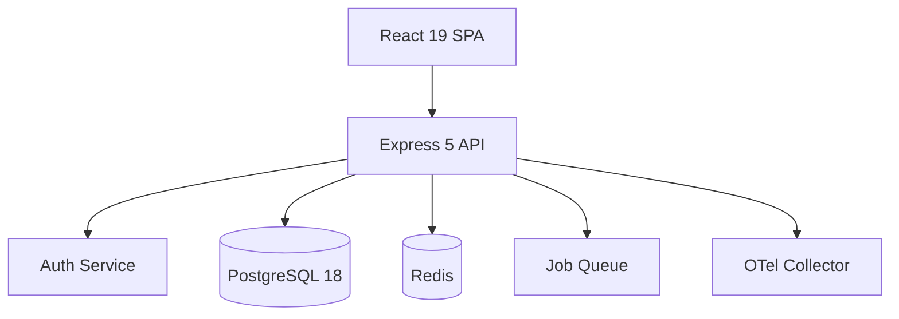
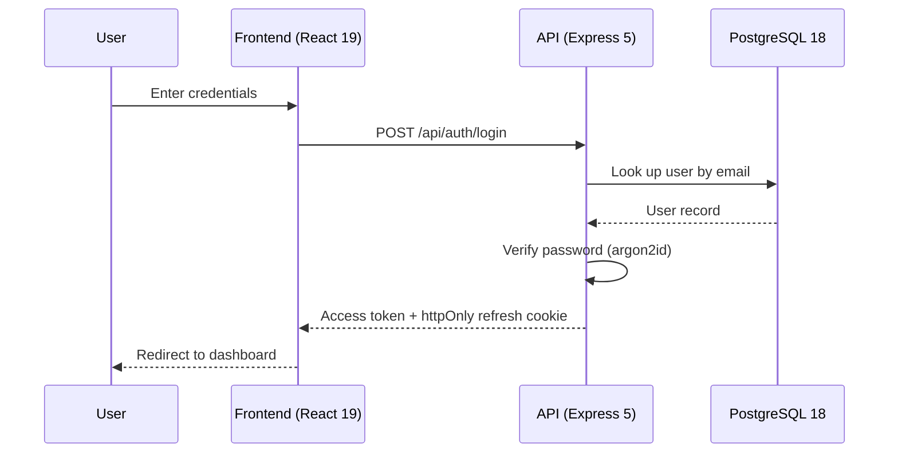
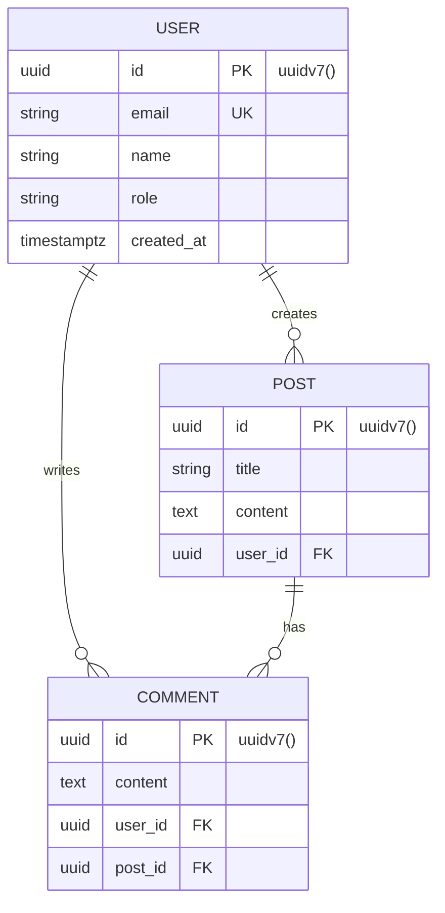
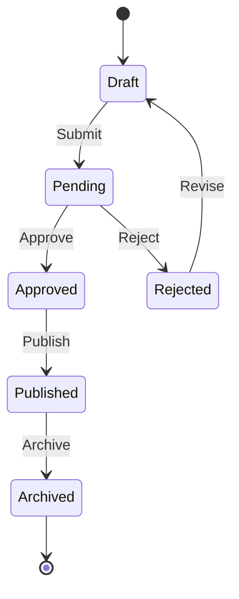
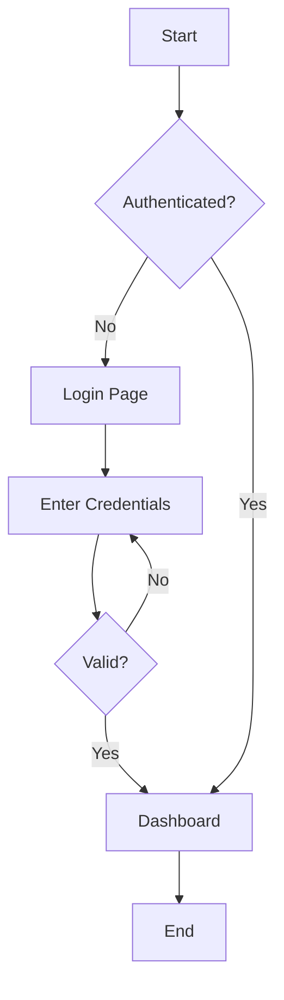

# Documentation Standards

## Documentation Types

| Type              | Purpose                                      | Audience                   |
| ----------------- | -------------------------------------------- | -------------------------- |
| **Architecture**  | System design, component relationships       | Developers, Tech Leads     |
| **API Reference** | Endpoint specifications, contracts           | Frontend devs, Integrators |
| **Development**   | Setup, contribution guidelines               | New developers             |
| **Product**       | Features, user guides                        | End users, Stakeholders    |
| **Operational**   | Runbooks, incident response, troubleshooting | On-call, SRE, Support      |

## Docs as Code

Documentation is source. It lives in the repository, ships in the same pull request as the
change it describes, and is tested like code.

### Principles

- **Co-located** - docs sit next to the code they describe (`docs/` in the repo, TSDoc in
  the source, README per package). A doc in a separate wiki drifts within a sprint.
- **Reviewed in the same PR** - a behaviour change with no doc change is an incomplete PR.
  Reviewers check the docs diff, not just the code diff.
- **Generated where possible** - the OpenAPI spec comes from Zod schemas, the type reference
  comes from TypeScript, the changelog comes from conventional commits. Hand-maintained
  copies of generated facts are technical debt.
- **Tested in CI** - links are checked, code examples are executed, diagrams are parsed.
- **Versioned with the code** - docs for release `v1.2` are on the `v1.2` tag.

### Diátaxis: Four Kinds of Document

Every document serves one of four purposes. Mixing them is the most common cause of
documentation that nobody can use.

| Kind             | Serves        | Answers                  | Example in this repo          |
| ---------------- | ------------- | ------------------------ | ----------------------------- |
| **Tutorial**     | Learning      | "Teach me by doing"      | Getting Started walkthrough   |
| **How-to guide** | A goal        | "How do I accomplish X?" | Runbook, "Add a new endpoint" |
| **Reference**    | Information   | "What exactly is this?"  | API reference, env var table  |
| **Explanation**  | Understanding | "Why is it like this?"   | ADRs, architecture overview   |

Rules that follow from this:

- A tutorial never explains trade-offs; it links to the explanation.
- A how-to guide assumes competence and states the goal in its title ("Rotate the database
  password"), not the topic ("Database passwords").
- Reference is complete, accurate, and boring. No narrative.
- Explanation is where rationale, alternatives, and history belong. Usually an ADR.

### CI Checks for Documentation

```yaml
# .github/workflows/docs.yml (excerpt)
jobs:
  docs:
    runs-on: ubuntu-latest
    permissions:
      contents: read
    steps:
      - uses: actions/checkout@<full-commit-sha>

      - name: Check links
        run: npx --yes lychee --no-progress './**/*.md'

      - name: Lint prose and formatting
        run: npm run docs:lint

      - name: Execute documented code examples
        run: npm run docs:test

      - name: Verify OpenAPI spec is up to date
        run: |
          npm run openapi:generate
          git diff --exit-code openapi.json

      - name: Validate Mermaid diagrams parse
        run: npm run docs:diagrams
```

Pin actions to full commit SHAs, not tags. Keep `permissions:` least-privilege per job.

## Architecture Documentation

### System Overview

````markdown
# System Architecture

## Overview

Brief description of the system's purpose and main components.

## High-Level Architecture


```mermaid
graph TB
    Client[React 19 SPA] --> API[Express 5 API]
    API --> Auth[Auth Service]
    API --> DB[(PostgreSQL 18)]
    API --> Cache[(Redis)]
    API --> Queue[Job Queue]
    API --> OTel[OTel Collector]
```

## Components

### Frontend (React + MUI)

- **Purpose**: User interface layer
- **Technology**: React 19.3, MUI v9, Vite 8, TanStack Query 5
- **Key Features**: Authentication, Dashboard, Settings

### Backend (Express)

- **Purpose**: API and business logic
- **Technology**: Node.js 24 LTS, Express 5.2, TypeScript 7
- **Responsibilities**: Auth, CRUD operations, Zod validation

### Database

- **Technology**: PostgreSQL 18 (UUIDv7 primary keys, `TIMESTAMPTZ`)
- **Migrations**: Forward-only, expand/contract, managed via Drizzle or Prisma

### Observability

- **Technology**: OpenTelemetry SDK, `pino` structured logs
- **Exports**: OTLP traces, metrics, and logs to the collector
````

### Component Documentation

````markdown
## Authentication Flow

### Sequence Diagram


```mermaid
sequenceDiagram
    participant U as User
    participant F as Frontend (React 19)
    participant A as API (Express 5)
    participant D as PostgreSQL 18

    U->>F: Enter credentials
    F->>A: POST /api/auth/login
    A->>D: Look up user by email
    D-->>A: User record
    A->>A: Verify password (argon2id)
    A-->>F: Access token + httpOnly refresh cookie
    F-->>U: Redirect to dashboard
```

### Flow Description

1. User submits login form
2. Frontend sends credentials to `/api/auth/login`
3. API validates credentials against the database
4. On success, the API returns a short-lived access token and sets a rotating refresh
   token in an httpOnly/Secure/SameSite cookie
5. Frontend redirects; the refresh cookie is never readable from JavaScript
````

### Decision Records (ADR)

```markdown
# ADR-001: Authentication Strategy

## Status

Accepted

## Context

Need to implement user authentication for the application.

## Decision

Use short-lived access tokens (15 minutes) verified with `jose`, plus rotating refresh
tokens (7 days) stored in httpOnly/Secure/SameSite cookies. Passwords hashed with argon2id.

## Rationale

- Short access-token lifetime limits the blast radius of a leaked token
- Rotation gives detectable replay (a reused refresh token invalidates the family)
- httpOnly cookies keep refresh tokens out of reach of XSS
- `jose` is maintained, standards-focused, and works on modern runtimes

## Consequences

- Must implement refresh rotation and reuse detection
- Revocation needs a server-side record of refresh-token families
- Clients must handle 401 + silent refresh
```

See `.claude/rules/architecture.md` for the full ADR template and lifecycle rules.

## API Documentation

### OpenAPI 3.1 Generated from Zod

The API specification is **generated, never hand-written**. Zod 4 schemas are the single
source of truth: the same schema validates requests at runtime and produces the OpenAPI 3.1
document. A hand-maintained YAML file drifts from the implementation the day after it is
written.

```ts
// src/validators/user.validator.ts
import { z } from "zod";

export const UserSchema = z
  .object({
    id: z.uuid(),
    email: z.email(),
    name: z.string().min(2).max(100),
    role: z.enum(["user", "admin"]),
    createdAt: z.iso.datetime(),
  })
  .meta({ id: "User", description: "An application user" });

export const CreateUserSchema = z
  .object({
    email: z.email(),
    password: z.string().min(12),
    name: z.string().min(2).max(100),
  })
  .meta({ id: "CreateUser" });
```

```ts
// scripts/generate-openapi.ts
import { z } from "zod";
import { writeFileSync } from "node:fs";
import { UserSchema } from "../src/validators/user.validator.js";

const document = {
  openapi: "3.1.0",
  info: { title: "User API", version: "1.2.0" },
  components: {
    schemas: { User: z.toJSONSchema(UserSchema, { target: "draft-2020-12" }) },
  },
  paths: {/* contributed by each route registration */},
};

writeFileSync("openapi.json", JSON.stringify(document, null, 2));
```

CI regenerates the spec and fails if the committed file differs (see the docs workflow
above). The generated excerpt below is published, not edited:

```yaml
# openapi.json (excerpt, generated - do not edit by hand)
openapi: 3.1.0
info:
  title: User API
  version: 1.2.0

paths:
  /api/users:
    get:
      summary: List users
      tags: [Users]
      security: [{ bearerAuth: [] }]
      parameters:
        - { name: cursor, in: query, schema: { type: string } }
        - {
            name: limit,
            in: query,
            schema: { type: integer, default: 20, maximum: 100 },
          }
      responses:
        "200":
          description: Cursor-paginated user list
          content:
            application/json:
              schema: { $ref: "#/components/schemas/UserListResponse" }
        "401":
          description: Authentication required
          content:
            application/problem+json:
              schema: { $ref: "#/components/schemas/ProblemDetails" }

components:
  schemas:
    User:
      type: object
      required: [id, email, name, role, createdAt]
      properties:
        id: { type: string, format: uuid }
        email: { type: string, format: email }
        name: { type: string, minLength: 2, maxLength: 100 }
        role: { type: string, enum: [user, admin] }
        createdAt: { type: string, format: date-time }
```

**JavaScript (ESM + JSDoc) fallback**: the same approach works without TypeScript - Zod
schemas live in `.js` files and the generator script is plain ESM. Only the type
annotations disappear.

### Error Documentation: RFC 9457 Problem Details

Errors are documented and returned as **Problem Details** (`application/problem+json`,
RFC 9457). Every error response has the same shape, so clients write one handler.

| Member     | Required    | Meaning                                                        |
| ---------- | ----------- | -------------------------------------------------------------- |
| `type`     | Recommended | URI identifying the problem kind; the docs page for it         |
| `title`    | Recommended | Short, human-readable, stable summary                          |
| `status`   | Recommended | HTTP status code, duplicated for convenience                   |
| `detail`   | Optional    | Human-readable explanation specific to this occurrence         |
| `instance` | Optional    | URI identifying this occurrence (often the request path or id) |
| extensions | Optional    | Any additional members, e.g. `errors`, `traceId`               |

```json
{
  "type": "https://api.example.com/problems/validation-error",
  "title": "Validation failed",
  "status": 422,
  "detail": "The request body failed schema validation.",
  "instance": "/api/users",
  "traceId": "4bf92f3577b34da6a3ce929d0e0e4736",
  "errors": [
    { "field": "email", "message": "Invalid email format" },
    { "field": "password", "message": "Must be at least 12 characters" }
  ]
}
```

Document each `type` URI as its own reference page: what causes it, which endpoints emit
it, and what the client should do. Include `traceId` so a support conversation can be
joined to a trace.

Existing APIs that already return the `{ success, error, code }` envelope may keep it -
document which format an endpoint uses, and never mix the two within one API version.

### API Endpoint Documentation

````markdown
## Users API

### List Users

`GET /api/users`

**Query Parameters**

| Parameter | Type    | Default | Description                                |
| --------- | ------- | ------- | ------------------------------------------ |
| cursor    | string  | -       | Opaque cursor from `pagination.nextCursor` |
| limit     | integer | 20      | Items per page (max 100)                   |
| search    | string  | -       | Search by name or email                    |

Cursor pagination is the default for lists. Offset pagination is documented only where the
result set is small and bounded.

**Response**

```json
{
  "data": [
    {
      "id": "0192f1a0-7c3e-7b2a-9f31-2b6c0a8d4e11",
      "email": "user@example.com",
      "name": "John Doe",
      "role": "user"
    }
  ],
  "pagination": {
    "limit": 20,
    "nextCursor": "eyJpZCI6IjAxOTJmMWEwIn0",
    "hasMore": true
  }
}
```

**Errors** (all `application/problem+json`)

| Status | `type`                       | Description                                 |
| ------ | ---------------------------- | ------------------------------------------- |
| 422    | `/problems/validation-error` | Invalid query parameters                    |
| 401    | `/problems/unauthorized`     | Missing or invalid token                    |
| 403    | `/problems/forbidden`        | Insufficient permissions                    |
| 429    | `/problems/rate-limited`     | Too many requests; see `Retry-After` header |
````

## Development Documentation

### README Structure

````markdown
# Project Name

Brief description of the project.

## Features

- Feature 1
- Feature 2
- Feature 3

## Tech Stack

- **Frontend**: React 19, MUI v9, Vite 8, TanStack Query 5
- **Backend**: Node.js 24 LTS, Express 5, TypeScript 7
- **Database**: PostgreSQL 18
- **Validation**: Zod 4 (also generates the OpenAPI 3.1 spec)
- **Testing**: Vitest 5, Testing Library 16, Playwright 1.63
- **Observability**: OpenTelemetry, `pino`

## Getting Started

### Prerequisites

- Node.js 24 LTS (>=22 supported)
- PostgreSQL 18 (or Docker)
- npm (lockfile committed; use `npm ci`)

### Installation

```bash
# Clone repository
git clone https://github.com/org/project.git
cd project

# Install dependencies from the lockfile
npm ci

# Set up environment
cp .env.example .env

# Start dependencies
docker compose up -d db redis

# Run database migrations
npm run db:migrate

# Start development server
npm run dev
```

### Environment Variables

| Variable                    | Description                             | Required                    |
| --------------------------- | --------------------------------------- | --------------------------- |
| DATABASE_URL                | PostgreSQL 18 connection string         | Yes                         |
| JWT_SECRET                  | Secret for token signing (min 32 chars) | Yes                         |
| PORT                        | Server port                             | No (default: 3001)          |
| NODE_ENV                    | `development`, `test`, or `production`  | No (default: development)   |
| ALLOWED_ORIGINS             | Comma-separated CORS origins            | No                          |
| LOG_LEVEL                   | `pino` log level                        | No (default: info)          |
| OTEL_EXPORTER_OTLP_ENDPOINT | OTLP collector endpoint                 | No (telemetry off if unset) |
| OTEL_SERVICE_NAME           | Service name reported in traces         | No                          |

Secrets never live in the repository. Local values go in `.env` (gitignored); CI uses OIDC
or repository secrets; production uses the platform's secret store.

## Scripts

| Command                    | Description                                |
| -------------------------- | ------------------------------------------ |
| `npm run dev`              | Start development server (Vite 8 + API)    |
| `npm run build`            | Type-check and build for production        |
| `npm run typecheck`        | TypeScript 7 project check                 |
| `npm test`                 | Run Vitest unit and integration tests      |
| `npm run test:e2e`         | Run Playwright end-to-end tests            |
| `npm run lint`             | Run ESLint 10 (flat config)                |
| `npm run format`           | Run Prettier 3                             |
| `npm run db:migrate`       | Run database migrations                    |
| `npm run openapi:generate` | Regenerate `openapi.json` from Zod schemas |
| `npm run docs:lint`        | Lint docs and check links                  |

## Project Structure

```
src/
  components/     # Shared React components
  features/       # Feature modules (UI + hooks + API calls)
  pages/          # Route page components
  hooks/          # Shared React hooks
  api/            # API client
  validators/     # Zod schemas (single source of truth)
  utils/          # Utility functions
  theme/          # MUI v9 theme config
```

## Contributing

See [CONTRIBUTING.md](CONTRIBUTING.md) for guidelines.

## License

MIT
````

### Contributing Guide

```markdown
# Contributing

## Development Workflow

1. Fork the repository
2. Create a feature branch: `git checkout -b feature/my-feature`
3. Make your changes, including documentation
4. Run tests: `npm test`
5. Run linting: `npm run lint`
6. Commit with conventional format: `feat: add user profile page`
7. Push and create a Pull Request

## Commit Messages

Follow [Conventional Commits](https://conventionalcommits.org/):

- `feat:` New feature
- `fix:` Bug fix
- `docs:` Documentation changes
- `style:` Code style (formatting, semicolons)
- `refactor:` Code refactoring
- `test:` Adding/updating tests
- `chore:` Maintenance tasks

## Code Standards

- Every exported function has TSDoc/JSDoc. With TypeScript, types live in the signature -
  do not repeat `@param {type}` in the doc comment.
- Test coverage must be at least 60% overall and 20% per file
- ESLint must pass without errors
- Validation with Zod at every API boundary
- Parameterized SQL only; never string concatenation
- No `console.log` in production code - use the structured logger

## Documentation Expectations

- Behaviour changes ship with their documentation in the same PR
- New endpoints update the Zod schemas; the OpenAPI spec is regenerated, not edited
- Architectural decisions get an ADR (see `docs/architecture/decisions/`)
- New runbook steps are verified by running them, not written from memory

## Pull Request Process

1. Update documentation for any changed functionality
2. Add tests for new features
3. Ensure all CI checks pass (lint, test, docs, spec drift)
4. Request review from at least one team member
```

## Product Documentation

### Feature Documentation

```markdown
# User Management

## Overview

The User Management module allows administrators to create, view, edit, and delete user
accounts.

## Features

### User List

- View all users in a paginated table
- Search users by name or email
- Sort by name, email, or creation date
- Filter by role (user/admin)

### Create User

- Email validation (unique, valid format)
- Password requirements (minimum 12 characters)
- Role assignment

### Edit User

- Update name and email
- Change role (admin only)
- Password reset functionality

### Delete User

- Confirmation dialog before deletion
- Soft delete (preserves data for audit)
- Admin-only permission

## User Interface

### User List Page

| Column  | Description           | Sortable |
| ------- | --------------------- | -------- |
| Name    | User's full name      | Yes      |
| Email   | User's email address  | Yes      |
| Role    | User or Admin         | Yes      |
| Created | Account creation date | Yes      |
| Actions | Edit, Delete buttons  | No       |

### Create/Edit Form

| Field    | Type     | Validation                          |
| -------- | -------- | ----------------------------------- |
| Name     | Text     | Required, 2-100 chars               |
| Email    | Email    | Required, valid format, unique      |
| Password | Password | Required (create only), min 12 chars |
| Role     | Select   | Required (admin only)               |

## Accessibility

The module targets WCAG 2.2 AA: full keyboard operation, visible focus, labelled controls,
and error messages announced to assistive technology.

## Permissions

| Action           | User | Admin |
| ---------------- | ---- | ----- |
| View user list   | No   | Yes   |
| View own profile | Yes  | Yes   |
| Edit own profile | Yes  | Yes   |
| Edit any user    | No   | Yes   |
| Delete user      | No   | Yes   |
| Change roles     | No   | Yes   |
```

### Release Notes

```markdown
# Release Notes

## v1.2.0 (2026-09-15)

### New Features

- **User Search**: Added ability to search users by name or email
- **Export Users**: Export user list to CSV format
- **Dark Mode**: Theme toggle in settings

### Improvements

- Improved form validation error messages
- Faster page load with optimized queries
- Better mobile responsiveness

### Bug Fixes

- Fixed pagination not resetting after search
- Fixed role dropdown not showing current value
- Fixed date formatting in user list

### Breaking Changes

- Errors from `/api/users` are now RFC 9457 Problem Details
  (`application/problem+json`) instead of the `{success, error}` envelope
```

## Mermaid Diagrams

### Entity Relationship


```mermaid
erDiagram
    USER ||--o{ POST : creates
    USER ||--o{ COMMENT : writes
    POST ||--o{ COMMENT : has
    USER {
        uuid id PK "uuidv7()"
        string email UK
        string name
        string role
        timestamptz created_at
    }
    POST {
        uuid id PK "uuidv7()"
        string title
        text content
        uuid user_id FK
    }
    COMMENT {
        uuid id PK "uuidv7()"
        text content
        uuid user_id FK
        uuid post_id FK
    }
```

### State Diagram


```mermaid
stateDiagram-v2
    [*] --> Draft
    Draft --> Pending: Submit
    Pending --> Approved: Approve
    Pending --> Rejected: Reject
    Rejected --> Draft: Revise
    Approved --> Published: Publish
    Published --> Archived: Archive
    Archived --> [*]
```

### Flowchart


```mermaid
flowchart TD
    A[Start] --> B{Authenticated?}
    B -->|No| C[Login Page]
    C --> D[Enter Credentials]
    D --> E{Valid?}
    E -->|No| D
    E -->|Yes| F[Dashboard]
    B -->|Yes| F
    F --> G[End]
```

## Operational Documentation

### Runbook Template

````markdown
# Runbook: [Service/Process Name]

## Overview

Brief description of what this runbook covers. A runbook is a how-to guide: it states a
goal and the steps to reach it, and assumes the reader is competent but under pressure.

## Prerequisites

- Access to the production environment
- Required tools installed (`docker`, `psql`, telemetry CLI)
- Relevant permissions

## Service Information

| Attribute  | Value                                   |
| ---------- | --------------------------------------- |
| Service    | app-api                                 |
| Repository | github.com/org/app                      |
| Owner Team | Platform                                |
| On-call    | #platform-oncall                        |
| SLO        | 99.9% availability, p95 latency < 500ms |
| Traces     | [Trace backend link]                    |
| Dashboards | [Metrics dashboard link]                |
| Logs       | [Log backend link]                      |

## Service Level Objectives

| SLI                   | Target | 30-day budget | Current burn |
| --------------------- | ------ | ------------- | ------------ |
| Availability          | 99.9%  | 43m 12s       | 18%          |
| Latency (p95 < 500ms) | 99%    | -             | 22%          |

Page when the fast burn-rate alert fires (budget consumed at more than 14x), not when CPU
crosses a raw threshold.

## Common Operations

### Restart Service

**When to use**: Service is unresponsive or memory usage is high.

**Steps**:

```bash
# 1. Check current status
docker compose -f compose.prod.yaml ps

# 2. Restart the service
docker compose -f compose.prod.yaml restart app

# 3. Verify service is healthy
curl -f http://localhost:3000/health
curl -f http://localhost:3000/health/ready
```

**Expected outcome**: Service returns to a healthy state within 2 minutes; error-budget
burn rate falls back below 1x within 10 minutes.

### Scale Service

**When to use**: Sustained latency SLI degradation or increased traffic.

**Steps**:

```bash
# Scale to 3 instances
docker compose -f compose.prod.yaml up -d --scale app=3

# Verify all instances are running
docker compose -f compose.prod.yaml ps
```

**Check before scaling**: confirm the database can absorb
(instances x pool size) connections.

### Inspect Telemetry

**When to use**: Any investigation. Start with traces, not logs.

**Steps**:

```bash
# 1. In the trace backend, filter service.name = app-api, status = ERROR, last 30m

# 2. Take a trace id from a failing request and pull the correlated logs
docker compose -f compose.prod.yaml logs --since=30m app \
  | grep '"trace_id":"4bf92f3577b34da6a3ce929d0e0e4736"'

# 3. Follow logs (JSON; pipe through pino-pretty for reading)
docker compose -f compose.prod.yaml logs -f app | npx pino-pretty
```

**Rule**: the trace id from the user's error response (`traceId` in the Problem Details
body) is the fastest path from a support ticket to a root cause.

## Troubleshooting

### High Memory Usage

**Symptoms**: Memory usage above 90%, slow responses, OOM restarts.

**Diagnosis**:

```bash
# Container-level resource usage
docker stats app --no-stream
```

Heap and GC figures come from the OpenTelemetry Node.js runtime instrumentation - check the
`process.runtime.*` metrics on the dashboard before restarting anything.

**Resolution**:

1. Restart the service (temporary mitigation - record it in the incident timeline)
2. Compare heap growth against deploy markers to find the introducing release
3. Increase memory limits only if the growth is legitimate

### Database Connection Errors

**Symptoms**: "Connection refused", "too many connections", timeouts.

**Diagnosis**:

```bash
# Check database status
docker compose -f compose.prod.yaml exec db pg_isready

# Check connection count against the limit
docker compose -f compose.prod.yaml exec db \
  psql -U postgres -c "SELECT count(*) FROM pg_stat_activity;"
```

**Resolution**:

1. Verify the database is running and reachable
2. Check pool sizing against instance count
3. Look for connection leaks - spans that never close usually mark the leaking path

### High Latency

**Symptoms**: Latency SLI burning budget, p95 above target, user complaints.

**Diagnosis**:

```bash
# Slow queries (pg_stat_statements)
docker compose -f compose.prod.yaml exec db \
  psql -U postgres -c "SELECT query, calls, mean_exec_time
   FROM pg_stat_statements ORDER BY total_exec_time DESC LIMIT 10;"
```

Then in the trace backend, sort spans by duration for the affected route and read the
critical path. The slowest span names the subsystem - database, external API, or CPU.

**Resolution**:

1. Fix or index the slow query identified by the trace
2. Add caching where the same span repeats within one request
3. Scale horizontally if the critical path is CPU-bound

## Emergency Procedures

### Complete Service Outage

1. **Assess**: Check service status and the availability SLI burn rate
2. **Communicate**: Post in #incidents, page on-call, open an incident channel
3. **Diagnose**: Traces first, then logs, then recent deployments
4. **Mitigate**: Roll back if a recent deploy correlates; restart services
5. **Resolve**: Fix the root cause
6. **Post-mortem**: Blameless review within 5 working days

### Rollback Deployment

```bash
# 1. Identify the last known-good image digest
docker images --digests | grep app

# 2. Pin that digest in the compose file
# Edit compose.prod.yaml

# 3. Deploy the previous version
docker compose -f compose.prod.yaml up -d app

# 4. Verify rollback
curl -f http://localhost:3000/health/ready
```

Automated rollback should already be wired to fast SLO burn; this is the manual fallback.
````

### Incident Response Template

```markdown
# Incident Report: [Brief Title]

This review is **blameless**. We describe what the system and the people did given the
information available at the time. We look for missing signals, unclear runbooks, and weak
guardrails - not for someone to hold responsible.

## Summary

| Field                 | Value                                   |
| --------------------- | --------------------------------------- |
| Incident ID           | INC-2026-014                            |
| Severity              | P1/P2/P3                                |
| Status                | Resolved                                |
| Start Time            | 2026-09-15 14:30 UTC                    |
| End Time              | 2026-09-15 15:45 UTC                    |
| Duration              | 1h 15m                                  |
| Impact                | 30% of requests failed                  |
| Error budget consumed | 62% of the monthly availability budget  |
| Detection             | Fast burn-rate alert (availability SLO) |

## Timeline

| Time (UTC) | Event                                                     |
| ---------- | --------------------------------------------------------- |
| 14:30      | Fast burn-rate alert fires on the availability SLO        |
| 14:35      | On-call engineer paged                                    |
| 14:40      | Investigation started from the error traces               |
| 14:55      | Root cause identified: connection leak on the export path |
| 15:15      | Fix deployed                                              |
| 15:30      | Burn rate back below 1x; SLI recovered                    |
| 15:45      | Incident closed                                           |

## Root Cause

The database connection pool was exhausted by a connection leak introduced in v1.2.3: the
export path acquired a client and returned early on validation failure without releasing it.

## Contributing Factors

- No alert on pool saturation, so the first signal was user-visible failure
- The leaking path had no integration test covering the early-return branch
- Pool metrics existed but were not on the primary dashboard

## Resolution

Deployed hotfix v1.2.4 releasing the client in a `finally` block.

## Impact

- 30% of API requests failed for 75 minutes
- ~500 users affected
- 62% of the monthly error budget consumed
- No data loss

## Action Items

| Action                                           | Owner     | Due Date   | Status      |
| ------------------------------------------------ | --------- | ---------- | ----------- |
| Alert on connection pool saturation at 80%       | @dev      | 2026-09-20 | Done        |
| Integration test covering early-return release   | @qa       | 2026-09-22 | Pending     |
| Add pool metrics to the primary dashboard        | @platform | 2026-09-25 | Pending     |
| Freeze feature deploys until the budget recovers | @platform | 2026-09-30 | In progress |

## Lessons Learned

- The system failed to signal pool pressure before users saw errors
- Traces pointed at the right subsystem in under 15 minutes - keep that path fast
- The error-budget policy worked: the deploy freeze was automatic, not argued about
```

### Troubleshooting Guide Template

````markdown
# Troubleshooting: [Feature/Area]

## Quick Diagnostics

```bash
# Liveness and readiness
curl -f http://localhost:3000/health
curl -f http://localhost:3000/health/ready

# Recent logs (structured JSON)
docker compose logs --tail=50 app | npx pino-pretty

# Resource usage
docker stats --no-stream
```

## Common Issues

### Issue: Login Not Working

**Symptoms**:

- Login button does nothing
- "Invalid credentials" for a correct password
- Redirect loop after login

**Possible Causes**:

1. Token signing secret mismatch between services
2. Session/refresh store (Redis) down
3. User account locked
4. Cookie rejected (missing Secure/SameSite, or plain HTTP)

**Diagnostic Steps**:

```bash
# Auth spans with error status in the trace backend name the failing step first

# Check auth service logs for the request's trace id
docker compose logs auth | grep '"trace_id":"<trace-id>"'

# Verify the signing secret is present (never print its value)
docker compose exec app sh -c 'test -n "$JWT_SECRET" && echo set || echo MISSING'

# Check Redis connectivity
docker compose exec redis redis-cli ping
```

**Resolution by Cause**:

1. **Secret mismatch**: ensure all services read the same secret, then restart them
2. **Redis down**: `docker compose restart redis`; check memory and eviction policy
3. **Account locked**: check user status; reset the failed-login counter
4. **Cookie rejected**: confirm HTTPS and the `Secure`/`SameSite` attributes on the response

### Issue: Slow Page Load

**Symptoms**:

- Pages take more than 3 seconds to load
- INP above 200ms in field data
- Timeout errors

**Possible Causes**:

1. Slow database queries
2. High server load
3. Oversized bundles or payloads
4. External API delays

**Diagnostic Steps**:

```bash
# Slow queries
docker compose exec db psql -U postgres -c \
  "SELECT query, calls, mean_exec_time
   FROM pg_stat_statements
   ORDER BY total_exec_time DESC LIMIT 10;"

# Server resources
docker stats --no-stream

# Bundle budget
npm run build -- --report
```

For the frontend, read Core Web Vitals from field data (INP at or below 200ms, LCP at or
below 2.5s, CLS at or below 0.1) before optimising anything; lab numbers mislead.
````

## Changelog Format

### Keep a Changelog

```markdown
# Changelog

All notable changes to this project will be documented in this file.

The format is based on [Keep a Changelog](https://keepachangelog.com/en/1.0.0/),
and this project adheres to [Semantic Versioning](https://semver.org/spec/v2.0.0.html).

## [Unreleased]

### Added

- New feature in development

## [1.2.0] - 2026-09-15

### Added

- User search functionality
- Export users to CSV
- Dark mode support

### Changed

- Improved form validation messages
- Optimized database queries for user list

### Fixed

- Pagination reset after search
- Role dropdown initial value

### Security

- Updated dependencies to patch a high-severity advisory

## [1.1.0] - 2026-07-01

### Added

- User profile editing
- Password reset flow

### Deprecated

- Old authentication endpoint (use /api/v2/auth)

### Removed

- Legacy user import feature

## [1.0.0] - 2026-04-10

### Added

- Initial release
- User management
- Authentication
- Basic dashboard
```

### API Changelog

````markdown
# API Changelog

## 2026-09-15 - v1.2.0

### New Endpoints

#### GET /api/users/search

Search users by name or email.

**Parameters**:

- `q` (string, required): Search query

**Response**: Same as GET /api/users

### Modified Endpoints

#### GET /api/users

- Added `search` query parameter
- Cursor pagination: response includes `pagination.nextCursor` and `pagination.hasMore`

### Deprecated

#### POST /api/auth/login (v1)

Use `/api/v2/auth/login` instead. Responses carry `Deprecation` and `Sunset` headers.
Will be removed in v2.0.0.

### Breaking Changes

None in this release.

---

## 2026-07-01 - v1.1.0

### Breaking Changes

#### Error format

Errors are now RFC 9457 Problem Details with `Content-Type: application/problem+json`.

Previous:

```json
{ "success": false, "error": "User not found", "code": "RESOURCE_NOT_FOUND" }
```

New:

```json
{
  "type": "https://api.example.com/problems/not-found",
  "title": "Not Found",
  "status": 404,
  "detail": "No user exists with that id.",
  "instance": "/api/users/0192f1a0-7c3e-7b2a-9f31-2b6c0a8d4e11"
}
```
````

## User Documentation

### User Guide Template

```markdown
# [Feature Name] User Guide

## Overview

Brief description of the feature and its benefits.

## Getting Started

### Prerequisites

- Active user account
- Required permissions

### Accessing the Feature

1. Log in to your account
2. Navigate to Settings > [Feature]
3. Click "Enable [Feature]"

## How to Use

### [Task 1]: Creating a [Thing]

1. Click the "Create New" button
2. Fill in the required fields:
   - **Name**: Enter a descriptive name
   - **Description**: Optional details
3. Click "Save"

**Tips**:

- Names must be unique
- Descriptions support markdown

### [Task 2]: Editing a [Thing]

1. Find the item in the list
2. Click the edit icon (pencil)
3. Make your changes
4. Click "Save Changes"

## Keyboard and Accessibility

- Every action is reachable by keyboard; focus order follows the visual order
- Screen readers announce validation errors as they appear
- The interface meets WCAG 2.2 AA

## Frequently Asked Questions

### Q: How do I reset my password?

A: Click "Forgot Password" on the login page and follow the email instructions.

### Q: Why can't I see the admin settings?

A: Admin settings require administrator privileges. Contact your team admin.

### Q: How do I export my data?

A: Go to Settings > Data > Export and select your preferred format.

## Troubleshooting

| Problem               | Solution                                        |
| --------------------- | ----------------------------------------------- |
| Can't log in          | Clear browser cache, try a private window       |
| Page not loading      | Check internet connection, refresh the page     |
| Error message appears | Note the reference id shown and contact support |

## Getting Help

- **Documentation**: [Link to docs]
- **Support Email**: support@example.com
- **Community Forum**: [Link to forum]
```

## Documentation Checklist

Before completing documentation:

### General Quality

- [ ] Clear and concise language
- [ ] Code examples are tested and work
- [ ] Diagrams render correctly (Mermaid syntax, never ASCII art)
- [ ] Tables are properly formatted
- [ ] Links are valid (link checker passes)
- [ ] Version numbers match the project's actual stack
- [ ] No sensitive information exposed
- [ ] Reviewed for technical accuracy

### Docs as Code

- [ ] Docs changed in the same PR as the behaviour they describe
- [ ] Each document has one Diátaxis purpose (tutorial, how-to, reference, explanation)
- [ ] Generated artefacts are generated, not hand-edited (OpenAPI, type reference)
- [ ] `openapi.json` regenerated and committed when schemas changed
- [ ] Docs CI job passes (links, examples, diagrams, spec drift)

### Technical Writing

- [ ] Active voice used
- [ ] Consistent terminology throughout
- [ ] Steps are numbered and actionable
- [ ] Screenshots are current (if applicable)
- [ ] Audience-appropriate language
- [ ] Examples are realistic and helpful

### API Documentation

- [ ] Every endpoint present in the generated OpenAPI 3.1 spec
- [ ] Error responses documented as RFC 9457 Problem Details
- [ ] Each problem `type` URI resolves to a reference page
- [ ] Pagination style stated (cursor by default)
- [ ] Idempotency and rate-limit behaviour documented

### Operational Docs

- [ ] Runbook covers common scenarios
- [ ] Diagnosis starts from traces, with trace/log correlation shown
- [ ] SLOs and error-budget policy stated
- [ ] Emergency procedures are clear
- [ ] Contact information is current
- [ ] Commands are copy-pasteable and use `docker compose` (v2, no hyphen)
- [ ] Expected outcomes are documented
- [ ] Incident template framed as blameless
