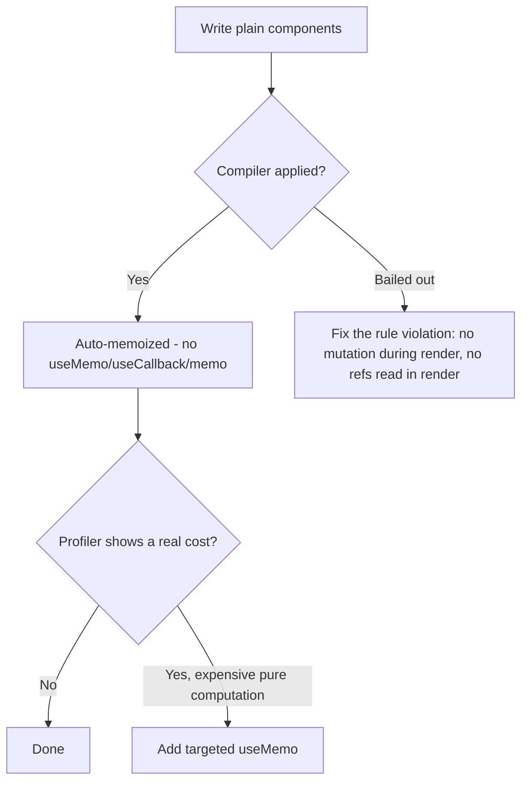
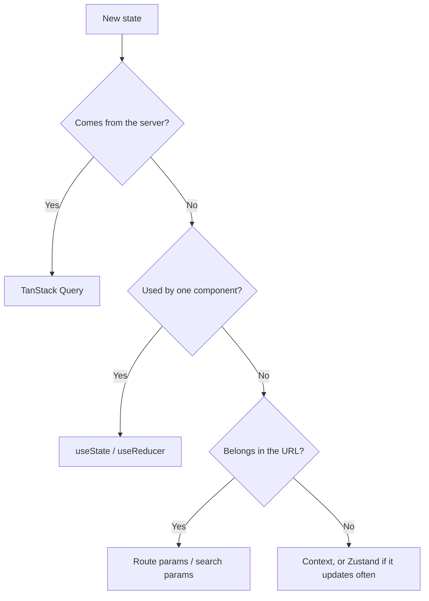

# Frontend Development (React 19 + MUI v9 + TypeScript)

Stack: React **19.3** with **React Compiler 1.0**, MUI **v9**, TypeScript **7.0**, Vite **8.3**,
TanStack Query **5**, react-hook-form **7.88** + Zod **4**.

All examples are TypeScript. A short **JavaScript (ESM + JSDoc) fallback** note appears only where
a JS project differs meaningfully.

## Project Structure

```
src/
├── components/
│   ├── ui/              # Reusable UI primitives (Button, Card, Modal wrappers)
│   └── forms/           # Form field wrappers (TextField, Select, NumberField)
├── features/            # Feature slices - the default home for new code
│   └── users/
│       ├── UserList.tsx
│       ├── UserProfile.tsx
│       ├── users.queries.ts   # TanStack Query hooks + query keys
│       └── users.schema.ts    # Zod schemas + inferred types
├── routes/              # Route components (lazy-loaded boundaries)
├── layouts/             # Layout shells (MainLayout, AuthLayout)
├── hooks/               # Shared hooks
├── context/             # Context providers
├── lib/                 # api client, query client, utilities
└── theme/               # MUI theme (CSS variables, color schemes)
```

Rules:

- One feature = one folder. Cross-feature imports go through `components/ui` or `lib`, never deep
  into another feature's internals.
- Co-locate tests (`UserList.test.tsx`) next to the component.
- Route-level files are the code-splitting boundary (see **Vite 8 build notes**).

## Component Patterns

### Typed function components

```tsx
import { Box, Button, Typography } from "@mui/material";

type User = { id: string; name: string; email: string; avatarUrl?: string };

type UserProfileProps = {
  user: User;
  /** Omit to render the profile read-only. */
  onEdit?: (id: string) => void;
};

/** Displays a user's profile with an optional edit affordance. */
export function UserProfile({ user, onEdit }: UserProfileProps) {
  return (
    <Box sx={{ p: 3 }}>
      <Typography variant="h4">{user.name}</Typography>
      <Typography variant="body2" color="text.secondary">
        {user.email}
      </Typography>
      {onEdit && (
        <Button
          variant="outlined"
          sx={{ mt: 2 }}
          onClick={() => onEdit(user.id)}
        >
          Edit
        </Button>
      )}
    </Box>
  );
}
```

- Never `React.FC` - it adds an implicit `children` and breaks generic components.
- Name the props type `<Component>Props` and export it when consumers need it.
- TSDoc documents intent only; **do not repeat types** (`@param {string}`) - they live in the
  signature.

**JavaScript (ESM + JSDoc) fallback:** describe props with a `@typedef` and one
`@param {UserProfileProps} props`, keeping the JSDoc types since the signature carries none.

### `ref` as a prop (no `forwardRef`)

React 19 passes `ref` like any other prop to function components. `forwardRef` is legacy.

```tsx
type InputProps = { label: string; ref?: React.Ref<HTMLInputElement> };

export function Input({ label, ref }: InputProps) {
  return <TextField label={label} inputRef={ref} />;
}
```

### Composition over prop drilling

```tsx
type CardProps = { children: React.ReactNode };

export function UserCard({ children }: CardProps) {
  return <Card sx={{ p: 2 }}>{children}</Card>;
}

export function UserCardHeader({
  title,
  subtitle,
}: {
  title: string;
  subtitle?: string;
}) {
  return (
    <Box sx={{ mb: 2 }}>
      <Typography variant="h6">{title}</Typography>
      {subtitle && (
        <Typography variant="body2" color="text.secondary">
          {subtitle}
        </Typography>
      )}
    </Box>
  );
}

// <UserCard><UserCardHeader title={user.name} /><UserCardActions user={user} /></UserCard>
```

## React Compiler First

React Compiler 1.0 is stable and is the default for new projects. It memoizes components and
values automatically from the source, so **manual memoization is no longer standard practice**.

```ts
// vite.config.ts
import { defineConfig } from "vite";
import react from "@vitejs/plugin-react";

export default defineConfig({
  plugins: [
    react({ babel: { plugins: [["babel-plugin-react-compiler", {}]] } }),
  ],
});
```

Enable `eslint-plugin-react-hooks` compiler diagnostics in flat config - they tell you when a
component was **skipped** (bailed out) by the compiler, which is your signal to fix the code
rather than to hand-memoize it.

### The mental model



### Rules the compiler relies on

- Components and hooks are **pure**: no mutating props, state, or module-level values during render.
- No reading or writing `ref.current` during render.
- Hooks stay at the top level, never in conditions or loops.
- Don't call component functions directly (`Header()`); render them (`<Header />`).

### When manual memoization is still warranted

| Situation                                                                              | Do this                                       |
| -------------------------------------------------------------------------------------- | --------------------------------------------- |
| Compiler is off (legacy app, opt-out file)                                             | Keep `useMemo`/`useCallback`/`memo` as before |
| Genuinely expensive pure computation (large sort/filter, parsing, chart transforms)    | `useMemo`, measured with the Profiler first   |
| Value passed to a non-React API or a `useEffect` dep that must be referentially stable | `useMemo`/`useCallback`                       |
| Third-party component memoized on identity that you cannot change                      | `memo` on your wrapper                        |
| Everything else                                                                        | Nothing - let the compiler do it              |

Do not add `useMemo`/`useCallback` "just in case". Unmeasured memoization is noise the compiler
already handles.

## Actions, Transitions, and Async UI

Actions replace hand-rolled `isSubmitting` / `error` / optimistic state.

### `useActionState`

```tsx
import { useActionState } from "react";

type State = { error?: string; ok?: boolean };

export function InviteForm({ teamId }: { teamId: string }) {
  const [state, submitAction, isPending] = useActionState<State, FormData>(
    async (_prev, formData) => {
      const email = String(formData.get("email") ?? "");
      const res = await api.invite(teamId, email);
      return res.ok ? { ok: true } : { error: res.error };
    },
    {},
  );

  return (
    <Box
      component="form"
      action={submitAction}
      sx={{ display: "grid", gap: 2 }}
    >
      <TextField name="email" label="Email" type="email" required />
      {state.error && <Alert severity="error">{state.error}</Alert>}
      <SubmitButton />
    </Box>
  );
}
```

`useActionState` returns `[state, action, isPending]`. Pass the action to `<form action={...}>` -
React resets the form and handles pending state for you.

### `useFormStatus`

Read the parent form's pending state from a child without prop drilling. It must be rendered
**inside** the `<form>`.

```tsx
import { useFormStatus } from "react-dom";

function SubmitButton() {
  const { pending } = useFormStatus();
  return (
    <Button type="submit" variant="contained" loading={pending}>
      Send invite
    </Button>
  );
}
```

### `useOptimistic`

```tsx
const [optimisticItems, addOptimistic] = useOptimistic(
  items,
  (current: Item[], draft: Item) => [...current, { ...draft, pending: true }],
);

async function send(formData: FormData) {
  const draft = { id: crypto.randomUUID(), text: String(formData.get("text")) };
  addOptimistic(draft);
  await api.createItem(draft);
}
```

The optimistic value reverts automatically when the action settles and real data arrives.

### `use()` and the cached-promise caveat

`use()` unwraps a promise or context and can be called conditionally (unlike other hooks).

```tsx
// lib/users.ts - cache OUTSIDE render
const userCache = new Map<string, Promise<User>>();
export function getUser(id: string): Promise<User> {
  if (!userCache.has(id)) userCache.set(id, api.getUser(id));
  return userCache.get(id)!;
}

function UserName({ id }: { id: string }) {
  const user = use(getUser(id)); // suspends until resolved
  return <Typography>{user.name}</Typography>;
}
```

**Caveat:** a promise created _during_ render is recreated on every render, so Suspense never
settles - an infinite loading loop. Always create promises outside render (a cache, a loader, or
TanStack Query). In practice prefer `useSuspenseQuery` over hand-rolled promise caches.

### `<Context>` as provider

```tsx
const ThemeModeContext = createContext<ThemeModeValue | null>(null);

// React 19: render the context itself, not Context.Provider
<ThemeModeContext value={value}>{children}</ThemeModeContext>;
```

`use(ThemeModeContext)` reads it; `useContext` still works.

### Document metadata

`<title>`, `<meta>`, and `<link>` rendered anywhere in a component are hoisted into `<head>` -
no helmet library needed.

## Hooks: `useEffect` Is a Last Resort

`useEffect` is for **synchronizing with systems outside React**. If no external system is
involved, it is the wrong tool.

### When NOT to use `useEffect`

| You want to…                           | Do this instead                                                 |
| -------------------------------------- | --------------------------------------------------------------- |
| Fetch server data                      | TanStack Query (`useQuery` / `useSuspenseQuery`)                |
| Derive state from props/state          | Compute during render (the compiler memoizes it)                |
| Reset state when a prop changes        | `key` prop on the component                                     |
| Respond to a user event                | Do the work in the event handler                                |
| Submit a form / mutate data            | Action (`useActionState`) or `useMutation`                      |
| Share logic between handlers           | A plain function, not an effect                                 |
| Cache an expensive computation         | `useMemo` (only if measured)                                    |
| Update parent when child state changes | Lift the state up, or call the parent's callback in the handler |

### Legitimate effects

Subscriptions to non-React sources, imperative DOM/browser APIs (focus traps, observers,
`matchMedia`), analytics on mount, WebSocket lifecycle, timers.

```tsx
useEffect(() => {
  const controller = new AbortController();
  window.addEventListener("resize", onResize, { signal: controller.signal });
  return () => controller.abort();
}, [onResize]);
```

Prefer `useSyncExternalStore` for reading external stores, and `AbortController` for cleanup.

### Custom hooks

Custom hooks compose other hooks and return values - they never own data fetching directly.

```ts
/** Tracks a CSS media query, staying in sync across SSR and client. */
export function useMediaQuery(query: string): boolean {
  return useSyncExternalStore(
    (cb) => {
      const mql = window.matchMedia(query);
      mql.addEventListener("change", cb);
      return () => mql.removeEventListener("change", cb);
    },
    () => window.matchMedia(query).matches,
    () => false,
  );
}
```

## MUI v9 Styling

### `sx` prop (primary method)

```tsx
<Box
  sx={{
    p: 2, // theme.spacing(2)
    bgcolor: "primary.main",
    color: "primary.contrastText",
    borderRadius: 1,
    boxShadow: 2,
    "&:hover": { bgcolor: "primary.dark" },
  }}
/>
```

### Responsive values

```tsx
<Box
  sx={{
    width: { xs: "100%", sm: "50%", md: "33%" },
    p: { xs: 2, md: 4 },
    flexDirection: { xs: "column", md: "row" },
  }}
/>
```

### Never use inline styles

```tsx
// Bad - hardcoded, no theme, no dark mode, no breakpoints
<div style={{ padding: '16px', color: '#1976d2' }} />

// Good
<Box sx={{ p: 2, color: 'primary.main' }} />
```

The only exception is a genuinely dynamic value that cannot be a token (e.g. a computed
`transform` from a drag position) - pass it via a CSS custom property instead where possible.

### `styled` for reusable variants

```tsx
import { styled } from "@mui/material/styles";

const StatCard = styled(Card)(({ theme }) => ({
  padding: theme.spacing(2),
  borderLeft: `4px solid ${theme.vars.palette.primary.main}`,
}));
```

Use `styled` when a styled element is reused across files; use `sx` for one-off styling.

### `useTheme` and `theme.vars`

```tsx
const theme = useTheme();
const border = `1px solid ${theme.vars.palette.divider}`;
```

With `cssVariables: true`, read colors through `theme.vars.*` so values resolve to CSS variables
and follow the active color scheme without a re-render.

## MUI v9 Theme (CSS Variables + Color Schemes)

```ts
// theme/index.ts
import { createTheme } from "@mui/material/styles";

const theme = createTheme({
  cssVariables: { colorSchemeSelector: "data-mui-color-scheme" },
  colorSchemes: {
    light: {
      palette: {
        primary: { main: "#1976d2" },
        secondary: { main: "#9c27b0" },
        background: { default: "#fafafa", paper: "#ffffff" },
      },
    },
    dark: {
      palette: {
        primary: { main: "#90caf9" },
        secondary: { main: "#ce93d8" },
        background: { default: "#121212", paper: "#1e1e1e" },
      },
    },
  },
  typography: {
    fontFamily: '"Inter", "Roboto", "Helvetica", "Arial", sans-serif',
    h1: { fontSize: "2.5rem", fontWeight: 600 },
    h2: { fontSize: "2rem", fontWeight: 600 },
  },
  shape: { borderRadius: 8 },
  components: {
    MuiButton: { styleOverrides: { root: { textTransform: "none" } } },
  },
});

export default theme;
```

### Provider setup and dark mode

```tsx
// App.tsx
import { ThemeProvider, CssBaseline } from "@mui/material";
// Only exported from its own path, not from the package root.
import InitColorSchemeScript from "@mui/material/InitColorSchemeScript";
import theme from "./theme";

export function App() {
  return (
    <ThemeProvider theme={theme} defaultMode="system">
      <InitColorSchemeScript attribute="data-mui-color-scheme" />
      <CssBaseline />
      <AppRoutes />
    </ThemeProvider>
  );
}
```

Toggle schemes with `useColorScheme()`:

```tsx
const { mode, setMode } = useColorScheme();
<IconButton
  aria-label="Toggle colour scheme"
  onClick={() => setMode(mode === "dark" ? "light" : "dark")}
>
  {mode === "dark" ? <LightModeOutlined /> : <DarkModeOutlined />}
</IconButton>;
```

Do **not** rebuild the theme object on mode change - CSS variables switch without a React
re-render, and `InitColorSchemeScript` prevents the first-paint flash.

### Typing custom theme fields

```ts
declare module "@mui/material/styles" {
  interface Theme {
    layout: { sidebarWidth: number };
  }
  interface ThemeOptions {
    layout?: { sidebarWidth?: number };
  }
}
```

### v9 migration gotchas

| Change                                                                 | Action                                                                                            |
| ---------------------------------------------------------------------- | ------------------------------------------------------------------------------------------------- |
| 23 legacy `*Outline` icon exports removed                              | Rename imports: `DeleteOutline` → `DeleteOutlined`                                                |
| Browser baseline raised (Chrome 117, Edge 121, Firefox 121, Safari 17) | Update `browserslist`/Vite `build.target`; drop polyfills for older targets                       |
| No MUI v8 - v7 jumped to v9 (aligned with MUI X v9)                    | Upgrade `@mui/material` and `@mui/x-*` together                                                   |
| Theme/CSS-variable refinements use `color-mix()`                       | Read colors via `theme.vars.*`, not `theme.palette.*`, in `styled`/`sx` callbacks                 |
| New components: **NumberField**, **Menubar**                           | Use `NumberField` for numeric input instead of `type="number"`; `Menubar` for app-level menu bars |

## Common MUI Patterns

### Layout with the modern Grid API

```tsx
import { Container, Grid } from "@mui/material";

export function Dashboard() {
  return (
    <Container maxWidth="lg">
      <Grid container spacing={3}>
        <Grid size={{ xs: 12, md: 8 }}>
          <MainContent />
        </Grid>
        <Grid size={{ xs: 12, md: 4 }}>
          <Sidebar />
        </Grid>
      </Grid>
    </Container>
  );
}
```

No `item` prop and no `xs={12} md={8}` props - the modern API uses `size` (a number, or a
breakpoint object, or `"grow"`/`"auto"`). Offsets use `offset={{ md: 2 }}`.
For simple one-dimensional layouts prefer `<Stack>` or `<Box sx={{ display: 'grid' }}>`.

### Numeric input (NumberField)

```tsx
<NumberField
  label="Quantity"
  min={1}
  max={99}
  step={1}
  value={quantity}
  onValueChange={setQuantity}
/>
```

### Dialogs with focus management

```tsx
type ConfirmDialogProps = {
  open: boolean;
  title: string;
  message: string;
  onClose: () => void;
  onConfirm: () => void;
};

export function ConfirmDialog({
  open,
  title,
  message,
  onClose,
  onConfirm,
}: ConfirmDialogProps) {
  const confirmRef = useRef<HTMLButtonElement>(null);
  return (
    <Dialog
      open={open}
      onClose={onClose}
      maxWidth="sm"
      fullWidth
      aria-labelledby="confirm-title"
      aria-describedby="confirm-desc"
    >
      <DialogTitle id="confirm-title">{title}</DialogTitle>
      <DialogContent>
        <Typography id="confirm-desc">{message}</Typography>
      </DialogContent>
      <DialogActions>
        <Button onClick={onClose}>Cancel</Button>
        <Button ref={confirmRef} onClick={onConfirm} variant="contained">
          Confirm
        </Button>
      </DialogActions>
    </Dialog>
  );
}
```

MUI traps focus and restores it to the trigger on close. Your job: label the dialog
(`aria-labelledby` / `aria-describedby`) and never make a destructive action the autofocused
control.

### Snackbar notifications

```tsx
type Notice = { message: string; severity: AlertColor };

export function useNotification() {
  const [notice, setNotice] = useState<Notice | null>(null);
  const notify = (message: string, severity: AlertColor = "info") =>
    setNotice({ message, severity });
  const close = () => setNotice(null);

  const snackbar = (
    <Snackbar
      open={notice !== null}
      autoHideDuration={6000}
      onClose={close}
      anchorOrigin={{ vertical: "bottom", horizontal: "right" }}
    >
      {notice ? (
        <Alert severity={notice.severity} onClose={close} variant="filled">
          {notice.message}
        </Alert>
      ) : undefined}
    </Snackbar>
  );

  return { notify, snackbar };
}
```

No `useCallback` here - the compiler handles identity stability.

## Forms: react-hook-form + Zod 4

```tsx
import { useForm, Controller } from "react-hook-form";
import { zodResolver } from "@hookform/resolvers/zod";
import { z } from "zod";

const loginSchema = z.object({
  email: z.email("Invalid email address"),
  password: z.string().min(12, "Minimum 12 characters"),
});

type LoginValues = z.infer<typeof loginSchema>;

export function LoginForm({
  onSubmit,
}: {
  onSubmit: (values: LoginValues) => Promise<void>;
}) {
  const {
    control,
    handleSubmit,
    formState: { errors, isSubmitting },
  } = useForm<LoginValues>({
    resolver: zodResolver(loginSchema),
    defaultValues: { email: "", password: "" },
  });

  return (
    <Box
      component="form"
      noValidate
      onSubmit={handleSubmit(onSubmit)}
      sx={{ display: "grid", gap: 2 }}
    >
      <Controller
        name="email"
        control={control}
        render={({ field }) => (
          <TextField
            {...field}
            label="Email"
            type="email"
            autoComplete="email"
            error={Boolean(errors.email)}
            helperText={errors.email?.message}
          />
        )}
      />
      <Controller
        name="password"
        control={control}
        render={({ field }) => (
          <TextField
            {...field}
            label="Password"
            type="password"
            autoComplete="current-password"
            error={Boolean(errors.password)}
            helperText={errors.password?.message}
          />
        )}
      />
      <Button type="submit" variant="contained" loading={isSubmitting}>
        Sign In
      </Button>
    </Box>
  );
}
```

Rules:

- The Zod schema is the single source of truth - derive the TS type with `z.infer`, never write it
  twice. Share the schema with the API layer where possible.
- Reuse the same schema shape the server validates with; client validation is UX, not security.
- Use `useActionState` + `<form action>` for simple forms; use react-hook-form when you need
  per-field validation modes, dynamic field arrays, or complex dependent fields.
- Always set `autoComplete` and correct `type` on inputs.

## State Management

Decision order - stop at the first that fits:



### Local state first

```tsx
const [open, setOpen] = useState(false);
const [filters, dispatch] = useReducer(filterReducer, initialFilters);
```

### Context for UI state

```tsx
type ThemeModeValue = { mode: "light" | "dark"; toggle: () => void };
const ThemeModeContext = createContext<ThemeModeValue | null>(null);

export function ThemeModeProvider({ children }: { children: React.ReactNode }) {
  const [mode, setMode] = useState<"light" | "dark">("light");
  const value = {
    mode,
    toggle: () => setMode((m) => (m === "light" ? "dark" : "light")),
  };
  return <ThemeModeContext value={value}>{children}</ThemeModeContext>;
}

export function useThemeMode(): ThemeModeValue {
  const ctx = use(ThemeModeContext);
  if (!ctx)
    throw new Error("useThemeMode must be used within ThemeModeProvider");
  return ctx;
}
```

Always throw when the context is missing - it turns a silent `undefined` into a clear error.

### TanStack Query v5 for server state

Object syntax only; `isPending` (not `isLoading`) is the "no data yet" flag.

```ts
// features/users/users.queries.ts
import {
  useQuery,
  useSuspenseQuery,
  useMutation,
  useQueryClient,
} from "@tanstack/react-query";

export const userKeys = {
  all: ["users"] as const,
  list: (filters: UserFilters) => [...userKeys.all, "list", filters] as const,
  detail: (id: string) => [...userKeys.all, "detail", id] as const,
};

/** Paginated user list. */
export function useUsers(filters: UserFilters) {
  return useQuery({
    queryKey: userKeys.list(filters),
    queryFn: ({ signal }) => api.getUsers(filters, signal),
    staleTime: 30_000,
  });
}

/** Suspense variant - `data` is always defined; pair with Suspense + ErrorBoundary. */
export function useUserSuspense(id: string) {
  return useSuspenseQuery({
    queryKey: userKeys.detail(id),
    queryFn: ({ signal }) => api.getUser(id, signal),
  });
}

export function useCreateUser() {
  const queryClient = useQueryClient();
  return useMutation({
    mutationFn: (input: CreateUserInput) => api.createUser(input),
    onSuccess: () => queryClient.invalidateQueries({ queryKey: userKeys.all }),
  });
}
```

```tsx
const { data, isPending, isError, error } = useUsers(filters);
if (isPending) return <CircularProgress aria-label="Loading users" />;
if (isError) return <Alert severity="error">{error.message}</Alert>;
```

Rules:

- Centralize query keys in a `*Keys` factory - never inline string arrays at call sites.
- Pass the `signal` through to `fetch` so cancelled queries abort in flight.
- Validate responses with the Zod schema at the API-client boundary, so `data` is typed by
  inference and malformed payloads fail loudly.
- Set `staleTime` deliberately; the default of `0` refetches more than you probably want.

## Performance

### Core Web Vitals targets

| Metric                              | Good     | Notes                                                          |
| ----------------------------------- | -------- | -------------------------------------------------------------- |
| LCP (Largest Contentful Paint)      | ≤ 2.5 s  | Preload the hero image/font; avoid client-only shells          |
| **INP** (Interaction to Next Paint) | ≤ 200 ms | Replaced FID. Measures _every_ interaction, not just the first |
| CLS (Cumulative Layout Shift)       | ≤ 0.1    | Reserve space with `Skeleton`, fixed image dimensions          |

Improving INP: keep event handlers short, move non-urgent updates into `startTransition` (or
`useDeferredValue` for a derived, expensive render), and split long tasks.

```tsx
const [query, setQuery] = useState("");
const deferredQuery = useDeferredValue(query);
const results = filterLargeList(items, deferredQuery); // heavy render, non-blocking
```

### Rendering rules

- Do not hand-memoize by default - see **React Compiler First**.
- Stable, unique `key` on list items; never the array index for reorderable lists.
- Virtualize lists past a few hundred rows (MUI X Data Grid, or a virtualizer).
- Profile before optimizing. "It looks slow" is not a measurement.

### Vite 8 build notes

- **Route-level code splitting** is the default lever: one `React.lazy` per route, wrapped in a
  `<Suspense>` with a layout-stable fallback (prevents CLS).

```tsx
const UserDashboard = lazy(() => import("./features/users/UserDashboard"));

<Suspense fallback={<Skeleton variant="rounded" height={320} />}>
  <UserDashboard />
</Suspense>;
```

- Import MUI components from the package root (`@mui/material`) - Vite tree-shakes them; deep
  default imports are no longer required.
- Set `build.target` to match the MUI v9 browser baseline so output isn't over-transpiled.
- Inspect the bundle (`rollup-plugin-visualizer`) before adding a dependency that ships its own
  date/icon/chart library.
- Prefetch the next likely route on hover/intent rather than eagerly bundling it.

## Accessibility (WCAG 2.2 AA)

### Icon buttons always get a label

```tsx
<IconButton aria-label="Delete user"><DeleteOutlined /></IconButton>
<IconButton aria-label="Close dialog" onClick={onClose}><CloseOutlined /></IconButton>
```

### Forms

```tsx
<TextField
  id="email"
  label="Email Address"
  slotProps={{ htmlInput: { 'aria-describedby': 'email-helper' } }}
/>
<FormHelperText id="email-helper">We'll never share your email</FormHelperText>
```

Every input has a visible `label`; errors are announced via `helperText` bound to the field, and
error summaries live in a `role="alert"` region.

### Focus management

- Dialogs/drawers: MUI traps focus and restores it to the trigger - don't fight it; do label the
  surface and place initial focus on a safe control.
- Route changes: move focus to the page's `<h1>` (`tabIndex={-1}`) and announce with a live region.
- Never remove focus outlines. Style `:focus-visible` instead.
- **2.4.11 Focus Not Obscured (2.2):** sticky headers/footers must not cover the focused element -
  add `scroll-margin-top` equal to the header height.
- **2.5.8 Target Size (2.2):** interactive targets ≥ 24×24 CSS px. MUI's default `IconButton`
  meets this; don't shrink it below `size="small"` without padding.
- **3.3.8 Accessible Authentication (2.2):** allow paste into password/OTP fields; never block
  password managers.

### Images and media

```tsx
<Avatar alt={`${user.name}'s profile picture`} src={user.avatarUrl} />
<Box component="img" src={chart} alt="" aria-hidden />  {/* decorative */}
```

### Verify

Run `@axe-core/playwright` against key routes, plus a manual keyboard pass: Tab through every
interactive element, confirm visible focus, and operate all controls without a mouse.

## Error Boundaries

`ErrorBoundary` is the one legitimate class component. Pair it with Suspense and TanStack Query's
`QueryErrorResetBoundary`.

```tsx
type ErrorBoundaryProps = { children: React.ReactNode; onReset?: () => void };
type ErrorBoundaryState = { error: Error | null };

export class ErrorBoundary extends Component<
  ErrorBoundaryProps,
  ErrorBoundaryState
> {
  state: ErrorBoundaryState = { error: null };

  static getDerivedStateFromError(error: Error): ErrorBoundaryState {
    return { error };
  }

  componentDidCatch(error: Error, info: React.ErrorInfo): void {
    reportError(error, { componentStack: info.componentStack });
  }

  render() {
    if (this.state.error) {
      return (
        <Box sx={{ p: 4, textAlign: "center" }} role="alert">
          <Typography variant="h5" gutterBottom>
            Something went wrong
          </Typography>
          <Button
            variant="contained"
            onClick={() => {
              this.setState({ error: null });
              this.props.onReset?.();
            }}
          >
            Try again
          </Button>
        </Box>
      );
    }
    return this.props.children;
  }
}
```

Place a boundary per route and around any independently failing widget. Report to your monitoring
service via `componentDidCatch` - never `console.log`. React 19's root options
(`onCaughtError` / `onUncaughtError`) can capture what boundaries miss.

## Checklist

Before completing frontend work:

### Code

- [ ] TypeScript throughout; props typed via `type Props = {...}`, no `React.FC`, no `any`
- [ ] React Compiler enabled; no speculative `useMemo`/`useCallback`/`memo`
- [ ] No compiler bailout warnings in lint output
- [ ] `useEffect` only for external-system synchronization (check the "when NOT to" table)
- [ ] Async submits use Actions (`useActionState`) or `useMutation`, not hand-rolled state
- [ ] `ref` passed as a prop; no `forwardRef`; `<Context>` used as provider
- [ ] Promises given to `use()` are cached outside render
- [ ] Exported components and hooks have TSDoc (intent only, no duplicated types)

### MUI

- [ ] `sx` prop for styling - no inline `style`, no hardcoded colors or spacing
- [ ] Theme uses `cssVariables` + `colorSchemes`; colors read via `theme.vars.*`
- [ ] Modern Grid API (`size={{ xs, md }}`), no `item` / `xs=` props
- [ ] Icon imports use `*Outlined` (legacy `*Outline` exports removed in v9)
- [ ] `build.target` / `browserslist` matches the v9 browser baseline

### Data & forms

- [ ] TanStack Query v5 object syntax; keys from a key factory; `signal` forwarded
- [ ] `staleTime` set deliberately; mutations invalidate the right keys
- [ ] Forms validated with Zod 4; types via `z.infer`; schema shared with the API layer
- [ ] Loading, empty, and error states all rendered

### Quality

- [ ] Unique, stable `key` on list items (never index for reorderable lists)
- [ ] Routes code-split with `React.lazy` + `<Suspense>`; fallback reserves layout space
- [ ] Core Web Vitals within target (LCP ≤ 2.5 s, INP ≤ 200 ms, CLS ≤ 0.1)
- [ ] WCAG 2.2 AA: icon buttons labelled, focus visible and not obscured, targets ≥ 24 px
- [ ] Error boundary per route; errors reported to monitoring, not `console.log`
- [ ] Responsive layout verified at `xs`, `md`, `lg`
- [ ] Browser console clear of errors and unaddressed warnings
