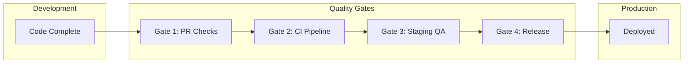

# Quality Gates & QA Processes

## Quality Gate Philosophy

- **Shift left** - Catch issues early in the development cycle
- **Automate everything possible** - Manual checks don't scale
- **Define clear criteria** - No ambiguity about pass/fail
- **Continuous improvement** - Refine gates based on escaped defects

## Quality Gate Stages



## Gate 1: Pull Request Checks

### Automated Checks (Required)

| Check | Tool | Threshold |
|-------|------|-----------|
| Linting | ESLint | 0 errors |
| Type checking | TypeScript/JSDoc | 0 errors |
| Unit tests | Jest | All pass |
| Code coverage | Jest | ≥60% overall, ≥20% per file |
| Security scan | npm audit | 0 high/critical |
| Commit messages | commitlint | Conventional format |

### Manual Checks (Required)

| Check | Reviewer | Criteria |
|-------|----------|----------|
| Code review | Peer | 1+ approval |
| Architecture review | Tech lead | For significant changes |
| Security review | Security team | For auth/data changes |

### PR Quality Criteria

```yaml
# .github/workflows/pr-checks.yml
name: PR Checks

on:
  pull_request:
    branches: [main, develop]

jobs:
  quality-gate-1:
    runs-on: ubuntu-latest
    steps:
      - uses: actions/checkout@v4

      - name: Setup Node.js
        uses: actions/setup-node@v4
        with:
          node-version: '20'
          cache: 'npm'

      - name: Install dependencies
        run: npm ci

      - name: Lint
        run: npm run lint

      - name: Type check
        run: npm run typecheck

      - name: Unit tests with coverage
        run: npm test -- --coverage --coverageReporters=json-summary

      - name: Check coverage thresholds
        run: |
          COVERAGE=$(cat coverage/coverage-summary.json | jq '.total.lines.pct')
          if (( $(echo "$COVERAGE < 60" | bc -l) )); then
            echo "Coverage $COVERAGE% is below 60% threshold"
            exit 1
          fi

      - name: Security audit
        run: npm audit --audit-level=high
```

## Gate 2: CI Pipeline

### Build Verification

| Check | Criteria | Blocking |
|-------|----------|----------|
| Build success | Exit code 0 | Yes |
| No build warnings | 0 warnings | No |
| Bundle size | < defined limit | Yes |
| Build time | < 10 minutes | No |

### Integration Tests

| Check | Criteria | Blocking |
|-------|----------|----------|
| API tests | All pass | Yes |
| Database tests | All pass | Yes |
| External services | Mocked, all pass | Yes |

### Quality Metrics

```yaml
# Quality thresholds in CI
quality:
  coverage:
    minimum: 60
    target: 80
  
  complexity:
    maximum_cyclomatic: 10
    maximum_cognitive: 15
  
  duplication:
    maximum_percentage: 5
  
  bundle_size:
    maximum_kb: 500
    
  build_time:
    maximum_minutes: 10
```

## Gate 3: Staging QA

### Deployment Verification

| Check | Method | Criteria |
|-------|--------|----------|
| Health endpoint | Automated | 200 OK |
| Smoke tests | Automated | All pass |
| Database migrations | Automated | Applied successfully |
| Configuration | Automated | All env vars set |

### Functional Testing

| Test Type | Scope | Criteria |
|-----------|-------|----------|
| Smoke tests | Critical paths | 100% pass |
| Regression tests | Full suite | 100% pass |
| New feature tests | PR scope | 100% pass |

### Non-Functional Testing

| Test Type | Criteria | Tool |
|-----------|----------|------|
| Performance | Response < 500ms (p95) | k6, Artillery |
| Load | Handle 100 concurrent users | k6 |
| Accessibility | WCAG 2.1 AA compliant | axe, Lighthouse |
| Security | No high/critical findings | OWASP ZAP |

### Manual QA Checklist

```markdown
## Staging QA Sign-off

### Functional Testing
- [ ] All acceptance criteria verified
- [ ] Happy path scenarios pass
- [ ] Error scenarios handled correctly
- [ ] Edge cases tested

### UI/UX Testing
- [ ] UI matches designs
- [ ] Responsive design verified (mobile, tablet, desktop)
- [ ] Loading states display correctly
- [ ] Error states display correctly
- [ ] Accessibility verified (keyboard nav, screen reader)

### Integration Testing
- [ ] Third-party integrations working
- [ ] API responses correct
- [ ] Data persistence verified

### Cross-Browser Testing
- [ ] Chrome (latest)
- [ ] Firefox (latest)
- [ ] Safari (latest)
- [ ] Edge (latest)

### Sign-off
- QA Engineer: _____________ Date: _______
- Product Owner: ___________ Date: _______
```

## Gate 4: Release Criteria

### Pre-Release Checklist

```markdown
## Release Checklist: v{version}

### Code Complete
- [ ] All planned features merged
- [ ] All bug fixes merged
- [ ] Feature flags configured

### Testing Complete
- [ ] Unit tests: ___% coverage
- [ ] Integration tests: All pass
- [ ] E2E tests: All pass
- [ ] Performance tests: Within thresholds
- [ ] Security scan: No high/critical

### Documentation
- [ ] Release notes drafted
- [ ] API documentation updated
- [ ] User documentation updated
- [ ] Runbook updated

### Operational Readiness
- [ ] Monitoring alerts configured
- [ ] Rollback plan documented
- [ ] On-call notified
- [ ] Stakeholders notified

### Approvals
- [ ] QA Lead sign-off
- [ ] Tech Lead sign-off
- [ ] Product Owner sign-off

### Release
- [ ] Version tagged in git
- [ ] Release notes published
- [ ] Deployment initiated
```

### Release Criteria Matrix

| Category | Criteria | Required |
|----------|----------|----------|
| Tests | All automated tests pass | Yes |
| Coverage | ≥60% code coverage | Yes |
| Security | No high/critical vulnerabilities | Yes |
| Performance | p95 latency < 500ms | Yes |
| Accessibility | WCAG 2.1 AA compliant | Yes |
| Documentation | Release notes complete | Yes |
| Approvals | All sign-offs obtained | Yes |

## Test Coverage Requirements

### Coverage by Code Type

| Code Type | Minimum | Target |
|-----------|---------|--------|
| Business logic | 80% | 90% |
| API endpoints | 70% | 85% |
| UI components | 60% | 75% |
| Utilities | 80% | 95% |
| Overall | 60% | 80% |

### Coverage Exclusions

```javascript
// jest.config.js
module.exports = {
  collectCoverageFrom: [
    'src/**/*.{js,jsx}',
    '!src/**/*.test.{js,jsx}',
    '!src/**/*.stories.{js,jsx}',
    '!src/index.js',
    '!src/setupTests.js',
    '!src/mocks/**',
  ],
  coverageThreshold: {
    global: {
      branches: 60,
      functions: 60,
      lines: 60,
      statements: 60,
    },
  },
};
```

## Performance Thresholds

### API Response Times

| Endpoint Type | p50 | p95 | p99 |
|--------------|-----|-----|-----|
| Read (GET) | 100ms | 300ms | 500ms |
| Write (POST/PUT) | 200ms | 500ms | 1000ms |
| Search | 200ms | 500ms | 1000ms |
| Report | 500ms | 2000ms | 5000ms |

### Frontend Performance

| Metric | Threshold | Tool |
|--------|-----------|------|
| First Contentful Paint | < 1.8s | Lighthouse |
| Largest Contentful Paint | < 2.5s | Lighthouse |
| Time to Interactive | < 3.8s | Lighthouse |
| Cumulative Layout Shift | < 0.1 | Lighthouse |
| Total Blocking Time | < 300ms | Lighthouse |
| Lighthouse Performance Score | ≥ 90 | Lighthouse |

### Load Testing Criteria

```javascript
// k6 load test thresholds
export const options = {
  thresholds: {
    http_req_duration: ['p(95)<500'], // 95% of requests under 500ms
    http_req_failed: ['rate<0.01'],    // Error rate under 1%
    http_reqs: ['rate>100'],           // At least 100 RPS
  },
  scenarios: {
    load_test: {
      executor: 'ramping-vus',
      startVUs: 0,
      stages: [
        { duration: '2m', target: 50 },   // Ramp up
        { duration: '5m', target: 50 },   // Steady state
        { duration: '2m', target: 100 },  // Peak
        { duration: '2m', target: 0 },    // Ramp down
      ],
    },
  },
};
```

## Accessibility Standards (WCAG 2.1 AA)

### Required Checks

| Criterion | Description | Test Method |
|-----------|-------------|-------------|
| 1.1.1 | Non-text content has alt text | Automated + Manual |
| 1.3.1 | Info and relationships conveyed | Manual |
| 1.4.3 | Contrast ratio ≥ 4.5:1 | Automated |
| 2.1.1 | Keyboard accessible | Manual |
| 2.4.4 | Link purpose clear | Manual |
| 3.1.1 | Page language defined | Automated |
| 4.1.2 | Name, role, value for UI | Automated |

### Automated Accessibility Testing

```javascript
// In Playwright tests
import { test, expect } from '@playwright/test';
import AxeBuilder from '@axe-core/playwright';

test('should have no accessibility violations', async ({ page }) => {
  await page.goto('/');

  const results = await new AxeBuilder({ page })
    .withTags(['wcag2a', 'wcag2aa'])
    .analyze();

  expect(results.violations).toEqual([]);
});
```

## Browser Compatibility

### Supported Browsers

| Browser | Version | Support Level |
|---------|---------|---------------|
| Chrome | Latest 2 | Full |
| Firefox | Latest 2 | Full |
| Safari | Latest 2 | Full |
| Edge | Latest 2 | Full |
| Chrome Mobile | Latest | Full |
| Safari iOS | Latest | Full |

### Browser Testing Matrix

| Feature | Chrome | Firefox | Safari | Edge |
|---------|--------|---------|--------|------|
| Core functionality | Required | Required | Required | Required |
| Progressive features | Required | Required | Graceful degradation | Required |
| Animations | Required | Required | Optional | Required |

## Regression Testing Strategy

### Test Prioritization

| Priority | Scope | Frequency |
|----------|-------|-----------|
| P0 - Critical | Login, checkout, core CRUD | Every PR |
| P1 - High | Major user flows | Every PR |
| P2 - Medium | Secondary features | Daily |
| P3 - Low | Edge cases, rare paths | Weekly |

### Regression Suite Composition

```
Total E2E Tests: 150
├── P0 Critical (30 tests) - Always run
├── P1 High (50 tests) - Run on PR
├── P2 Medium (40 tests) - Daily
└── P3 Low (30 tests) - Weekly
```

### Smoke Test Suite

```javascript
// tests/e2e/smoke.spec.js
test.describe('Smoke Tests', () => {
  test('homepage loads', async ({ page }) => {
    await page.goto('/');
    await expect(page).toHaveTitle(/App Name/);
  });

  test('user can log in', async ({ page }) => {
    await page.goto('/login');
    await page.fill('[name="email"]', 'test@example.com');
    await page.fill('[name="password"]', 'password123');
    await page.click('button[type="submit"]');
    await expect(page).toHaveURL('/dashboard');
  });

  test('API health check', async ({ request }) => {
    const response = await request.get('/api/health');
    expect(response.ok()).toBeTruthy();
  });
});
```

## Defect Management

### Severity Levels

| Severity | Description | Response Time | Resolution |
|----------|-------------|---------------|------------|
| Critical | System down, data loss | 1 hour | 4 hours |
| High | Major feature broken | 4 hours | 1 day |
| Medium | Feature impaired | 1 day | 1 week |
| Low | Minor issue | 1 week | Next sprint |

### Bug Report Template

```markdown
## Bug Report

### Summary
Brief description of the bug.

### Environment
- Browser: Chrome 120
- OS: macOS 14.0
- Environment: Staging
- Version: v1.2.3

### Steps to Reproduce
1. Go to '...'
2. Click on '...'
3. See error

### Expected Behavior
What should happen.

### Actual Behavior
What actually happens.

### Screenshots/Logs
[Attach screenshots or error logs]

### Severity
- [ ] Critical
- [ ] High
- [ ] Medium
- [ ] Low

### Additional Context
Any other relevant information.
```

## Checklist

### QA Engineer Checklist

- [ ] Test plan created and approved
- [ ] Test cases written for new features
- [ ] Automated tests updated
- [ ] Regression suite passing
- [ ] Performance tests executed
- [ ] Accessibility audit completed
- [ ] Cross-browser testing done
- [ ] Sign-off provided

### Release Manager Checklist

- [ ] All quality gates passed
- [ ] Release notes reviewed
- [ ] Rollback plan in place
- [ ] Stakeholders notified
- [ ] Monitoring verified
- [ ] Release executed
- [ ] Post-release verification done
