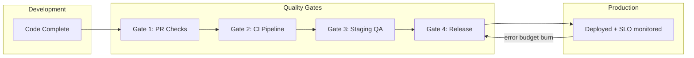

# Quality Gates & QA Processes

## Quality Gate Philosophy

- **Shift left** - Catch issues at the cheapest point in the cycle
- **Automate everything possible** - Manual checks do not scale and drift
- **Define clear criteria** - No ambiguity about pass/fail, no judgement calls in CI
- **Budget, don't block** - Release decisions use SLOs and error budgets, not gut feel
- **Continuous improvement** - Refine gates based on defects that escaped to production

## Quality Gate Stages


```mermaid
flowchart LR
    subgraph dev [Development]
        A[Code Complete]
    end

    subgraph gates [Quality Gates]
        B[Gate 1: PR Checks]
        C[Gate 2: CI Pipeline]
        D[Gate 3: Staging QA]
        E[Gate 4: Release]
    end

    subgraph prod [Production]
        F[Deployed + SLO monitored]
    end

    A --> B --> C --> D --> E --> F
    F -->|error budget burn| E
```

## Gate 1: Pull Request Checks

### Automated Checks (Required)

| Check                      | Tool                                              | Threshold                   |
| -------------------------- | ------------------------------------------------- | --------------------------- |
| Lint                       | ESLint 10 (flat config) or Biome 2                | 0 errors                    |
| Format                     | Prettier 3.9 or Biome 2                           | `--check` clean             |
| Type check                 | `tsc --noEmit` (TypeScript 7)                     | 0 errors                    |
| Unit + component tests     | Vitest 5                                          | All pass                    |
| Coverage                   | Vitest `v8` provider                              | ≥60% overall, ≥20% per file |
| Dependency vulnerabilities | `osv-scanner` (+ `npm audit`)                     | 0 high/critical             |
| Secret scanning            | Gitleaks / GitHub secret scanning push protection | 0 findings                  |
| Lockfile integrity         | `npm ci` succeeds, lockfile unchanged             | Exact match                 |
| Commit messages            | commitlint (Conventional Commits)                 | Conforming                  |

### Manual Checks (Required)

| Check                | Reviewer      | Criteria                                              |
| -------------------- | ------------- | ----------------------------------------------------- |
| Code review          | Peer          | 1+ approval                                           |
| Architecture review  | Tech lead     | For significant or cross-cutting changes              |
| Security review      | Security team | For auth, crypto, data-handling or dependency changes |
| Accessibility review | QA / design   | For any new or restructured UI                        |

### Linting and Type Checking

ESLint 10 is flat-config only (`eslint.config.ts`); `.eslintrc.*` is no longer read.

```typescript
// eslint.config.ts
import js from "@eslint/js";
import tseslint from "typescript-eslint";
import react from "eslint-plugin-react";
import reactHooks from "eslint-plugin-react-hooks";
import jsxA11y from "eslint-plugin-jsx-a11y";

export default tseslint.config(
  { ignores: ["dist/**", "coverage/**", "playwright-report/**"] },
  js.configs.recommended,
  ...tseslint.configs.recommendedTypeChecked,
  {
    languageOptions: { parserOptions: { projectService: true } },
    plugins: { react, "react-hooks": reactHooks, "jsx-a11y": jsxA11y },
    rules: {
      "no-console": ["error", { allow: ["error", "warn"] }],
      "@typescript-eslint/no-floating-promises": "error",
      "react-hooks/rules-of-hooks": "error",
      "react-hooks/exhaustive-deps": "error",
    },
  },
);
```

**TypeScript 7 caveat.** TypeScript 7's native Go compiler makes `tsc --noEmit` 8-12x faster, and
that is what the type-check job should run. But TS 7 has no stable programmatic API until 7.1, so
`typescript-eslint` (and Vue/Svelte/Astro/Angular tooling) cannot drive the native build yet. If you
use type-aware lint rules, keep TypeScript 5.9 installed alongside for the linter and point the
build/type-check job at TypeScript 7:

```jsonc
// package.json
{
  "scripts": {
    "typecheck": "tsc --noEmit", // TS 7: `tsc` IS the native compiler; `tsgo` is only the nightly channel
    "lint": "eslint .", // resolves TS 5.9 for type-aware rules
    "lint:fast": "biome check .", // Biome 2 alternative: lint + format, no type info
    "format": "prettier --check .",
  },
}
```

Biome 2 is the fast alternative to ESLint + Prettier (single binary, one config, seconds instead of
minutes). It does not do type-aware analysis, so if you rely on rules like `no-floating-promises`,
either keep ESLint for a nightly type-aware pass or accept the gap explicitly.

### PR Checks Workflow

```yaml
# .github/workflows/pr-checks.yml
name: PR Checks

on:
  pull_request:
    branches: [main, develop]

# Least privilege at the top; individual jobs widen only if they must.
permissions:
  contents: read

concurrency:
  group: pr-${{ github.event.pull_request.number }}
  cancel-in-progress: true

jobs:
  quality-gate-1:
    name: Gate 1 - PR quality
    runs-on: ubuntu-latest
    timeout-minutes: 20
    steps:
      - uses: actions/checkout@08c6903cd8c0fde910a37f88322edcfb5dd907a8 # v5.0.0
        with:
          fetch-depth: 0

      - uses: actions/setup-node@a0853c24544627f65ddf259abe73b1d18a591444 # v5.0.0
        with:
          node-version: "24"
          cache: "npm"

      # --ignore-scripts blocks malicious postinstall (OWASP A03, supply chain).
      - name: Install dependencies
        run: npm ci --ignore-scripts

      - name: Lint
        run: npm run lint

      - name: Format check
        run: npm run format

      - name: Type check
        run: npm run typecheck

      - name: Unit and component tests
        run: >-
          npx vitest run --coverage
          --reporter=default --reporter=junit
          --outputFile=./test-results/junit.xml

      - name: Enforce coverage thresholds
        run: |
          COVERAGE=$(jq '.total.lines.pct' coverage/coverage-summary.json)
          echo "Line coverage: ${COVERAGE}%"
          awk -v c="$COVERAGE" 'BEGIN { exit (c < 60) }' \
            || { echo "::error::Coverage ${COVERAGE}% is below the 60% threshold"; exit 1; }

      - name: Vulnerability scan (OSV)
        uses: google/osv-scanner-action@f9f37b9a1f2a1a83a2b7fa0b7b1cbbd3a6f8d8f6 # v2.0.2
        with:
          scan-args: |-
            --lockfile=package-lock.json
            --fail-on-vuln

      - name: npm audit
        run: npm audit --audit-level=high

      - name: Secret scan
        uses: gitleaks/gitleaks-action@44c470ffc35caa8b1eb3e8012ca53c2f9bea4eb5 # v2.3.9
        env:
          GITHUB_TOKEN: ${{ secrets.GITHUB_TOKEN }}
```

Every action is pinned to a full commit SHA with the version in a trailing comment. Tags are
mutable - the tj-actions compromise (CVE-2025-30066) moved a tag to a malicious commit. Dependabot
keeps the SHAs fresh.

### PR Quality Criteria

| Criterion        | Requirement                                                         |
| ---------------- | ------------------------------------------------------------------- |
| Size             | < 500 lines changed; split beyond 1000                              |
| Scope            | One logical change per PR                                           |
| Tests            | New behaviour has tests at the lowest layer that can catch its bugs |
| Docs             | Public API, env vars and runbook changes documented                 |
| Migrations       | Forward-only, expand/contract, reviewed separately from app code    |
| Breaking changes | Called out in the description with a migration note                 |

## Gate 2: CI Pipeline

### Build Verification

| Check               | Criteria                                     | Blocking |
| ------------------- | -------------------------------------------- | -------- |
| Build success       | Exit code 0                                  | Yes      |
| Build warnings      | 0 warnings                                   | No       |
| Bundle size         | Within budget (below)                        | Yes      |
| Docker image builds | Multi-stage build succeeds, runs as non-root | Yes      |
| Build time          | < 10 minutes                                 | No       |

### Integration Tests

| Check                                                           | Criteria                     | Blocking |
| --------------------------------------------------------------- | ---------------------------- | -------- |
| API tests (Supertest / `fetch`)                                 | All pass                     | Yes      |
| Database tests (real PostgreSQL 18 via Testcontainers)          | All pass                     | Yes      |
| Migration applied to a production-shaped dataset                | Succeeds within lock budget  | Yes      |
| Rollback path exercised (expand/contract, not a down migration) | Verified                     | Yes      |
| External services                                               | Mocked with MSW 2, all pass  | Yes      |
| Contract tests                                                  | Consumer/provider pacts pass | Yes      |

### Quality Thresholds

```yaml
# Thresholds enforced in CI
quality:
  coverage:
    minimum: 60 # overall lines
    per_file_minimum: 20
    target: 80

  complexity:
    maximum_cyclomatic: 10
    maximum_cognitive: 15

  duplication:
    maximum_percentage: 5

  bundle_size:
    initial_js_kb: 250 # gzipped, first load
    total_js_kb: 500
    css_kb: 60

  build_time:
    maximum_minutes: 10

  dependencies:
    max_high_severity: 0
    max_critical_severity: 0
    max_direct_deps_outdated_major: 5
```

### Supply Chain Artifacts

Produced in CI, verified at Gate 4:

| Artifact                 | Tool                              | Purpose                                                |
| ------------------------ | --------------------------------- | ------------------------------------------------------ |
| SBOM (CycloneDX or SPDX) | `syft` / `npm sbom`               | Inventory for vulnerability response                   |
| Build provenance         | `actions/attest-build-provenance` | SLSA attestation binding artifact to source + workflow |
| Image signature          | Sigstore/cosign keyless           | Verifiable publisher identity                          |
| Package provenance       | `npm publish --provenance`        | Published packages traceable to a build                |

```yaml
build-and-attest:
  name: Build, SBOM and provenance
  runs-on: ubuntu-latest
  needs: [quality-gate-1]
  permissions:
    contents: read
    id-token: write # OIDC for keyless signing and attestation
    packages: write
    attestations: write
  steps:
    - uses: actions/checkout@08c6903cd8c0fde910a37f88322edcfb5dd907a8 # v5.0.0

    - uses: docker/setup-buildx-action@e468171a9de216ec08956ac3ada2f0791b6bd435 # v3.11.1

    - name: Build and push image
      id: build
      uses: docker/build-push-action@263435318d21b8e681c14492fe198d362a7d2c83 # v6.18.0
      with:
        context: .
        push: true
        tags: ghcr.io/${{ github.repository }}:${{ github.sha }}
        provenance: mode=max
        sbom: true
        cache-from: type=gha
        cache-to: type=gha,mode=max

    - name: Attest build provenance
      uses: actions/attest-build-provenance@977bb373b6b3a2a6f7b1f0f0e1e6a9b4e60d6f0e # v3.0.0
      with:
        subject-name: ghcr.io/${{ github.repository }}
        subject-digest: ${{ steps.build.outputs.digest }}
        push-to-registry: true
```

Cloud deploys authenticate via **OIDC** with the trust policy restricted to the exact repository,
branch and workflow file. No long-lived cloud credentials in secrets.

## Gate 3: Staging QA

### Deployment Verification

| Check               | Method                            | Criteria                              |
| ------------------- | --------------------------------- | ------------------------------------- |
| Liveness            | `GET /health`                     | 200 OK                                |
| Readiness           | `GET /health/ready`               | 200 OK, all dependency checks `ok`    |
| Smoke tests         | Playwright `--grep @smoke`        | 100% pass                             |
| Database migrations | Applied, `lock_timeout` respected | No long locks, no failures            |
| Configuration       | Startup env validation (Zod)      | All required vars present             |
| Traces flowing      | OpenTelemetry collector           | Spans visible for a synthetic request |

### Functional Testing

| Test Type          | Scope               | Criteria                            |
| ------------------ | ------------------- | ----------------------------------- |
| Smoke (`@p0`)      | Critical paths      | 100% pass                           |
| Regression (`@p1`) | Major user flows    | 100% pass                           |
| New feature tests  | PR scope            | 100% pass                           |
| Exploratory        | New/changed surface | Timeboxed session, findings triaged |

### Non-Functional Testing

| Test Type       | Criteria                                         | Tool                               |
| --------------- | ------------------------------------------------ | ---------------------------------- |
| API performance | p95 < 500ms (see table below)                    | k6                                 |
| Load            | 100 concurrent VUs, error rate < 1%              | k6                                 |
| Frontend vitals | INP ≤ 200ms, LCP ≤ 2.5s, CLS ≤ 0.1               | Lighthouse CI                      |
| Accessibility   | WCAG 2.2 AA, 0 axe violations                    | `@axe-core/playwright`, Lighthouse |
| Security (DAST) | 0 high/critical findings                         | OWASP ZAP baseline scan            |
| Headers         | CSP, HSTS, COOP/CORP, Permissions-Policy present | securityheaders / custom check     |

### Manual QA Checklist

```markdown
## Staging QA Sign-off

### Functional

- [ ] All acceptance criteria verified
- [ ] Happy path scenarios pass
- [ ] Error scenarios handled correctly (network failure, 4xx, 5xx, timeout)
- [ ] Edge cases tested (empty, maximum, boundary, concurrent)
- [ ] Idempotency verified for retried unsafe operations

### UI/UX

- [ ] UI matches designs
- [ ] Responsive at 360px, 768px, 1280px, 1920px
- [ ] Loading, empty and error states all render
- [ ] Dark mode verified
- [ ] Reduced-motion preference respected

### Accessibility (WCAG 2.2 AA - manual portion)

- [ ] Keyboard-only operation of the whole flow
- [ ] Visible focus indicator, never obscured by sticky UI (2.4.11)
- [ ] Any drag interaction has a single-pointer alternative (2.5.7)
- [ ] Interactive targets at least 24x24 CSS px or adequately spaced (2.5.8)
- [ ] Help mechanisms appear in a consistent place (3.2.6)
- [ ] No cognitive-function test required to authenticate; paste into password fields allowed (3.3.8)
- [ ] Screen reader announces headings, landmarks and live regions correctly

### Integration

- [ ] Third-party integrations working
- [ ] API responses match the OpenAPI 3.1 contract
- [ ] Data persistence verified after restart

### Cross-Browser

- [ ] Chrome (latest 2)
- [ ] Firefox (latest 2)
- [ ] Safari (latest 2)
- [ ] Edge (latest 2)
- [ ] Mobile Safari / Chrome Android

### Sign-off

- QA Engineer: _____________ Date: _______
- Product Owner: ___________ Date: _______
```

## Gate 4: Release Criteria

### SLOs and Error Budget

Releases are gated on the error budget, not on a feeling that things look fine.

| SLO                                    | Target (30-day window) | Monthly error budget |
| -------------------------------------- | ---------------------- | -------------------- |
| API availability (non-5xx / total)     | 99.9%                  | 43m 12s              |
| API latency (p95 < 500ms)              | 99% of requests        | 1% of requests       |
| Checkout success rate                  | 99.5%                  | 0.5% of attempts     |
| Frontend INP ≤ 200ms (p75, field data) | 90% of sessions        | 10% of sessions      |

**Error budget policy:**

| Budget remaining | Release policy                                                         |
| ---------------- | ---------------------------------------------------------------------- |
| > 50%            | Normal velocity; ship features freely                                  |
| 25-50%           | Ship features; require canary + automated rollback                     |
| 10-25%           | Reliability work prioritized; only low-risk or fix-forward releases    |
| < 10%            | Feature freeze. Only fixes that reduce burn, until the budget recovers |
| Exhausted        | Incident review required before the next feature release               |

Alerting is **burn-rate based** (fast burn: 14.4x over 1h; slow burn: 6x over 6h), not raw
thresholds. A canary deploy that burns budget faster than the fast-burn threshold rolls back
automatically.

### Pre-Release Checklist

```markdown
## Release Checklist: v{version}

### Code Complete

- [ ] All planned features merged
- [ ] All blocking bug fixes merged
- [ ] Feature flags configured with a documented default and kill switch

### Testing Complete

- [ ] Unit + component coverage: ___% (≥60% overall, ≥20% per file)
- [ ] Integration tests against real PostgreSQL: all pass
- [ ] E2E (`@p0` + `@p1`): all pass, 0 quarantined tests in the critical path
- [ ] Performance: within thresholds
- [ ] Accessibility: WCAG 2.2 AA, 0 axe violations
- [ ] Security: 0 high/critical (`osv-scanner`, `npm audit`, ZAP)

### Supply Chain

- [ ] SBOM generated and archived for this version
- [ ] Build provenance attestation published and verifiable
- [ ] Container image signed (cosign keyless)
- [ ] Lockfile committed; build used `npm ci --ignore-scripts`
- [ ] No new direct dependency added without review

### Reliability

- [ ] Error budget ≥ 25% remaining (or an explicit, recorded exception)
- [ ] SLO dashboards and burn-rate alerts live for new endpoints
- [ ] Rollback plan documented and tested
- [ ] Migrations are backward-compatible with the previous app version

### Documentation

- [ ] Release notes drafted
- [ ] OpenAPI 3.1 spec regenerated and published
- [ ] User documentation updated
- [ ] Runbook updated for new failure modes

### Operational Readiness

- [ ] Monitoring alerts configured
- [ ] On-call notified
- [ ] Stakeholders notified

### Approvals

- [ ] QA Lead sign-off
- [ ] Tech Lead sign-off
- [ ] Product Owner sign-off

### Release

- [ ] Version tagged in git
- [ ] Release notes published
- [ ] Canary deploy started, burn rate watched for one bake period
```

### Release Criteria Matrix

| Category      | Criteria                                            | Required |
| ------------- | --------------------------------------------------- | -------- |
| Tests         | All automated tests pass                            | Yes      |
| Coverage      | ≥60% overall, ≥20% per file                         | Yes      |
| Types         | `tsc --noEmit` clean                                | Yes      |
| Security      | 0 high/critical vulnerabilities, 0 secret findings  | Yes      |
| Supply chain  | SBOM + provenance attestation published             | Yes      |
| Performance   | API p95 < 500ms; INP ≤ 200ms, LCP ≤ 2.5s, CLS ≤ 0.1 | Yes      |
| Accessibility | WCAG 2.2 AA compliant                               | Yes      |
| Reliability   | Error budget ≥ 25% or recorded exception            | Yes      |
| Flakiness     | Critical-path flake rate < 1%                       | Yes      |
| Documentation | Release notes + API spec complete                   | Yes      |
| Approvals     | All sign-offs obtained                              | Yes      |

## Test Coverage Requirements

### Coverage by Code Type

| Code Type                 | Minimum | Target |
| ------------------------- | ------- | ------ |
| Business logic / services | 80%     | 90%    |
| API routes and middleware | 70%     | 85%    |
| UI components             | 60%     | 75%    |
| Utilities                 | 80%     | 95%    |
| Overall                   | 60%     | 80%    |

### Coverage Configuration

```typescript
// vitest.config.ts (coverage section)
export default defineConfig({
  test: {
    coverage: {
      provider: "v8",
      reporter: ["text", "json-summary", "lcov"],
      include: ["src/**/*.{ts,tsx}"],
      exclude: [
        "src/**/*.test.{ts,tsx}",
        "src/**/*.stories.tsx",
        "src/**/index.ts",
        "src/test/**",
        "src/mocks/**",
      ],
      thresholds: {
        lines: 60,
        functions: 60,
        branches: 60,
        statements: 60,
        "**/src/**/*.{ts,tsx}": {
          lines: 20,
          functions: 20,
          branches: 20,
          statements: 20,
        },
      },
    },
  },
});
```

Coverage is a floor. Reviewers reject tests that exist only to raise the number - assertion-free
tests, snapshot dumps of rendered trees, or tests that mock the unit under test.

## Performance Thresholds

### API Response Times

| Endpoint Type          | p50   | p95    | p99    |
| ---------------------- | ----- | ------ | ------ |
| Read (GET)             | 100ms | 300ms  | 500ms  |
| Write (POST/PUT/PATCH) | 200ms | 500ms  | 1000ms |
| Search                 | 200ms | 500ms  | 1000ms |
| Report / export        | 500ms | 2000ms | 5000ms |

### Frontend Performance (Core Web Vitals)

**INP replaced FID** as the responsiveness metric. FID is retired - do not report it.

| Metric                                       | Good    | Needs improvement | Poor    |
| -------------------------------------------- | ------- | ----------------- | ------- |
| **INP** (Interaction to Next Paint)          | ≤ 200ms | 200-500ms         | > 500ms |
| **LCP** (Largest Contentful Paint)           | ≤ 2.5s  | 2.5-4.0s          | > 4.0s  |
| **CLS** (Cumulative Layout Shift)            | ≤ 0.1   | 0.1-0.25          | > 0.25  |
| FCP (First Contentful Paint)                 | ≤ 1.8s  | 1.8-3.0s          | > 3.0s  |
| TTFB                                         | ≤ 800ms | 0.8-1.8s          | > 1.8s  |
| TBT (lab stand-in; INP itself is field-only) | ≤ 200ms | 200-600ms         | > 600ms |
| Lighthouse Performance score                 | ≥ 90    | -                 | -       |

Lab metrics (Lighthouse CI) gate the pipeline; **field metrics (RUM, p75 across real sessions) are
the SLO**. A green lab score with a poor field p75 means the lab profile is wrong, not that the
site is fast.

```javascript
// lighthouserc.js
export default {
  ci: {
    collect: {
      url: [
        "http://localhost:3000/",
        "http://localhost:3000/login",
        "http://localhost:3000/users",
      ],
      numberOfRuns: 3,
      settings: { preset: "desktop" },
    },
    assert: {
      assertions: {
        "categories:performance": ["error", { minScore: 0.9 }],
        "categories:accessibility": ["error", { minScore: 1 }],
        "largest-contentful-paint": ["error", { maxNumericValue: 2500 }],
        "cumulative-layout-shift": ["error", { maxNumericValue: 0.1 }],
        // TBT is the lab stand-in: a Lighthouse navigation run cannot measure
        // INP, which needs real interactions. Gate INP on field data (RUM/CrUX).
        "total-blocking-time": ["error", { maxNumericValue: 200 }],
        "resource-summary:script:size": ["error", { maxNumericValue: 256_000 }],
      },
    },
    upload: { target: "temporary-public-storage" },
  },
};
```

### Load Testing Criteria

```javascript
// tests/load/api.js - k6
import http from "k6/http";
import { check } from "k6";

export const options = {
  thresholds: {
    // Abort early rather than burning CI minutes on a clearly failing build.
    http_req_duration: [
      { threshold: "p(95)<500", abortOnFail: true, delayAbortEval: "30s" },
    ],
    "http_req_duration{endpoint:write}": ["p(95)<1000"],
    http_req_failed: ["rate<0.01"],
    checks: ["rate>0.99"],
  },
  scenarios: {
    steady_load: {
      executor: "ramping-vus",
      startVUs: 0,
      stages: [
        { duration: "2m", target: 50 },
        { duration: "5m", target: 50 },
        { duration: "2m", target: 100 },
        { duration: "2m", target: 0 },
      ],
      tags: { scenario: "steady" },
    },
    spike: {
      executor: "ramping-arrival-rate",
      startRate: 10,
      timeUnit: "1s",
      preAllocatedVUs: 100,
      stages: [
        { duration: "30s", target: 10 },
        { duration: "30s", target: 300 },
        { duration: "1m", target: 10 },
      ],
      startTime: "11m",
      tags: { scenario: "spike" },
    },
  },
};

const BASE = __ENV.BASE_URL;
const TOKEN = __ENV.API_TOKEN;

export default function () {
  const res = http.get(`${BASE}/api/users?limit=20`, {
    headers: { Authorization: `Bearer ${TOKEN}` },
    tags: { endpoint: "read" },
  });

  check(res, {
    "status is 200": (r) => r.status === 200,
    "returns a data array": (r) => Array.isArray(r.json("data")),
    "no server errors": (r) => r.status < 500,
  });
}
```

Run load tests against staging with production-shaped data volume. A load test on an empty database
measures the connection pool, not the queries.

## Accessibility Standards (WCAG 2.2 AA)

WCAG 2.2 AA is the target. 2.1 AA is the older baseline - meeting it is no longer sufficient.

### New in WCAG 2.2 (must be checked explicitly)

| Criterion                                 | Requirement                                                                                                     | Test Method                            |
| ----------------------------------------- | --------------------------------------------------------------------------------------------------------------- | -------------------------------------- |
| 2.4.11 Focus Not Obscured (Minimum)       | The focused element is not entirely hidden by sticky headers, footers or cookie banners                         | Manual + Playwright bounding-box check |
| 2.5.7 Dragging Movements                  | Every drag interaction has a single-pointer alternative (buttons, menu action)                                  | Manual                                 |
| 2.5.8 Target Size (Minimum)               | Interactive targets ≥ 24x24 CSS px, or adequately spaced                                                        | Automated (Playwright) + axe           |
| 3.2.6 Consistent Help                     | Help mechanisms appear in the same relative order on every page                                                 | Manual                                 |
| 3.3.7 Redundant Entry                     | Previously entered information is auto-populated or selectable                                                  | Manual                                 |
| 3.3.8 Accessible Authentication (Minimum) | No cognitive-function test (puzzle, memorization, transcription) without an alternative; password paste allowed | Manual                                 |

4.1.1 Parsing was removed in 2.2 - stop reporting it.

### Carried-Over Core Criteria

| Criterion | Description                                       | Test Method        |
| --------- | ------------------------------------------------- | ------------------ |
| 1.1.1     | Non-text content has alt text                     | Automated + manual |
| 1.3.1     | Info and relationships conveyed programmatically  | Manual             |
| 1.4.3     | Contrast ratio ≥ 4.5:1 (3:1 for large text)       | Automated          |
| 1.4.11    | Non-text contrast ≥ 3:1 (UI components, graphics) | Automated          |
| 2.1.1     | Fully keyboard accessible, no traps               | Manual             |
| 2.4.4     | Link purpose clear from its text or context       | Manual             |
| 3.1.1     | Page language defined                             | Automated          |
| 4.1.2     | Name, role, value exposed for all UI components   | Automated          |

### Automated Accessibility Testing

```typescript
// tests/e2e/a11y.spec.ts
import { test, expect } from "@playwright/test";
import AxeBuilder from "@axe-core/playwright";

test("has no WCAG 2.2 AA violations", async ({ page }) => {
  await page.goto("/");

  const results = await new AxeBuilder({ page })
    .withTags(["wcag2a", "wcag2aa", "wcag21a", "wcag21aa", "wcag22aa"])
    .analyze();

  expect(results.violations).toEqual([]);
});
```

Automated tooling detects roughly a third of WCAG issues. The manual checklist in Gate 3 covers the
rest; a green axe run is not an accessibility sign-off.

## Browser Compatibility

MUI v9 raised the browser baseline. Anything below it is unsupported, not "degraded".

| Browser        | Minimum                | Support Level |
| -------------- | ---------------------- | ------------- |
| Chrome         | 117+ (latest 2 tested) | Full          |
| Edge           | 121+ (latest 2 tested) | Full          |
| Firefox        | 121+ (latest 2 tested) | Full          |
| Safari         | 17+ (latest 2 tested)  | Full          |
| Chrome Android | Latest                 | Full          |
| Safari iOS     | 17+                    | Full          |

### Browser Testing Matrix

| Feature                    | Chrome   | Firefox  | Safari   | Edge     |
| -------------------------- | -------- | -------- | -------- | -------- |
| Core functionality         | Required | Required | Required | Required |
| Visual regression baseline | Required | Optional | Optional | Optional |
| Accessibility scan         | Required | Optional | Optional | Optional |
| Animations                 | Required | Required | Optional | Required |

## Regression Testing Strategy

### Test Prioritization

| Priority      | Tag            | Scope                      | Frequency              |
| ------------- | -------------- | -------------------------- | ---------------------- |
| P0 - Critical | `@p0` `@smoke` | Login, checkout, core CRUD | Every PR + post-deploy |
| P1 - High     | `@p1`          | Major user flows           | Every PR               |
| P2 - Medium   | `@p2`          | Secondary features         | Nightly                |
| P3 - Low      | `@p3` `@slow`  | Edge cases, rare paths     | Weekly                 |

```
Total E2E tests: 150
├── P0 (30)  - every PR, sharded, also run against production after deploy
├── P1 (50)  - every PR
├── P2 (40)  - nightly
└── P3 (30)  - weekly
```

```bash
npx playwright test --grep "@p0|@p1" --shard=1/4
npx playwright test --grep "@smoke" --project=chromium   # post-deploy verification
```

## Flaky Test Policy

A flaky test is worse than no test: it trains the team to ignore red builds.

**Definition.** A test that produces different results on the same commit. CI tracks per-test pass
rate over the last 50 runs on `main`.

| Flake rate (50 runs) | Action                                              |
| -------------------- | --------------------------------------------------- |
| 0%                   | Healthy                                             |
| < 1%                 | Logged, watched                                     |
| 1-5%                 | Issue opened, owner assigned, fix within one sprint |
| > 5%                 | Quarantined within 24 hours                         |

**Process:**

1. **Detect** - CI records retries. Any test that passes only on retry is reported automatically.
2. **Quarantine** - Move it out of the blocking suite with `test.fixme()` (Playwright) or
   `it.skip` plus a linked issue. Never delete it silently, never add a blanket retry to hide it.
3. **Own** - The quarantining PR assigns an owner and a due date. No owner means no quarantine -
   fix it now instead.
4. **Fix the cause, not the symptom** - The common causes are: a fixed `waitForTimeout`, shared
   mutable state between tests, real time or timezone dependence, unseeded random data, an
   unmocked third party, and test-order coupling. Increasing the timeout fixes none of them.
5. **Restore** - A quarantined test returns to the blocking suite only after 20 consecutive green
   runs.

**Hard rules:**

- `retries: 2` in CI exists to keep infrastructure blips from blocking merges, not to make flaky
  tests pass. A retry-pass is a defect report.
- Nothing quarantined may sit on a P0 path. If a critical-path test is unreliable, the release is
  blocked until it is fixed.
- Quarantine budget: at most 2% of the suite. Above that, stop feature work and fix the suite.
- `test.only` / `it.only` committed to the repo fails the build (`forbidOnly` in CI).

## Defect Management

### Severity Levels

| Severity | Description                             | Response Time | Resolution  |
| -------- | --------------------------------------- | ------------- | ----------- |
| Critical | System down, data loss, security breach | 1 hour        | 4 hours     |
| High     | Major feature broken, no workaround     | 4 hours       | 1 day       |
| Medium   | Feature impaired, workaround exists     | 1 day         | 1 week      |
| Low      | Minor issue, cosmetic                   | 1 week        | Next sprint |

### Bug Report Template

```markdown
## Bug Report

### Summary

Brief description of the bug.

### Environment

- Browser: Chrome 140
- OS: macOS 26
- Environment: Staging
- Version / commit: v1.2.3 (abc1234)
- Trace ID: (from the response header or console)

### Steps to Reproduce

1. Go to '...'
2. Click on '...'
3. See error

### Expected Behavior

What should happen.

### Actual Behavior

What actually happens.

### Screenshots / Logs / Trace

[Attach screenshots, the Playwright trace, or the OpenTelemetry trace link]

### Severity

- [ ] Critical
- [ ] High
- [ ] Medium
- [ ] Low

### Impact

- Users affected: ___
- Error budget impact: ___

### Additional Context

Any other relevant information.
```

## Checklist

### QA Engineer Checklist

- [ ] Test plan created and approved
- [ ] Test cases written for new features and tagged by priority
- [ ] Automated tests updated (unit, integration, E2E)
- [ ] Regression suite passing, no new quarantines on P0 paths
- [ ] Performance tests executed against production-shaped data
- [ ] Accessibility audit completed against WCAG 2.2 AA (automated + manual)
- [ ] Cross-browser testing done at the MUI v9 baseline
- [ ] Flaky tests triaged and owned
- [ ] Sign-off provided

### Release Manager Checklist

- [ ] All four quality gates passed
- [ ] Error budget checked against the release policy
- [ ] SBOM and provenance attestation published and verified
- [ ] Release notes reviewed
- [ ] Rollback plan in place and tested
- [ ] Stakeholders notified
- [ ] Monitoring and burn-rate alerts verified
- [ ] Canary deployed and baked before full rollout
- [ ] Post-release verification (`@smoke` against production) done
