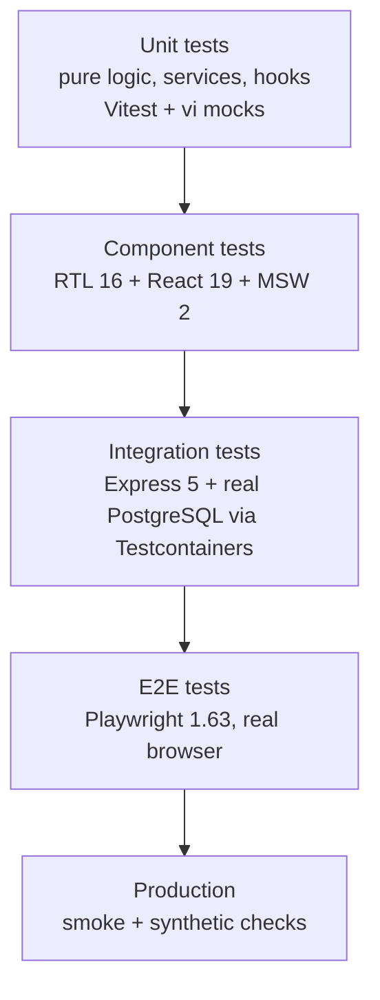
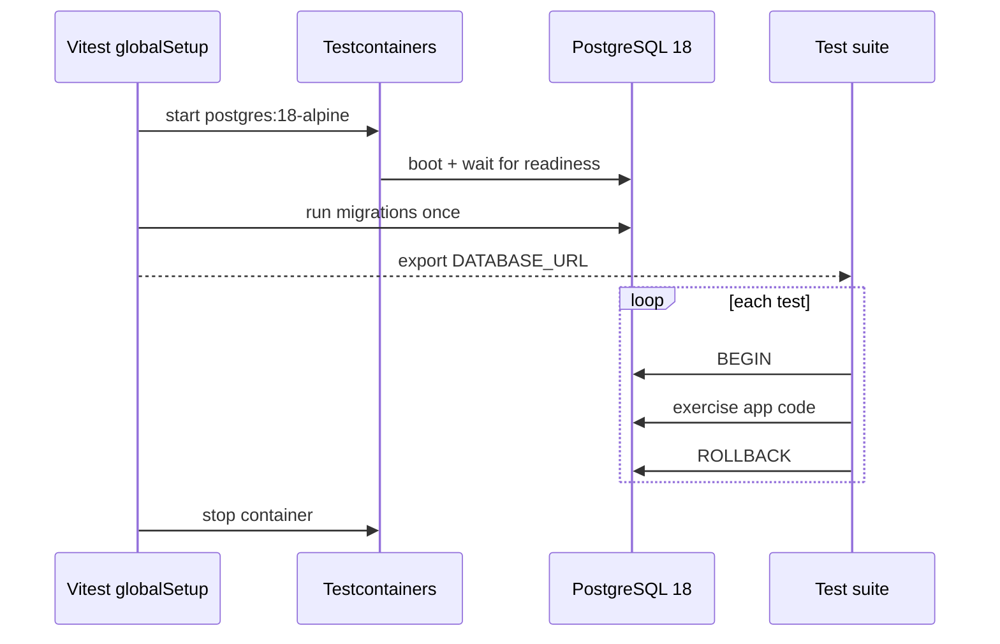

# Testing Guidelines

## Testing Philosophy

- **Test behavior, not implementation** - Tests verify what code does, not how it does it
- **Given-When-Then structure** - Clear, scannable test organization
- **Independent tests** - Each test runs in isolation, in any order, in parallel
- **Fast feedback** - Unit tests run in milliseconds; push slow work to fewer, higher-value tests
- **Real dependencies where it counts** - Mock the network (MSW), not the database (Testcontainers)

## Toolchain

| Concern                             | Tool                    | Version     |
| ----------------------------------- | ----------------------- | ----------- |
| Runner (unit + integration)         | Vitest                  | 5.0         |
| Zero-dependency backend alternative | `node:test`             | Node 24 LTS |
| Coverage                            | Vitest `v8` provider    | -           |
| Component testing                   | Testing Library (React) | 16.3        |
| Network mocking                     | MSW                     | 2.x         |
| Real database in tests              | Testcontainers          | -           |
| HTTP assertions                     | Supertest (or `fetch`)  | -           |
| E2E                                 | Playwright              | 1.63        |
| Accessibility                       | `@axe-core/playwright`  | WCAG 2.2 AA |

All examples are TypeScript. For a JavaScript (ESM + JSDoc) project, drop the type annotations and
name files `.test.js`; everything else is identical.

## Test Layers



Rule of thumb: many unit tests, a solid layer of component and integration tests, a small
high-signal E2E suite. Every bug fix gets a regression test at the lowest layer that can catch it.

## Vitest Configuration

```typescript
// vitest.config.ts
import { defineConfig } from "vitest/config";
import react from "@vitejs/plugin-react";

export default defineConfig({
  plugins: [react()],
  test: {
    // Vitest 5 "projects" replaces the old `workspace` file.
    projects: [
      {
        extends: true,
        test: {
          name: "unit",
          include: ["src/**/*.test.ts"],
          environment: "node",
        },
      },
      {
        extends: true,
        test: {
          name: "dom",
          include: ["src/**/*.test.tsx"],
          environment: "jsdom",
          setupFiles: ["./src/test/setup.ts"],
        },
      },
      {
        extends: true,
        test: {
          name: "integration",
          include: ["tests/integration/**/*.test.ts"],
          environment: "node",
          // Containers are expensive: no file-level parallelism, longer timeouts.
          fileParallelism: false,
          testTimeout: 60_000,
          hookTimeout: 120_000,
          globalSetup: ["./tests/integration/global-setup.ts"],
        },
      },
    ],
    coverage: {
      provider: "v8",
      reporter: ["text", "json-summary", "lcov"],
      reportsDirectory: "./coverage",
      include: ["src/**/*.{ts,tsx}"],
      exclude: [
        "src/**/*.test.{ts,tsx}",
        "src/**/*.stories.tsx",
        "src/**/index.ts",
        "src/test/**",
        "src/mocks/**",
      ],
      thresholds: {
        lines: 60,
        functions: 60,
        branches: 60,
        statements: 60,
        // Global thresholds apply to the project as a whole; the glob entry below adds
        // the 20% per-file floor, so one large untested file cannot hide behind a good
        // global number.
        perFile: false,
        "**/src/**/*.{ts,tsx}": {
          lines: 20,
          functions: 20,
          branches: 20,
          statements: 20,
        },
      },
    },
  },
});
```

```typescript
// src/test/setup.ts
import "@testing-library/jest-dom/vitest";
import { cleanup } from "@testing-library/react";
import { afterEach, afterAll, beforeAll } from "vitest";
import { server } from "../mocks/server";

beforeAll(() => server.listen({ onUnhandledRequest: "error" }));
afterEach(() => {
  server.resetHandlers();
  cleanup();
});
afterAll(() => server.close());
```

### Coverage Requirements

| Scope           | Minimum |
| --------------- | ------- |
| Overall project | 60%     |
| Per file        | 20%     |

Coverage is a floor, not a goal. A file at 95% with assertion-free tests is worse than one at 65%
with meaningful ones. Never write a test purely to move the number.

### Running Tests

| Command                           | Purpose                           |
| --------------------------------- | --------------------------------- |
| `npx vitest`                      | Watch mode, all projects          |
| `npx vitest run`                  | Single run (CI)                   |
| `npx vitest run --project=unit`   | One project only                  |
| `npx vitest run --coverage`       | Coverage report + threshold check |
| `npx vitest run --reporter=junit` | JUnit XML for CI annotations      |
| `npx playwright test`             | E2E suite                         |

### Migrating from Jest

| Jest                          | Vitest 5                                                             |
| ----------------------------- | -------------------------------------------------------------------- |
| `jest.fn()`                   | `vi.fn()`                                                            |
| `jest.mock('./mod')`          | `vi.mock('./mod')`                                                   |
| `jest.spyOn(obj, 'm')`        | `vi.spyOn(obj, 'm')`                                                 |
| `jest.requireActual('./mod')` | `await vi.importActual('./mod')`                                     |
| `jest.useFakeTimers()`        | `vi.useFakeTimers()`                                                 |
| `jest.advanceTimersByTime(n)` | `vi.advanceTimersByTime(n)`                                          |
| `jest.clearAllMocks()`        | `vi.clearAllMocks()`                                                 |
| `jest.config.js`              | `vitest.config.ts`                                                   |
| `testEnvironment: 'jsdom'`    | `environment: 'jsdom'`                                               |
| globals by default            | `import { describe, it, expect } from 'vitest'` (or `globals: true`) |

Import test APIs explicitly rather than enabling `globals: true` - it keeps editor go-to-definition
working and makes the runner obvious in every file.

## Test Structure (Given-When-Then)

```typescript
// src/services/user.service.test.ts
import { describe, it, expect, beforeEach, vi } from "vitest";
import { userService } from "./user.service";
import { ConflictError, ValidationError } from "../utils/errors";

describe("UserService", () => {
  describe("createUser", () => {
    it("should create a user with valid data", async () => {
      // Given - preconditions
      const input = {
        email: "john@example.com",
        password: "Password123",
        name: "John Doe",
      };

      // When - the action under test
      const user = await userService.createUser(input);

      // Then - observable outcome
      expect(user).toMatchObject({
        email: "john@example.com",
        name: "John Doe",
      });
      expect(user.id).toBeDefined();
      expect(user).not.toHaveProperty("passwordHash");
    });

    it("should reject an invalid email", async () => {
      // Given
      const input = { email: "invalid", password: "Password123", name: "J D" };

      // When / Then
      await expect(userService.createUser(input)).rejects.toThrow(
        ValidationError,
      );
    });

    it("should reject a duplicate email", async () => {
      // Given
      const input = {
        email: "taken@example.com",
        password: "Password123",
        name: "J D",
      };
      await userService.createUser(input);

      // When / Then
      await expect(userService.createUser(input)).rejects.toThrow(
        ConflictError,
      );
    });
  });
});
```

Keep the three blocks visually separated. If "Given" needs more than ~10 lines, extract a factory.

## Unit Testing

### Pure Functions

```typescript
// src/utils/format.ts
/** Formats a numeric amount as a localized currency string. */
export function formatCurrency(amount: number, currency = "USD"): string {
  return new Intl.NumberFormat("en-US", { style: "currency", currency }).format(
    amount,
  );
}
```

```typescript
// src/utils/format.test.ts
import { describe, it, expect } from "vitest";
import { formatCurrency } from "./format";

describe("formatCurrency", () => {
  it.each([
    [1234.56, "USD", "$1,234.56"],
    [1234.56, "EUR", "€1,234.56"],
    [0, "USD", "$0.00"],
    [-50, "USD", "-$50.00"],
  ])("formats %d as %s -> %s", (amount, currency, expected) => {
    expect(formatCurrency(amount, currency)).toBe(expected);
  });
});
```

`it.each` is the right tool for table-driven cases; a `for` loop inside one `it` is not - a failure
must name the case that broke.

### Services With Dependencies

Prefer dependency injection over module mocking. Injected fakes are typed, refactor-safe, and need
no hoisting rules.

```typescript
// src/services/user.service.ts
export interface UserRepository {
  findById(id: string): Promise<User | null>;
  findByEmail(email: string): Promise<User | null>;
  insert(data: NewUser): Promise<User>;
}

/** Creates a user service bound to a repository implementation. */
export function createUserService(repo: UserRepository) {
  return {
    async getUserById(id: string): Promise<User> {
      const user = await repo.findById(id);
      if (!user) throw new NotFoundError(`User ${id} not found`);
      return user;
    },
  };
}
```

```typescript
// src/services/user.service.test.ts
import { describe, it, expect, beforeEach, vi } from "vitest";
import { createUserService, type UserRepository } from "./user.service";
import { NotFoundError } from "../utils/errors";

describe("createUserService", () => {
  let repo: { [K in keyof UserRepository]: ReturnType<typeof vi.fn> };

  beforeEach(() => {
    repo = {
      findById: vi.fn(),
      findByEmail: vi.fn(),
      insert: vi.fn(),
    };
  });

  describe("getUserById", () => {
    it("should return the user when found", async () => {
      // Given
      const user = { id: "123", name: "John", email: "john@example.com" };
      repo.findById.mockResolvedValue(user);
      const service = createUserService(repo as unknown as UserRepository);

      // When
      const result = await service.getUserById("123");

      // Then
      expect(result).toEqual(user);
      expect(repo.findById).toHaveBeenCalledExactlyOnceWith("123");
    });

    it("should throw NotFoundError when the user does not exist", async () => {
      // Given
      repo.findById.mockResolvedValue(null);
      const service = createUserService(repo as unknown as UserRepository);

      // When / Then
      await expect(service.getUserById("999")).rejects.toThrow(NotFoundError);
    });
  });
});
```

### Async Testing

```typescript
import { describe, it, expect, vi, afterEach } from "vitest";

describe("async operations", () => {
  it("should fetch user data", async () => {
    const user = await fetchUser("123");
    expect(user.name).toBe("John");
  });

  it("should reject with a typed error", async () => {
    await expect(fetchUser("invalid")).rejects.toThrowError(
      expect.objectContaining({ name: "NotFoundError" }),
    );
  });

  it("should abort an in-flight request", async () => {
    const controller = new AbortController();
    const promise = fetchUser("123", { signal: controller.signal });
    controller.abort();
    await expect(promise).rejects.toThrow(/abort/i);
  });
});
```

Always `await` the assertion on a rejected promise. A missing `await` turns a failing test green
and leaks an unhandled rejection into the next test.

### Fake Timers

```typescript
import { describe, it, expect, vi, afterEach } from "vitest";
import { createDebounced } from "./debounce";

describe("createDebounced", () => {
  afterEach(() => {
    vi.useRealTimers();
  });

  it("should invoke the callback once with the latest argument", async () => {
    // Given
    vi.useFakeTimers();
    const onSearch = vi.fn();
    const search = createDebounced(onSearch, 300);

    // When
    search("test");
    search("test2");
    await vi.advanceTimersByTimeAsync(300);

    // Then
    expect(onSearch).toHaveBeenCalledExactlyOnceWith("test2");
  });
});
```

Use `advanceTimersByTimeAsync` when the code under test awaits between ticks. Never insert a real
`setTimeout` sleep in a test - it is a guaranteed source of flake.

### Snapshots

Inline snapshots only, and only for stable serialized output (an error payload, a generated SQL
string, a formatted diff). Never snapshot a rendered component tree - it asserts implementation and
gets blindly updated on every failure.

```typescript
it("serializes a problem detail", () => {
  expect(toProblem(new NotFoundError("User 1 not found")))
    .toMatchInlineSnapshot(`
    {
      "detail": "User 1 not found",
      "status": 404,
      "title": "Not Found",
      "type": "https://example.com/probs/not-found",
    }
  `);
});
```

## Zero-Dependency Alternative: `node:test`

For a backend package that should not carry a test-runner dependency, Node 24's built-in runner is
enough. Same Given-When-Then discipline, different imports.

```typescript
// src/utils/errors.test.ts
import { describe, it, mock } from "node:test";
import assert from "node:assert/strict";
import { createUserService } from "./user.service.js";

describe("createUserService", () => {
  it("throws NotFoundError when the user is missing", async () => {
    // Given
    const findById = mock.fn(async () => null);
    const service = createUserService({ findById } as never);

    // When / Then
    await assert.rejects(() => service.getUserById("999"), {
      name: "NotFoundError",
    });
    assert.equal(findById.mock.callCount(), 1);
  });
});
```

Run with `node --test --experimental-test-coverage` (add `--import tsx` or run compiled output for
TypeScript). Use it for libraries and small services; use Vitest wherever there is a frontend, a
DOM environment, or module mocking to do.

## Integration Testing

Integration tests exercise routes, middleware, services and SQL together against a **real
PostgreSQL 18** started by Testcontainers. Mocking the database hides exactly the bugs these tests
exist to catch: constraint violations, transaction behaviour, migration drift and query errors.



### Global Setup

```typescript
// tests/integration/global-setup.ts
import {
  PostgreSqlContainer,
  type StartedPostgreSqlContainer,
} from "@testcontainers/postgresql";
import { migrate } from "../../src/db/migrate";

let container: StartedPostgreSqlContainer;

/** Starts one PostgreSQL container for the whole integration project and migrates it. */
export async function setup(): Promise<void> {
  container = await new PostgreSqlContainer("postgres:18-alpine")
    .withDatabase("app_test")
    .withUsername("test")
    .withPassword("test")
    // tmpfs data dir: much faster, nothing to persist between runs.
    .withTmpFs({ "/var/lib/postgresql/data": "rw,noexec,nosuid,size=512m" })
    .start();

  process.env.DATABASE_URL = container.getConnectionUri();
  await migrate(process.env.DATABASE_URL);
}

/** Stops the container after the project finishes. */
export async function teardown(): Promise<void> {
  await container?.stop();
}
```

### Per-Test Isolation With Transactions

Wrapping each test in a transaction that always rolls back is faster and safer than truncating
tables, and leaves no ordering coupling between tests.

```typescript
// tests/integration/db.ts
import { Pool, type PoolClient } from "pg";

export const pool = new Pool({
  connectionString: process.env.DATABASE_URL,
  max: 5,
});

/** Runs a test body inside a transaction that is always rolled back. */
export async function withRollback<T>(
  fn: (client: PoolClient) => Promise<T>,
): Promise<T> {
  const client = await pool.connect();
  try {
    await client.query("BEGIN");
    return await fn(client);
  } finally {
    await client.query("ROLLBACK");
    client.release();
  }
}
```

```typescript
// tests/integration/user.repository.test.ts
import { describe, it, expect, afterAll } from "vitest";
import { withRollback, pool } from "./db";
import { createUserRepository } from "../../src/repositories/user.repository";

afterAll(async () => {
  await pool.end();
});

describe("userRepository", () => {
  it("should reject a duplicate email at the database level", async () => {
    await withRollback(async (client) => {
      // Given
      const repo = createUserRepository(client);
      await repo.insert({
        email: "dup@example.com",
        name: "A",
        passwordHash: "x",
      });

      // When / Then
      await expect(
        repo.insert({ email: "dup@example.com", name: "B", passwordHash: "y" }),
      ).rejects.toMatchObject({ code: "23505" }); // unique_violation
    });
  });

  it("should generate a UUIDv7 primary key ordered by insertion time", async () => {
    await withRollback(async (client) => {
      // Given
      const repo = createUserRepository(client);

      // When
      const first = await repo.insert({
        email: "a@example.com",
        name: "A",
        passwordHash: "x",
      });
      const second = await repo.insert({
        email: "b@example.com",
        name: "B",
        passwordHash: "y",
      });

      // Then - UUIDv7 keys sort in creation order
      expect(second.id > first.id).toBe(true);
    });
  });
});
```

### API Endpoint Testing (Supertest)

```typescript
// tests/integration/users.routes.test.ts
import { describe, it, expect, beforeAll, afterAll } from "vitest";
import request from "supertest";
import { createApp } from "../../src/app";
import { pool } from "./db";
import { signAccessToken } from "../../src/utils/tokens";
import { seedUser, truncateAll } from "./factories";

const app = createApp({ pool });
let adminToken: string;

beforeAll(async () => {
  const admin = await seedUser({ role: "admin", email: "admin@test.com" });
  adminToken = await signAccessToken(admin);
});

afterAll(async () => {
  await truncateAll();
  await pool.end();
});

describe("GET /api/users", () => {
  it("should return a cursor-paginated list", async () => {
    // When
    const res = await request(app)
      .get("/api/users?limit=20")
      .set("Authorization", `Bearer ${adminToken}`)
      .expect(200)
      .expect("Content-Type", /json/);

    // Then
    expect(res.body.data).toBeInstanceOf(Array);
    expect(res.body.pagination).toMatchObject({
      limit: 20,
      hasMore: expect.any(Boolean),
    });
  });

  it("should return 401 without a token", async () => {
    await request(app).get("/api/users").expect(401);
  });
});

describe("POST /api/users", () => {
  it("should create a user and return 201", async () => {
    // Given
    const payload = {
      email: "new@example.com",
      password: "Password123",
      name: "New User",
    };

    // When
    const res = await request(app)
      .post("/api/users")
      .set("Authorization", `Bearer ${adminToken}`)
      .send(payload)
      .expect(201);

    // Then
    expect(res.body.data.email).toBe(payload.email);
    expect(res.body.data).not.toHaveProperty("passwordHash");
    expect(res.headers.location).toMatch(/^\/api\/users\//);
  });

  it("should return RFC 9457 problem details for a validation failure", async () => {
    // When
    const res = await request(app)
      .post("/api/users")
      .set("Authorization", `Bearer ${adminToken}`)
      .send({ email: "invalid", password: "short", name: "T" })
      .expect(422)
      .expect("Content-Type", /application\/problem\+json/);

    // Then
    expect(res.body).toMatchObject({ status: 422, title: expect.any(String) });
    expect(res.body.errors).toEqual(
      expect.arrayContaining([
        expect.objectContaining({
          field: "email",
          message: expect.any(String),
        }),
      ]),
    );
  });
});
```

### The Same Test With `fetch`

Supertest is convenient, but a real listener plus `fetch` exercises the actual HTTP stack - headers,
status text, streaming - with no extra dependency. Use it when you want maximum fidelity, or when
testing anything Supertest abstracts away.

```typescript
// tests/integration/users.fetch.test.ts
import { describe, it, expect, beforeAll, afterAll } from "vitest";
import { createServer, type Server } from "node:http";
import { once } from "node:events";
import { createApp } from "../../src/app";
import { pool } from "./db";
import { signAccessToken } from "../../src/utils/tokens";
import { seedUser, truncateAll } from "./factories";

let server: Server;
let baseUrl: string;
let adminToken: string;

beforeAll(async () => {
  server = createServer(createApp({ pool }));
  server.listen(0);
  await once(server, "listening");
  const address = server.address();
  if (typeof address === "object" && address)
    baseUrl = `http://127.0.0.1:${address.port}`;

  const admin = await seedUser({
    role: "admin",
    email: "admin-fetch@test.com",
  });
  adminToken = await signAccessToken(admin);
});

afterAll(async () => {
  server.close();
  await truncateAll();
  await pool.end();
});

describe("GET /health", () => {
  it("should report liveness", async () => {
    // When
    const res = await fetch(`${baseUrl}/health`);

    // Then
    expect(res.status).toBe(200);
    await expect(res.json()).resolves.toMatchObject({ status: "ok" });
  });
});

describe("POST /api/users", () => {
  it("should honour an idempotency key", async () => {
    // Given
    const body = JSON.stringify({
      email: "i@example.com",
      password: "Password123",
      name: "I",
    });
    const headers = {
      "content-type": "application/json",
      "idempotency-key": "test-key-1",
      authorization: `Bearer ${adminToken}`,
    };

    // When
    const first = await fetch(`${baseUrl}/api/users`, {
      method: "POST",
      headers,
      body,
    });
    const second = await fetch(`${baseUrl}/api/users`, {
      method: "POST",
      headers,
      body,
    });

    // Then
    expect(first.status).toBe(201);
    expect(second.status).toBe(201);
    expect((await second.json()).data.id).toBe((await first.json()).data.id);
  });
});
```

### Test Data Factories

```typescript
// tests/integration/factories.ts
import { pool } from "./db";

let counter = 0;

/** Inserts a user with sensible defaults; override only what the test cares about. */
export async function seedUser(
  overrides: Partial<NewUser> = {},
): Promise<User> {
  counter += 1;
  const { rows } = await pool.query<User>(
    `INSERT INTO users (email, name, password_hash, role)
     VALUES ($1, $2, $3, $4)
     RETURNING id, email, name, role, created_at`,
    [
      overrides.email ?? `user${counter}@example.com`,
      overrides.name ?? `User ${counter}`,
      overrides.passwordHash ?? "argon2-placeholder-hash",
      overrides.role ?? "user",
    ],
  );
  return rows[0];
}

/** Clears all business tables between suites. */
export async function truncateAll(): Promise<void> {
  await pool.query(
    "TRUNCATE users, orders, order_items RESTART IDENTITY CASCADE",
  );
}
```

Factories take overrides and generate everything else. A test that spells out fifteen irrelevant
fields hides the one field it is actually about.

## Network Mocking With MSW 2

MSW 2 replaced the MSW 1 `rest` / `res(ctx.json())` API with `http` + `HttpResponse`. Handlers now
return a standard `Response`.

```typescript
// src/mocks/handlers.ts
import { http, HttpResponse, delay } from "msw";

export const handlers = [
  http.get("/api/users", ({ request }) => {
    const url = new URL(request.url);
    const search = url.searchParams.get("search") ?? "";
    const users = [
      { id: "1", name: "John Doe", email: "john@example.com" },
      { id: "2", name: "Jane Doe", email: "jane@example.com" },
    ].filter((u) => u.name.toLowerCase().includes(search.toLowerCase()));

    return HttpResponse.json({
      data: users,
      pagination: { limit: 20, hasMore: false },
    });
  }),

  http.get("/api/users/:id", ({ params }) => {
    if (params.id === "missing") {
      return HttpResponse.json(
        { type: "about:blank", title: "Not Found", status: 404 },
        {
          status: 404,
          headers: { "content-type": "application/problem+json" },
        },
      );
    }
    return HttpResponse.json({ data: { id: params.id, name: "John Doe" } });
  }),

  http.post("/api/users", async ({ request }) => {
    const body = (await request.json()) as { email: string; name: string };
    await delay(50);
    return HttpResponse.json({ data: { id: "3", ...body } }, { status: 201 });
  }),
];
```

```typescript
// src/mocks/server.ts
import { setupServer } from "msw/node";
import { handlers } from "./handlers";

export const server = setupServer(...handlers);
```

Override a handler for one test with `server.use(...)`; `resetHandlers()` in `afterEach` (see
`src/test/setup.ts`) restores the defaults.

```typescript
it('should show an error state when the API fails', async () => {
  // Given
  server.use(
    http.get('/api/users', () => HttpResponse.json({ title: 'Boom' }, { status: 500 })),
  );

  // When
  renderWithProviders(<UserList />);

  // Then
  expect(await screen.findByRole('alert')).toHaveTextContent(/couldn't load users/i);
});
```

Run the server with `onUnhandledRequest: 'error'`. A silent pass-through request is a test that is
quietly hitting the network.

## React Component Testing (RTL 16 + React 19)

### Basics

```tsx
// src/features/users/UserProfile.test.tsx
import { describe, it, expect, vi } from "vitest";
import { render, screen } from "@testing-library/react";
import { UserProfile } from "./UserProfile";

const user = { id: "123", name: "John Doe", email: "john@example.com" };

describe("UserProfile", () => {
  it("should render the user name and email", () => {
    render(<UserProfile user={user} />);

    expect(
      screen.getByRole("heading", { name: "John Doe" }),
    ).toBeInTheDocument();
    expect(screen.getByText("john@example.com")).toBeInTheDocument();
  });

  it("should not render an edit button when onEdit is omitted", () => {
    render(<UserProfile user={user} />);

    expect(
      screen.queryByRole("button", { name: /edit/i }),
    ).not.toBeInTheDocument();
  });

  it("should render an edit button when onEdit is provided", () => {
    render(<UserProfile user={user} onEdit={vi.fn()} />);

    expect(screen.getByRole("button", { name: /edit/i })).toBeInTheDocument();
  });
});
```

### Query Priority (Accessibility First)

```tsx
// Best - what a keyboard or screen-reader user perceives
screen.getByRole("button", { name: /submit/i });
screen.getByRole("textbox", { name: /email/i });
screen.getByRole("checkbox", { name: /remember me/i });
screen.getByRole("alert");
screen.getByRole("status"); // aria-live polite regions

// Good
screen.getByLabelText(/email address/i);
screen.getByPlaceholderText(/search/i);
screen.getByText(/welcome back/i);

// Last resort - only when no accessible name exists (and consider fixing that instead)
screen.getByTestId("virtualized-row-42");
```

If a query is hard to write with `getByRole`, that is usually an accessibility defect in the
component, not a reason to reach for `data-testid`.

### User Interaction

```tsx
// src/features/auth/LoginForm.test.tsx
import { describe, it, expect, vi } from "vitest";
import { render, screen } from "@testing-library/react";
import userEvent from "@testing-library/user-event";
import { LoginForm } from "./LoginForm";

describe("LoginForm", () => {
  it("should submit with the entered credentials", async () => {
    // Given
    const user = userEvent.setup();
    const onSubmit = vi.fn();
    render(<LoginForm onSubmit={onSubmit} />);

    // When
    await user.type(
      screen.getByRole("textbox", { name: /email/i }),
      "john@example.com",
    );
    await user.type(screen.getByLabelText(/password/i), "Password123");
    await user.click(screen.getByRole("button", { name: /sign in/i }));

    // Then
    expect(onSubmit).toHaveBeenCalledExactlyOnceWith({
      email: "john@example.com",
      password: "Password123",
    });
  });

  it("should show a validation error for a malformed email", async () => {
    // Given
    const user = userEvent.setup();
    render(<LoginForm onSubmit={vi.fn()} />);

    // When
    await user.type(screen.getByRole("textbox", { name: /email/i }), "invalid");
    await user.click(screen.getByRole("button", { name: /sign in/i }));

    // Then
    expect(await screen.findByText(/invalid email/i)).toBeInTheDocument();
  });

  it("should support keyboard-only submission", async () => {
    // Given
    const user = userEvent.setup();
    const onSubmit = vi.fn();
    render(<LoginForm onSubmit={onSubmit} />);

    // When
    await user.tab();
    await user.keyboard("john@example.com");
    await user.tab();
    await user.keyboard("Password123{Enter}");

    // Then
    expect(onSubmit).toHaveBeenCalledOnce();
  });
});
```

Rules that matter with React 19 + RTL 16:

- Always `userEvent.setup()` once per test, before `render`. Never use `fireEvent` unless you are
  deliberately firing a low-level event RTL's user layer cannot produce.
- **Never wrap in `act()` by hand.** `render`, `userEvent` and `findBy*` already handle it. A
  manual `act()` around an async interaction is a symptom of a wrong query, not a fix.
- Prefer `await screen.findByRole(...)` over `await waitFor(() => expect(getBy...))`. `findBy*`
  retries the query, produces a better failure message, and cannot accidentally assert inside a
  retry loop.
- Reserve `waitFor` for assertions about something other than the DOM (a spy call count, a store
  value), and `waitForElementToBeRemoved` for disappearance.

### Testing `useActionState` Forms

React 19 Actions replace hand-rolled submit/pending/error state. Test the three observable states:
idle, pending, settled.

```tsx
// src/features/users/CreateUserForm.tsx
import { useActionState } from "react";
import { Alert, Box, Button, TextField } from "@mui/material";

type FormState = { error?: string; fieldErrors?: Record<string, string[]> };

/** Creates a user via a server action and surfaces pending/error state. */
export function CreateUserForm({
  action,
}: {
  action: (fd: FormData) => Promise<FormState>;
}) {
  const [state, formAction, isPending] = useActionState<FormState, FormData>(
    async (_prev, formData) => action(formData),
    {},
  );

  return (
    <Box component="form" action={formAction} sx={{ display: "grid", gap: 2 }}>
      <TextField
        name="email"
        label="Email"
        error={Boolean(state.fieldErrors?.email)}
        helperText={state.fieldErrors?.email?.[0]}
      />
      {state.error && <Alert severity="error">{state.error}</Alert>}
      <Button type="submit" disabled={isPending}>
        {isPending ? "Creating…" : "Create user"}
      </Button>
    </Box>
  );
}
```

```tsx
// src/features/users/CreateUserForm.test.tsx
import { describe, it, expect, vi } from "vitest";
import { render, screen } from "@testing-library/react";
import userEvent from "@testing-library/user-event";
import { CreateUserForm } from "./CreateUserForm";

describe("CreateUserForm", () => {
  it("should disable the submit button while the action is pending", async () => {
    // Given - an action we control the resolution of
    const user = userEvent.setup();
    let resolve!: (v: Record<string, never>) => void;
    const action = vi.fn(
      () => new Promise<Record<string, never>>((r) => (resolve = r)),
    );
    render(<CreateUserForm action={action} />);

    // When
    await user.type(
      screen.getByRole("textbox", { name: /email/i }),
      "new@example.com",
    );
    await user.click(screen.getByRole("button", { name: /create user/i }));

    // Then - pending state is visible and the control is disabled
    expect(
      await screen.findByRole("button", { name: /creating/i }),
    ).toBeDisabled();

    // When the action settles
    resolve({});
    expect(
      await screen.findByRole("button", { name: /create user/i }),
    ).toBeEnabled();
  });

  it("should render field errors returned by the action", async () => {
    // Given
    const user = userEvent.setup();
    const action = vi.fn(async () => ({
      fieldErrors: { email: ["Email already registered"] },
    }));
    render(<CreateUserForm action={action} />);

    // When
    await user.type(
      screen.getByRole("textbox", { name: /email/i }),
      "taken@example.com",
    );
    await user.click(screen.getByRole("button", { name: /create user/i }));

    // Then
    expect(
      await screen.findByText(/email already registered/i),
    ).toBeInTheDocument();
  });

  it("should send the typed values in the FormData payload", async () => {
    // Given
    const user = userEvent.setup();
    const action = vi.fn(async () => ({}));
    render(<CreateUserForm action={action} />);

    // When
    await user.type(
      screen.getByRole("textbox", { name: /email/i }),
      "a@example.com",
    );
    await user.click(screen.getByRole("button", { name: /create user/i }));

    // Then
    await screen.findByRole("button", { name: /create user/i });
    const formData = action.mock.calls[0][0] as FormData;
    expect(formData.get("email")).toBe("a@example.com");
  });
});
```

Test the action function itself as a plain unit test (in → out). The component test only proves the
wiring: values reach the action, pending disables the control, errors render.

### Async Components With TanStack Query + MSW

```tsx
// src/test/render.tsx
import type { ReactElement, ReactNode } from "react";
import { render, type RenderOptions } from "@testing-library/react";
import { QueryClient, QueryClientProvider } from "@tanstack/react-query";
import { ThemeProvider } from "@mui/material/styles";
import theme from "../theme";

/** Renders a component inside the providers the app supplies in production. */
export function renderWithProviders(ui: ReactElement, options?: RenderOptions) {
  const queryClient = new QueryClient({
    defaultOptions: { queries: { retry: false, gcTime: 0 } },
  });

  function Wrapper({ children }: { children: ReactNode }) {
    return (
      <QueryClientProvider client={queryClient}>
        <ThemeProvider theme={theme}>{children}</ThemeProvider>
      </QueryClientProvider>
    );
  }

  return { queryClient, ...render(ui, { wrapper: Wrapper, ...options }) };
}
```

A fresh `QueryClient` per test is mandatory; a shared one leaks cache between tests and makes the
suite order-dependent. `retry: false` keeps failure tests fast.

```tsx
// src/features/users/UserList.test.tsx
import { describe, it, expect } from "vitest";
import { http, HttpResponse, delay } from "msw";
import { screen } from "@testing-library/react";
import { server } from "../../mocks/server";
import { renderWithProviders } from "../../test/render";
import { UserList } from "./UserList";

describe("UserList", () => {
  it("should show a loading indicator first", async () => {
    // Given
    server.use(
      http.get("/api/users", async () => {
        await delay(100);
        return HttpResponse.json({ data: [] });
      }),
    );

    // When
    renderWithProviders(<UserList />);

    // Then
    expect(screen.getByRole("progressbar")).toBeInTheDocument();
  });

  it("should render users once loaded", async () => {
    // When
    renderWithProviders(<UserList />);

    // Then
    expect(
      await screen.findByRole("link", { name: "John Doe" }),
    ).toBeInTheDocument();
    expect(screen.getByRole("link", { name: "Jane Doe" })).toBeInTheDocument();
    expect(screen.queryByRole("progressbar")).not.toBeInTheDocument();
  });

  it("should render an empty state when the list is empty", async () => {
    // Given
    server.use(http.get("/api/users", () => HttpResponse.json({ data: [] })));

    // When
    renderWithProviders(<UserList />);

    // Then
    expect(await screen.findByText(/no users yet/i)).toBeInTheDocument();
  });

  it("should render an error state on failure", async () => {
    // Given
    server.use(
      http.get("/api/users", () =>
        HttpResponse.json(
          { title: "Internal Server Error", status: 500 },
          { status: 500 },
        ),
      ),
    );

    // When
    renderWithProviders(<UserList />);

    // Then
    expect(await screen.findByRole("alert")).toHaveTextContent(
      /couldn't load users/i,
    );
  });
});
```

Every data-driven component gets four tests: loading, success, empty, error. Missing empty and
error states are the most common production bugs this layer catches.

### Testing Hooks

```tsx
// src/features/users/useUsers.test.ts
import { describe, it, expect } from "vitest";
import { renderHook, waitFor } from "@testing-library/react";
import { QueryClient, QueryClientProvider } from "@tanstack/react-query";
import type { ReactNode } from "react";
import { useUsers } from "./useUsers";

function wrapper({ children }: { children: ReactNode }) {
  const client = new QueryClient({
    defaultOptions: { queries: { retry: false } },
  });
  return <QueryClientProvider client={client}>{children}</QueryClientProvider>;
}

describe("useUsers", () => {
  it("should start in a pending state", () => {
    const { result } = renderHook(() => useUsers(), { wrapper });

    expect(result.current.isPending).toBe(true);
    expect(result.current.data).toBeUndefined();
  });

  it("should resolve with user data", async () => {
    const { result } = renderHook(() => useUsers(), { wrapper });

    await waitFor(() => expect(result.current.isSuccess).toBe(true));
    expect(result.current.data).toHaveLength(2);
  });

  it("should refetch when the search term changes", async () => {
    const { result, rerender } = renderHook(({ q }) => useUsers(q), {
      wrapper,
      initialProps: { q: "" },
    });
    await waitFor(() => expect(result.current.isSuccess).toBe(true));

    rerender({ q: "jane" });

    await waitFor(() => expect(result.current.data).toHaveLength(1));
  });
});
```

`waitFor` is correct here - the assertion is on hook state, not the DOM.

### A Note on the React Compiler

React Compiler 1.0 handles memoization. Do not write tests that assert render counts or the
identity of a callback across renders - they test the compiler, break when it improves, and say
nothing about behaviour. Assert what the user sees.

## Mocking Patterns

Preference order: **inject a dependency** > **MSW for HTTP** > **`vi.mock` for a module** >
**`vi.spyOn` for a single method**. Each step down couples the test harder to structure.

### Module Mocks

```typescript
import { describe, it, expect, vi, beforeEach } from "vitest";
import { emailService } from "../services/email.service";
import { registerUser } from "../services/registration.service";

vi.mock("../services/email.service", () => ({
  emailService: { sendWelcome: vi.fn(async () => undefined) },
}));

beforeEach(() => {
  vi.clearAllMocks();
});

it("should send a welcome email after registration", async () => {
  await registerUser({
    email: "john@example.com",
    password: "Password123",
    name: "John",
  });

  expect(emailService.sendWelcome).toHaveBeenCalledWith("john@example.com");
});
```

`vi.mock` calls are hoisted above imports. To use a variable inside the factory, declare it with
`vi.hoisted`:

```typescript
const { sendWelcome } = vi.hoisted(() => ({ sendWelcome: vi.fn() }));
vi.mock("../services/email.service", () => ({ emailService: { sendWelcome } }));
```

### Partial Mocks

```typescript
vi.mock("../utils/helpers", async (importOriginal) => {
  const actual = await importOriginal<typeof import("../utils/helpers")>();
  return { ...actual, generateId: vi.fn(() => "mock-id") };
});
```

### Spies and Implementations

```typescript
// Sequenced results
mockFn
  .mockResolvedValueOnce({ id: "1" })
  .mockResolvedValueOnce({ id: "2" })
  .mockRejectedValueOnce(new Error("Failed"));

// Conditional implementation
mockFn.mockImplementation((id: string) => {
  if (id === "invalid") throw new NotFoundError("nope");
  return { id, name: "Test" };
});

// Spy on a real method, auto-restored by restoreMocks
const spy = vi.spyOn(logger, "error").mockImplementation(() => {});

// Deterministic time without fake timers
vi.setSystemTime(new Date("2026-09-20T12:00:00Z"));
```

Set `restoreMocks: true` and `clearMocks: true` in the Vitest config so every test starts from a
clean slate without per-file boilerplate.

## Test Isolation

```typescript
import { beforeAll, afterAll, beforeEach, afterEach, vi } from "vitest";

beforeAll(async () => {
  await db.connect();
});

afterAll(async () => {
  await db.disconnect();
});

beforeEach(async () => {
  await db.query("TRUNCATE users CASCADE");
});

afterEach(() => {
  vi.clearAllMocks();
  vi.useRealTimers();
});
```

Isolation rules:

- No shared mutable module state between tests. Build fresh objects in `beforeEach`.
- No dependence on test execution order. `npx vitest run --sequence.shuffle` must still pass.
- No shared external resource keyed by a fixed value - generate unique emails, ids and container
  ports.
- Clean up in `afterEach`, not at the end of the test body: a failing assertion skips the rest.

## Test Naming Conventions

```typescript
// Good - describes observable behaviour
it("should return 404 when the user does not exist");
it("should hash the password before storing it");
it("should prevent duplicate email registration");
it("should disable the submit button while the action is pending");

// Bad - describes implementation
it("calls the database");
it("uses argon2");
it("checks the array length");
```

Structure: `describe('<unit>') > describe('<method or scenario>') > it('should <observable
outcome> when <condition>')`. The failure output should read as a sentence explaining what broke.

## E2E Testing (Playwright 1.63)

### Project Structure

```
tests/
├── e2e/
│   ├── auth.setup.ts        # storageState producer
│   ├── smoke.spec.ts        # @smoke - P0
│   ├── users.spec.ts        # @p1
│   ├── checkout.spec.ts     # @p1
│   ├── visual.spec.ts       # @visual
│   └── a11y.spec.ts         # @a11y
├── fixtures/
│   ├── test-data.ts
│   └── app-fixtures.ts      # custom test fixtures
├── pages/
│   ├── BasePage.ts
│   ├── LoginPage.ts
│   └── DashboardPage.ts
└── playwright.config.ts
```

### Configuration

```typescript
// playwright.config.ts
import { defineConfig, devices } from "@playwright/test";

const baseURL = process.env.BASE_URL ?? "http://localhost:3000";

export default defineConfig({
  testDir: "./tests/e2e",
  fullyParallel: true,
  forbidOnly: Boolean(process.env.CI),
  retries: process.env.CI ? 2 : 0,
  workers: process.env.CI ? 4 : undefined,
  timeout: 30_000,
  expect: { timeout: 5_000 },
  reporter: process.env.CI
    ? [["github"], ["html", { open: "never" }], ["blob"]]
    : [["list"], ["html", { open: "on-failure" }]],

  use: {
    baseURL,
    trace: "on-first-retry",
    screenshot: "only-on-failure",
    video: "retain-on-failure",
    testIdAttribute: "data-testid",
  },

  projects: [
    // 1. Produce the authenticated storage state once.
    { name: "setup", testMatch: /auth\.setup\.ts/ },

    // 2. Everything else reuses it.
    {
      name: "chromium",
      dependencies: ["setup"],
      use: {
        ...devices["Desktop Chrome"],
        storageState: "playwright/.auth/user.json",
      },
    },
    {
      name: "firefox",
      dependencies: ["setup"],
      use: {
        ...devices["Desktop Firefox"],
        storageState: "playwright/.auth/user.json",
      },
    },
    {
      name: "webkit",
      dependencies: ["setup"],
      use: {
        ...devices["Desktop Safari"],
        storageState: "playwright/.auth/user.json",
      },
    },
    {
      name: "mobile-chrome",
      dependencies: ["setup"],
      use: {
        ...devices["Pixel 8"],
        storageState: "playwright/.auth/user.json",
      },
    },
    // Logged-out journeys get their own project with no stored state.
    {
      name: "anonymous",
      testMatch: /auth\.spec\.ts/,
      use: { ...devices["Desktop Chrome"] },
    },
  ],

  webServer: {
    command: "npm run preview",
    url: baseURL,
    reuseExistingServer: !process.env.CI,
    timeout: 120_000,
  },
});
```

### Authentication Setup Project

Logging in through the UI in every test is the single biggest waste of E2E time. Do it once, save
the storage state, reuse it.

```typescript
// tests/e2e/auth.setup.ts
import { test as setup, expect } from "@playwright/test";
import { testUsers } from "../fixtures/test-data";

const authFile = "playwright/.auth/user.json";

setup("authenticate", async ({ page }) => {
  await page.goto("/login");
  await page
    .getByRole("textbox", { name: "Email" })
    .fill(testUsers.regular.email);
  await page.getByLabel("Password").fill(testUsers.regular.password);
  await page.getByRole("button", { name: "Sign in" }).click();

  // Wait on a real post-login signal, never a timeout.
  await expect(page.getByRole("heading", { name: /dashboard/i })).toBeVisible();

  await page.context().storageState({ path: authFile });
});
```

### Web-First Assertions

Playwright assertions retry until they pass or the expect timeout expires. Use them instead of
manual waits.

```typescript
// Good - auto-retrying, no arbitrary waits
await expect(page.getByRole("alert")).toHaveText("Saved");
await expect(page.getByRole("button", { name: "Save" })).toBeEnabled();
await expect(page.getByRole("row")).toHaveCount(20);
await expect(page).toHaveURL(/\/users\/[0-9a-f-]+$/);
await expect(page.getByRole("textbox", { name: "Email" })).toHaveValue(
  "a@example.com",
);
await expect(page.getByRole("progressbar")).toBeHidden();

// Bad - snapshots a value once, races the app
expect(await page.getByRole("alert").textContent()).toBe("Saved");
await page.waitForTimeout(2000);
```

Never use `page.waitForTimeout` in a committed test. If something needs waiting for, there is an
assertion or a `waitForResponse` for it.

### Page Object Model

```typescript
// tests/pages/BasePage.ts
import type { Locator, Page } from "@playwright/test";

export abstract class BasePage {
  constructor(protected readonly page: Page) {}

  get toast(): Locator {
    return this.page.getByRole("status");
  }

  async navigate(path: string): Promise<void> {
    await this.page.goto(path);
  }
}
```

```typescript
// tests/pages/LoginPage.ts
import { expect, type Locator, type Page } from "@playwright/test";
import { BasePage } from "./BasePage";

export class LoginPage extends BasePage {
  readonly email: Locator;
  readonly password: Locator;
  readonly submit: Locator;
  readonly error: Locator;

  constructor(page: Page) {
    super(page);
    this.email = page.getByRole("textbox", { name: "Email" });
    this.password = page.getByLabel("Password");
    this.submit = page.getByRole("button", { name: "Sign in" });
    this.error = page.getByRole("alert");
  }

  async goto(): Promise<void> {
    await this.navigate("/login");
  }

  async login(email: string, password: string): Promise<void> {
    await this.email.fill(email);
    await this.password.fill(password);
    await this.submit.click();
  }

  async expectError(message: string | RegExp): Promise<void> {
    await expect(this.error).toContainText(message);
  }
}
```

Page objects expose locators and intent-level actions. They do **not** contain assertions about
business outcomes - those belong in the spec, where the failure message is meaningful.

### Custom Fixtures

```typescript
// tests/fixtures/app-fixtures.ts
import { test as base } from "@playwright/test";
import { LoginPage } from "../pages/LoginPage";
import { DashboardPage } from "../pages/DashboardPage";

export const test = base.extend<{
  loginPage: LoginPage;
  dashboardPage: DashboardPage;
}>({
  loginPage: async ({ page }, use) => {
    await use(new LoginPage(page));
  },
  dashboardPage: async ({ page }, use) => {
    await use(new DashboardPage(page));
  },
});

export { expect } from "@playwright/test";
```

### Spec Examples

```typescript
// tests/e2e/auth.spec.ts
import { test, expect } from "../fixtures/app-fixtures";
import { testUsers } from "../fixtures/test-data";

test.describe("Authentication @p0", () => {
  test("logs in with valid credentials", async ({
    loginPage,
    dashboardPage,
    page,
  }) => {
    // Given
    await loginPage.goto();

    // When
    await loginPage.login(testUsers.regular.email, testUsers.regular.password);

    // Then
    await expect(page).toHaveURL(/dashboard/);
    await expect(dashboardPage.welcome).toContainText(testUsers.regular.name);
  });

  test("shows an error for invalid credentials", async ({ loginPage }) => {
    await loginPage.goto();
    await loginPage.login(testUsers.regular.email, "wrong-password");
    await loginPage.expectError(/invalid credentials/i);
  });

  test("rate-limits repeated failed attempts", async ({ loginPage }) => {
    await loginPage.goto();
    for (let i = 0; i < 6; i += 1) {
      await loginPage.login(testUsers.regular.email, "wrong-password");
    }
    await loginPage.expectError(/too many/i);
  });
});
```

### API Mocking With `page.route`

```typescript
// tests/e2e/error-states.spec.ts
import { test, expect } from "@playwright/test";

test("handles an API failure gracefully @p1", async ({ page }) => {
  // Given
  await page.route("**/api/users*", async (route) => {
    await route.fulfill({
      status: 500,
      contentType: "application/problem+json",
      body: JSON.stringify({ title: "Internal Server Error", status: 500 }),
    });
  });

  // When
  await page.goto("/users");

  // Then
  await expect(page.getByRole("alert")).toContainText(/couldn't load users/i);
  await expect(page.getByRole("button", { name: /retry/i })).toBeVisible();
});

test("shows an offline banner when the network drops @p2", async ({
  page,
  context,
}) => {
  await page.goto("/users");
  await context.setOffline(true);
  await page.getByRole("button", { name: /refresh/i }).click();
  await expect(page.getByRole("status")).toContainText(/offline/i);
});

test("sends the expected create-user payload @p1", async ({ page }) => {
  await page.goto("/users/new");

  const request = page.waitForRequest(
    (r) => r.url().includes("/api/users") && r.method() === "POST",
  );
  await page.getByRole("textbox", { name: "Email" }).fill("new@example.com");
  await page.getByRole("button", { name: "Create user" }).click();

  expect((await request).postDataJSON()).toMatchObject({
    email: "new@example.com",
  });
});
```

Route mocking is for error paths, slow responses and third-party boundaries. Happy paths should run
against the real API - otherwise E2E tests only prove the mocks agree with themselves.

### Visual Regression

```typescript
// tests/e2e/visual.spec.ts
import { test, expect } from "@playwright/test";

test.describe("Visual regression @visual", () => {
  test.beforeEach(async ({ page }) => {
    // Remove the usual sources of pixel noise.
    await page.emulateMedia({ reducedMotion: "reduce" });
    await page.clock.setFixedTime(new Date("2026-09-20T12:00:00Z"));
  });

  test("dashboard", async ({ page }) => {
    await page.goto("/dashboard");
    await expect(page.getByRole("heading", { level: 1 })).toBeVisible();
    await expect(page).toHaveScreenshot("dashboard.png", {
      fullPage: true,
      maxDiffPixelRatio: 0.01,
      mask: [page.getByTestId("last-updated")],
    });
  });

  test("user card in dark mode", async ({ page }) => {
    await page.emulateMedia({ colorScheme: "dark" });
    await page.goto("/users");
    await expect(page.getByTestId("user-card").first()).toHaveScreenshot(
      "user-card-dark.png",
    );
  });
});
```

Generate baselines on the same platform CI uses (run the Playwright container image locally), or
the suite will fail on font rendering alone.

### Accessibility (WCAG 2.2 AA)

```typescript
// tests/e2e/a11y.spec.ts
import { test, expect } from "@playwright/test";
import AxeBuilder from "@axe-core/playwright";

const pages = ["/", "/login", "/dashboard", "/users", "/users/new"];

test.describe("Accessibility @a11y", () => {
  for (const path of pages) {
    test(`${path} has no WCAG 2.2 AA violations`, async ({ page }) => {
      await page.goto(path);

      const results = await new AxeBuilder({ page })
        .withTags(["wcag2a", "wcag2aa", "wcag21a", "wcag21aa", "wcag22aa"])
        .exclude(".third-party-widget")
        .analyze();

      expect(results.violations).toEqual([]);
    });
  }

  test("focus is never obscured by the sticky header (2.4.11)", async ({
    page,
  }) => {
    await page.goto("/users");
    await page.keyboard.press("Tab");

    const focused = page.locator(":focus");
    const box = await focused.boundingBox();
    const headerBox = await page.getByRole("banner").boundingBox();
    expect(box && headerBox && box.y >= headerBox.y + headerBox.height).toBe(
      true,
    );
  });

  test("interactive targets are at least 24x24 (2.5.8)", async ({ page }) => {
    await page.goto("/users");
    for (const button of await page.getByRole("button").all()) {
      const box = await button.boundingBox();
      if (!box) continue;
      expect(box.width).toBeGreaterThanOrEqual(24);
      expect(box.height).toBeGreaterThanOrEqual(24);
    }
  });

  test("the whole flow is keyboard operable", async ({ page }) => {
    await page.goto("/users/new");
    await page.keyboard.press("Tab");
    await page.keyboard.type("kbd@example.com");
    await page.keyboard.press("Enter");
    await expect(page.getByRole("status")).toBeVisible();
  });
});
```

Automated scanning catches roughly a third of WCAG issues. The remaining criteria - dragging
alternatives (2.5.7), consistent help (3.2.6), accessible authentication (3.3.8) - need the manual
checks in `quality-gates.md`.

### Test Tags and Prioritization

```typescript
test("checkout completes @p0 @smoke", async ({ page }) => {
  /* ... */
});

// Or on a whole describe block
test.describe("Reporting", { tag: ["@p3", "@slow"] }, () => {
  /* ... */
});
```

| Tag              | Scope                      | When it runs                 |
| ---------------- | -------------------------- | ---------------------------- |
| `@smoke` / `@p0` | Login, checkout, core CRUD | Every PR, plus post-deploy   |
| `@p1`            | Major user flows           | Every PR                     |
| `@p2`            | Secondary features         | Nightly                      |
| `@p3` / `@slow`  | Edge cases, rare paths     | Weekly                       |
| `@visual`        | Screenshot comparisons     | Nightly + on UI-touching PRs |
| `@a11y`          | Axe scans                  | Every PR                     |

```bash
npx playwright test --grep "@smoke"
npx playwright test --grep-invert "@slow"
```

### CI Integration With Sharding

```yaml
# .github/workflows/e2e.yml
name: E2E Tests

on:
  pull_request:
    branches: [main, develop]
  push:
    branches: [main]

permissions:
  contents: read

concurrency:
  group: e2e-${{ github.ref }}
  cancel-in-progress: true

jobs:
  e2e:
    name: E2E (shard ${{ matrix.shard }}/4)
    runs-on: ubuntu-latest
    timeout-minutes: 30
    strategy:
      fail-fast: false
      matrix:
        shard: [1, 2, 3, 4]
    container:
      # Pin the browser image so screenshots are byte-stable.
      image: mcr.microsoft.com/playwright:v1.63.0-noble
    steps:
      - uses: actions/checkout@08c6903cd8c0fde910a37f88322edcfb5dd907a8 # v5.0.0

      - uses: actions/setup-node@a0853c24544627f65ddf259abe73b1d18a591444 # v5.0.0
        with:
          node-version: "24"
          cache: "npm"

      - run: npm ci --ignore-scripts

      - name: Run E2E tests
        run: npx playwright test --shard=${{ matrix.shard }}/4
        env:
          BASE_URL: http://localhost:3000

      - name: Upload blob report
        if: "!cancelled()"
        uses: actions/upload-artifact@ea165f8d65b6e75b540449e92b4886f43607fa02 # v4.6.2
        with:
          name: blob-report-${{ matrix.shard }}
          path: blob-report/
          retention-days: 7

  merge-reports:
    name: Merge reports
    if: "!cancelled()"
    needs: [e2e]
    runs-on: ubuntu-latest
    permissions:
      contents: read
    steps:
      - uses: actions/checkout@08c6903cd8c0fde910a37f88322edcfb5dd907a8 # v5.0.0
      - uses: actions/setup-node@a0853c24544627f65ddf259abe73b1d18a591444 # v5.0.0
        with:
          node-version: "24"
          cache: "npm"
      - run: npm ci --ignore-scripts
      - uses: actions/download-artifact@634f93cb2916e3fdff6788551b99b062d0335ce0 # v5.0.0
        with:
          path: all-blob-reports
          pattern: blob-report-*
          merge-multiple: true
      - run: npx playwright merge-reports --reporter=html ./all-blob-reports
      - uses: actions/upload-artifact@ea165f8d65b6e75b540449e92b4886f43607fa02 # v4.6.2
        with:
          name: playwright-report
          path: playwright-report/
          retention-days: 14
```

Actions are pinned to full commit SHAs (tags are mutable - see CVE-2025-30066), each job declares
least-privilege `permissions`, and the shards merge into one report.

## Checklist

### Unit and Integration Tests

- [ ] Given-When-Then structure, visually separated
- [ ] One logical assertion per test (or closely related assertions)
- [ ] Tests independent; `--sequence.shuffle` still passes
- [ ] All async operations awaited, including rejection assertions
- [ ] `vi.fn` / `vi.mock` / `vi.useFakeTimers` (no Jest APIs remaining)
- [ ] Mocks cleared and restored between tests
- [ ] Dependencies injected where practical instead of module-mocked
- [ ] No real sleeps; fake timers or auto-retrying assertions instead
- [ ] Integration tests hit real PostgreSQL via Testcontainers, not a mocked DB
- [ ] Each test rolls back or truncates its data
- [ ] MSW 2 API used (`http` + `HttpResponse`), `onUnhandledRequest: 'error'`
- [ ] Error paths and edge cases covered, not just the happy path
- [ ] Coverage meets thresholds (60% overall / 20% per file)

### React Component Tests

- [ ] `userEvent.setup()` before render; no bare `fireEvent`
- [ ] Queried by role/label first; `data-testid` only as a documented last resort
- [ ] `findBy*` preferred over `waitFor` for DOM assertions
- [ ] No hand-written `act()` wrapping
- [ ] Fresh `QueryClient` per test with `retry: false`
- [ ] Loading, success, empty and error states all tested
- [ ] `useActionState` forms tested for idle / pending / settled
- [ ] No assertions on render counts or memoization identity

### E2E Tests (Playwright)

- [ ] Page Object Model for reusable locators and actions
- [ ] Auth via a `setup` project + `storageState`, not a UI login per test
- [ ] Web-first assertions only; zero `waitForTimeout`
- [ ] `getByRole` as the default locator
- [ ] Tests independent and safe to run fully parallel
- [ ] `trace: 'on-first-retry'`, screenshots and video on failure
- [ ] `page.route` used for error paths, not to fake happy paths
- [ ] Axe scan with WCAG 2.2 AA tags on every key page
- [ ] Visual baselines generated in the CI browser image
- [ ] Tests tagged (`@p0`…`@p3`, `@smoke`, `@a11y`, `@visual`)
- [ ] CI sharded, reports merged, actions SHA-pinned with least-privilege permissions
