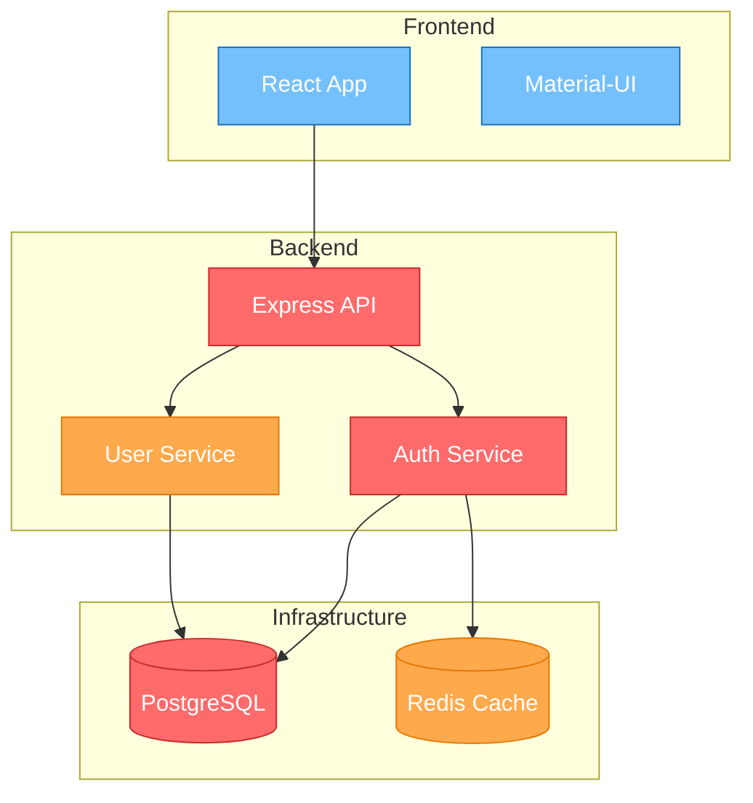

# /dependency-graph

Generate a visual dependency graph of the system showing how components, services, and packages relate to each other, with colour-coded criticality levels.

## When to Use This Skill

- Understanding system architecture for new team members
- Identifying single points of failure
- Planning refactoring or migration work
- Assessing blast radius of changes

## Usage

```
/dependency-graph [--scope system|service|package] [--entry-point <path>] [--depth 1|2|3]
```

### Parameters

| Parameter | Description | Required | Default |
|-----------|-------------|----------|---------|
| scope | What level to graph | No | system |
| entry-point | Starting file or service | No | Project root |
| depth | How many levels deep | No | 2 |

## Instructions

### Phase 1: Scan Dependencies

1. **System scope**: Scan docker-compose, CI/CD workflows, infrastructure configs for service dependencies
2. **Service scope**: Scan route files, controllers, and services for internal module dependencies
3. **Package scope**: Analyse package.json, import statements, and require calls

For each dependency found, capture:
- Source and target
- Type (imports, API call, database, message queue, external service)
- Direction (upstream/downstream)
- Criticality (critical path, important, standard, optional)

### Phase 2: Build Dependency Map

1. Deduplicate and normalise dependency names
2. Classify criticality:
   - **Critical** (red): Failure causes system outage (database, auth, core API)
   - **Important** (orange): Failure degrades functionality (cache, search, notifications)
   - **Standard** (blue): Normal dependencies (utility libraries, formatting)
   - **Optional** (grey): Development/test only dependencies
3. Detect cycles and flag them

### Phase 3: Generate Visualisation

Output a Mermaid diagram with:
- Colour-coded nodes by criticality
- Grouped subgraphs by layer (frontend, backend, infrastructure, external)
- Directional edges showing dependency flow
- Cycle warnings as comments

## Output Format

```markdown
# Dependency Graph: [Scope]

## Overview
- **Total components**: X
- **Critical dependencies**: X
- **Cycles detected**: X

## Graph



## Dependency Table

| Source | Target | Type | Criticality | Notes |
|--------|--------|------|-------------|-------|
| API | PostgreSQL | Database | Critical | Single point of failure |
| API | Redis | Cache | Important | Graceful degradation possible |

## Findings
- [Key observations about the dependency structure]
- [Cycle warnings if any]
- [Single points of failure]
```

## Examples

### Example 1: System Overview
```
/dependency-graph --scope system
```

### Example 2: Service Dependencies
```
/dependency-graph --scope service --entry-point src/services/order.service.js --depth 3
```
