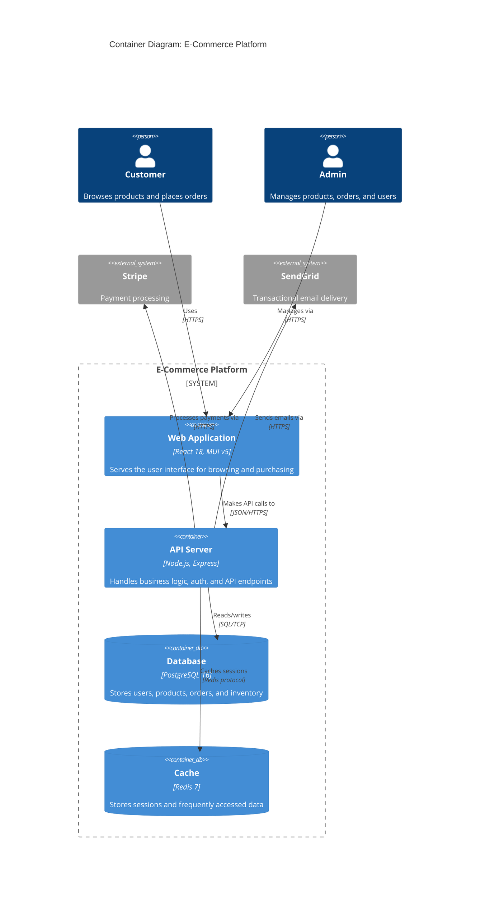

# Generate C4 Architecture Diagrams

Create structured C4 model diagrams at context, container, or component level for web application systems. Produces data-driven diagrams by scanning the actual codebase rather than relying on assumptions.

## When to Use This Skill

- Creating formal architecture documentation following the C4 model
- Producing context diagrams for stakeholder communication
- Documenting container-level architecture showing React frontend, Express API, PostgreSQL, and supporting services
- Detailing the internal component structure of a specific container (e.g., the API layer)
- Generating diagrams for Architecture Decision Records or system design reviews

## Usage

| Parameter   | Required | Description                                                              | Default      |
|-------------|----------|--------------------------------------------------------------------------|--------------|
| level       | Yes      | C4 level: `context`, `container`, `component`                            | -            |
| system-name | Yes      | Name of the system or container to diagram                               | -            |
| format      | No       | Output format: `mermaid-c4`, `flowchart`, `plantuml`                     | `mermaid-c4` |

## Instructions

### Phase 1: Gather C4 Elements

Scan the codebase and project configuration to identify:

1. **People**: End users, administrators, API consumers, external developers.
2. **Systems**: The primary application, external systems it depends on (payment providers, email services, identity providers, CDNs).
3. **Containers** (for container/component level):
   - React frontend application
   - Express API server
   - PostgreSQL database
   - Redis cache (if present)
   - Background workers or job queues (if present)
   - Reverse proxy or load balancer
4. **Components** (for component level):
   - Routes, controllers, services, middleware, validators
   - Identify from `src/routes/`, `src/controllers/`, `src/services/`, `src/middleware/`
5. **Relationships**: Determine direction, protocol, and purpose of each connection (e.g., "Makes API calls using HTTPS/JSON", "Reads/writes using SQL over TCP").

### Phase 2: Apply C4 Modelling Rules

#### Context Level
- Draw the system as a single box at the centre.
- Show all external actors (people and external systems) around it.
- Label every relationship with its purpose (not technical protocol).
- Do not show internal details -- the system is a black box.

#### Container Level
- Draw a system boundary containing all internal containers.
- Show each deployable unit: frontend app, API server, database, cache, workers.
- External actors and systems sit outside the boundary.
- Label relationships with technology and purpose (e.g., "JSON/HTTPS", "SQL/TCP").
- Include container technology labels (e.g., "React 18 SPA", "Express.js API", "PostgreSQL 16").

#### Component Level
- Focus on a single container (typically the API server).
- Draw a container boundary and place components inside.
- Show how components interact: routes delegate to controllers, controllers call services, services access the database.
- External containers (database, frontend) sit outside the boundary.
- Map to actual code structure found in the codebase.

### Phase 3: Generate Diagram

Produce the diagram in the requested format:

#### Mermaid C4 Format (`mermaid-c4`)
Use Mermaid's C4 diagram syntax:
```
C4Context / C4Container / C4Component
  Person(alias, "Label", "Description")
  System(alias, "Label", "Description")
  System_Ext(alias, "Label", "Description")
  Container(alias, "Label", "Technology", "Description")
  ContainerDb(alias, "Label", "Technology", "Description")
  Component(alias, "Label", "Technology", "Description")
  Rel(from, to, "Label", "Technology")
  System_Boundary(alias, "Label") { ... }
  Container_Boundary(alias, "Label") { ... }
```

#### Flowchart Format (`flowchart`)
Use `flowchart TD` or `flowchart LR` with styled subgraphs to represent boundaries:
- Use `subgraph` for system/container boundaries with descriptive titles.
- Style boundary subgraphs with dashed borders.
- Use node shapes to differentiate: `[App]` for containers, `[(Database)]` for data stores, `([Person])` for actors.
- Apply consistent colours: blue for internal, grey for external, green for databases.

#### PlantUML Format (`plantuml`)
Use standard C4-PlantUML includes and macros. Wrap in a code block tagged `plantuml`.

### Graph Layout Best Practices

- **Declaration order matters**: Mermaid renders nodes in the order they are declared. Declare the most important node first.
- **Minimise edge crossings**: Place nodes that communicate frequently adjacent to each other in the declaration order.
- **Group with subgraphs**: Use subgraphs for system/container boundaries. This clusters related nodes visually.
- **Consistent direction**: Use `TD` (top-down) for hierarchical views, `LR` (left-to-right) for flow views.
- **Limit nodes per diagram**: Aim for 5-12 nodes. If more are needed, split into multiple diagrams at a more detailed C4 level.

**Important**: Always use Mermaid or PlantUML. Never produce ASCII art diagrams.

## Output Format

1. **Title**: C4 level and system name (e.g., "C4 Container Diagram: Order Management System").
2. **Description**: 2-3 sentences summarising the architecture shown.
3. **Diagram**: Fenced code block with the appropriate language tag (`mermaid` or `plantuml`).
4. **Element Catalogue**: A table listing each element with its type, technology, and responsibility.
5. **Notes**: Assumptions, simplifications, or recommendations for deeper diagrams.

## Examples

### Example 1: Container Diagram

```
/c4-diagram level=container system-name="E-Commerce Platform"
```

Output:

**C4 Container Diagram: E-Commerce Platform**

The e-commerce platform consists of a React single-page application, an Express API handling business logic, a PostgreSQL database for persistence, and Redis for session caching. External systems include Stripe for payments and SendGrid for transactional email.



| Element   | Type       | Technology         | Responsibility                        |
|-----------|------------|--------------------|---------------------------------------|
| spa       | Container  | React 18, MUI v5   | User interface                        |
| api       | Container  | Node.js, Express   | Business logic and API endpoints      |
| db        | ContainerDb| PostgreSQL 16      | Persistent data storage               |
| cache     | ContainerDb| Redis 7            | Session and data caching              |
| stripe    | System_Ext | Stripe API         | Payment processing                    |
| sendgrid  | System_Ext | SendGrid API       | Email delivery                        |

### Example 2: Component Diagram

```
/c4-diagram level=component system-name="Express API Server" format=flowchart
```

Output uses a flowchart with subgraphs showing the routes, controllers, services, middleware, and data access layers within the API container, with connections to the database and frontend containers outside the boundary.
