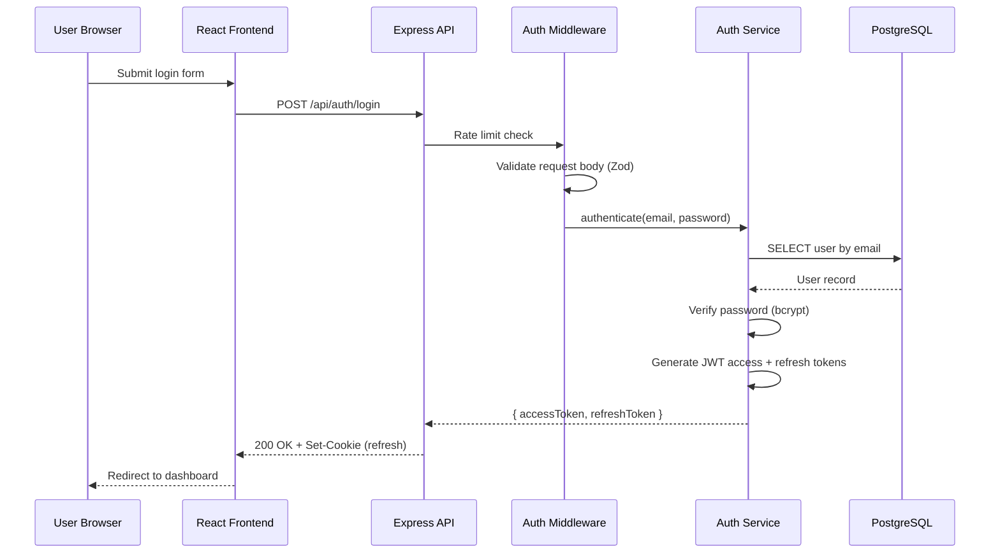

# Generate Architecture Diagrams

Create clear, accurate architecture diagrams using Mermaid syntax for web application systems built with React, Express, and PostgreSQL.

## When to Use This Skill

- Documenting system architecture for new or existing projects
- Creating visual representations of data flows, API interactions, or database schemas
- Producing diagrams for Architecture Decision Records (ADRs)
- Communicating system design to team members or stakeholders
- Visualizing component relationships, state machines, or deployment topology

## Usage

| Parameter    | Required | Description                                                                                  | Default  |
|--------------|----------|----------------------------------------------------------------------------------------------|----------|
| type         | Yes      | Diagram type: `c4-context`, `c4-container`, `system-landscape`, `data-flow`, `sequence`, `er`, `state`, `class` | -        |
| subject      | Yes      | The system, feature, or component to diagram                                                 | -        |
| detail-level | No       | Level of detail: `high`, `medium`, `low`                                                     | `medium` |

## Instructions

### Phase 1: Gather System Information

1. Scan the codebase structure to identify relevant components:
   - Frontend: React pages, features, layouts, shared components
   - Backend: Express routes, controllers, services, middleware
   - Database: PostgreSQL tables, relationships, migrations
   - Infrastructure: Docker services, external APIs, caches
2. Identify relationships between components (dependencies, data flow, API calls).
3. Note boundaries: system boundary, network boundaries, trust boundaries.
4. Adjust scope based on `detail-level`:
   - **high**: Show all components, middleware, utilities, and internal details
   - **medium**: Show major components, services, and key relationships
   - **low**: Show top-level systems and primary interactions only

### Phase 2: Select Mermaid Syntax

Choose the correct Mermaid syntax for the requested diagram type:

- **c4-context**: Use `C4Context` block with `Person`, `System`, `System_Ext`, and `Rel` directives. Show the system as a black box with external actors and systems.
- **c4-container**: Use `C4Container` block with `Container`, `ContainerDb`, `Container_Boundary`, and `Rel` directives. Show internal services (React app, Express API, PostgreSQL, Redis) within the system boundary.
- **system-landscape**: Use `flowchart TD` with styled subgraphs for each system. Show the full ecosystem including CI/CD, monitoring, third-party services.
- **data-flow**: Use `flowchart LR` to trace how data moves through the stack: user input through React forms, API requests, validation, database writes, and responses.
- **sequence**: Use `sequenceDiagram` with participants for Client, API, Service, and Database. Show request/response flows including auth middleware, validation, and error paths.
- **er**: Use `erDiagram` with proper cardinality notation (`||--o{`, `||--|{`). Show tables, columns, primary keys, foreign keys, and relationship labels.
- **state**: Use `stateDiagram-v2` for workflow or entity status transitions. Include initial/final states, guard conditions, and transition labels.
- **class**: Use `classDiagram` to show service/component relationships, interfaces, and dependencies between layers (routes, controllers, services, data access).

### Phase 3: Generate Diagram

1. Write the Mermaid code block with proper syntax.
2. Apply layout best practices:
   - Declare nodes in logical reading order (top-to-bottom or left-to-right).
   - Group related nodes in subgraphs with descriptive labels.
   - Minimise edge crossings by ordering declarations carefully.
   - Use consistent arrow styles (`-->` for sync, `-.->` for async, `==>` for important).
3. Add clear labels to all nodes and edges.
4. Include a title comment at the top of the diagram.
5. Write a brief description paragraph explaining what the diagram shows.

**Important**: Always use Mermaid syntax. Never produce ASCII art diagrams. Mermaid renders consistently across Markdown viewers, documentation sites, and GitHub.

## Output Format

Provide the output in this structure:

1. **Description**: 2-3 sentences explaining what the diagram represents and key takeaways.
2. **Diagram**: A fenced Mermaid code block (` ```mermaid ... ``` `).
3. **Legend** (if needed): Explain any colour coding, line styles, or abbreviations.
4. **Notes**: Any assumptions made, components omitted at the chosen detail level, or suggestions for complementary diagrams.

## Examples

### Example 1: Sequence Diagram for Authentication

```
/diagram type=sequence subject="user login flow" detail-level=medium
```

Output:

The login flow starts at the React frontend, passes through Express middleware for rate limiting and validation, authenticates against the database, and returns a JWT token pair.



### Example 2: ER Diagram for Core Tables

```
/diagram type=er subject="core application tables" detail-level=high
```

Output includes the `erDiagram` block showing users, orders, order_items, and products with full column details and relationship cardinality.
