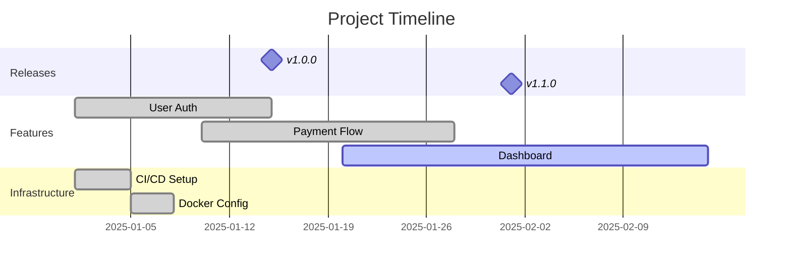

# /timeline

Generate a visual timeline of project events from git history, milestones, releases, and documentation, rendered as a Mermaid Gantt chart, table, or list.

## When to Use This Skill

- Visualising project history for retrospectives
- Creating milestone timelines for stakeholders
- Understanding the evolution of a feature or component
- Generating release history documentation

## Usage

```
/timeline [--period <date-range>] [--scope releases|features|commits|all] [--format gantt|table|list]
```

### Parameters

| Parameter | Description | Required | Default |
|-----------|-------------|----------|---------|
| period | Date range | No | Last 6 months |
| scope | What events to include | No | all |
| format | Output visualisation format | No | gantt |

## Instructions

### Phase 1: Collect Events

Based on scope, gather timeline events:

**releases**: Git tags, GitHub releases, version bumps in package.json
**features**: Major PRs, feature branch merges, milestone completions
**commits**: Significant commits (exclude trivial changes)
**all**: Combine all sources

For each event capture:
- Date
- Title/description
- Category (release, feature, fix, infrastructure, docs)
- Significance (major, minor, patch)

### Phase 2: Build Timeline

1. Sort events chronologically
2. Group by month or sprint
3. Identify milestones and phase boundaries
4. Calculate durations for features (branch create → merge)

### Phase 3: Generate Visualisation

**gantt**: Mermaid Gantt chart showing features and milestones over time
**table**: Chronological event table with categories
**list**: Simple dated list grouped by month

## Output Format

### Gantt Format
```markdown
# Project Timeline


```

### Table Format
```markdown
| Date | Event | Category | Significance |
|------|-------|----------|-------------|
| 2025-01-15 | v1.0.0 Released | Release | Major |
| 2025-01-10 | Payment flow merged | Feature | Major |
```

### List Format
```markdown
## January 2025
- **Jan 15**: v1.0.0 released
- **Jan 10**: Payment flow feature merged (PR #42)
- **Jan 05**: CI/CD pipeline operational
```

## Examples

### Example 1: Full Project Timeline
```
/timeline --period "last 6 months" --format gantt
```

### Example 2: Release History
```
/timeline --scope releases --format table
```
