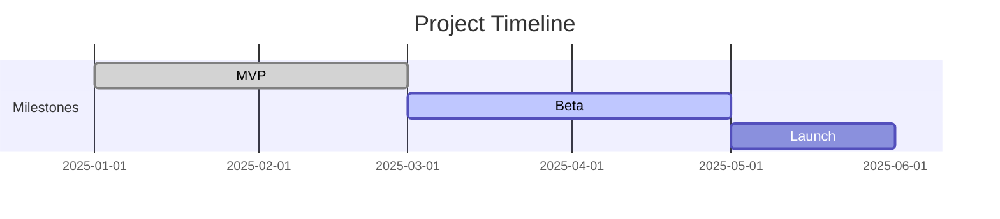

# /project-report

Generate a comprehensive project status report using four parallel agents analysing tasks, meetings/decisions, risks, and timeline, with RAG (Red/Amber/Green) health indicators.

## When to Use This Skill

- Monthly project status updates
- Steering committee reporting
- Project health assessments
- Milestone reviews

## Usage

```
/project-report [--period <timeframe>] [--audience leadership|team|stakeholders]
```

### Parameters

| Parameter | Description | Required | Default |
|-----------|-------------|----------|---------|
| period | Reporting period | No | Last month |
| audience | Report audience | No | leadership |

## Instructions

### Phase 1: Gather Project Data

1. Scan repository for project indicators (issues, PRs, milestones)
2. Check for project documentation (roadmaps, milestone definitions)
3. Review recent git activity for progress indicators
4. Look for existing status files or project boards

### Phase 2: Parallel Analysis (Agent Team)

Launch 4 agents using the Task tool:

**Agent 1: Task & Progress Analyser** (Haiku)
Task: Assess work completion and velocity
- Count completed vs planned work items
- Calculate completion percentage per milestone
- Identify overdue items
- Track velocity trends (is the team speeding up or slowing down?)
Return: Progress metrics with RAG status

**Agent 2: Decision & Blocker Analyser** (Sonnet)
Task: Track decisions and blockers
- Extract key decisions from PRs, ADRs, and issues
- Identify current blockers and their age
- Note pending decisions that need attention
- Assess decision quality (are we making timely decisions?)
Return: Decision log and blocker list

**Agent 3: Risk Analyser** (Sonnet)
Task: Assess project risks
- Technical risks (architecture concerns, tech debt accumulation)
- Schedule risks (slipping milestones, scope creep indicators)
- Resource risks (knowledge silos, team capacity)
- External risks (dependency updates, third-party service changes)
Return: Risk register with mitigation status

**Agent 4: Timeline Analyser** (Haiku)
Task: Assess timeline health
- Compare actual progress to planned milestones
- Calculate estimated completion dates
- Identify critical path items
- Flag timeline risks (items that could delay the project)
Return: Timeline assessment with Mermaid Gantt chart

### Phase 3: Compile Report

1. Merge all agent outputs
2. Assign overall RAG status
3. Generate executive summary
4. Create action items for leadership attention

## Output Format

```markdown
# Project Status Report: [Project Name]

**Period**: [Timeframe] | **Status**: [RAG] | **Date**: [Date]

## Executive Summary
[3-5 sentences: overall status, key achievements, main concerns]

## Health Dashboard

| Area | Status | Notes |
|------|--------|-------|
| Progress | Green | On track, 85% complete |
| Decisions | Amber | 2 pending decisions |
| Risks | Amber | 1 high-risk item |
| Timeline | Green | On schedule |

## Progress
[Task completion details, velocity metrics]

## Key Decisions
[Decisions made, decisions pending]

## Risks & Mitigations

| Risk | Severity | Likelihood | Mitigation | Owner |
|------|----------|-----------|------------|-------|
| [Risk] | High | Medium | [Plan] | [Name] |

## Timeline



## Actions Required
1. [ ] [Action for leadership attention]
```

## Examples

### Example 1: Monthly Report
```
/project-report --period "January 2025" --audience leadership
```

### Example 2: Team Report
```
/project-report --audience team
```
