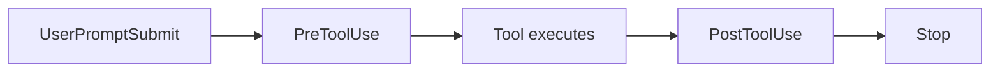

# Claude Code Configuration for SDLC Projects

A comprehensive `.claude` configuration for full-stack web development teams. Covers the entire
Software Development Life Cycle with specialized rules, skills (slash commands), subagents, and
automated hooks.

Baseline: **September 2026** - TypeScript-first, React 19 + MUI v9, Node 24 + Express 5,
PostgreSQL 18, Vitest 5, OWASP Top 10:2025.

## Features

- **12 Rule Files** covering frontend, backend, DevOps, architecture, testing, and more
- **37 Skills (Slash Commands)** in the current `SKILL.md` format, several using agent teams
- **11 Subagents** defined as `.claude/agents/*.md` for task delegation
- **10 Production-Ready Hooks** for security, quality, and UX automation
- **Complete SDLC Coverage** for all team roles
- **Quality Gates** separating automated verification from what genuinely needs a human

## Tech Stack

| Category      | Technologies                                                      |
| ------------- | ----------------------------------------------------------------- |
| Language      | TypeScript 7 (strict); JavaScript ESM + JSDoc as fallback         |
| Runtime       | Node.js 24 LTS (target `>=22`)                                    |
| Frontend      | React 19 + React Compiler, Material UI v9, Vite 8                 |
| Backend       | Express 5 (Fastify / Hono / NestJS covered as alternatives)       |
| Database      | PostgreSQL 18 - `pg`, Drizzle ORM or Kysely                       |
| Validation    | Zod 4 - one schema drives types, runtime checks and OpenAPI       |
| Server state  | TanStack Query v5                                                 |
| Testing       | Vitest 5, Testing Library, Playwright, Testcontainers, MSW 2      |
| API contract  | REST + OpenAPI 3.1 from Zod; RFC 9457 Problem Details for errors  |
| Observability | OpenTelemetry + `pino`                                            |
| CI/CD         | GitHub Actions - SHA-pinned actions, OIDC, build provenance, SBOM |
| Containers    | Docker, Docker Compose v2                                         |
| Lint / format | ESLint 10 flat config + Prettier 3, or Biome 2                    |

### What changed in v3

| Area       | Before                                   | Now                                                       |
| ---------- | ---------------------------------------- | --------------------------------------------------------- |
| Language   | JavaScript + JSDoc                       | TypeScript-first, JS kept as an explicit fallback         |
| React      | React 18, manual `useMemo`/`useCallback` | React 19 + Compiler, Actions, `use()`                     |
| MUI        | v5                                       | v9 (no v8 exists - MUI jumped 7 → 9 to align with MUI X)  |
| Express    | 4 with `asyncHandler`                    | 5 - async errors forwarded automatically                  |
| Tests      | Jest, MSW 1, mocked DB                   | Vitest 5, MSW 2, real PostgreSQL via Testcontainers       |
| API errors | `{success, error}` envelope              | RFC 9457 Problem Details (envelope documented as legacy)  |
| Security   | OWASP Top 10 2021, bcrypt                | OWASP Top 10:2025, argon2id, supply-chain controls        |
| CI         | Actions by tag                           | SHA-pinned, least-privilege, OIDC, provenance attestation |
| Subagents  | Inline `agents` block in settings.json   | `.claude/agents/*.md` files                               |
| Skills     | `.claude/skills/<category>/<name>.md`    | `.claude/skills/<name>/SKILL.md`                          |

## Structure

```
.claude/
├── CLAUDE.md                          # Main configuration
├── settings.json                      # Hooks and permissions
├── agents/                            # 11 subagent definitions
│   ├── api-designer.md
│   ├── architect.md
│   ├── backend.md
│   ├── code-reviewer.md
│   ├── database.md
│   ├── devops.md
│   ├── documentation.md
│   ├── frontend.md
│   ├── qa.md
│   ├── security.md
│   └── testing.md
├── rules/
│   ├── api-design.md                  # REST, Problem Details, OpenAPI 3.1
│   ├── architecture.md                # ADRs, C4, fitness functions
│   ├── backend.md                     # Node 24 / Express 5 patterns
│   ├── code-review.md                 # PR templates, review checklists
│   ├── database.md                    # PostgreSQL 18 schema, migrations
│   ├── devops.md                      # GitHub Actions, Docker, rollouts
│   ├── documentation.md               # Technical writing, docs-as-code
│   ├── frontend.md                    # React 19 / MUI v9 patterns
│   ├── no-ascii-diagrams.md           # Enforce Mermaid over ASCII
│   ├── quality-gates.md               # QA processes, release criteria
│   ├── security.md                    # OWASP Top 10:2025
│   └── testing.md                     # Vitest, RTL, Playwright
└── skills/
    └── <skill-name>/SKILL.md          # 37 skills, one directory each
hooks/
├── security/
│   ├── secret-detection.py            # Block secrets in prompts
│   ├── secret-file-scanner.py         # Block secrets in file writes
│   └── file-protection.py             # Protect .env, lockfiles, keys
├── quality/
│   ├── code-formatter.py              # Auto-format after edits
│   ├── import-checker.py              # Validate import paths
│   └── naming-convention.py           # Enforce file naming
├── ux/
│   ├── context-loader.sh              # Auto-load skill context
│   └── search-hint.sh                 # Suggest faster searches
├── safety/
│   └── bash-safety.py                 # Auto-allow safe commands
└── notification/
    └── desktop-notify.sh              # Desktop notification on completion
docs/
└── agent-teams-guide.md               # Agent team patterns guide
```

## Quick Start

### Option 1: Clone and Copy

```bash
git clone https://github.com/servika/claude-configuration.git
cp -r claude-configuration/.claude your-project/
cp -r claude-configuration/hooks your-project/
```

### Option 2: Use degit

```bash
npx degit servika/claude-configuration your-project-config
cp -r your-project-config/.claude your-project/
cp -r your-project-config/hooks your-project/
```

### Hook Setup

After copying, make hook scripts executable:

```bash
chmod +x hooks/**/*.py hooks/**/*.sh
```

Hooks are wired in `.claude/settings.json` and run automatically during Claude Code sessions.
Paths use `${CLAUDE_PROJECT_DIR}`, so they resolve regardless of the working directory.

## SDLC Role Coverage

| Role                 | Primary Rules                           | Focus Areas                            |
| -------------------- | --------------------------------------- | -------------------------------------- |
| **Developer**        | frontend, backend, api-design, database | Feature implementation, code quality   |
| **QA Engineer**      | testing, quality-gates                  | Test automation, E2E, release criteria |
| **Technical Writer** | documentation, architecture             | Docs, runbooks, ADRs                   |
| **DevOps Engineer**  | devops, security                        | CI/CD, Docker, deployment              |
| **Architect**        | architecture, api-design, database      | System design, technical decisions     |

## Subagents

Each subagent is a `.claude/agents/<name>.md` file with YAML frontmatter (`name`, `description`,
`tools`, `model`) and a prompt that loads the relevant rule files. Claude delegates to them
automatically, or you can name one explicitly.

| Agent           | Description                          | Model  | Key Rules                               |
| --------------- | ------------------------------------ | ------ | --------------------------------------- |
| `frontend`      | React 19 + MUI v9 development        | sonnet | frontend, testing, security             |
| `backend`       | Node 24 + Express 5 APIs             | sonnet | backend, api-design, database, security |
| `database`      | PostgreSQL 18 schema and queries     | sonnet | database, backend                       |
| `api-designer`  | REST contracts and OpenAPI 3.1       | sonnet | api-design, documentation, backend      |
| `devops`        | CI/CD, Docker, observability         | sonnet | devops, security                        |
| `architect`     | System design, ADRs, C4              | opus   | architecture, api-design, database      |
| `testing`       | Unit, integration, component tests   | sonnet | testing, quality-gates                  |
| `qa`            | E2E, test plans, quality gates       | sonnet | testing, quality-gates                  |
| `code-reviewer` | PR quality assessment (read-only)    | opus   | code-review, security, quality-gates    |
| `security`      | OWASP Top 10:2025 review (read-only) | opus   | security, backend, devops               |
| `documentation` | Technical writing and runbooks       | sonnet | documentation, architecture             |

## Skills (Slash Commands)

37 skills, each in its own directory as `.claude/skills/<name>/SKILL.md` with `name`,
`description` and `model` frontmatter. Several fan out to parallel agents.

### Architecture

| Command                | Description                                                          |
| ---------------------- | -------------------------------------------------------------------- |
| `/adr`                 | Generate Architecture Decision Records                               |
| `/impact-analysis`     | 4-agent impact analysis (technical, organisational, financial, risk) |
| `/scenario-compare`    | Compare architectural scenarios with weighted scoring                |
| `/nfr-capture`         | Capture Non-Functional Requirements (ISO 25010)                      |
| `/nfr-review`          | Review NFRs for completeness, measurability, feasibility             |
| `/architecture-report` | 5-agent governance report with RAG health dashboard                  |
| `/cost-analysis`       | Infrastructure, licensing, and operational cost analysis             |
| `/dependency-graph`    | Generate Mermaid dependency graphs with criticality                  |

### Diagramming

| Command           | Description                                             |
| ----------------- | ------------------------------------------------------- |
| `/diagram`        | Generate Mermaid diagrams (C4, data flow, sequence, ER) |
| `/c4-diagram`     | C4-specific diagrams (Context, Container, Component)    |
| `/diagram-review` | 4-agent review for readability, completeness, accuracy  |

### Content Processing

| Command             | Description                                             |
| ------------------- | ------------------------------------------------------- |
| `/pdf-extract`      | Extract and structure content from PDFs                 |
| `/pptx-extract`     | Extract content from PowerPoint files                   |
| `/youtube-analyze`  | Analyse YouTube videos (technical/summary/action-items) |
| `/video-digest`     | Triage and deep-analyse video content                   |
| `/weblink`          | Quick web page capture with summary                     |
| `/article`          | Article capture with relevance scoring                  |
| `/research-notes`   | Structured notes from research materials                |
| `/document-extract` | Auto-detect and extract from any document format        |

### Codebase Health

| Command                | Description                                                            |
| ---------------------- | ---------------------------------------------------------------------- |
| `/code-quality-report` | 5-dimension quality analysis (complexity, coverage, lint, deps, build) |
| `/broken-references`   | Find broken imports, missing files, dead exports                       |
| `/dead-code-finder`    | Detect unused files, unreachable components, dead routes               |
| `/auto-document`       | Batch-generate doc comments, README sections, API docs                 |
| `/auto-categorize`     | Classify files by architectural layer                                  |
| `/dependency-checker`  | Audit npm deps for security, freshness, usage, licenses                |

### Scoring

| Command           | Description                                           |
| ----------------- | ----------------------------------------------------- |
| `/score-document` | Score documents against rubrics with parallel agents  |
| `/exec-summary`   | Generate audience-tailored executive summaries (BLUF) |

### Reporting

| Command           | Description                                        |
| ----------------- | -------------------------------------------------- |
| `/sprint-summary` | Generate sprint summaries from git history and PRs |
| `/project-report` | Project status report with RAG indicators          |

### Meetings

| Command          | Description                                          |
| ---------------- | ---------------------------------------------------- |
| `/meeting-notes` | Structure meeting notes with parallel extraction     |
| `/voice-meeting` | Process voice transcripts into structured notes      |
| `/email-capture` | Capture emails as structured notes with action items |

### Knowledge

| Command           | Description                                          |
| ----------------- | ---------------------------------------------------- |
| `/summarize`      | Summarise content at configurable depth and audience |
| `/find-related`   | Discover related code via imports, deps, patterns    |
| `/find-decisions` | Catalogue decisions from ADRs, PRs, commits          |
| `/timeline`       | Generate timelines from git history and milestones   |
| `/skill-creator`  | Create new skills with agent-team patterns           |

## Hooks

Hooks run automatically during Claude Code sessions to enforce quality and security.

| Hook                     | Event            | Purpose                                           |
| ------------------------ | ---------------- | ------------------------------------------------- |
| `secret-detection.py`    | UserPromptSubmit | Block secrets (AWS, JWT, Stripe, etc.) in prompts |
| `secret-file-scanner.py` | PreToolUse       | Block secrets in file writes                      |
| `file-protection.py`     | PreToolUse       | Protect .env, lockfiles, keys from modification   |
| `code-formatter.py`      | PostToolUse      | Auto-format with Prettier/Black/gofmt after edits |
| `import-checker.py`      | PostToolUse      | Validate JS/TS import paths resolve to files      |
| `naming-convention.py`   | PostToolUse      | Enforce file naming conventions per directory     |
| `context-loader.sh`      | UserPromptSubmit | Auto-load relevant rules when skills are invoked  |
| `search-hint.sh`         | PreToolUse       | Suggest faster search methods (Glob over Grep)    |
| `bash-safety.py`         | PreToolUse       | Auto-allow safe read-only commands                |
| `desktop-notify.sh`      | Stop             | Desktop notification (macOS/Linux) on completion  |

### Hook Lifecycle



Exit codes: `0` = allow (stdout JSON may carry a decision), `2` = block with the reason on stderr,
anything else = non-blocking error.

## What's Included

### Development Rules

- **frontend.md** - React 19 compiler-first patterns, Actions, MUI v9 `sx`/CSS variables,
  TanStack Query, accessibility
- **backend.md** - Express 5 layering, async error forwarding, typed request augmentation,
  pino + OpenTelemetry, graceful shutdown
- **api-design.md** - REST conventions, RFC 9457 Problem Details, OpenAPI 3.1 from Zod, cursor
  pagination, idempotency keys
- **database.md** - PostgreSQL 18 schema design, UUIDv7 keys, Drizzle/Kysely, zero-downtime
  migrations, indexing

### Quality Rules

- **testing.md** - Vitest 5, Testing Library with React 19, MSW 2, Testcontainers, Playwright
- **quality-gates.md** - PR checks, CI gates, staging QA, release criteria, INP-based performance
  budgets, WCAG 2.2 AA
- **code-review.md** - PR templates, review checklists, supply-chain and AI-authored-code review
- **security.md** - OWASP Top 10:2025, argon2id, `jose`, CSP without `unsafe-inline`, supply-chain
  controls

### Operations Rules

- **devops.md** - Hardened GitHub Actions, Docker multi-stage builds, rollout strategies,
  OpenTelemetry, SLO alerting
- **architecture.md** - ADR lifecycle, C4 model, fitness functions, architecture characteristics
- **documentation.md** - README structure, docs-as-code, runbooks, incident response
- **no-ascii-diagrams.md** - Enforce Mermaid diagrams, never ASCII art

## Code Quality Standards

### Automated Verification

- Lint passes (ESLint 10 flat config or Biome 2)
- Type check passes (`tsc --noEmit`)
- Build succeeds
- Test coverage ≥60% overall, ≥20% per file
- Dependency scan clean for high/critical (`npm audit`, `osv-scanner`)

### Code Requirements

- Doc comments on exported functions (TSDoc; types stay in the signature)
- Parameterized database queries (no SQL injection)
- Input validation with Zod at every boundary
- No `console.log` in production code
- New dependencies justified in the PR description

## Customization

### Modify Tech Stack

Edit `.claude/CLAUDE.md` to change frameworks, libraries, or coverage thresholds, then update the
matching rule file in `.claude/rules/`.

### Add or Change Subagents

Create `.claude/agents/<name>.md`:

```markdown
---
name: performance
description: Performance profiling and optimisation. Use for latency or bundle-size work.
tools: Read, Glob, Grep, Bash
model: opus
---

You are a performance engineer...
```

### Add Custom Skills

Create `.claude/skills/<name>/SKILL.md`:

```markdown
---
name: my-skill
description: Short description shown when Claude decides whether to use this skill
model: sonnet
---

# My Skill

Instructions for the skill...
```

Or use `/skill-creator` to generate one interactively.

### Adjust Permissions

Edit `permissions` in `.claude/settings.json`. Rules are `allow`, `ask`, and `deny`, with `deny`
taking precedence. Personal overrides belong in `.claude/settings.local.json` (gitignored).

### Customise Hooks

Hook scripts in `hooks/` can be modified. Key customisation points:

- `secret-detection.py` - add patterns to `SECRET_PATTERNS`
- `file-protection.py` - modify `PROTECTED_PATHS` and `SAFE_DIRECTORIES`
- `bash-safety.py` - extend `SAFE_COMMANDS` or `NEVER_SAFE`
- `naming-convention.py` - adjust `CONVENTIONS` per directory

## Requirements

- [Claude Code](https://claude.ai/code) or a compatible tool
- Node.js 22+ (24 LTS recommended) for the configured tech stack
- Python 3 (for hook scripts)
- PostgreSQL 16+ (18 recommended) if using the database rules
- Docker (if using the DevOps rules)

## Contributing

Contributions are welcome. Please:

1. Fork the repository
2. Create a feature branch
3. Make your changes
4. Submit a pull request

### Guidelines

- Follow the existing rule file format
- Include practical, TypeScript-first code examples that you have verified
- Add checklists where appropriate
- Mermaid diagrams only - never ASCII art
- Test with Claude Code before submitting

## Acknowledgments

- Built for teams using Claude Code who want consistent, high-quality development practices across
  the entire SDLC
- Skills adapted from [Dave's Claude Code Skills](https://github.com/DavidROliverBA/Daves-Claude-Code-Skills)
  with significant adaptation for SDLC/web development workflows

## License

MIT License - see [LICENSE](LICENSE) for details.
